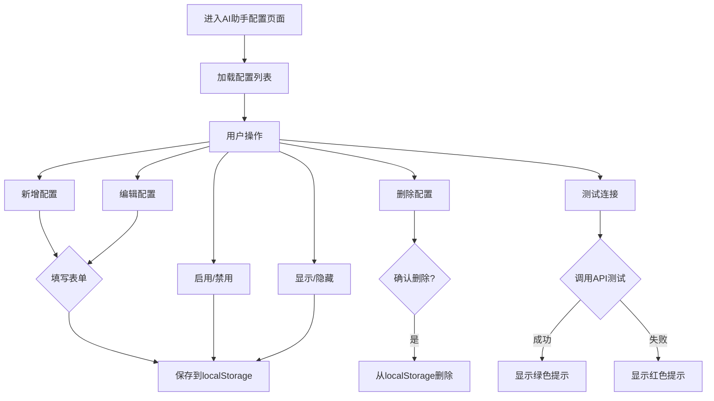

# AI助手配置页面 PRD

## 1. 需求背景

### 痛点
- **问题现象**：AI助手的 Agent 配置（如 Dify API 地址、密钥等）硬编码在前端代码中，修改需要重新部署
- **发生频率**：每次切换环境或更换 API Key 都需要开发人员修改代码
- **当前 workaround**：直接在代码中修改 DIFY_CONFIG 配置

### 业务目标
- **量化指标**：支持可视化配置 AI Agent，无需代码修改即可切换配置
- **目标期限**：2026-05-25

### 涉及系统/模块
- **模块名称**：AIAssistantConfig（AI助手配置页面）
- **变更类型**：新增
- **对接接口**：无（纯前端配置管理）

## 2. 用户故事

### 故事1
- **角色**：系统管理员
- **功能**：配置多个 AI Agent（Dify、星辰平台、星智平台等）
- **收益**：统一管理 AI 数据来源，灵活切换
- **验收条件**：新增、编辑、删除、启用禁用配置

### 故事2
- **角色**：运维人员
- **功能**：测试 AI Agent 连接是否正常
- **收益**：快速排查配置问题
- **验收条件**：点击测试按钮显示连接成功/失败提示

### 故事3
- **角色**：业务用户
- **功能**：查看 AI 助手列表，选择使用哪个 Agent
- **收益**：不同 Agent 提供不同服务
- **验收条件**：已启用的 Agent 显示在 AI 助手切换中

## 3. 需求清单

| 序号 | 需求描述 | 优先级 | 状态 | 负责人 | 截止日期 |
|------|----------|--------|------|--------|----------|
| 1 | AI助手配置页面路由和菜单接入 | P0 | DONE | | 2026-05-25 |
| 2 | 配置列表展示（名称、平台、URL、API Key等） | P0 | DONE | | 2026-05-25 |
| 3 | 新增配置弹窗 | P0 | DONE | | 2026-05-25 |
| 4 | 编辑配置弹窗 | P0 | DONE | | 2026-05-25 |
| 5 | 删除配置 | P1 | DONE | | 2026-05-25 |
| 6 | 启用/禁用配置 | P1 | DONE | | 2026-05-25 |
| 7 | 显示/隐藏切换（在AI助手中显示） | P1 | DONE | | 2026-05-25 |
| 8 | 测试连接功能 | P2 | DONE | | 2026-05-25 |
| 9 | 会话次数统计 | P2 | DONE | | 2026-05-25 |
| 10 | 配置持久化（localStorage） | P0 | DONE | | 2026-05-25 |

## 4. 业务流程图



## 5. 页面结构

### 路由信息
- **路由路径** - /ai-assistant-config
- **页面标题** - AI助手配置
- **访问权限** - 登录用户（系统管理员）

### 布局结构
- **布局类型** - 单栏式
- **区域-页面标题** - 标题 + 新增按钮
- **区域-配置表格** - 列表展示区域

### 表格结构
```
配置表格
├── 表头（状态、名称、平台、API地址、API Key、会话次数、操作）
└── 数据行
    ├── 状态开关
    ├── 名称 + 显示/隐藏图标
    ├── 平台名称
    ├── API地址（截断显示）
    ├── API Key（脱敏显示）
    ├── 会话次数
    ├── 最后会话时间
    └── 操作按钮（测试、显示/隐藏、编辑、删除）
```

## 6. 功能描述

### 功能点1：配置列表展示

#### 页面级
| 字段名 | 类型 | 必填 | 默认值 | 来源 | 校验规则 | 展示形式 | 交互约束 |
|--------|------|------|--------|------|----------|----------|----------|
| 配置表格 | table | - | - | localStorage | - | 标准表格 | - |
| 状态开关 | button | - | - | isEnabled | - | Power图标按钮 | 可点击切换 |
| 名称 | span | - | - | name字段 | - | font-medium | 只读 |
| 显示图标 | Eye/EyeOff | - | - | isVisible | - | lucide图标 | 只读 |
| 平台 | span | - | - | platform字段 | - | 文本 | 只读 |
| API地址 | span | - | - | url字段 | - | 截断，tooltip显示完整 | 只读 |
| API Key | span | - | - | apiKey字段 | - | 脱敏显示 | 只读 |
| 会话次数 | span | - | - | sessionCount字段 | - | 数字 | 只读 |
| 最后会话 | span | - | - | lastSessionTime字段 | - | 时间字符串 | 只读 |

#### 样式规格
| 属性 | 说明 |
|------|------|
| 表格容器 | bg-white rounded-lg shadow overflow-hidden |
| 表头行 | bg-gray-50 |
| 数据行 | divide-y divide-gray-100 |
| 禁用行 | bg-gray-50 opacity-60 |
| 状态按钮 | p-1.5 rounded-full |
| 启用态 | bg-green-100 text-green-600 |
| 禁用态 | bg-gray-100 text-gray-400 |

### 功能点2：新增/编辑配置弹窗

#### 弹窗级
- **弹窗：新增配置 / 编辑配置**
  - **触发入口**：点击"新增配置"按钮 或 点击编辑按钮
  - **关闭方式**：关闭图标 / 取消按钮

#### 字段列表
| 字段名 | 类型 | 必填 | 默认值 | 来源 | 校验规则 | 展示形式 | 交互约束 |
|--------|------|------|--------|------|----------|----------|----------|
| 名称 | input:text | 是 | - | 用户输入 | 非空 | 输入框 | 可编辑 |
| 平台 | select | 是 | dify | 枚举选择 | 非空 | 下拉选择 | 可编辑 |
| API地址 | input:text | 是 | http://localhost/v1 | 用户输入 | 非空,URL格式 | 输入框 | 可编辑 |
| API Key | input:text | 是 | - | 用户输入 | 非空 | 输入框 | 可编辑 |
| 测试URL | div | - | 自动生成 | 计算得出 | - | 只读文本 | 只读 |
| 启用 | input:checkbox | 否 | true | 用户选择 | - | 复选框 | 可编辑 |
| 在AI助手中显示 | input:checkbox | 否 | true | 用户选择 | - | 复选框 | 可编辑 |

#### 平台枚举
| 枚举值 | 说明 |
|--------|------|
| 星辰平台 | 星辰AI平台 |
| dify | Dify开源平台 |
| 星智平台 | 星智AI平台 |

#### 业务逻辑
```
1. 新增时：id为空，保存时生成新ID
2. 测试URL：自动生成为 {url}/app-info
3. 用户标识：自动获取当前登录用户（localStorage current_user 或默认值 lto-user）
4. 会话次数/最后会话：新增时为0/null，保存时不变
```

#### 保存逻辑
```
1. 校验必填字段
2. 自动生成 testUrl = url + "/app-info"
3. 自动获取 user = localStorage.getItem('current_user') || 'lto-user'
4. 保存到 localStorage ai_assistant_configs
5. 关闭弹窗，刷新列表
```

### 功能点3：测试连接

#### 页面级
| 字段名 | 类型 | 必填 | 默认值 | 来源 | 校验规则 | 展示形式 | 交互约束 |
|--------|------|------|--------|------|----------|----------|----------|
| 测试按钮 | button | - | - | UI | - | TestTube图标 | 可点击 |
| 测试结果 | toast | - | - | API响应 | - | 成功/失败提示 | 只读 |

#### 业务逻辑
```
1. 点击测试按钮
2. 调用 fetch(testUrl, { headers: { Authorization: Bearer apiKey } })
3. 响应成功(200)：显示绿色提示"连接成功！"
4. 响应失败：显示红色提示"连接失败: {status}"
5. 网络错误：显示红色提示"连接失败: {error.message}"
```

### 功能点4：启用/禁用

#### 页面级
| 字段名 | 类型 | 必填 | 默认值 | 来源 | 校验规则 | 展示形式 | 交互约束 |
|--------|------|------|--------|------|----------|----------|----------|
| 启用状态 | boolean | - | true | 配置数据 | - | Power图标按钮 | 可切换 |
| 禁用行样式 | - | - | - | isEnabled=false | - | bg-gray-50 opacity-60 | - |

#### 业务逻辑
```
1. 点击切换 isEnabled 状态
2. 更新 localStorage 配置
3. 禁用状态下测试按钮不可用
4. 禁用状态下行样式变灰
```

### 功能点5：显示/隐藏切换

#### 页面级
| 字段名 | 类型 | 必填 | 默认值 | 来源 | 校验规则 | 展示形式 | 交互约束 |
|--------|------|------|--------|------|----------|----------|----------|
| 显示状态 | boolean | - | true | isVisible字段 | - | Eye/EyeOff图标 | 可切换 |

#### 业务逻辑
```
1. 点击切换 isVisible 状态
2. 更新 localStorage 配置
3. 影响 AI 助手 Agent 切换列表的显示
```

## 7. 数据流图

### 数据存储
- **存储位置** - localStorage
- **存储键** - ai_assistant_configs
- **存储格式** - JSON数组

### 数据结构
```typescript
interface AIConfig {
  id: string;              // 配置ID
  name: string;             // 配置名称
  platform: string;          // 平台：星辰平台/dify/星智平台
  url: string;               // API地址
  apiKey: string;            // API密钥
  user: string;             // 用户标识（自动获取）
  testUrl: string;           // 测试URL（自动生成）
  isEnabled: boolean;        // 是否启用
  isVisible: boolean;        // 是否在AI助手中显示
  sessionCount: number;     // 会话次数
  lastSessionTime: string;   // 最后会话时间
}
```

### 数据刷新点
- **刷新时机** - 操作成功后（新增/编辑/删除/启用禁用/显示隐藏）
- **影响范围** - localStorage 和 UI 状态

### 默认配置
```javascript
[
  {
    id: "default-ontology",
    name: "本体查询助手",
    platform: "星辰平台",
    url: "http://localhost/v1",
    apiKey: "app-3V47CAfeck1BBKaTFKF8zp66",
    isEnabled: true,
    isVisible: true,
  },
  {
    id: "default-lto",
    name: "LTO客服助手",
    platform: "星辰平台",
    url: "http://localhost/v1",
    apiKey: "app-Qm3Nun7BNZfKqcKn0PRQVkY7",
    isEnabled: true,
    isVisible: true,
  }
]
```

## 8. 验收标准

### 正常流程
- [x] **操作**：进入"系统设置 → AI助手配置" → **预期**：显示配置列表
- [x] **操作**：点击"新增配置" → **预期**：打开新增弹窗
- [x] **操作**：填写表单后点击"保存" → **预期**：配置保存到localStorage，列表刷新
- [x] **操作**：点击编辑按钮 → **预期**：打开编辑弹窗，表单预填当前数据
- [x] **操作**：点击删除按钮 → **预期**：确认后删除配置，列表刷新
- [x] **操作**：点击状态开关 → **预期**：切换启用/禁用状态
- [x] **操作**：点击显示/隐藏按钮 → **预期**：切换显示状态
- [x] **操作**：点击测试按钮 → **预期**：调用API测试，显示结果提示

### 异常流程
- [x] **操作**：填写必填字段为空保存 → **预期**：保存按钮禁用
- [x] **操作**：测试时API不可用 → **预期**：显示红色失败提示
- [x] **操作**：刷新页面 → **预期**：配置从localStorage恢复

## 9. 更新记录

### v1 - 2026-05-25
- 初始版本
- 实现配置页面路由接入（系统设置 → AI助手配置）
- 实现配置列表展示（表格形式）
- 实现新增/编辑配置弹窗
- 实现删除配置（确认后删除）
- 实现启用/禁用切换
- 实现显示/隐藏切换
- 实现测试连接功能
- 实现会话次数统计
- 实现localStorage持久化
