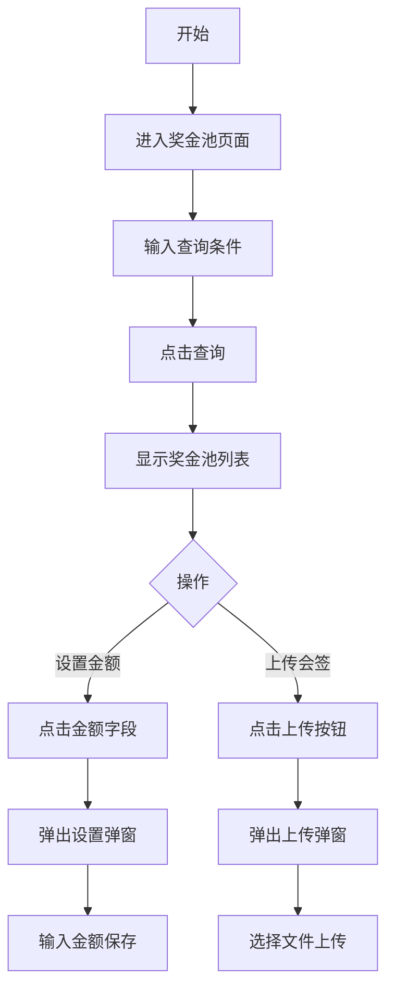

## 需求背景

### 痛点
- **问题现象**：奖金池额度需要审核和设置，当前无统一的管理入口
- **发生频率**：高 - 每月都需要设置和审核奖金池额度
- **当前 workaround**：通过线下流程处理

### 业务目标
- **量化指标**：提供统一的奖金池管理和会签记录上传功能
- **目标期限**：2026年6月

### 涉及系统/模块
- **模块名称**：宁波产数钱包-奖金池
- **变更类型**：新增
- **对接接口**：奖金池查询接口、奖金池设置接口、会签记录上传接口

---

## 用户故事

### 故事1：奖金池管理员
- **角色**：区县分公司奖金池管理员
- **功能**：查看奖金池记录、设置奖金池金额、上传会签记录
- **收益**：快速完成奖金池额度设置和审批
- **验收条件**：可修改奖金池金额，可上传会签记录文件

---

## 需求清单

| 序号 | 需求描述 | 优先级 | 状态 | 负责人 | 截止日期 |
|------|----------|--------|------|--------|----------|
| 1 | 奖金池查询条件 | P0 | TODO | | |
| 2 | 奖金池数据表格 | P0 | TODO | | |
| 3 | 设置奖金池金额弹窗 | P0 | TODO | | |
| 4 | 上传会签记录弹窗 | P0 | TODO | | |

---

## 业务流程图

---

## 页面结构

### 路由信息
- **路由路径** - `/宁波产数钱包/奖金池`
- **页面标题** - 奖金池
- **访问权限** - 登录用户

### 布局结构
- **布局类型** - 单栏
- **区域-标题区** - 页面标题"奖金池"，副标题"奖金池查询"
- **区域-查询区** - 查询条件卡片
- **区域-主内容** - 数据表格

---

## 功能描述

### 功能点1：奖金池查询

#### 查询条件字段：
| 字段名 | 类型 | 必填 | 默认值 | 来源 | 校验规则 | 展示形式 | 交互约束 |
|--------|------|------|--------|------|----------|----------|----------|
| 账期 | 文本 | 否 | 空 | 用户选择 | type=month | 月份选择器 | 可编辑 |
| 申请时间 | 日期 | 否 | 空 | 用户选择 | - | 日期范围选择器 | 可编辑 |
| 审核状态 | 枚举 | 否 | 空 | 用户选择 | - | 下拉选择 | 可编辑 |
| 送审人 | 文本 | 否 | 空 | 用户输入 | - | 输入框 | 可编辑 |
| 分局 | 枚举 | 否 | 空 | 用户选择 | - | 下拉选择 | 可编辑 |

#### 操作按钮字段：
| 字段名 | 类型 | 必填 | 默认值 | 来源 | 校验规则 | 展示形式 | 交互约束 |
|--------|------|------|--------|------|----------|----------|----------|
| 查询 | 按钮 | 是 | - | - | - | primary按钮 | 可编辑 |
  | 导出 | 按钮 | 否 | - | - | - | outline按钮 | 点击输出导出日志 |
| 重置 | 按钮 | 是 | - | - | - | outline按钮 | 可编辑 |

#### 字段列表（9列）：
| 字段名 | 类型 | 必填 | 默认值 | 来源 | 校验规则 | 展示形式 | 交互约束 |
|--------|------|------|--------|------|----------|----------|----------|
| 账期 | 文本 | 是 | - | 接口 | - | 文字 | 只读 |
| 区县分局 | 文本 | 是 | - | 接口 | - | 文字 | 只读 |
| 奖金池额度(万元) | 数字 | 是 | - | 接口 | - | 蓝色可点击链接 | 可编辑 |
| 设置时间 | 文本 | 是 | - | 接口 | - | 日期 | 只读 |
| 设置人 | 文本 | 是 | - | 接口 | - | 文字 | 只读 |
| 变更时间 | 文本 | 是 | - | 接口 | - | 日期 | 只读 |
| 变更人 | 文本 | 是 | - | 接口 | - | 文字 | 只读 |
| 审核状态 | 文本 | 是 | - | 接口 | - | 标签(已审核-绿色/待审核-黄色/已驳回-红色) | 只读 |
| 会签记录 | 文本/文件 | 是 | - | 接口/用户上传 | - | 文件名链接或上传按钮 | 可编辑 |

### 功能点2：设置奖金池金额弹窗

#### 弹窗级
- **弹窗：设置奖金池金额**
  - **触发入口**：点击"奖金池额度"字段
  - **关闭方式**：取消按钮
  - **字段列表**：
    | 字段名 | 类型 | 必填 | 默认值 | 来源 | 校验规则 | 展示形式 | 交互约束 |
    |--------|------|------|--------|------|----------|----------|----------|
    | 区县 | 文本 | 是 | 当前行区县 | 接口 | - | 文字（弹窗标题显示） | 只读 |
    | 账期 | 文本 | 是 | 当前行账期 | 接口 | - | 文字（弹窗标题显示） | 只读 |
    | 奖金池额度（万元） | 数字 | 是 | 当前值 | 用户输入 | 数字格式 | 输入框 | 可编辑 |
  - **确定按钮**：调用保存接口，成功关闭弹窗
  - **取消按钮**：关闭弹窗，不保存

### 功能点3：上传会签记录弹窗

#### 弹窗级
- **弹窗：上传会签记录**
  - **触发入口**：点击"上传会签记录"按钮
  - **关闭方式**：取消按钮
  - **字段列表**：
    | 字段名 | 类型 | 必填 | 默认值 | 来源 | 校验规则 | 展示形式 | 交互约束 |
    |--------|------|------|--------|------|----------|----------|----------|
    | 上传文件 | 文件 | 是 | - | 用户选择 | pdf/doc/docx格式，≤50MB | 文件选择器/已选文件显示+删除按钮 | 可编辑 |
  - **提示文字**：支持pdf、doc、docx格式，文件大小不超过50MB
  - **确定按钮**：上传文件到服务器
  - **取消按钮**：关闭弹窗

---

## 数据流图

### 接口1：查询奖金池
- **请求路径** - `/api/taskWallet/getCfgBonusPool74PageList`
- **请求方法** - POST
- **请求参数** - pageNum, pageSize, cycleMonth, startDate, endDate, statusCd, receiveUser, qxId
- **响应字段** - records, total

### 接口2：保存奖金池设置
- **请求路径** - `/api/taskWallet/saveCfgBonusPool74`
- **请求方法** - POST
- **请求参数** - id, cycleMonth, qxId, bonusAmount, signFiles
- **响应字段** - code, msg

### 接口3：上传会签记录
- **请求路径** - `/api/taskWallet/uploadSignFile`
- **请求方法** - POST
- **请求参数** - formData (file)
- **响应字段** - fileName, filePath

---

## 验收标准

### 正常流程
- [ ] **操作**：进入奖金池页面 → **预期**：显示查询条件和奖金池列表
- [ ] **操作**：点击"奖金池额度"金额 → **预期**：弹出设置弹窗
- [ ] **操作**：输入金额，点击确定 → **预期**：保存成功，弹窗关闭，列表刷新
- [ ] **操作**：点击"上传会签记录"按钮 → **预期**：弹出上传弹窗
- [ ] **操作**：选择文件，点击确定 → **预期**：上传成功，显示文件名

### 异常流程
- [ ] **操作**：上传文件格式不正确 → **预期**：提示"文件格式不支持"
- [ ] **操作**：上传文件超过50MB → **预期**：提示"文件大小超过限制"
- [ ] **操作**：设置金额时输入非数字 → **预期**：提示"请输入有效数字"

---

## 更新记录

### v1 - 2026-05-20
- 初始版本：奖金池页面PRD，包含奖金池查询、金额设置、会签记录上传功能