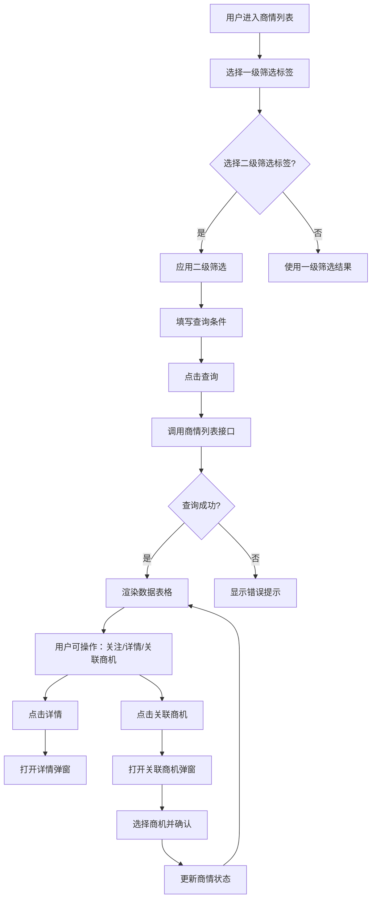

# BusinessInfoManagement（商情信息管理）PRD

## 需求背景

### 痛点
- **问题现象**：商机来源分散（招标、中标等），各渠道商情信息难以统一管理；处理状态不透明，无法快速定位待处理的商情。
- **发生频率**：高
- **当前 workaround**：通过 Excel 表格手动汇总，或登录多个渠道平台分别查看。

### 业务目标
- **量化指标**：支持 1000+ 条商情数据秒级查询；商情处理效率提升 30%。
- **目标期限**：2026 Q2

### 涉及系统/模块
- **模块名称**：商情信息管理（BusinessInfoManagement）
- **变更类型**：新增
- **对接接口**：商情数据接口、商机关联接口

---

## 用户故事

### 故事1
- **角色**：地市管理员 / 客户经理
- **功能**：通过多级筛选条件快速查询商情列表，查看商情详情和流程状态。
- **收益**：减少查找时间，快速了解商情来源和当前处理环节。
- **验收条件**：查询条件组合生效；列表数据分页正常；详情弹窗展示完整信息。

### 故事2
- **角色**：客户经理
- **功能**：对目标商情执行"关注"操作，标记后优先展示。
- **收益**：快速定位重点关注的商机。
- **验收条件**：关注状态实时更新，关注条目单独筛选。

### 故事3
- **角色**：客户经理
- **功能**：将已中标商情关联至已创建的商机。
- **收益**：打通商情与商机环节，实现业务闭环。
- **验收条件**：关联后商情状态更新为"已关联商机"；关联数据同步至商机模块。

---

## 需求清单

| 序号 | 需求描述 | 优先级 | 状态 | 负责人 | 截止日期 |
|------|----------|--------|------|--------|----------|
| 1 | 两级筛选标签页（全部/未处理/已处理/我关注的，含二级子状态） | P0 | TODO | | |
| 2 | 商情列表查询表单（基础8字段 + 更多条件8字段） | P0 | TODO | | |
| 3 | 三分组表头大型表格（30+列，含列宽拖拽、冻结列） | P0 | TODO | | |
| 4 | 列表数据展示（Mock 数据 5 条记录） | P0 | TODO | | |
| 5 | 分页组件（10条/页） | P1 | TODO | | |
| 6 | 关注/取消关注功能 | P1 | TODO | | |
| 7 | 商情详情弹窗（BusinessInfoModal） | P1 | TODO | | |
| 8 | 商情流程查看弹窗 | P1 | TODO | | |
| 9 | 关联商机弹窗（LinkOpportunityDialog） | P1 | TODO | | |
| 10 | 后端接口对接 | P1 | TODO | | |

- **优先级**：P0（核心流程阻塞）/ P1（重要功能）/ P2（体验优化）/ P3（未来规划）
- **状态**：TODO / IN PROGRESS / DONE / BLOCKED

---

## 业务流程图

---

## 页面结构

### 路由信息
- **路由路径**：`/business-info`
- **页面标题**：商情信息管理
- **访问权限**：登录（客户经理/地市管理员/省管理员角色）

### 布局结构
- **布局类型**：单栏
- **区域-主内容**：顶部筛选标签 + 主内容区（查询表单 + 表格 + 分页）

### Tab 结构
- **Tab名称**：一级筛选标签
- **Tab内容**：全部(150) / 未处理(80) / 已处理(60) / 我关注的(10)
- **加载方式**：预加载
- **默认激活**：全部

---

## 功能描述

### 功能点1：多级筛选标签页

#### 页面级
- **字段：功能入口** - 类型：按钮；描述：点击一级/二级标签切换筛选条件
- **字段：前置条件** - 类型：文本；描述：无
- **字段：后置影响** - 类型：字段列表；描述：影响列表数据内容

#### Tab 级
- **Tab名称**：全部/未处理/已处理/我关注的
- **查询条件字段**：
  | 字段名 | 类型 | 必填 | 默认值 | 来源 | 校验规则 | 展示形式 | 交互约束 |
  |--------|------|------|--------|------|----------|----------|----------|
  | 一级状态 | 单选 | 否 | 全部 | 固定枚举 | | 标签按钮 | 点击切换，联动二级标签 |
  | 二级状态 | 单选 | 否 | 全部 | 动态枚举 | | 标签按钮 | 随一级状态变化而变化 |

---

### 功能点2：商情列表查询表单

#### 页面级
- 基础查询区域（4列×2行=8字段）：商情编号、项目名称、项目编码、招标单位、行业类型、商情状态、管控部门、商情区域
- 展开更多查询区域（4列×2行=8字段）：数据类型、运营商标签、集团派发时间（范围）、招标/中标金额（范围）、招标发布时间、中标时间、当前操作步骤、当前操作角色
- 操作按钮：查询、重置、展开更多/收起更多

#### 查询条件字段（基础字段）
  | 字段名 | 类型 | 必填 | 默认值 | 来源 | 校验规则 | 展示形式 | 交互约束 |
  |--------|------|------|--------|------|----------|----------|----------|
  | 商情编号 | 文本 | 否 | 空 | 用户输入 | | 输入框 | 模糊匹配 |
  | 项目名称 | 文本 | 否 | 空 | 用户输入 | | 输入框 | 模糊匹配 |
  | 项目编码 | 文本 | 否 | 空 | 用户输入 | | 输入框 | 精确匹配 |
  | 招标单位 | 文本 | 否 | 空 | 用户输入 | | 输入框 | 模糊匹配 |
  | 行业类型 | 文本 | 否 | 空 | 用户输入 | | 输入框 | |
  | 商情状态 | 下拉 | 否 | 全部 | 字典 | | 下拉选择 | |
  | 管控部门 | 文本 | 否 | 空 | 用户输入 | | 输入框 | |
  | 商情区域 | 文本 | 否 | 空 | 用户输入 | | 输入框 | |

---

### 功能点3：商情列表数据表格

#### 页面级
- 三层分组表头：
  - 第一组"商情基本信息"（6列）：集团派发时间、地市、区县、商情编号、项目编码、项目名称
  - 第二组"商情处理信息"（8列）：商情状态、当前操作步骤、当前操作角色、当前操作人、客户经理、集团商机编码、商机名称、集团商机编码时间
  - 第三组"商情信息"（16列）：数据类型、招标/中标金额、招标发布时间、开标时间、招标截至时间、中标时间、招标单位、企业派发名称、中标单位、运营商标签、项目类型、管控部门、招标单位所属区域、附件、企业派发名称、区域分组
- 最后一列：操作（关注/详情）
- 列宽可拖拽（左侧固定列区域含 6 个冻结列）
- 操作列固定在右侧

#### 字段列表
  | 字段名 | 类型 | 必填 | 默认值 | 来源 | 校验规则 | 展示形式 | 交互约束 |
  |--------|------|------|--------|------|----------|----------|----------|
  | 集团派发时间 | 日期 | | | 系统 | | yyyy-MM-dd | |
  | 地市 | 文本 | | | 系统 | | | |
  | 商情编号 | 文本 | | | 系统 | | 蓝色链接 | 点击查看详情 |
  | 项目名称 | 文本 | | | 系统 | | 截断20字符 | |
  | 商情状态 | 标签 | | | 系统 | | 状态标签 | 未处理(橙)/转商机(蓝)/其他(绿) |
  | 当前操作步骤 | 文本 | | | 系统 | | 蓝色链接 | 点击查看流程 |
  | 附件 | 文本 | | | 系统 | | 链接 | |
  | 操作 | 操作组 | | | | | | 关注+详情按钮 | |

#### 弹窗级
- **弹窗：商情详情**
  - **触发入口**：点击列表"详情"按钮
  - **关闭方式**：关闭图标 / 取消按钮
  - **确定按钮**：无
  - **取消按钮**：关闭弹窗

- **弹窗：关联商机**
  - **触发入口**：详情弹窗内点击"关联商机"按钮
  - **关闭方式**：遮罩层 / 关闭图标 / 取消按钮

---

## 数据流图

### 接口1：商情列表查询
- **请求路径**：`GET /api/business-info/list`
- **请求方法**：GET
- **请求头**：Authorization
- **请求参数**：
  - `status` - 类型：字符串；必填：否；来源：一级筛选
  - `subStatus` - 类型：字符串；必填：否；来源：二级筛选
  - `city` - 类型：字符串；必填：否；来源：查询表单
  - `businessInfoCode` - 类型：字符串；必填：否；来源：查询表单
  - `page` - 类型：数字；必填：是；来源：分页；校验：>=1
  - `pageSize` - 类型：数字；必填：是；来源：分页；校验：10/20/50
- **响应字段**：
  - `data[]` - 类型：数组；描述：商情列表
  - `total` - 类型：数字；描述：总记录数
- **错误码**：
  - `401` - 未授权
  - `500` - 服务器异常

### 接口2：商情详情
- **请求路径**：`GET /api/business-info/:id`
- **请求方法**：GET
- **响应字段**：商情完整字段集（30+字段）

### 接口3：关联商机
- **请求路径**：`POST /api/business-info/:id/link-opportunity`
- **请求方法**：POST
- **请求参数**：
  - `opportunityId` - 类型：字符串；必填：是；来源：LinkOpportunityDialog
- **刷新时机**：关联成功后刷新列表

### 数据刷新点
- **刷新时机**：页面加载 / 筛选切换 / 查询后 / 关联操作成功后
- **影响字段**：列表数据、商情编号数字

---

## 验收标准

### 正常流程
- [ ] **操作**：点击"全部/未处理/已处理/我关注的"标签 → **预期**：列表按筛选条件更新，数字同步变化
- [ ] **操作**：在商情编号输入框输入值，点击查询 → **预期**：列表显示匹配结果
- [ ] **操作**：点击列头拖拽调整宽度 → **预期**：列宽变化，右侧固定列不受影响
- [ ] **操作**：点击列表中的商情编号（蓝色链接） → **预期**：打开详情弹窗
- [ ] **操作**：点击"详情"按钮 → **预期**：打开商情详情弹窗
- [ ] **操作**：点击展开更多条件 → **预期**：显示8个附加查询字段

### 异常流程
- [ ] **操作**：不填写任何条件直接查询 → **预期**：返回全部数据（分页）
- [ ] **操作**：查询不存在的商情编号 → **预期**：显示空数据提示"暂无数据"
- [ ] **操作**：网络断开时查询 → **预期**：显示"网络异常，请检查网络连接"

---

## 更新记录

### v1 - 2026-05-09
- 初始版本
