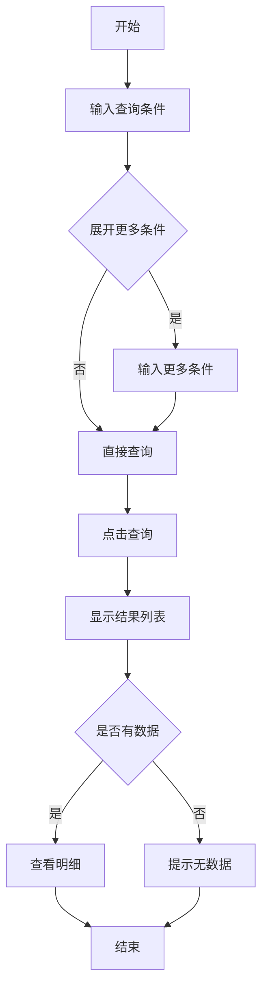

## 需求背景

### 痛点
- **问题现象**：财务人员需要查询商机奖奖励发放明细，数据分散查询不便
- **发生频率**：高 - 每月都需要查询和统计
- **当前 workaround**：手动汇总Excel数据

### 业务目标
- **量化指标**：提供统一的查询入口，快速查看商机奖发放情况
- **目标期限**：2026年6月

### 涉及系统/模块
- **模块名称**：宁波产数钱包-商机奖奖励清单
- **变更类型**：新增

---

## 用户故事

### 故事1：财务人员
- **角色**：区县分公司财务人员
- **功能**：查询和查看商机奖奖励发放明细
- **收益**：快速获取商机奖数据，提升工作效率
- **验收条件**：可按多种条件筛选查看明细

---

## 需求清单

| 序号 | 需求描述 | 优先级 | 状态 | 负责人 | 截止日期 |
|------|----------|--------|------|--------|----------|
| 1 | 实现查询条件和表格展示 | P0 | DONE | | |
| 2 | 实现展开更多条件功能 | P0 | DONE | | |
| 3 | 实现重置功能 | P0 | DONE | | |

---

## 业务流程图

---

## 页面结构

### 路由信息
- **路由路径** - `/宁波产数钱包/商机奖奖励清单`
- **页面标题** - 商机奖奖励清单
- **访问权限** - 登录用户

### 布局结构
- **布局类型** - 单栏
- **区域-标题区** - 页面标题"商机奖奖励清单"，副标题"查询商机奖奖励发放明细"
- **区域-查询区** - 查询条件卡片（支持展开更多条件）
- **区域-主内容** - 数据表格

---

## 功能描述

### 功能点1：商机奖奖励清单

#### Tab 级
- **Tab名称** - 商机奖奖励清单
- **查询条件字段**（基础条件）：
  | 字段名 | 类型 | 必填 | 默认值 | 来源 | 校验规则 | 展示形式 | 交互约束 |
  |--------|------|------|--------|------|----------|----------|----------|
  | 地市 | 枚举 | 否 | 空 | 用户选择 | - | 下拉选择 | 可编辑 |
  | 区县 | 枚举 | 否 | 空 | 用户选择 | - | 下拉选择 | 可编辑 |
  | 支局 | 枚举 | 否 | 空 | 用户选择 | - | 下拉选择 | 可编辑 |
  | 商机名称 | 文本 | 否 | 空 | 用户输入 | - | 输入框 | 可编辑 |
  | 商机编码 | 文本 | 否 | 空 | 用户输入 | - | 输入框 | 可编辑 |
  | 商机录入时间 | 日期 | 否 | 空 | 用户选择 | - | 日期范围选择器 | 可编辑 |

- **查询条件字段**（展开更多条件）：
  | 字段名 | 类型 | 必填 | 默认值 | 来源 | 校验规则 | 展示形式 | 交互约束 |
  |--------|------|------|--------|------|----------|----------|----------|
  | 合同金额 | 数字 | 否 | 空 | 用户输入 | - | 范围输入框 | 可编辑 |
  | 有效商机奖发放日期 | 日期 | 否 | 空 | 用户选择 | - | 日期范围选择器 | 可编辑 |
  | 大额商机奖发放日期 | 日期 | 否 | 空 | 用户选择 | - | 日期范围选择器 | 可编辑 |

- **操作按钮字段**：
  | 字段名 | 类型 | 必填 | 默认值 | 来源 | 校验规则 | 展示形式 | 交互约束 |
  |--------|------|------|--------|------|----------|----------|----------|
  | 查询 | 按钮 | 是 | - | - | - | primary按钮 | 可编辑 |
  | 重置 | 按钮 | 是 | - | - | - | outline按钮 | 可编辑 |
  | 展开更多条件 | 按钮 | 否 | - | - | - | link按钮 | 可编辑 |

- **字段列表**：
  | 字段名 | 类型 | 必填 | 默认值 | 来源 | 校验规则 | 展示形式 | 交互约束 |
  |--------|------|------|--------|------|----------|----------|----------|
  | 区县 | 文本 | 是 | - | 接口 | - | 文字 | 只读 |
  | 支局 | 文本 | 是 | - | 接口 | - | 文字 | 只读 |
  | 商机名称 | 文本 | 是 | - | 接口 | - | 文字 | 只读 |
  | 商机录入时间 | 文本 | 是 | - | 接口 | - | 日期文字 | 只读 |
  | 商机编码 | 文本 | 是 | - | 接口 | - | 蓝色文字 | 只读 |
  | 是否转化 | 文本 | 是 | - | 接口 | - | 绿色标签/灰色标签 | 只读 |
  | 合同总金额 | 数字 | 是 | - | 接口 | - | 数字 | 只读 |
  | 客户经理 | 文本 | 是 | - | 接口 | - | 文字 | 只读 |
  | 组织 | 文本 | 是 | - | 接口 | - | 文字 | 只读 |
  | 电话 | 文本 | 是 | - | 接口 | - | 文字(脱敏) | 只读 |
  | 有效商机奖发放金额 | 数字 | 是 | - | 接口 | - | 蓝色数字 | 只读 |
  | 有效商机奖发放日期 | 文本 | 是 | - | 接口 | - | 日期文字 | 只读 |
  | 大额商机奖奖励金额 | 数字 | 是 | - | 接口 | - | 蓝色数字 | 只读 |
  | 大额商机奖发放账期 | 文本 | 是 | - | 接口 | - | 文字 | 只读 |

---

## 数据流图

### 接口1：查询商机奖奖励清单
- **请求路径** - `/api/taskWallet/getSaleOppAwardPageList`
- **请求方法** - POST
- **请求参数** - 地市、区县、支局、商机名称、商机编码、商机录入时间、合同金额范围、有效商机奖发放日期、大额商机奖发放日期
- **响应字段** - records, total

---

## 验收标准

### 正常流程
- [ ] **操作**：进入页面，显示基础查询条件 → **预期**：页面加载成功，表格显示"暂无数据"
- [ ] **操作**：选择区县，点击查询 → **预期**：表格显示对应数据
- [ ] **操作**：点击"展开更多条件" → **预期**：显示更多查询条件
- [ ] **操作**：填写所有条件后查询 → **预期**：显示筛选后的数据
- [ ] **操作**：点击重置 → **预期**：所有条件恢复默认值

### 异常流程
- [ ] **操作**：不选择任何条件直接查询 → **预期**：显示全部数据（或提示需要至少选择一个条件）

---

## 更新记录

### v1 - 2026-05-18
- 初始版本：商机奖奖励清单页面PRD