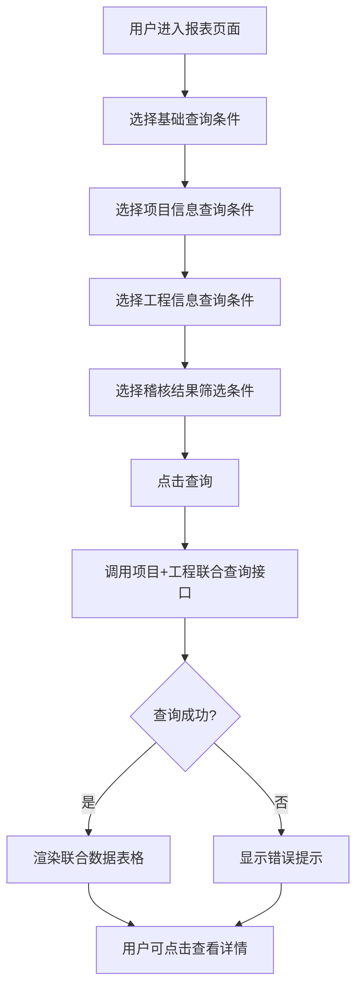

# ConstructNotFixedNoExpense（已列收工程未转固无支出）PRD

## 需求背景

### 痛点
- **问题现象**：ICT 项目和工程项目之间存在关联关系（投资资源），部分项目已列收产数收入但对应的工程项目尚未转固（或预转固），且未列产数成本，存在财务合规风险。
- **发生频率**：中
- **当前 workaround**：通过财务 Excel 表格手动筛选对照，人工排查风险项目。

### 业务目标
- **量化指标**：覆盖 100% 已列收产数收入的项目；实现 1 键查询异常关联。
- **目标期限**：2026 Q2

### 涉及系统/模块
- **模块名称**：已列收工程未转固无支出（ConstructNotFixedNoExpense）
- **变更类型**：新增
- **对接接口**：ICT 项目接口、工程项目接口

---

## 用户故事

### 故事1
- **角色**：财务人员 / 项目经理
- **功能**：通过多维度查询条件，快速筛选出"已列收产数收入、工程未转固（或预转固）、未列产数成本"的风险项目。
- **收益**：及时发现财务合规风险点，减少人工排查工作量。
- **验收条件**：查询条件支持多维度组合筛选；列表数据完整显示 ICT 项目和工程项目信息。

---

## 需求清单

| 序号 | 需求描述 | 优先级 | 状态 | 负责人 | 截止日期 |
|------|----------|--------|------|--------|----------|
| 1 | 基于 ReportTemplate 组件构建报表页面 | P0 | TODO | | |
| 2 | 基础查询区域（地市、区县、帐套） | P0 | TODO | | |
| 3 | 项目信息查询区域（ICT项目8字段） | P1 | TODO | | |
| 4 | 工程信息查询区域（工程信息9字段） | P1 | TODO | | |
| 5 | 稽核结果查询筛选 | P1 | TODO | | |
| 6 | 三层分组表头大型表格（23列） | P0 | TODO | | |
| 7 | Mock 数据展示（2条） | P0 | TODO | | |
| 8 | 后端接口对接 | P1 | TODO | | |

- **优先级**：P0（核心流程阻塞）/ P1（重要功能）/ P2（体验优化）/ P3（未来规划）
- **状态**：TODO / IN PROGRESS / DONE / BLOCKED

---

## 业务流程图

---

## 页面结构

### 路由信息
- **路由路径**：`/construct-not-fixed-no-expense`
- **页面标题**：已列收工程未转固无支出
- **访问权限**：登录（财务/项目经理角色）

### 布局结构
- **布局类型**：单栏
- **区域-主内容**：基于 ReportTemplate 组件：顶部分组查询表单 + 三层分组表头数据表格

### Tab 结构
- 无 Tab

---

## 功能描述

### 功能点1：多分组查询表单

#### 页面级
- **字段：功能入口** - 类型：文本；描述：通过侧边栏菜单进入
- **字段：前置条件** - 类型：文本；描述：用户已登录
- **字段：后置影响** - 类型：字段列表；描述：影响查询结果数据

#### 查询分组字段

- **基础数据**（默认展示，不带分组标题）：
  | 字段名 | 类型 | 必填 | 默认值 | 来源 | 校验规则 | 展示形式 | 交互约束 |
  |--------|------|------|--------|------|----------|----------|----------|
  | 地市 | 下拉单选 | 否 | 全部 | 字典 | | 下拉选择 | |
  | 区县 | 下拉单选 | 否 | 全部 | 字典 | | 下拉选择 | |
  | 帐套 | 下拉单选 | 否 | 全部 | 字典 | | 下拉选择 | |

- **项目信息**（需展开）：
  | 字段名 | 类型 | 必填 | 默认值 | 来源 | 校验规则 | 展示形式 | 交互约束 |
  |--------|------|------|--------|------|----------|----------|----------|
  | 项目编码 | 文本 | 否 | | 用户输入 | | | |
  | 项目名称 | 文本 | 否 | | 用户输入 | | | |
  | 项目类型 | 下拉 | 否 | 全部 | 字典 | | 下拉选择 | 成本型/分成型 |
  | 立项时间 | 日期范围 | 否 | | 用户输入 | | | |
  | ICT项目所属帐套 | 下拉 | 否 | | 字典 | | | |
  | 累计确认产数收入 | 数值范围 | 否 | | 用户输入 | | | |
  | 首次产数收入时间 | 日期范围 | 否 | | 用户输入 | | | |
  | 累计产数成本支出 | 数值范围 | 否 | | 用户输入 | | | |

- **工程信息**（需展开）：
  | 字段名 | 类型 | 必填 | 默认值 | 来源 | 校验规则 | 展示形式 | 交互约束 |
  |--------|------|------|--------|------|----------|----------|----------|
  | 工程项目编码 | 文本 | 否 | | 用户输入 | | | |
  | 工程项目名称 | 文本 | 否 | | 用户输入 | | | |
  | 工程项目状态 | 下拉 | 否 | 全部 | 字典 | | | 待转固/预转固/已转固 |
  | 工程立项时间 | 日期范围 | 否 | | 用户输入 | | | |
  | 预转固日期 | 日期范围 | 否 | | 用户输入 | | | |
  | 转固日期 | 日期范围 | 否 | | 用户输入 | | | |
  | 工程项目立项批复金额 | 数值范围 | 否 | | 用户输入 | | | |
  | 投资占比(%) | 数值范围 | 否 | | 用户输入 | | | |
  | 累计已发生投资额 | 数值范围 | 否 | | 用户输入 | | | |

- **稽核**（需展开）：
  | 字段名 | 类型 | 必填 | 默认值 | 来源 | 校验规则 | 展示形式 | 交互约束 |
  |--------|------|------|--------|------|----------|----------|----------|
  | 稽核结果 | 下拉 | 否 | | 字典 | | | |

---

### 功能点2：联合数据表格（23列三层分组）

#### 页面级
- 页面标题：已列收工程未转固无支出
- 表头分组结构（5组）：
  - **账期**（1列）：账期
  - **基础数据**（4列）：ICT项目来源、工程项目来源、是否有数据、公司类型
  - **ICT项目信息**（8列）：ICT项目编码、ICT项目名称、ICT项目总体预算、ICT项目所属账套、ICT项目类型、累计确认产数收入、首次产数收入时间、累计产数成本支出
  - **工程项目信息**（10列）：工程项目编码、工程项目名称、工程立项时间、工程项目所属账套、预转固日期、转固日期、工程项目状态、工程项目立项批复金额、投资占比(%)、累计已发生投资额
  - **稽核结果**（1列）：稽核结果

#### 字段列表
  | 字段名 | 类型 | 必填 | 默认值 | 来源 | 校验规则 | 展示形式 | 交互约束 |
  |--------|------|------|--------|------|----------|----------|----------|
  | 账期 | 文本 | | | 系统 | | | |
  | ICT项目编码 | 文本 | | | 系统 | | | 蓝色 |
  | ICT项目名称 | 文本 | | | 系统 | | 截断 | |
  | ICT项目总体预算 | 数字 | | | 系统 | | 右对齐金额 | |
  | 累计确认产数收入 | 数字 | | | 系统 | | 右对齐金额 | |
  | 累计产数成本支出 | 数字 | | | 系统 | | 右对齐金额 | |
  | 工程项目编码 | 文本 | | | 系统 | | | |
  | 工程项目名称 | 文本 | | | 系统 | | | |
  | 工程立项时间 | 日期 | | | 系统 | | | |
  | 工程项目状态 | 文本 | | | 系统 | | | |
  | 工程项目立项批复金额 | 数字 | | | 系统 | | 右对齐金额 | |
  | 投资占比(%) | 文本 | | | 系统 | | 右对齐 | |
  | 累计已发生投资额 | 数字 | | | 系统 | | 右对齐金额 | |
  | 稽核结果 | 文本 | | | 系统 | | | 红色背景 | |

---

## 数据流图

### 接口1：已列收工程未转固无支出联合查询
- **请求路径**：`GET /api/construct/not-fixed-no-expense`
- **请求方法**：GET
- **请求头**：Authorization
- **请求参数**：
  - `city` - 类型：字符串；必填：否
  - `district` - 类型：字符串；必填：否
  - `accountBook` - 类型：字符串；必填：否
  - `ictProjectType` - 类型：字符串；必填：否
  - `engineeringStatus` - 类型：字符串；必填：否
  - `auditResult` - 类型：字符串；必填：否
- **响应字段**：
  - `data[]` - 类型：数组；描述：ICT+工程项目联合数据
  - `total` - 类型：数字；描述：总记录数
- **存储位置**：数据库表（ICT项目表 + 工程项目表 JOIN）
- **错误码**：
  - `401` - 未授权
  - `500` - 服务器异常

### 数据刷新点
- **刷新时机**：点击查询按钮
- **影响字段**：列表全部字段

---

## 验收标准

### 正常流程
- [ ] **操作**：选择地市"杭州"，点击查询 → **预期**：列表仅显示杭州的数据
- [ ] **操作**：不填写任何条件查询 → **预期**：返回全部数据
- [ ] **操作**：查询结果按账期分组展示 → **预期**：分组表头正确显示

### 异常流程
- [ ] **操作**：网络断开时查询 → **预期**：显示"网络异常"
- [ ] **操作**：接口返回 403 → **预期**：显示"无权限访问"

---

## 更新记录

### v1 - 2026-05-09
- 初始版本
