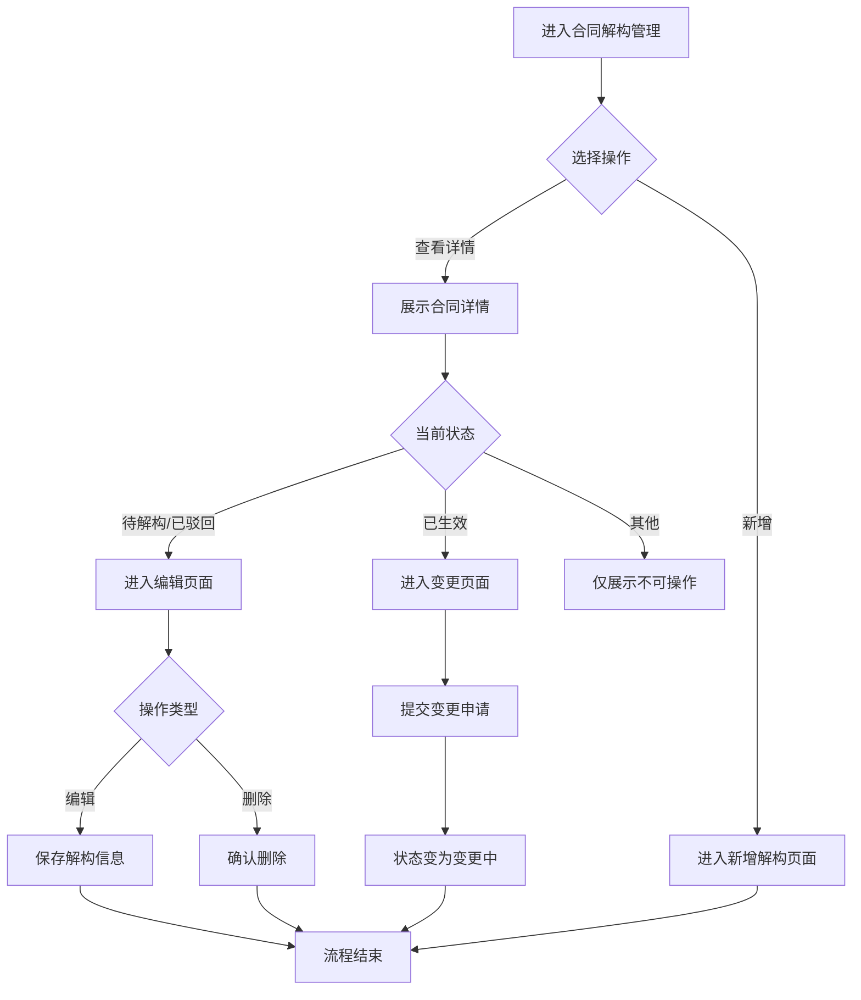

# 合同解构管理 PRD

## 需求背景

### 痛点
- **问题现象**：合同解构流程涉及多状态流转（待解构/审批中/已生效/已驳回/变更中/已作废），当前缺乏统一的合同解构状态管理入口，用户难以快速定位和处理异常状态的合同
- **发生频率**：高
- **当前 workaround**：用户通过分散的模块查找合同解构信息，无法集中查看所有合同的状态和变更记录

### 业务目标
- **量化指标**：合同解构审批周期缩短 20%，异常状态合同处理效率提升 30%
- **目标期限**：2026-Q2

### 涉及系统/模块
- **模块名称**：合同解构管理
- **变更类型**：新增
- **对接接口**：合同详情、合同编辑、合同变更、商情管理

---

## 用户故事

### 故事1：合同解构专员查看所有合同状态
- **角色**：合同解构专员/项目经理
- **功能**：在合同解构管理页面集中查看所有合同的解构状态、审批进度、变更记录
- **收益**：无需切换多个模块即可掌握所有合同状态，大幅减少查找时间
- **验收条件**：
  - 页面加载后展示合同列表，按最近更新时间倒序
  - 支持按项目名称/编号、合同编号模糊搜索
  - 支持按解构状态（全部/待解构/审批中/已生效/已驳回/变更中/已作废）筛选
  - 顶部展示各类状态的统计数据（合同总数、各状态数量）

### 故事2：合同解构专员编辑合同
- **角色**：合同解构专员
- **功能**：对处于"待解构"或"已驳回"状态的合同进行编辑
- **收益**：快速完成合同解构信息的录入和修正
- **验收条件**：
  - 点击编辑按钮进入合同编辑页面
  - 编辑完成后保存，系统提示保存成功

### 故事3：合同解构专员发起变更
- **角色**：合同解构专员
- **功能**：对已生效的合同发起变更申请
- **收益**：规范变更流程，确保变更可追溯
- **验收条件**：
  - 仅已生效状态的合同显示变更入口
  - 提交变更申请后，状态变为"变更中"

---

## 需求清单

| 序号 | 需求描述 | 优先级 | 状态 | 负责人 | 截止日期 |
|------|----------|--------|------|--------|----------|
| 1 | 实现合同解构列表展示功能 | P0 | TODO | | |
| 2 | 实现按状态筛选和关键词搜索 | P0 | TODO | | |
| 3 | 实现新增解构按钮功能 | P1 | TODO | | |
| 4 | 实现合同详情查看功能 | P0 | TODO | | |
| 5 | 实现合同编辑功能（待解构/已驳回状态） | P0 | TODO | | |
| 6 | 实现合同变更申请功能（已生效状态） | P0 | TODO | | |
| 7 | 实现删除功能（待解构/已驳回状态） | P1 | TODO | | |
| 8 | 实现批量导出功能 | P2 | TODO | | |
| 9 | 实现数据统计栏展示 | P1 | TODO | | |

- **优先级**：P0（核心流程阻塞）/ P1（重要功能）/ P2（体验优化）/ P3（未来规划）
- **状态**：TODO / IN PROGRESS / DONE / BLOCKED

---

## 业务流程图

---

## 页面结构

### 路由信息
- **路由路径** - 类型：文本；示例：`/contract-demolition`
- **页面标题** - 类型：文本；示例：`合同解构管理`
- **访问权限** - 类型：枚举（公开/登录/角色）；描述：登录用户（合同解构专员/项目经理）

### 布局结构
- **布局类型** - 类型：枚举（单栏/双栏/三栏）；描述：单栏布局
- **区域-顶部栏** - 字段列表；描述：页面标题 + 描述
- **区域-主内容** - 字段列表；描述：查询筛选区 + 操作按钮区 + 数据统计栏 + 数据列表区 + 分页控件

### Tab 结构
- 无 Tab 结构

---

## 功能描述

### 功能点1：合同解构列表展示

#### 页面级
- **字段：功能入口** - 类型：文本；描述：从菜单进入合同解构管理页面
- **字段：前置条件** - 类型：文本；描述：用户已登录且有合同解构管理权限
- **字段：后置影响** - 类型：字段列表；描述：列表数据影响统计栏数字、审批进度显示

#### 查询条件字段
| 字段名 | 类型 | 必填 | 默认值 | 来源 | 校验规则 | 展示形式 | 交互约束 |
|--------|------|------|--------|------|----------|----------|----------|
| searchText | 文本 | 否 | 空 | 用户输入 | 最大长度100 | 搜索框 | 可编辑，支持模糊匹配 |
| statusFilter | 枚举 | 否 | all | 用户选择 | 枚举值校验 | 下拉选择 | 可编辑 |

#### 操作按钮字段
| 字段名 | 类型 | 必填 | 默认值 | 来源 | 校验规则 | 展示形式 | 交互约束 |
|--------|------|------|--------|------|----------|----------|----------|
| 新增解构 | 按钮 | - | - | - | - | 主操作按钮 | 点击进入新增解构页面 |
| 批量导出 | 按钮 | - | - | - | - | 次要按钮 | 点击触发导出 |
| 刷新 | 按钮 | - | - | - | - | 次要按钮 | 点击刷新列表 |
| 重置 | 按钮 | - | - | - | - | 次要按钮 | 点击清空筛选条件 |

#### 字段列表
| 字段名 | 类型 | 必填 | 默认值 | 来源 | 校验规则 | 展示形式 | 交互约束 |
|--------|------|------|--------|------|----------|----------|----------|
| 序号 | 数字 | - | 自动编号 | 系统生成 | - | 文本 | 只读 |
| 项目编号 | 文本 | - | - | 接口返回 | - | 文本 | 只读 |
| 项目名称 | 文本 | - | - | 接口返回 | - | 文本，超长截断 | 只读 |
| 合同编号 | 文本 | - | - | 接口返回 | - | 文本 | 只读 |
| 合同名称 | 文本 | - | - | 接口返回 | - | 文本，超长截断 | 只读 |
| 合同总金额 | 数字 | - | - | 接口返回 | - | 金额格式化显示（万元） | 只读 |
| 项目工期 | 文本 | - | - | 接口返回 | - | 日期范围文本 | 只读 |
| 解构状态 | 枚举 | - | - | 接口返回 | - | 彩色标签 | 只读 |
| 审批进度 | 文本 | - | - | 接口返回 | - | 标签（如 2/4） | 只读 |
| 经办人 | 文本 | - | - | 接口返回 | - | 姓名+部门 | 只读 |
| 最近更新 | 日期时间 | - | - | 接口返回 | - | YYYY-MM-DD HH:mm:ss | 只读 |
| 操作 | 操作组 | - | - | - | - | 图标按钮组 | 根据状态显示不同操作 |

### 功能点2：数据统计栏

#### 页面级
- **字段：功能入口** - 类型：文本；描述：页面加载时自动展示
- **字段：前置条件** - 类型：文本；描述：列表数据加载完成
- **字段：后置影响** - 类型：字段列表；描述：点击统计卡片可筛选对应状态

#### 字段列表
| 字段名 | 类型 | 必填 | 默认值 | 来源 | 校验规则 | 展示形式 | 交互约束 |
|--------|------|------|--------|------|----------|----------|----------|
| 合同总数 | 数字 | - | 0 | 计算得出 | - | 数字+标签卡片 | 点击筛选全部 |
| 待解构 | 数字 | - | 0 | 计算得出 | - | 数字+灰色卡片 | 点击筛选待解构 |
| 审批中 | 数字 | - | 0 | 计算得出 | - | 数字+蓝色卡片 | 点击筛选审批中 |
| 已生效 | 数字 | - | 0 | 计算得出 | - | 数字+绿色卡片 | 点击筛选已生效 |
| 变更中 | 数字 | - | 0 | 计算得出 | - | 数字+橙色卡片 | 点击筛选变更中 |
| 已驳回 | 数字 | - | 0 | 计算得出 | - | 数字+红色卡片 | 点击筛选已驳回 |

### 功能点3：操作按钮组

#### 页面级
- **字段：功能入口** - 类型：文本；描述：表格每行的操作列
- **字段：前置条件** - 类型：文本；描述：根据记录状态显示不同操作按钮
- **字段：后置影响** - 类型：字段列表；描述：操作后可能改变记录状态或删除记录

#### 操作按钮字段
| 字段名 | 类型 | 必填 | 默认值 | 来源 | 校验规则 | 展示形式 | 交互约束 |
|--------|------|------|--------|------|----------|----------|----------|
| 查看 | 图标按钮 | - | - | - | - | 眼睛图标，蓝色 | 始终显示，点击进入详情页 |
| 编辑 | 图标按钮 | - | - | - | - | 编辑图标，绿色 | 仅待解构/已驳回状态显示 |
| 变更 | 图标按钮 | - | - | - | - | 文件图标，橙色 | 仅已生效状态显示 |
| 删除 | 图标按钮 | - | - | - | - | 垃圾桶图标，红色 | 仅待解构/已驳回状态显示 |

---

## 数据流图

### 接口1：获取合同解构列表
- **请求路径** - 类型：文本；示例：`GET /api/contract-demolition/list`
- **请求方法** - 类型：枚举；必填：是
- **请求头** - 字段列表；描述：Authorization: Bearer {token}
- **请求参数** - 字段列表：
  - `searchText` - 类型：字符串；必填：否；来源：页面搜索框；校验：最大长度100
  - `status` - 类型：字符串；必填：否；来源：页面状态下拉；校验：枚举值
  - `page` - 类型：数字；必填：否；来源：分页控件；校验：正整数
  - `pageSize` - 类型：数字；必填：否；来源：分页控件；校验：正整数
- **响应字段** - 字段列表：
  - `id` - 类型：字符串；描述：合同记录唯一ID
  - `projectCode` - 类型：字符串；描述：项目编号
  - `projectName` - 类型：字符串；描述：项目名称
  - `contractCode` - 类型：字符串；描述：合同编号
  - `contractName` - 类型：字符串；描述：合同名称
  - `contractAmount` - 类型：数字；描述：合同总金额（单位：元）
  - `projectPeriod` - 类型：字符串；描述：项目工期
  - `status` - 类型：枚举；描述：解构状态（待解构/审批中/已生效/已驳回/变更中/已作废）
  - `approvalProgress` - 类型：字符串；描述：审批进度，格式如 "2/4"
  - `handler` - 类型：字符串；描述：经办人，格式为 "姓名/部门"
  - `lastUpdateTime` - 类型：字符串；描述：最近更新时间，格式 YYYY-MM-DD HH:mm:ss
- **存储位置** - 类型：文本；示例：`数据库表 contract_demolition`
- **错误码** - 字段列表：
  - `401` - `用户未登录或登录已过期`
  - `403` - `无访问权限`
  - `500` - `服务器异常`

### 接口2：删除合同解构记录
- **请求路径** - 类型：文本；示例：`DELETE /api/contract-demolition/{id}`
- **请求方法** - 类型：枚举；必填：是
- **请求头** - 字段列表；描述：Authorization: Bearer {token}
- **请求参数** - 字段列表：
  - `id` - 类型：字符串；必填：是；来源：操作行记录ID；校验：非空
- **响应字段** - 字段列表：
  - `success` - 类型：布尔；描述：是否删除成功
  - `message` - 类型：字符串；描述：操作结果信息
- **存储位置** - 类型：文本；示例：`数据库表 contract_demolition`
- **错误码** - 字段列表：
  - `404` - `记录不存在`
  - `409` - `当前状态不允许删除`

### 数据刷新点
- **刷新时机** - 类型：枚举（页面加载/操作成功后/手动刷新）
- **影响字段** - 字段列表；描述：列表数据、统计栏数字

---

## 验收标准

### 正常流程
- [ ] **操作**：进入合同解构管理页面 → **预期**：页面展示合同列表，按最近更新时间倒序排列
- [ ] **操作**：在搜索框输入关键词 → **预期**：列表实时过滤显示匹配项目名称/编号、合同编号的记录
- [ ] **操作**：选择状态筛选下拉 → **预期**：列表仅显示对应状态的记录
- [ ] **操作**：点击统计卡片 → **预期**：状态下拉自动切换为对应状态，列表过滤显示
- [ ] **操作**：点击查看按钮 → **预期**：进入合同详情页面
- [ ] **操作**：对待解构状态记录点击编辑 → **预期**：进入合同编辑页面
- [ ] **操作**：对已生效记录点击变更 → **预期**：进入合同变更页面
- [ ] **操作**：对待解构状态记录点击删除 → **预期**：弹出确认提示，确认后删除记录

### 异常流程
- [ ] **操作**：搜索框输入超长文本 → **预期**：前端截断或提示输入超长
- [ ] **操作**：无匹配结果时 → **预期**：列表显示空状态提示
- [ ] **操作**：删除已驳回状态记录 → **预期**：提示删除成功，列表刷新
- [ ] **操作**：对审批中状态记录点击编辑 → **预期**：编辑按钮不显示
- [ ] **操作**：分页操作 → **预期**：列表正确切换分页

---

## 更新记录

### v1 - 2026-05-09
- 初始版本
