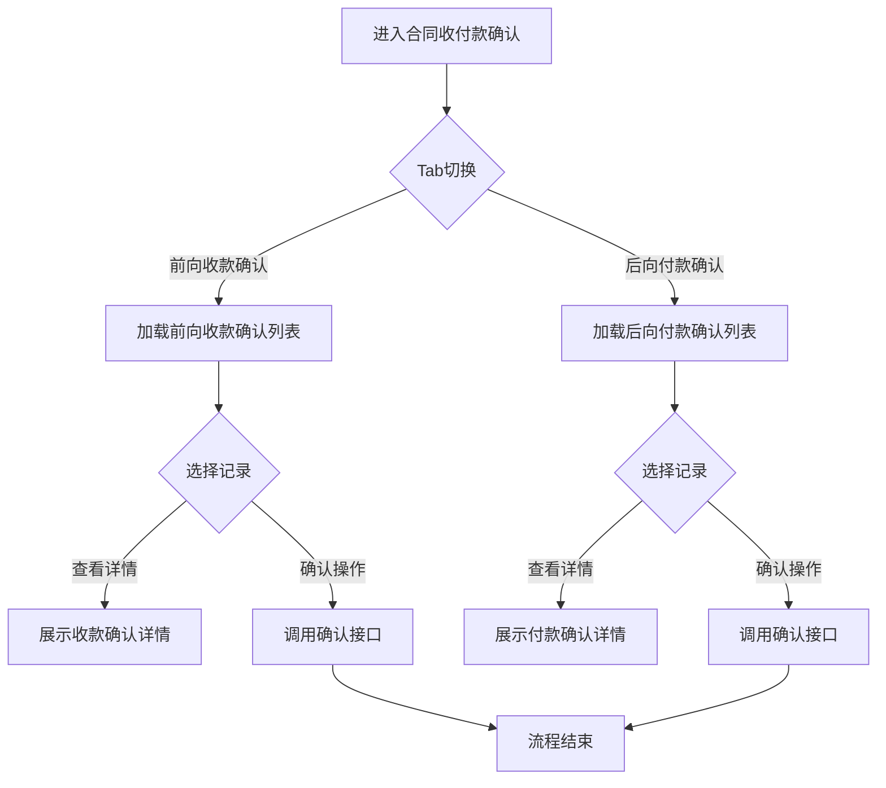

# 合同收付款确认 PRD

## 需求背景

### 痛点
- **问题现象**：合同收付款确认涉及前向收款和后向付款两个方向，当前缺少统一的确认管理入口，财务人员难以集中处理和跟踪收付款确认流程
- **发生频率**：高
- **当前 workaround**：通过分散的财务模块处理前向收款和后向付款，无法在一个页面集中管理

### 业务目标
- **量化指标**：收付款确认处理效率提升 25%，确认周期缩短 15%
- **目标期限**：2026-Q2

### 涉及系统/模块
- **模块名称**：合同收付款确认
- **变更类型**：新增
- **对接接口**：ForwardReceiptConfirmation（前向收款确认）、BackwardPaymentConfirmation（后向付款确认）

---

## 用户故事

### 故事1：财务人员处理前向收款确认
- **角色**：财务人员
- **功能**：在"前向收款确认" Tab 中处理向上游客户的收款确认
- **收益**：集中处理收款确认，提高工作效率
- **验收条件**：
  - 切换到"前向收款确认" Tab 时正确加载对应内容
  - 显示收款确认列表，支持查看详情和确认操作

### 故事2：财务人员处理后向付款确认
- **角色**：财务人员
- **功能**：在"后向付款确认" Tab 中处理向下游供应商的付款确认
- **收益**：统一管理付款确认流程，确保付款准确及时
- **验收条件**：
  - 切换到"后向付款确认" Tab 时正确加载对应内容
  - 显示付款确认列表，支持查看详情和确认操作

---

## 需求清单

| 序号 | 需求描述 | 优先级 | 状态 | 负责人 | 截止日期 |
|------|----------|--------|------|--------|----------|
| 1 | 实现前向收款确认 Tab 及列表展示 | P0 | TODO | | |
| 2 | 实现后向付款确认 Tab 及列表展示 | P0 | TODO | | |
| 3 | 实现前向收款确认详情功能 | P0 | TODO | | |
| 4 | 实现后向付款确认详情功能 | P0 | TODO | | |
| 5 | 实现前向收款确认操作功能 | P1 | TODO | | |
| 6 | 实现后向付款确认操作功能 | P1 | TODO | | |

- **优先级**：P0（核心流程阻塞）/ P1（重要功能）/ P2（体验优化）/ P3（未来规划）
- **状态**：TODO / IN PROGRESS / DONE / BLOCKED

---

## 业务流程图

---

## 页面结构

### 路由信息
- **路由路径** - 类型：文本；示例：`/contract-payment-confirmation`
- **页面标题** - 类型：文本；示例：`合同收付款确认`
- **访问权限** - 类型：枚举（公开/登录/角色）；描述：登录用户（财务人员）

### 布局结构
- **布局类型** - 类型：枚举（单栏/双栏/三栏）；描述：单栏布局
- **区域-主内容** - 字段列表；描述：Tab 切换区 + Tab 内容区

### Tab 结构
- **Tab名称** - 类型：文本；示例：`前向收款确认` / `后向付款确认`
- **Tab路由** - 类型：文本；描述：通过 Tabs value 属性切换
- **加载方式** - 类型：枚举（预加载/懒加载/keep-alive）；描述：预加载，两个 Tab 内容同时渲染
- **默认激活** - 类型：布尔；描述：是，默认激活"前向收款确认" Tab

---

## 功能描述

### 功能点1：Tab 切换

#### 页面级
- **字段：功能入口** - 类型：文本；描述：点击 Tab 触发器切换内容
- **字段：前置条件** - 类型：文本；描述：页面已加载完成
- **字段：后置影响** - 类型：字段列表；描述：切换后显示对应 Tab 的内容

#### Tab 级
- **Tab名称** - 类型：文本；描述：前向收款确认 / 后向付款确认
- **字段列表**：
| 字段名 | 类型 | 必填 | 默认值 | 来源 | 校验规则 | 展示形式 | 交互约束 |
|--------|------|------|--------|------|----------|----------|----------|
| 前向收款确认 | Tab触发器 | - | 默认激活 | - | - | 文字+下划线 | 点击切换内容 |
| 后向付款确认 | Tab触发器 | - | - | - | - | 文字+下划线 | 点击切换内容 |

### 功能点2：前向收款确认列表

#### Tab 级
- **Tab名称** - 类型：文本；描述：`前向收款确认`
- **查询条件字段**：
| 字段名 | 类型 | 必填 | 默认值 | 来源 | 校验规则 | 展示形式 | 交互约束 |
|--------|------|------|--------|------|----------|----------|----------|
| - | - | - | - | - | - | - | - |
- **操作按钮字段**：
| 字段名 | 类型 | 必填 | 默认值 | 来源 | 校验规则 | 展示形式 | 交互约束 |
|--------|------|------|--------|------|----------|----------|----------|
| - | - | - | - | - | - | - | - |
- **字段列表**：具体字段由 ForwardReceiptConfirmation 组件定义

### 功能点3：后向付款确认列表

#### Tab 级
- **Tab名称** - 类型：文本；描述：`后向付款确认`
- **查询条件字段**：
| 字段名 | 类型 | 必填 | 默认值 | 来源 | 校验规则 | 展示形式 | 交互约束 |
|--------|------|------|--------|------|----------|----------|----------|
| - | - | - | - | - | - | - | - |
- **操作按钮字段**：
| 字段名 | 类型 | 必填 | 默认值 | 来源 | 校验规则 | 展示形式 | 交互约束 |
|--------|------|------|--------|------|----------|----------|----------|
| - | - | - | - | - | - | - | - |
- **字段列表**：具体字段由 BackwardPaymentConfirmation 组件定义

---

## 数据流图

### 接口1：获取前向收款确认列表
- **请求路径** - 类型：文本；示例：`GET /api/forward-receipt-confirmation/list`
- **请求方法** - 类型：枚举；必填：是
- **请求头** - 字段列表；描述：Authorization: Bearer {token}
- **请求参数** - 字段列表：
  - `page` - 类型：数字；必填：否；来源：分页控件；校验：正整数
  - `pageSize` - 类型：数字；必填：否；来源：分页控件；校验：正整数
- **响应字段** - 字段列表：
  - `id` - 类型：字符串；描述：记录唯一ID
  - `contractCode` - 类型：字符串；描述：合同编号
  - `customerName` - 类型：字符串；描述：客户名称
  - `amount` - 类型：数字；描述：收款金额
  - `status` - 类型：枚举；描述：确认状态（待确认/已确认/已驳回）
- **存储位置** - 类型：文本；示例：`数据库表 forward_receipt_confirmation`
- **错误码** - 字段列表：
  - `401` - `用户未登录或登录已过期`
  - `500` - `服务器异常`

### 接口2：获取后向付款确认列表
- **请求路径** - 类型：文本；示例：`GET /api/backward-payment-confirmation/list`
- **请求方法** - 类型：枚举；必填：是
- **请求头** - 字段列表；描述：Authorization: Bearer {token}
- **请求参数** - 字段列表：
  - `page` - 类型：数字；必填：否；来源：分页控件；校验：正整数
  - `pageSize` - 类型：数字；必填：否；来源：分页控件；校验：正整数
- **响应字段** - 字段列表：
  - `id` - 类型：字符串；描述：记录唯一ID
  - `contractCode` - 类型：字符串；描述：合同编号
  - `supplierName` - 类型：字符串；描述：供应商名称
  - `amount` - 类型：数字；描述：付款金额
  - `status` - 类型：枚举；描述：确认状态（待确认/已确认/已驳回）
- **存储位置** - 类型：文本；示例：`数据库表 backward_payment_confirmation`
- **错误码** - 字段列表：
  - `401` - `用户未登录或登录已过期`
  - `500` - `服务器异常`

### 数据刷新点
- **刷新时机** - 类型：枚举（页面加载/Tab切换/操作成功后/手动刷新）
- **影响字段** - 字段列表；描述：列表数据

---

## 验收标准

### 正常流程
- [ ] **操作**：进入合同收付款确认页面 → **预期**：页面显示"前向收款确认"和"后向付款确认"两个 Tab，默认激活前向收款确认
- [ ] **操作**：点击"后向付款确认" Tab → **预期**：内容切换为后向付款确认列表
- [ ] **操作**：点击"前向收款确认" Tab → **预期**：内容切换为前向收款确认列表
- [ ] **操作**：在前向收款确认列表点击查看 → **预期**：展开详情或跳转到详情页
- [ ] **操作**：在后向付款确认列表点击查看 → **预期**：展开详情或跳转到详情页

### 异常流程
- [ ] **操作**：Tab 快速连续切换 → **预期**：正确加载对应内容，不出现错误
- [ ] **操作**：网络异常时切换 Tab → **预期**：显示加载失败提示，可重试

---

## 更新记录

### v1 - 2026-05-09
- 初始版本
