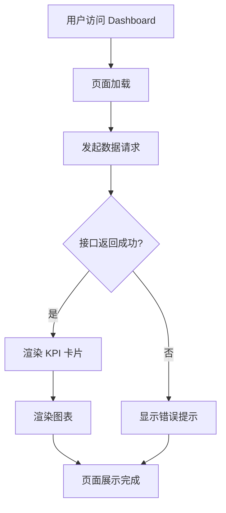

# Dashboard（数据看板）PRD

## 需求背景

### 痛点
- **问题现象**：业务决策层需要快速了解整体经营状况，当前缺乏统一的数据可视化看板，各模块数据分散。
- **发生频率**：高
- **当前 workaround**：通过多个后台管理页面分别查看，或依赖定期下发的 Excel 报表。

### 业务目标
- **量化指标**：看板覆盖核心 KPI 指标数量 >= 10 个；页面加载至首次渲染 < 2s。
- **目标期限**：2026 Q2

### 涉及系统/模块
- **模块名称**：Dashboard（数据看板）
- **变更类型**：新增
- **对接接口**：待对接后端各模块数据接口

---

## 用户故事

### 故事1
- **角色**：管理层 / 政企客户经理
- **功能**：在单一页面查看关键业务指标（收入、成本、项目进度）的可视化图表。
- **收益**：快速获取全局视图，减少在不同页面之间切换的时间成本。
- **验收条件**：页面在 1920x1080 分辨率下正常展示；图表数据与后端接口返回一致。

---

## 需求清单

| 序号 | 需求描述 | 优先级 | 状态 | 负责人 | 截止日期 |
|------|----------|--------|------|--------|----------|
| 1 | 仪表盘主框架，引入 Figma 设计稿（定稿版）组件 | P0 | TODO | | |
| 2 | 按设计稿布局各图表区块（KPI 卡片、折线图、柱状图、饼图等） | P0 | TODO | | |
| 3 | 各图表数据源对接后端接口 | P1 | TODO | | |
| 4 | 图表响应式自适应（不同分辨率） | P2 | TODO | | |

- **优先级**：P0（核心流程阻塞）/ P1（重要功能）/ P2（体验优化）/ P3（未来规划）
- **状态**：TODO / IN PROGRESS / DONE / BLOCKED

---

## 业务流程图

---

## 页面结构

### 路由信息
- **路由路径**：`/dashboard`
- **页面标题**：数据看板
- **访问权限**：登录（需认证）

### 布局结构
- **布局类型**：单栏（全宽设计稿）
- **区域-主内容**：定稿版 Figma 组件完整渲染，支持 1920x1080 基准分辨率

### Tab 结构
- 无 Tab，纯单页展示

---

## 功能描述

### 功能点1：仪表盘主框架

#### 页面级
- **字段：功能入口** - 类型：文本；描述：通过侧边栏导航进入 Dashboard
- **字段：前置条件** - 类型：文本；描述：用户已登录
- **字段：后置影响** - 类型：字段列表；描述：无

#### 页面内容（基于 Figma 定稿版设计稿）
- 背景色：`#e7f3ff`
- 内容区域：1920x1080 固定画布，居中展示
- 组件来源：`FigmaDashboard`（`定稿版`组件）

---

## 数据流图

### 接口1：看板数据接口
- **请求路径**：`GET /api/dashboard/stats`
- **请求方法**：GET
- **请求头**：Authorization
- **请求参数**：无
- **响应字段**：
  - `revenue` - 类型：数字；描述：本月收入（万元）
  - `cost` - 类型：数字；描述：本月成本（万元）
  - `projectCount` - 类型：数字；描述：进行中项目数
  - `opportunityCount` - 类型：数字；描述：商机数量
  - `revenueTrend[]` - 类型：数组；描述：近6个月收入趋势
  - `costTrend[]` - 类型：数组；描述：近6个月成本趋势
- **存储位置**：数据库表
- **错误码**：
  - `401` - 未授权，请重新登录

### 数据刷新点
- **刷新时机**：页面加载时自动请求
- **影响字段**：KPI 卡片数值、图表数据

---

## 验收标准

### 正常流程
- [ ] **操作**：访问 `/dashboard` → **预期**：页面完整渲染，显示所有图表和 KPI 卡片
- [ ] **操作**：刷新页面 → **预期**：数据重新请求并渲染

### 异常流程
- [ ] **操作**：未登录访问 → **预期**：重定向至登录页
- [ ] **操作**：接口返回 500 → **预期**：显示错误提示，数据区显示占位符

---

## 更新记录

### v1 - 2026-05-09
- 初始版本
