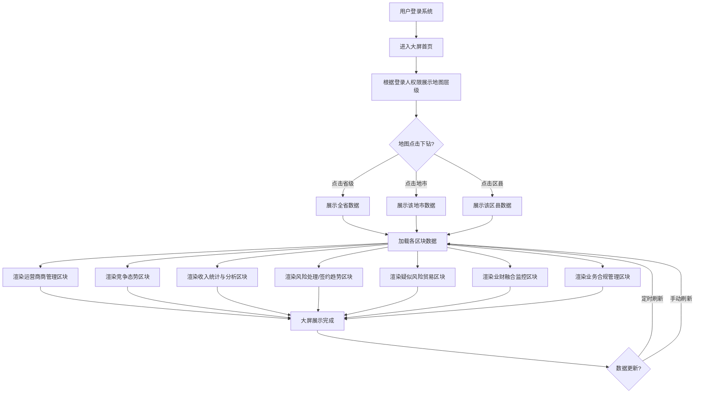

# Dashboard（产数高质量运营平台大屏）PRD

## 需求背景

### 痛点
- **问题现象**：业务决策层需要实时掌握商机运营、竞争态势、产数收入、风险贸易、业财融合等多维度经营状况，当前缺乏统一的数据可视化大屏，各模块数据分散，分析困难。
- **发生频率**：高
- **当前 workaround**：通过多个后台管理页面分别查看，或依赖定期下发的 Excel 报表，数据滞后且不直观。

### 业务目标
- **量化指标**：大屏覆盖核心 KPI 指标 >= 50 个；页面加载至首次渲染 < 3s；支持省-市-区县三级地图下钻。
- **目标期限**：2026 Q2

### 涉及系统/模块
- **模块名称**：Dashboard（产数高质量运营平台大屏）
- **变更类型**：新增
- **对接接口**：商机运营、竞争态势、产数收入、风险贸易、业财融合等各模块数据接口

---

## 用户故事

### 故事1
- **角色**：省级管理层
- **功能**：登录系统默认进入大屏首页，展示全省所有数据，支持穿透展示三级数据（省-市-区县），点击地图下钻至下一级。
- **收益**：从全局视角快速掌握浙江产数业务整体经营状况。
- **验收条件**：默认展示省级数据；地图支持三级下钻；所有数据与登录人权限联动。

### 故事2
- **角色**：地市级管理员
- **功能**：查看本地市的商机管理、竞争态势、收入统计、风险贸易等模块数据。
- **收益**：聚焦本地市数据，精准掌握区域业务短板。
- **验收条件**：地图下钻至地市后展示该地市数据；数据范围 = 登录人权限 + 地图层级 + 当年1月1日至今。

### 故事3
- **角色**：政企客户经理
- **功能**：查看商机总数、推进中商机数及金额、中标比例排名等运营指标。
- **收益**：快速了解商机规模与推进进度，辅助客户拜访与商机挖掘。
- **验收条件**：各指标数据实时更新，支持本月新增和环比变化展示。

---

## 需求清单

| 序号 | 需求描述 | 优先级 | 状态 | 负责人 | 截止日期 |
|------|----------|--------|------|--------|----------|
| 1 | 大屏首页主框架（地图 + 各区块布局） | P0 | TODO | | |
| 2 | 地图三级下钻（省-市-区县）+ 数据联动 | P0 | TODO | | |
| 3 | 时间范围：默认当年1月1日至今数据 | P0 | TODO | | |
| 4 | 运营商机管理区块（商机总数/推进中/中标比例TOP3） | P0 | TODO | | |
| 5 | 竞争态势区块（中标/丢标/漏单 + 商情清单滚动） | P0 | TODO | | |
| 6 | 收入统计与分析区块（产数收入/ICT储备/重点产品/稳政/强企） | P0 | TODO | | |
| 7 | 近一年风险处理 / 项目签约趋势（折线图） | P1 | TODO | | |
| 8 | 疑似风险贸易区块（风险项目清单/派单处理进度） | P1 | TODO | | |
| 9 | 业财融合监控区块（5项差异率折线图） | P1 | TODO | | |
| 10 | 业务合规管理区块（应收账款/列收不规范） | P1 | TODO | | |
| 11 | 各图表数据源对接后端接口 | P1 | TODO | | |
| 12 | 图表响应式自适应（不同分辨率） | P2 | TODO | | |

- **优先级**：P0（核心流程阻塞）/ P1（重要功能）/ P2（体验优化）/ P3（未来规划）
- **状态**：TODO / IN PROGRESS / DONE / BLOCKED

---

## 业务流程图

---

## 页面结构

### 路由信息
- **路由路径**：`/dashboard`
- **页面标题**：产数高质量运营平台大屏
- **访问权限**：登录（政企客户经理/地市管理员/省公司管理人员，权限决定数据范围）

### 布局结构
- **布局类型**：单栏（全宽大屏设计稿）
- **区域-顶部**：标题栏（平台名称 + 当前时间 + 当前层级提示）
- **区域-左侧**：地图区域（支持三级下钻：省-市-区县）
- **区域-主体**：各数据区块（KPI卡片 / 折线图 / 饼图 / 滚动清单）
- **区域-背景**：深色背景，数字大屏风格

### 数据权限规则
- **默认层级**：省级（浙江）
- **下钻层级**：省 → 市（11地市）→ 区县
- **数据范围**：登录人权限 × 地图当前层级 × 时间范围（当年1月1日至今）
- **最多层级**：三级（省-市-区县）

### 时间范围
- **默认范围**：当年1月1日至今
- **截止日期**：动态取当前日期

---

## 功能描述

### 功能点1：大屏首页主框架

#### 页面级
- **字段：功能入口** - 类型：文本；描述：登录后默认跳转进入
- **字段：前置条件** - 类型：文本；描述：用户已登录，有对应数据权限
- **字段：后置影响** - 类型：字段列表；描述：地图层级变化后联动更新所有区块数据

#### 全局数据规则字段
  | 字段名 | 类型 | 必填 | 默认值 | 来源 | 校验规则 | 展示形式 | 交互约束 |
  |--------|------|------|--------|------|----------|----------|----------|
  | 当前地图层级 | 枚举 | | 省级 | 系统 | | 文字标签 | 点击地图切换 |
  | 数据权限范围 | 数组 | | | 系统 | | | 根据登录人角色确定 |
  | 时间范围起 | 日期 | | 当年1月1日 | 系统 | | YYYY-MM-DD | |
  | 时间范围止 | 日期 | | 当前日期 | 系统 | | YYYY-MM-DD | |

---

### 功能点2：运营商机管理

#### 页面级
- **区块标题**：运营商机管理
- **字段列表**：
  | 字段名 | 类型 | 必填 | 默认值 | 来源 | 校验规则 | 展示形式 | 交互约束 |
  |--------|------|------|--------|------|----------|----------|----------|
  | 商机总数 | 数字 | | | 接口 | | 大字号数字 + 标签 | |
  | 本月新增 | 数字 | | | 接口 | | 小字号 + "新增"标签 | |
  | 环比变化 | 数字 | | | 接口 | | ↑↓图标 + 百分比 | 绿色减少红色增长 |
  | 推进中商机数 | 数字 | | | 接口 | | 大字号数字 | |
  | 本月新增 | 数字 | | | 接口 | | 小字号 + "新增"标签 | |
  | 环比变化 | 数字 | | | 接口 | | ↑↓图标 + 百分比 | |
  | 推进中商机总金额 | 金额 | | | 接口 | | 大字号（万元） | |
  | 本月新增 | 金额 | | | 接口 | | 小字号 + "新增"标签 | |
  | 环比变化 | 数字 | | | 接口 | | ↑↓图标 + 百分比 | |
  | TOP3中标比例排名 | 表格 | | | 接口 | | 排名列表 | 展示前三地区中标比例 |

---

### 功能点3：竞争态势

#### 页面级
- **区块标题**：竞争态势
- **字段列表**：
  | 字段名 | 类型 | 必填 | 默认值 | 来源 | 校验规则 | 展示形式 | 交互约束 |
  |--------|------|------|--------|------|----------|----------|----------|
  | 中标数量 | 数字 | | | 接口 | | 大字号 | 截止今日商情库电信中标数量 |
  | 中标金额 | 金额 | | | 接口 | | 大字号 | 截止今日商情库电信中标金额 |
  | 本月新增数量 | 数字 | | | 接口 | | 标签 | |
  | 环比变化 | 数字 | | | 接口 | | ↑↓图标 | 对比上月变化数量 |
  | 电信份额占比图 | 饼图 | | | 接口 | | 饼图 | 电信/移动/联通/广电四家金额占比 |
  | 丢标总数 | 数字 | | | 接口 | | 大字号 | 截止今日商情库非电信中标数量 |
  | 本月新增 | 数字 | | | 接口 | | 标签 | |
  | 环比变化 | 数字 | | | 接口 | | ↑↓图标 | |
  | 漏单总数 | 数字 | | | 接口 | | 大字号 | |
  | 本月新增 | 数字 | | | 接口 | | 标签 | |
  | 环比变化 | 数字 | | | 接口 | | ↑↓图标 | |
  | TOP3区域丢单漏单排名 | 表格 | | | 接口 | | 排名列表 | |

#### 商情清单滚动区
- **自动滚动清单**（3个Tab切换）：
  | 字段名 | 类型 | 必填 | 默认值 | 来源 | 校验规则 | 展示形式 | 交互约束 |
  |--------|------|------|--------|------|----------|----------|----------|
  | 漏单重点大单(>500万) | 滚动列表 | | | 接口 | | 自动滚动 | 鼠标悬停停止，移开继续；倒序 |
  | 丢标重点大单(>500万) | 滚动列表 | | | 接口 | | 自动滚动 | 同上 |
  | 中标重点大单(>500万) | 滚动列表 | | | 接口 | | 自动滚动 | 同上 |
  | 清单项 | 文本 | | | 接口 | | 超长截断 | 点击打开商情详情弹窗 |

---

### 功能点4：收入统计与分析

#### 页面级
- **区块标题**：收入统计与分析

##### 1. 产数收入（4项）
  | 字段名 | 类型 | 必填 | 默认值 | 来源 | 校验规则 | 展示形式 | 交互约束 |
  |--------|------|------|--------|------|----------|----------|----------|
  | 产数收入金额 | 金额 | | | 接口 | | 大字号（万元） | 本年产数类产品确收金额 |
  | 同比 | 百分比 | | | 接口 | | 绿色减少红色增长 | 与去年同期同比 |
  | 预算完成率 | 百分比 | | | 接口 | | 进度条+数字 | 今日本产数收入/全年预算 |
  | 资源型收入金额 | 金额 | | | 接口 | | 大字号 | 本年资源型类产品确收金额 |
  | 同比 | 百分比 | | | 接口 | | 同上 | |
  | 预算完成率 | 百分比 | | | 接口 | | 同上 | |
  | ICT收入金额 | 金额 | | | 接口 | | 大字号 | 本年ICT类产品确收金额 |
  | 同比 | 百分比 | | | 接口 | | 同上 | |
  | 预算完成率 | 百分比 | | | 接口 | | 同上 | |
  | 小微ICT收入金额 | 金额 | | | 接口 | | 大字号 | 本年小微ICT类产品确收金额 |
  | 同比 | 百分比 | | | 接口 | | 同上 | |
  | 预算完成率 | 百分比 | | | 接口 | | 同上 | |

##### 2. ICT项目收入储备
  | 字段名 | 类型 | 必填 | 默认值 | 来源 | 校验规则 | 展示形式 | 交互约束 |
  |--------|------|------|--------|------|----------|----------|----------|
  | 收入储备金额 | 金额 | | | 接口 | | 大字号 | 存量+增量全年计划列收 |
  | 同比 | 百分比 | | | 接口 | | 同上 | |
  | 储备系数 | 数字 | | | 接口 | | 数字 | 收入储备/目标 |
  | 同比 | 百分比 | | | 接口 | | 绿色减少红色增长 | |
  | 签约转收率 | 百分比 | | | 接口 | | 数字 | 计划列收金额/已立项金额 |
  | 同比 | 百分比 | | | 接口 | | 同上 | |

##### 3. 重点产品收入
  | 字段名 | 类型 | 必填 | 默认值 | 来源 | 校验规则 | 展示形式 | 交互约束 |
  |--------|------|------|--------|------|----------|----------|----------|
  | 天翼云收入金额 | 金额 | | | 接口 | | 大字号 | 本年天翼云产品确收金额 |
  | 同比 | 百分比 | | | 接口 | | 绿色减少红色增长 | |
  | 预算完成率 | 百分比 | | | 接口 | | 进度条+数字 | |
  | 强企双线收入金额 | 金额 | | | 接口 | | 大字号 | |
  | 同比 | 百分比 | | | 接口 | | 同上 | |
  | 预算完成率 | 百分比 | | | 接口 | | 同上 | |
  | IDC（含智算）收入金额 | 金额 | | | 接口 | | 大字号 | |
  | 同比 | 百分比 | | | 接口 | | 同上 | |
  | 预算完成率 | 百分比 | | | 接口 | | 同上 | |
  | 5G物联网收入金额 | 金额 | | | 接口 | | 大字号 | |
  | 同比 | 百分比 | | | 接口 | | 同上 | |
  | 预算完成率 | 百分比 | | | 接口 | | 同上 | |

##### 4. 稳政
  | 字段名 | 类型 | 必填 | 默认值 | 来源 | 校验规则 | 展示形式 | 交互约束 |
  |--------|------|------|--------|------|----------|----------|----------|
  | 产数签约额 | 金额 | | | 接口 | | 大字号 | 产数类产品签约额 |
  | 同比 | 百分比 | | | 接口 | | 绿色减少红色增长 | |
  | ICT签约额 | 金额 | | | 接口 | | 大字号 | ICT签约额 |
  | 同比 | 百分比 | | | 接口 | | 同上 | |

##### 5. 强企
  | 字段名 | 类型 | 必填 | 默认值 | 来源 | 校验规则 | 展示形式 | 交互约束 |
  |--------|------|------|--------|------|----------|----------|----------|
  | 管控清单产数收入 | 金额 | | | 接口 | | 大字号 | 管控清单客户产数确收金额 |
  | 同比 | 百分比 | | | 接口 | | 绿色减少红色增长 | |
  | 管控清单ICT签约额 | 金额 | | | 接口 | | 大字号 | |
  | 同比 | 百分比 | | | 接口 | | 同上 | |
  | 百万大单签约数 | 数字 | | | 接口 | | 大字号 | 管控清单客户签约合同金额≥100w的合同数 |
  | 直拓清单ICT签约额 | 金额 | | | 接口 | | 大字号 | 直拓清单客户ICT签约额 |
  | 同比 | 百分比 | | | 接口 | | 同上 | |
  | 百万大单签约数 | 数字 | | | 接口 | | 大字号 | 直拓清单客户签约合同金额≥100w的合同数 |
  | 楼园收入金额 | 金额 | | | 接口 | | 大字号 | 企业类型为楼园的客户列收金额 |
  | 同比 | 百分比 | | | 接口 | | 同上 | |
  | 新增政企客户数 | 数字 | | | 接口 | | 大字号 | 今年新增crm政企客户数 |
  | 同比 | 百分比 | | | 接口 | | 同上 | |
  | 时序目标完成率 | 百分比 | | | 接口 | | 进度条+数字 | 今年新增/目标新增 |
  | 中小企业覆盖率 | 百分比 | | | 接口 | | 数字 | 新增政企客户中中小企业覆盖占比 |
  | 园区覆盖率 | 百分比 | | | 接口 | | 数字 | 新增政企客户中园区企业覆盖占比 |

---

### 功能点5：近一年风险处理 / 项目签约趋势

#### 页面级
- **区块标题**：近一年风险处理 / 项目签约趋势
- **图表类型**：双Y轴折线图（左侧Y轴=派单数量，右侧Y轴=签约完成率）
- **字段列表**：
  | 字段名 | 类型 | 必填 | 默认值 | 来源 | 校验规则 | 展示形式 | 交互约束 |
  |--------|------|------|--------|------|----------|----------|----------|
  | 签约完成率 | 折线 | | | 接口 | | 绿色折线 | 近一年每月数据 |
  | 省内风险派单数量 | 折线 | | | 接口 | | 蓝色折线 | 近一年每月数据 |
  | 集团司库风险派单 | 折线 | | | 接口 | | 紫色折线 | 近一年每月集团下发派单数量 |

---

### 功能点6：疑似风险贸易

#### 页面级
- **区块标题**：疑似风险贸易
- **左侧统计区字段**：
  | 字段名 | 类型 | 必填 | 默认值 | 来源 | 校验规则 | 展示形式 | 交互约束 |
  |--------|------|------|--------|------|----------|----------|----------|
  | 风险项目清单总数 | 数字 | | | 接口 | | 大字号 | |
  | 本月新增 | 数字 | | | 接口 | | 标签 | |
  | 环比数据 | 数字 | | | 接口 | | ↑↓图标 | 环比上个月增长或减少 |
  | 集团司库派单数 | 数字 | | | 接口 | | 大字号 | 本年派单数量 |
  | 集团司库处理完成数 | 数字 | | | 接口 | | 大字号 | |
  | 省内派单数 | 数字 | | | 接口 | | 大字号 | 本省本年派单数量 |
  | 省内处理完成数 | 数字 | | | 接口 | | 大字号 | |

- **右侧清单区**（Tab切换：集团司库风险清单 / 省内风险清单）：
  | 字段名 | 类型 | 必填 | 默认值 | 来源 | 校验规则 | 展示形式 | 交互约束 |
  |--------|------|------|--------|------|----------|----------|----------|
  | 发现风险总数 | 数字 | | | 接口 | | 标签 | 发现风险清单数 |
  | 发现风险模型数 | 数字 | | | 接口 | | 标签 | 从发现风险清单去重计算 |
  | 各风险模型分险数 | 滚动列表 | | | 接口 | | 自动滚动 | 鼠标悬停停止，移开继续滚动 |
  | 环比 | 百分比 | | | 接口 | | 绿色减少红色增长 | 环比上个月增长或减少 |

---

### 功能点7：业财融合监控

#### 页面级
- **区块标题**：业财融合监控

##### 1. 收入计划与实际确收差异率
  | 字段名 | 类型 | 必填 | 默认值 | 来源 | 校验规则 | 展示形式 | 交互约束 |
  |--------|------|------|--------|------|----------|----------|----------|
  | 收入计划金额 | 金额 | | | 接口 | | 大字号 | 截止今日需录收收入计划金额 |
  | 实际确收金额 | 金额 | | | 接口 | | 大字号 | 截止今日已录收金额 |
  | 差异率 | 百分比 | | | 接口 | | 数字 | (计划-确收)/计划 |
  | 各区域折线图 | 折线 | | | 接口 | | 三线折线图 | 收入计划(蓝)/实际确收(绿)/差异率(紫) |

##### 2. 收支关联进度差异率
  | 字段名 | 类型 | 必填 | 默认值 | 来源 | 校验规则 | 展示形式 | 交互约束 |
  |--------|------|------|--------|------|----------|----------|----------|
  | 收入进度 | 百分比 | | | 接口 | | 数字 | 需录收金额/收入计划 |
  | 支出进度 | 百分比 | | | 接口 | | 数字 | 支出金额/支出计划 |
  | 差异率 | 百分比 | | | 接口 | | 数字 | 收入进度-支出进度 |
  | 各区域折线图 | 折线 | | | 接口 | | 三线折线图 | 收入进度(蓝)/支出进度(绿)/差异率(紫) |

##### 3. 收付关联进度差异率
  | 字段名 | 类型 | 必填 | 默认值 | 来源 | 校验规则 | 展示形式 | 交互约束 |
  |--------|------|------|--------|------|----------|----------|----------|
  | 收款进度 | 百分比 | | | 接口 | | 数字 | 收款金额/收款计划 |
  | 付款进度 | 百分比 | | | 接口 | | 数字 | 付款金额/付款计划 |
  | 差异率 | 百分比 | | | 接口 | | 数字 | 收款进度-付款进度 |
  | 各区域折线图 | 折线 | | | 接口 | | 三线折线图 | 收款进度(蓝)/付款进度(绿)/差异率(紫) |

##### 4. 负现金流项目数
  | 字段名 | 类型 | 必填 | 默认值 | 来源 | 校验规则 | 展示形式 | 交互约束 |
  |--------|------|------|--------|------|----------|----------|----------|
  | 负现金流项目数 | 数字 | | | 接口 | | 大字号 | 截止今日负现金流项目数量 |
  | 收付毛利率 | 百分比 | | | 接口 | | 数字 | (收款-付款)/收款 |
  | 各区域折线图 | 折线 | | | 接口 | | 双线折线图 | 负现金流项目数(蓝)/收付毛利率(紫) |

##### 5. 低负毛利率
  | 字段名 | 类型 | 必填 | 默认值 | 来源 | 校验规则 | 展示形式 | 交互约束 |
  |--------|------|------|--------|------|----------|----------|----------|
  | 低负毛利率项目数 | 数字 | | | 接口 | | 大字号 | 截止今日低负毛利率项目数 |
  | 毛利率 | 百分比 | | | 接口 | | 数字 | (确收-支出)/确收 |
  | 各区域折线图 | 折线 | | | 接口 | | 双线折线图 | 低负毛利率项目数(蓝)/毛利率(紫) |

---

### 功能点8：业务合规管理

#### 页面级
- **区块标题**：业务合规管理
- **字段列表**：
  | 字段名 | 类型 | 必填 | 默认值 | 来源 | 校验规则 | 展示形式 | 交互约束 |
  |--------|------|------|--------|------|----------|----------|----------|
  | 项目型应收账款余额 | 金额 | | | 接口 | | 大字号 | |
  | 同比 | 百分比 | | | 接口 | | 绿色减少红色增长 | |
  | 环比 | 百分比 | | | 接口 | | 绿色减少红色增长 | |
  | 项目型一年以上长账龄应收账款余额 | 金额 | | | 接口 | | 大字号 | |
  | 同比 | 百分比 | | | 接口 | | 同上 | |
  | 环比 | 百分比 | | | 接口 | | 同上 | |
  | 列收不规范数 | 数字 | | | 接口 | | 大字号 | |
  | 设备/工程/赔补进主营 | 数字 | | | 接口 | | 大字号 | |

---

## 数据流图

### 接口1：大屏首页数据
- **请求路径**：`GET /api/dashboard/home`
- **请求方法**：GET
- **请求头**：Authorization
- **请求参数**：
  | 参数名 | 类型 | 必填 | 来源 | 校验 |
  |--------|------|------|------|------|
  | region | 字符串 | 否 | 地图当前层级 | 省/市/区县 |
  | regionCode | 字符串 | 否 | 地图点击 | |
  | startDate | 日期 | 否 | 全局时间范围起 | 默认当年1月1日 |
  | endDate | 日期 | 否 | 全局时间范围止 | 默认当前日期 |
- **响应字段**：
  - `opportunityStats{}` - 运营商机管理数据
  - `competitionStats{}` - 竞争态势数据
  - `revenueStats{}` - 收入统计与分析数据
  - `riskTrend{}` - 风险处理/签约趋势数据
  - `riskTradeStats{}` - 疑似风险贸易数据
  - `bizFinanceStats{}` - 业财融合监控数据
  - `complianceStats{}` - 业务合规管理数据
- **存储位置**：各业务数据库聚合表
- **错误码**：401（未授权）/ 500（服务器错误）

### 接口2：竞争态势-商情清单
- **请求路径**：`GET /api/dashboard/competition/list`
- **请求方法**：GET
- **请求参数**：
  | 参数名 | 类型 | 必填 | 来源 | 校验 |
  |--------|------|------|------|------|
  | type | 枚举 | 是 | 清单类型 | lost/abandon/win |
  | region | 字符串 | 否 | 地图层级 | |
  | minAmount | 数字 | 否 | 最低金额 | 默认500万 |
  | startDate | 日期 | 否 | | 默认当年1月1日 |
  | endDate | 日期 | 否 | | 默认当前日期 |
- **响应字段**：
  - `data[]` - 商情清单
    - `companyName` - 字符串；描述：客户名称
    - `amount` - 数字；描述：金额（万元）
    - `bidDate` - 日期；描述：中标/丢标日期
    - `region` - 字符串；描述：所属区域
- **错误码**：401 / 500

### 接口3：业财融合-各区域折线图数据
- **请求路径**：`GET /api/dashboard/biz-finance/trend`
- **请求方法**：GET
- **请求参数**：
  | 参数名 | 类型 | 必填 | 来源 | 校验 |
  |--------|------|------|------|------|
  | type | 枚举 | 是 | 差异类型 | revenue/revenue_expense/payment_expense/negative_cash/low_margin |
  | region | 字符串 | 否 | 地图层级 | |
  | startDate | 日期 | 否 | | 默认当年1月1日 |
  | endDate | 日期 | 否 | | 默认当前日期 |
- **响应字段**：
  - `data[]` - 各区域趋势数据
    - `region` - 字符串；描述：区域名称
    - `planAmount` - 数字；描述：计划金额
    - `actualAmount` - 数字；描述：实际金额
    - `rate` - 数字；描述：差异率
    - `monthly[]` - 数组；描述：近一年每月数据

### 数据刷新点
- **刷新时机**：页面加载 / 地图点击下钻 / 定时刷新（5分钟轮询）
- **影响字段**：所有区块数据联动更新

---

## 验收标准

### 正常流程
- [ ] **操作**：登录系统 → **预期**：默认进入大屏首页，展示省级数据，时间范围为当年1月1日至今
- [ ] **操作**：点击地图上市级区域 → **预期**：页面数据切换至该地市数据，其他区块联动更新
- [ ] **操作**：继续点击地图上区县 → **预期**：数据切换至该区县，最多三级
- [ ] **操作**：查看运营商机管理区块 → **预期**：显示商机总数/推进中数量/金额/中标比例TOP3，各含本月新增和环比数据
- [ ] **操作**：查看竞争态势区块 → **预期**：显示中标/丢标/漏单数量及电信份额饼图，商情清单自动滚动
- [ ] **操作**：鼠标悬停商情清单 → **预期**：滚动停止；移开后继续滚动；点击清单打开详情弹窗
- [ ] **操作**：查看收入统计与分析区块 → **预期**：产数收入/资源型/ICT/小微ICT各含金额/同比/预算完成率；重点产品5项各含金额/同比/完成率
- [ ] **操作**：查看近一年风险处理/签约趋势折线图 → **预期**：三折线展示签约完成率(绿)/省内派单(蓝)/集团司库派单(紫)
- [ ] **操作**：查看业财融合监控区块 → **预期**：5项差异率各含统计数字+各区域折线图（三线或双线）

### 异常流程
- [ ] **操作**：接口返回空数据 → **预期**：区块显示"暂无数据"占位
- [ ] **操作**：网络断开 → **预期**：显示网络异常提示，保留上次数据
- [ ] **操作**：无权限访问 → **预期**：显示 403 或空数据

---

## 更新记录

### v1 - 2026-05-11
- 初始版本，根据大屏文档3.2章节完整重构，包含运营商机管理、竞争态势、收入统计与分析、近一年风险处理/签约趋势、疑似风险贸易、业财融合监控、业务合规管理共8大功能区块的字段级描述
