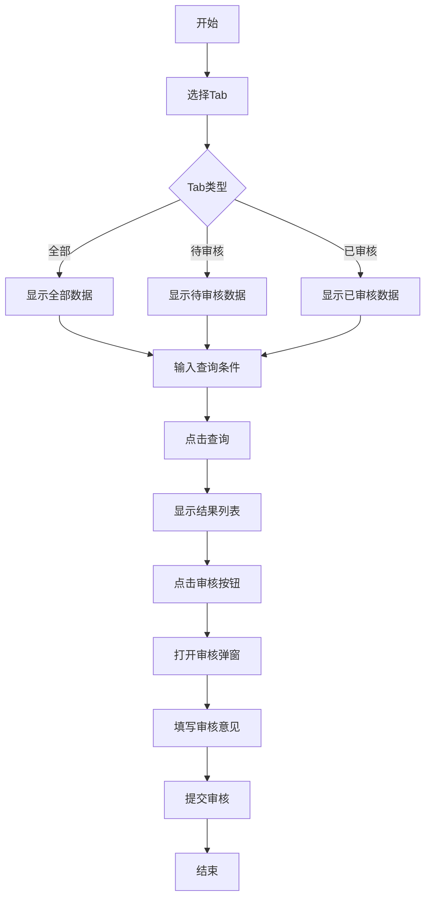

## 需求背景

### 痛点
- **问题现象**：有效商机奖需要审核管理，当前无统一的审核入口
- **发生频率**：高 - 每月有大量商机需要审核发放有效商机奖
- **当前 workaround**：通过线下流程或分散的系统处理

### 业务目标
- **量化指标**：提供统一的审核管理入口，提升审核效率
- **目标期限**：2026年6月

### 涉及系统/模块
- **模块名称**：宁波产数钱包-有效商机奖
- **变更类型**：新增

---

## 用户故事

### 故事1：审核人员
- **角色**：区县分公司审核人员
- **功能**：查询、审核有效商机奖申请
- **收益**：快速处理审核，提升工作效率
- **验收条件**：可按多种条件筛选，支持审核操作

---

## 需求清单

| 序号 | 需求描述 | 优先级 | 状态 | 负责人 | 截止日期 |
|------|----------|--------|------|--------|----------|
| 1 | 实现Tab切换（全部/待审核/已审核） | P0 | TODO | | |
| 2 | 实现查询条件 | P0 | TODO | | |
| 3 | 实现数据表格展示 | P0 | TODO | | |
| 4 | 实现审核弹窗 | P0 | TODO | | |

---

## 业务流程图

---

## 页面结构

### 路由信息
- **路由路径** - `/宁波产数钱包/有效商机奖`
- **页面标题** - 有效商机奖
- **访问权限** - 登录用户

### 布局结构
- **布局类型** - 单栏
- **区域-标题区** - 页面标题"有效商机奖"，副标题说明
- **区域-Tab区** - 全部x个、待审核y个、已审核z个
- **区域-查询区** - 查询条件卡片
- **区域-主内容** - 数据表格，含操作列

---

## 功能描述

### 功能点1：有效商机奖列表

#### Tab 级
- **Tab名称** - 全部/待审核/已审核
- **Tab显示内容** - Tab标签显示数量，如"全部x个"、"待审核y个"、"已审核z个"

#### 查询条件字段：
  | 字段名 | 类型 | 必填 | 默认值 | 来源 | 校验规则 | 展示形式 | 交互约束 |
  |--------|------|------|--------|------|----------|----------|----------|
  | 商机名称 | 文本 | 否 | 空 | 用户输入 | - | 输入框 | 可编辑 |
  | 商机编码 | 文本 | 否 | 空 | 用户输入 | - | 输入框 | 可编辑 |
  | 客户名称 | 文本 | 否 | 空 | 用户输入 | - | 输入框 | 可编辑 |
  | 客户编码 | 文本 | 否 | 空 | 用户输入 | - | 输入框 | 可编辑 |
  | 区县 | 枚举 | 否 | 空 | 用户选择 | - | 下拉选择 | 可编辑 |
  | 支局 | 枚举 | 否 | 空 | 用户选择 | - | 下拉选择 | 可编辑 |
  | 客户经理 | 文本 | 否 | 空 | 用户输入 | - | 输入框 | 可编辑 |
  | 审核状态 | 枚举 | 否 | 空 | 用户选择 | - | 下拉选择 | 可编辑 |
  | 录入时间范围 | 日期 | 否 | 空 | 用户选择 | - | 日期范围选择器 | 可编辑 |

#### 操作按钮字段：
  | 字段名 | 类型 | 必填 | 默认值 | 来源 | 校验规则 | 展示形式 | 交互约束 |
  |--------|------|------|--------|------|----------|----------|----------|
  | 查询 | 按钮 | 是 | - | - | - | primary按钮 | 可编辑 |
  | 导出 | 按钮 | 否 | - | - | - | outline按钮 | 点击输出导出日志 |
  | 重置 | 按钮 | 是 | - | - | - | outline按钮 | 可编辑 |

#### 字段列表：
  | 字段名 | 类型 | 必填 | 默认值 | 来源 | 校验规则 | 展示形式 | 交互约束 |
  |--------|------|------|--------|------|----------|----------|----------|
  | 商机名称 | 文本 | 是 | - | 接口 | - | 文字 | 只读 |
  | 商机编码 | 文本 | 是 | - | 接口 | - | 蓝色文字 | 只读 |
  | 客户名称 | 文本 | 是 | - | 接口 | - | 文字 | 只读 |
  | 客户编码 | 文本 | 是 | - | 接口 | - | 文字 | 只读 |
  | 有效商机奖金额 | 数字 | 是 | - | 接口 | - | 蓝色数字 | 只读 |
  | 录入时间 | 日期 | 是 | - | 接口 | - | 日期文字 | 只读 |
  | 客户经理 | 文本 | 是 | - | 接口 | - | 文字 | 只读 |
  | 区县 | 文本 | 是 | - | 接口 | - | 文字 | 只读 |
  | 支局 | 文本 | 是 | - | 接口 | - | 文字 | 只读 |
  | 审核状态 | 文本 | 是 | - | 接口 | - | 标签(待审核/已审核) | 只读 |
  | 操作 | 操作 | 是 | - | - | - | 审核按钮 | 可编辑 |

### 功能点2：审核弹窗

#### 弹窗级
- **弹窗：审核弹窗**
  - **触发入口**：点击列表中的"审核"按钮
  - **关闭方式**：关闭图标 / 取消按钮 / Esc键
  - **字段列表**：
    | 字段名 | 类型 | 必填 | 默认值 | 来源 | 校验规则 | 展示形式 | 交互约束 |
    |--------|------|------|--------|------|----------|----------|----------|
    | 审核意见 | 文本 | 否 | 空 | 用户输入 | - | 多行文本输入框 | 可编辑 |
  - **确定按钮**：点击后调用审核接口，成功关闭弹窗刷新列表，失败显示错误信息
  - **取消按钮**：点击后关闭弹窗，不调用接口

---

## 数据流图

### 接口1：查询有效商机奖列表
- **请求路径** - `/api/taskWallet/effectiveBusinessOpp/list`
- **请求方法** - POST
- **请求参数** - 商机名称、商机编码、客户名称、客户编码、区县、支局、客户经理、审核状态、录入时间范围、Tab类型
- **响应字段** - records, total, 待审核数量, 已审核数量

### 接口2：审核有效商机奖
- **请求路径** - `/api/taskWallet/effectiveBusinessOpp/audit`
- **请求方法** - POST
- **请求参数** - id, 审核意见, 审核状态
- **响应字段** - success, message

---

## 验收标准

### 正常流程
- [ ] **操作**：进入页面，显示Tab切换和全部数据 → **预期**：Tab显示全部x个
- [ ] **操作**：点击"待审核"Tab → **预期**：列表显示待审核数据
- [ ] **操作**：点击"已审核"Tab → **预期**：列表显示已审核数据
- [ ] **操作**：填写查询条件，点击查询 → **预期**：表格显示筛选后的数据
- [ ] **操作**：点击"审核"按钮 → **预期**：审核弹窗打开
- [ ] **操作**：填写审核意见，点击确定 → **预期**：审核成功，弹窗关闭，列表刷新

### 异常流程
- [ ] **操作**：不填写审核意见直接提交 → **预期**：可以提交（审核意见非必填）
- [ ] **操作**：审核接口返回错误 → **预期**：弹窗显示错误信息，数据未保存

---

## 更新记录

### v1 - 2026-05-20
- 初始版本：有效商机奖页面PRD