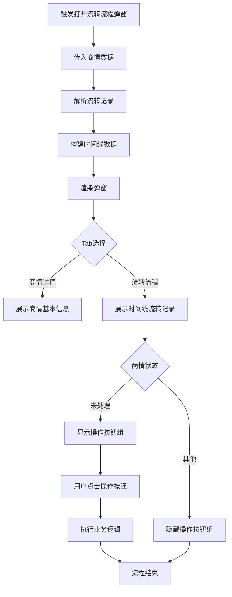

# 流转流程弹窗 PRD

## 需求背景

### 痛点
- **问题现象**：商情流转过程中，用户无法直观了解当前所处环节、处理人、已完成的流转步骤，需要通过分散的记录或系统日志查看流转历史
- **发生频率**：高
- **当前 workaround**：用户通过系统通知或手动查询了解流转状态，缺乏统一的流转流程可视化展示

### 业务目标
- **量化指标**：用户查询流转状态时间缩短 50%，流转异常定位效率提升 30%
- **目标期限**：2026-Q2

### 涉及系统/模块
- **模块名称**：流转流程弹窗
- **变更类型**：新增
- **对接接口**：商情详情、流程历史记录

---

## 用户故事

### 故事1：用户查看商情流转流程
- **角色**：业务人员/管理员
- **功能**：在商情详情页点击查看流转流程，以时间线形式展示完整的流转记录
- **收益**：直观了解商情从创建到当前状态的全流程，提高信息透明度
- **验收条件**：
  - 弹窗以时间线形式展示流转记录
  - 每条记录显示时间、操作人、执行操作、操作前状态、操作后状态
  - 当前处理步骤高亮显示

### 故事2：用户对未处理商情进行操作
- **角色**：业务人员
- **功能**：对状态为"未处理"的商情进行关联商机、创建商机、回退集团、取回等操作
- **收益**：快速处理待办商情，提高工作效率
- **验收条件**：
  - 仅当 businessInfoStatus 为"未处理"时显示操作按钮
  - 点击操作按钮后执行对应业务逻辑

---

## 需求清单

| 序号 | 需求描述 | 优先级 | 状态 | 负责人 | 截止日期 |
|------|----------|--------|------|--------|----------|
| 1 | 实现流转流程弹窗显示 | P0 | TODO | | |
| 2 | 实现时间线形式展示流转记录 | P0 | TODO | | |
| 3 | 实现商情详情/流转流程 Tab 切换 | P1 | TODO | | |
| 4 | 实现未处理状态的操作按钮 | P1 | TODO | | |
| 5 | 实现关闭弹窗功能 | P0 | TODO | | |

- **优先级**：P0（核心流程阻塞）/ P1（重要功能）/ P2（体验优化）/ P3（未来规划）
- **状态**：TODO / IN PROGRESS / DONE / BLOCKED

---

## 业务流程图

---

## 页面结构

### 路由信息
- **路由路径** - 类型：文本；描述：弹窗组件，无独立路由，通过父组件控制显示
- **页面标题** - 类型：文本；示例：`流转流程`
- **访问权限** - 类型：枚举（公开/登录/角色）；描述：登录用户

### 布局结构
- **布局类型** - 类型：枚举（单栏/双栏/三栏）；描述：弹窗居中展示
- **区域-主内容** - 字段列表；描述：Tab切换区 + 内容区 + 底部按钮区

---

## 功能描述

### 功能点1：流转流程弹窗展示

#### 页面级
- **字段：功能入口** - 类型：文本；描述：从商情详情页点击"查看流转"按钮打开
- **字段：前置条件** - 类型：文本；描述：商情数据已加载，存在流转记录
- **字段：后置影响** - 类型：字段列表；描述：关闭弹窗后返回父页面

#### 弹窗级
- **弹窗：流转流程弹窗**
  - **触发入口**：点击父页面的"查看流转"按钮
  - **关闭方式**：遮罩层点击 / 关闭图标 / 确定按钮 / 关闭按钮 / Esc键
  - **弹窗尺寸**：宽度 800px，最大高度 90vh
  - **字段列表**：
    | 字段名 | 类型 | 必填 | 默认值 | 来源 | 校验规则 | 展示形式 | 交互约束 |
    |--------|------|------|--------|------|----------|----------|----------|
    | 弹窗标题 | 文本 | - | 流转流程 | - | - | 文字 | 只读 |
    | Tab-商情详情 | Tab触发器 | - | 未激活 | 用户点击 | - | 文字按钮 | 点击切换 |
    | Tab-流转流程 | Tab触发器 | - | 默认激活 | 用户点击 | - | 文字按钮 | 点击切换 |

### 功能点2：流转流程时间线展示

#### 弹窗级
- **弹窗：流转流程弹窗 - 流转流程 Tab**
  - **字段列表**：
    | 字段名 | 类型 | 必填 | 默认值 | 来源 | 校验规则 | 展示形式 | 交互约束 |
    |--------|------|------|--------|------|----------|----------|----------|
    | 时间 | 日期时间 | - | - | 接口返回 | - | YYYY-MM-DD HH:mm:ss | 只读 |
    | 操作人 | 文本 | - | - | 接口返回 | - | 文本 | 只读 |
    | 执行操作 | 文本 | - | - | 接口返回 | - | 文本 | 只读 |
    | 操作前状态 | 文本 | - | - | 接口返回 | - | 文本 | 只读 |
    | 操作后状态 | 文本 | - | - | 接口返回 | - | 文本 | 只读 |
    | 备注 | 文本 | 否 | 空 | 接口返回 | - | 文本段落 | 只读 |
    | 连接线 | 装饰 | - | - | 系统生成 | - | 垂直虚线 | 视觉连接 |

### 功能点3：未处理状态操作按钮

#### 弹窗级
- **弹窗：流转流程弹窗 - 底部按钮区**
  - **触发入口**：当 businessInfoStatus === "未处理" 时显示
  - **字段列表**：
    | 字段名 | 类型 | 必填 | 默认值 | 来源 | 校验规则 | 展示形式 | 交互约束 |
    |--------|------|------|--------|------|----------|----------|----------|
    | 确定 | 按钮 | - | - | - | - | 主操作按钮 | 点击关闭弹窗 |
    | 关联商机 | 按钮 | - | - | - | - | 主操作按钮 | 仅未处理状态显示 |
    | 创建商机 | 按钮 | - | - | - | - | 主操作按钮 | 仅未处理状态显示 |
    | 回退集团 | 按钮 | - | - | - | - | 次要按钮 | 仅未处理状态显示 |
    | 取回 | 按钮 | - | - | - | - | 次要按钮 | 仅未处理状态显示 |
    | 关闭 | 按钮 | - | - | - | - | 次要按钮 | 点击关闭弹窗 |

---

## 数据流图

### 接口1：获取流转流程记录
- **请求路径** - 类型：文本；示例：`GET /api/business-info/{id}/flow-history`
- **请求方法** - 类型：枚举；必填：是
- **请求头** - 字段列表；描述：Authorization: Bearer {token}
- **请求参数** - 字段列表：
  - `id` - 类型：字符串；必填：是；来源：商情ID；校验：非空
- **响应字段** - 字段列表：
  - `groupDispatchTime` - 类型：字符串；描述：集团派单时间
  - `groupBusinessTime` - 类型：字符串；描述：省级业务处理时间
  - `currentOperators` - 类型：数组；描述：当前处理人列表
  - `currentOperator` - 类型：字符串；描述：当前处理人
  - `currentOperationRole` - 类型：字符串；描述：当前操作角色
  - `currentOperationStep` - 类型：字符串；描述：当前操作步骤
  - `flowHistory` - 类型：数组；描述：历史流转记录
    - `id` - 类型：数字；描述：记录ID
    - `time` - 类型：字符串；描述：操作时间
    - `operator` - 类型：字符串；描述：操作人
    - `fromRole` - 类型：字符串；描述：操作前角色/状态
    - `toRole` - 类型：字符串；描述：操作后角色/状态
    - `action` - 类型：字符串；描述：执行操作
    - `remark` - 类型：字符串；描述：备注信息
- **存储位置** - 类型：文本；示例：`数据库表 business_info_flow_history`
- **错误码** - 字段列表：
  - `404` - `商情记录不存在`
  - `500` - `服务器异常`

### 接口2：执行业务操作（关联商机/创建商机/回退/取回）
- **请求路径** - 类型：文本；示例：`POST /api/business-info/{id}/action`
- **请求方法** - 类型：枚举；必填：是
- **请求头** - 字段列表；描述：Authorization: Bearer {token}
- **请求参数** - 字段列表：
  - `id` - 类型：字符串；必填：是；来源：商情ID；校验：非空
  - `action` - 类型：枚举；必填：是；来源：用户点击的按钮；校验：枚举值（associate_opportunity/create_opportunity/rollback/fetch）
- **响应字段** - 字段列表：
  - `success` - 类型：布尔；描述：是否操作成功
  - `message` - 类型：字符串；描述：操作结果信息
- **存储位置** - 类型：文本；示例：`数据库表 business_info`
- **错误码** - 字段列表：
  - `400` - `操作参数错误`
  - `403` - `无操作权限`
  - `409` - `当前状态不允许此操作`
  - `500` - `服务器异常`

### 数据刷新点
- **刷新时机** - 类型：枚举（页面加载/操作成功后）
- **影响字段** - 字段列表；描述：流转记录列表、当前处理状态

---

## 验收标准

### 正常流程
- [ ] **操作**：点击父页面"查看流转"按钮 → **预期**：弹窗打开，默认显示"流转流程" Tab
- [ ] **操作**：点击"商情详情" Tab → **预期**：内容切换为商情基本信息展示
- [ ] **操作**：点击"流转流程" Tab → **预期**：内容切换为时间线流转记录
- [ ] **操作**：查看时间线记录 → **预期**：每条记录显示时间、操作人、操作、状态变更信息
- [ ] **操作**：对未处理商情点击"关联商机" → **预期**：调用关联接口，显示操作结果
- [ ] **操作**：对未处理商情点击"创建商机" → **预期**：调用创建接口，显示操作结果
- [ ] **操作**：点击"确定"或"关闭"按钮 → **预期**：弹窗关闭，不修改任何数据

### 异常流程
- [ ] **操作**：网络异常时打开弹窗 → **预期**：显示加载失败提示，可重试
- [ ] **操作**：商情状态为"已处理"时打开弹窗 → **预期**：底部操作按钮不显示
- [ ] **操作**：流转记录为空 → **预期**：显示空状态提示
- [ ] **操作**：点击遮罩层 → **预期**：弹窗关闭

---

## 更新记录

### v1 - 2026-05-09
- 初始版本
