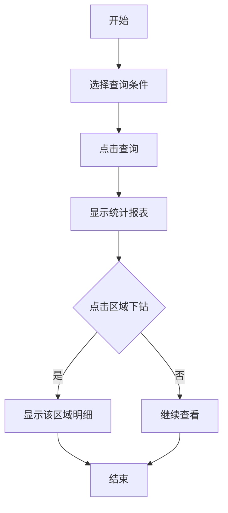

## 需求背景

### 痛点
- **问题现象**：管理层需要按区域统计大额商机奖发放情况，但数据分散难以汇总
- **发生频率**：高 - 每月都需要统计汇报
- **当前 workaround**：手动汇总多个数据源

### 业务目标
- **量化指标**：提供按区域下钻的统计报表，便于管理层决策
- **目标期限**：2026年6月

### 涉及系统/模块
- **模块名称**：宁波产数钱包-大额商机奖发放统计报表
- **变更类型**：新增

---

## 用户故事

### 故事1：管理人员
- **角色**：区县分公司管理人员
- **功能**：查看大额商机奖发放统计，按区域下钻分析
- **收益**：快速了解各区域大额商机奖发放情况
- **验收条件**：可按区域下钻查看明细数据

---

## 需求清单

| 序号 | 需求描述 | 优先级 | 状态 | 负责人 | 截止日期 |
|------|----------|--------|------|--------|----------|
| 1 | 实现查询条件和表格展示 | P0 | DONE | | |
| 2 | 实现区域下钻功能 | P0 | DONE | | |
| 3 | 实现重置功能 | P0 | DONE | | |

---

## 业务流程图

---

## 页面结构

### 路由信息
- **路由路径** - `/宁波产数钱包/大额商机奖发放统计报表`
- **页面标题** - 大额商机奖发放统计报表
- **访问权限** - 登录用户

### 布局结构
- **布局类型** - 单栏
- **区域-标题区** - 页面标题"大额商机奖发放统计报表"，副标题"按区域统计大额商机奖发放情况"
- **区域-查询区** - 查询条件卡片
- **区域-主内容** - 统计表格

---

## 功能描述

### 功能点1：大额商机奖发放统计

#### Tab 级
- **Tab名称** - 大额商机奖发放统计报表
- **查询条件字段**：
  | 字段名 | 类型 | 必填 | 默认值 | 来源 | 校验规则 | 展示形式 | 交互约束 |
  |--------|------|------|--------|------|----------|----------|----------|
  | 地市 | 枚举 | 否 | 空 | 用户选择 | - | 下拉选择 | 可编辑 |
  | 区县 | 枚举 | 否 | 空 | 用户选择 | - | 下拉选择 | 可编辑 |
  | 支局 | 枚举 | 否 | 空 | 用户选择 | - | 下拉选择 | 可编辑 |
  | 账期 | 文本 | 否 | 空 | 用户选择 | type=month | 月份选择器 | 可编辑 |

- **操作按钮字段**：
  | 字段名 | 类型 | 必填 | 默认值 | 来源 | 校验规则 | 展示形式 | 交互约束 |
  |--------|------|------|--------|------|----------|----------|----------|
  | 查询 | 按钮 | 是 | - | - | - | primary按钮 | 可编辑 |
  | 重置 | 按钮 | 是 | - | - | - | outline按钮 | 可编辑 |

- **字段列表**：
  | 字段名 | 类型 | 必填 | 默认值 | 来源 | 校验规则 | 展示形式 | 交互约束 |
  |--------|------|------|--------|------|----------|----------|----------|
  | 账期 | 文本 | 是 | - | 接口 | - | 文字 | 只读 |
  | 区域（下钻） | 文本 | 是 | - | 接口 | - | 蓝色链接 | 可编辑 |
  | 当月发放大额商机奖励个数 | 数字 | 是 | - | 接口 | - | 数字 | 只读 |
  | 当月发放大额商机奖励金额 | 数字 | 是 | - | 接口 | - | 蓝色数字 | 只读 |
  | 本年度累计已发放大额商机奖个数 | 数字 | 是 | - | 接口 | - | 数字 | 只读 |
  | 本年度累计已发放大额商机奖金额 | 数字 | 是 | - | 接口 | - | 蓝色数字 | 只读 |
  | 未发放大额商机奖个数 | 数字 | 是 | - | 接口 | - | 数字 | 只读 |
  | 未发放大额商机奖金额 | 数字 | 是 | - | 接口 | - | 橙色数字 | 只读 |

---

## 数据流图

### 接口1：查询大额商机奖发放统计
- **请求路径** - `/api/taskWallet/getSaleOppAwardReportList`
- **请求方法** - POST
- **请求参数** - 地市、区县、支局、账期
- **响应字段** - 区域统计数据列表

---

## 验收标准

### 正常流程
- [ ] **操作**：进入页面，默认显示本月数据 → **预期**：显示大额商机奖统计报表
- [ ] **操作**：点击区域名称 → **预期**：下钻显示该区域的明细数据
- [ ] **操作**：选择账期后查询 → **预期**：显示该账期的统计数据

### 异常流程
- [ ] **操作**：选择的账期无数据 → **预期**：显示空表格，提示"暂无数据"

---

## 更新记录

### v1 - 2026-05-18
- 初始版本：大额商机奖发放统计报表PRD