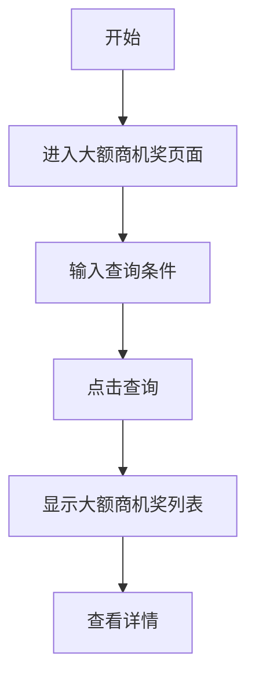

## 需求背景

### 痛点
- **问题现象**：大额商机奖需要分配管理，当前无统一的分配入口
- **发生频率**：高 - 每月有大量商机需要分配大额商机奖
- **当前 workaround**：通过线下流程或分散的系统处理

### 业务目标
- **量化指标**：提供统一的分配管理入口，提升分配效率
- **目标期限**：2026年6月

### 涉及系统/模块
- **模块名称**：宁波产数钱包-大额商机奖
- **变更类型**：新增

---

## 用户故事

### 故事1：管理人员
- **角色**：区县分公司管理人员
- **功能**：查询、分配大额商机奖
- **收益**：快速处理分配，提升工作效率
- **验收条件**：可按多种条件筛选，支持分配操作

---

## 需求清单

| 序号 | 需求描述 | 优先级 | 状态 | 负责人 | 截止日期 |
|------|----------|--------|------|--------|----------|
| 1 | 实现查询条件（7个字段） | P0 | DONE | | |
| 2 | 实现数据表格展示（15列） | P0 | DONE | | |

---

## 业务流程图

---

## 页面结构

### 路由信息
- **路由路径** - `/宁波产数钱包/大额商机奖`
- **页面标题** - 大额商机奖
- **访问权限** - 登录用户

### 布局结构
- **布局类型** - 单栏
- **区域-标题区** - 页面标题"大额商机奖"，副标题"查询和分配大额商机奖发放"
- **区域-查询区** - 查询条件卡片（4列布局）
- **区域-主内容** - 数据表格

---

## 功能描述

### 功能点1：大额商机奖查询

#### 查询条件字段：
| 字段名 | 类型 | 必填 | 默认值 | 来源 | 校验规则 | 展示形式 | 交互约束 |
|--------|------|------|--------|------|----------|----------|----------|
| 商机名称 | 文本 | 否 | 空 | 用户输入 | - | 输入框 | 可编辑 |
| 商机编码 | 文本 | 否 | 空 | 用户输入 | - | 输入框 | 可编辑 |
| 区县 | 枚举 | 否 | 空 | 用户选择 | - | 下拉选择 | 可编辑 |
| 支局 | 枚举 | 否 | 空 | 用户选择 | - | 下拉选择 | 可编辑 |
| 客户经理 | 文本 | 否 | 空 | 用户输入 | - | 输入框 | 可编辑 |
| 收款状态 | 枚举 | 否 | 空 | 用户选择 | - | 下拉选择 | 可编辑 |
| 签报状态 | 枚举 | 否 | 空 | 用户选择 | - | 下拉选择 | 可编辑 |

#### 操作按钮字段：
| 字段名 | 类型 | 必填 | 默认值 | 来源 | 校验规则 | 展示形式 | 交互约束 |
|--------|------|------|--------|------|----------|----------|----------|
| 查询 | 按钮 | 是 | - | - | - | primary按钮 | 可编辑 |
  | 导出 | 按钮 | 否 | - | - | - | outline按钮 | 点击输出导出日志 |
| 重置 | 按钮 | 是 | - | - | - | outline按钮 | 可编辑 |

#### 字段列表（15列）：
| 字段名 | 类型 | 必填 | 默认值 | 来源 | 校验规则 | 展示形式 | 交互约束 |
|--------|------|------|--------|------|----------|----------|----------|
| 商机名称 | 文本 | 是 | - | 接口 | - | 文字(最大宽度截断) | 只读 |
| 商机编码 | 文本 | 是 | - | 接口 | - | 蓝色文字 | 只读 |
| 合同金额(万元) | 数字 | 是 | - | 接口 | - | 数字 | 只读 |
| 大额商机奖金额 | 数字 | 是 | - | 接口 | - | 蓝色数字 | 只读 |
| 客户经理 | 文本 | 是 | - | 接口 | - | 文字 | 只读 |
| 区县 | 文本 | 是 | - | 接口 | - | 文字 | 只读 |
| 支局 | 文本 | 是 | - | 接口 | - | 文字 | 只读 |
| 收款状态 | 文本 | 是 | - | 接口 | - | 标签(已收款-绿色/待收款-黄色) | 只读 |
| 签报状态 | 文本 | 是 | - | 接口 | - | 标签(已签报-绿色/待签报-黄色) | 只读 |
| 商机录入时间 | 日期 | 是 | - | 接口 | - | 日期文字 | 只读 |
| 商机转化时间 | 日期 | 是 | - | 接口 | - | 日期文字 | 只读 |
| 关联签报文号 | 文本 | 是 | - | 接口 | - | 文字 | 只读 |
| 审核状态 | 文本 | 是 | - | 接口 | - | 标签(已审核-绿色/待分配-黄色/已分配-绿色) | 只读 |
| 送审人 | 文本 | 是 | - | 接口 | - | 文字 | 只读 |
| 审批时间 | 日期 | 是 | - | 接口 | - | 日期文字 | 只读 |

---

## 数据流图

### 接口1：查询大额商机奖列表
- **请求路径** - `/api/taskWallet/bigBusinessOpp/list`
- **请求方法** - POST
- **请求参数** - 商机名称、商机编码、区县、支局、客户经理、收款状态、签报状态、pageNum, pageSize
- **响应字段** - records, total

---

## 验收标准

### 正常流程
- [ ] **操作**：进入大额商机奖页面 → **预期**：显示查询条件和空列表
- [ ] **操作**：输入查询条件，点击查询 → **预期**：显示大额商机奖列表
- [ ] **操作**：点击"重置"按钮 → **预期**：查询条件清空

### 异常流程
- [ ] **操作**：未选择区县直接选择支局 → **预期**：支局下拉框禁用

---

## 更新记录

### v1 - 2026-05-20
- 更新版本：大额商机奖页面PRD（移除Tab，保留15列数据）