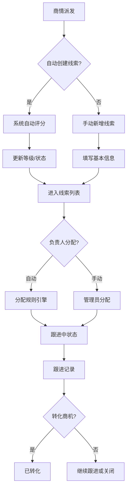

# 线索获取 PRD

## 需求背景

### 痛点
- **问题现象**：商情派发后线索手动录入效率低，数据分散无法统一管理，缺乏评分机制导致跟进优先级不清晰
- **发生频率**：高
- **当前 workaround**：线下Excel记录，人工判断优先级

### 业务目标
- **量化指标**：线索自动创建率≥95%，A级线索24小时内跟进率≥90%
- **目标期限**：2026-Q2

### 涉及系统/模块
- **模块名称**：线索获取
- **变更类型**：新增
- **对接接口**：商情派发系统

---

## 用户故事

### 故事1
- **角色**：销售经理
- **功能**：商情派发后自动生成线索，记录客户基本信息并完成评分分级
- **收益**：减少重复录入，确保高价值线索优先跟进
- **验收条件**：商情派发触发后3分钟内生成线索，评分结果准确

### 故事2
- **角色**：线索负责人
- **功能**：查看线索详情、跟进记录，支持新增线索和编辑
- **收益**：快速了解线索全貌，提升跟进效率
- **验收条件**：详情页信息完整，跟进记录按时间倒序展示

### 故事3
- **角色**：管理员
- **功能**：配置线索分级评分标准（潜在价值/紧急程度/需求匹配度权重）
- **收益**：灵活适配不同业务场景的评分规则
- **验收条件**：配置保存后新线索自动应用新规则

---

## 需求清单

| 序号 | 需求描述 | 优先级 | 状态 | 负责人 | 截止日期 |
|------|----------|--------|------|--------|----------|
| 1 | 线索列表展示（序号/编号/客户名称/联系人/电话/区域/来源/关联商情/预估金额/等级/状态/负责人/跟进次数/创建时间） | P0 | TODO | | |
| 2 | 统计卡片：线索总数/A级/B级/C级/跟进中/已转化 | P0 | TODO | | |
| 3 | 搜索筛选：关键词搜索（客户名称/线索编号/联系人）+ 等级筛选 + 状态筛选 | P0 | TODO | | |
| 4 | 线索详情页：基本信息/联系人信息/评分信息/跟进记录/操作日志 | P0 | TODO | | |
| 5 | 新增线索按钮 | P1 | TODO | | |
| 6 | 导出数据按钮 | P1 | TODO | | |
| 7 | 刷新按钮 | P1 | TODO | | |
| 8 | 查看/编辑操作入口 | P1 | TODO | | |
| 9 | 分页组件（上一页/页码/下一页） | P0 | TODO | | |
| 10 | 线索分级标准Tab：潜在价值评分/紧急程度评分/需求匹配度评分/等级评定规则 | P1 | TODO | | |
| 11 | 评分规则保存/重置按钮 | P1 | TODO | | |

- **优先级**：P0（核心流程阻塞）/ P1（重要功能）/ P2（体验优化）/ P3（未来规划）
- **状态**：TODO / IN PROGRESS / DONE / BLOCKED

---

## 业务流程图

---

## 页面结构

### 路由信息
- **路由路径**：`/lead-acquisition`
- **页面标题**：线索获取
- **访问权限**：登录 / 销售/管理员角色

### 布局结构
- **布局类型**：单栏
- **区域-主内容**：页面标题 + Tabs（线索列表/线索分级标准）

### Tab 结构
- **Tab名称**：线索列表 / 线索分级标准
- **Tab路由**：通过Tabs组件切换（无独立路由）
- **加载方式**：预加载
- **默认激活**：线索列表

---

## 功能描述

### 功能点1：线索列表

#### 页面级
- **字段：功能入口** - 类型：文本；描述：点击Tab「线索列表」进入
- **字段：前置条件** - 类型：文本；描述：用户已登录，且有线索数据
- **字段：后置影响** - 类型：字段列表；描述：列表刷新影响统计卡片数据

#### 统计卡片
| 字段名 | 类型 | 必填 | 默认值 | 来源 | 校验规则 | 展示形式 | 交互约束 |
|--------|------|------|--------|------|----------|----------|----------|
| 线索总数 | 数字 | - | 0 | 接口 | - | 渐变卡片 | 只读 |
| A级线索数 | 数字 | - | 0 | 接口 | - | 红色渐变卡片 | 只读 |
| B级线索数 | 数字 | - | 0 | 接口 | - | 橙色渐变卡片 | 只读 |
| C级线索数 | 数字 | - | 0 | 接口 | - | 黄色渐变卡片 | 只读 |
| 跟进中数 | 数字 | - | 0 | 接口 | - | 青色渐变卡片 | 只读 |
| 已转化数 | 数字 | - | 0 | 接口 | - | 绿色渐变卡片 | 只读 |

#### 查询条件字段
| 字段名 | 类型 | 必填 | 默认值 | 来源 | 校验规则 | 展示形式 | 交互约束 |
|--------|------|------|--------|------|----------|----------|----------|
| 关键词搜索 | 字符串 | 否 | 空 | 页面输入 | - | Input带搜索图标 | 实时过滤 |
| 线索等级 | 枚举 | 否 | all | 下拉选择 | 枚举：A/B/C级/全部 | Select | 选择即过滤 |
| 线索状态 | 枚举 | 否 | all | 下拉选择 | 枚举：待分配/跟进中/已转化/已关闭/全部 | Select | 选择即过滤 |

#### 操作按钮字段
| 字段名 | 类型 | 必填 | 默认值 | 来源 | 校验规则 | 展示形式 | 交互约束 |
|--------|------|------|--------|------|----------|----------|----------|
| 新增线索 | 按钮 | - | - | - | - | 主色按钮 | 点击弹出新增弹窗 |
| 导出数据 | 按钮 | - | - | - | - | 边框按钮 | 触发导出 |
| 刷新 | 按钮 | - | - | - | - | 边框小按钮 | 重新加载列表 |

#### 字段列表（数据表格）
| 字段名 | 类型 | 必填 | 默认值 | 来源 | 校验规则 | 展示形式 | 交互约束 |
|--------|------|------|--------|------|----------|----------|----------|
| 序号 | 数字 | - | 自增 | - | - | 文字 | 只读 |
| 线索编号 | 字符串 | - | - | 接口 | - | 文字 | 只读 |
| 客户名称 | 字符串 | - | - | 接口 | - | 超长截断 | 点击跳转详情 |
| 联系人 | 字符串 | - | - | 接口 | - | 文字 | 只读 |
| 联系电话 | 字符串 | - | - | 接口 | - | 文字（脱敏） | 只读 |
| 所属区域 | 字符串 | - | - | 接口 | - | 文字 | 只读 |
| 线索来源 | 字符串 | - | - | 接口 | - | 蓝色标签 | 只读 |
| 关联商情 | 字符串 | - | - | 接口 | - | 蓝色文字/无则显示- | 可点击 |
| 预估金额 | 数字 | - | - | 接口 | - | 右对齐+¥X.XX万 | 只读 |
| 线索等级 | 枚举 | - | - | 接口 | - | A级红色/B级橙色/C级黄色标签 | 只读 |
| 线索状态 | 枚举 | - | - | 接口 | - | 待分配橙色/跟进中蓝色/已转化绿色/已关闭灰色标签 | 只读 |
| 负责人 | 字符串 | - | - | 接口 | - | 文字/待分配 | 只读 |
| 跟进次数 | 数字 | - | 0 | 接口 | - | 居中数字 | 只读 |
| 创建时间 | 日期时间 | - | - | 接口 | - | YYYY-MM-DD HH:mm:ss | 只读 |
| 操作 | 操作组 | - | - | - | - | 查看/编辑图标按钮 | 点击触发 |

#### 分页
| 字段名 | 类型 | 必填 | 默认值 | 来源 | 校验规则 | 展示形式 | 交互约束 |
|--------|------|------|--------|------|----------|----------|----------|
| 总记录数 | 数字 | - | 0 | 接口 | - | 文字 | 只读 |
| 上一页 | 按钮 | - | 禁用 | - | - | 边框按钮 | 无数据时禁用 |
| 页码按钮 | 数字 | - | - | 接口 | - | 边框按钮/当前页蓝色填充 | 点击跳转 |
| 下一页 | 按钮 | - | - | - | - | 边框按钮 | 末页禁用 |

---

### 功能点2：线索详情页

#### 页面级
- **字段：功能入口** - 类型：按钮；描述：点击列表「查看」按钮
- **字段：前置条件** - 类型：文本；描述：列表中存在可查看的线索
- **字段：后置影响** - 类型：字段列表；描述：查看不修改任何数据

#### 返回按钮
| 字段名 | 类型 | 必填 | 默认值 | 来源 | 校验规则 | 展示形式 | 交互约束 |
|--------|------|------|--------|------|----------|----------|----------|
| 返回列表 | 按钮 | - | - | - | - | 边框按钮（带←图标） | 点击返回列表页 |

#### 基本信息区块
| 字段名 | 类型 | 必填 | 默认值 | 来源 | 校验规则 | 展示形式 | 交互约束 |
|--------|------|------|--------|------|----------|----------|----------|
| 线索编号 | 字符串 | - | - | 接口 | - | 文字 | 只读 |
| 客户名称 | 字符串 | - | - | 接口 | - | 文字 | 只读 |
| 所属行业 | 字符串 | - | - | 接口 | - | 文字 | 只读 |
| 所属区域 | 字符串 | - | - | 接口 | - | 文字+地图图标 | 只读 |
| 线索来源 | 字符串 | - | - | 接口 | - | 蓝色文字 | 只读 |
| 关联商情编号 | 字符串 | - | - | 接口 | - | 蓝色文字/无则不显示 | 可点击 |
| 创建时间 | 日期时间 | - | - | 接口 | - | 文字+日历图标 | 只读 |
| 负责人 | 字符串 | - | - | 接口 | - | 文字+用户图标/待分配 | 只读 |
| 跟进次数 | 数字 | - | 0 | 接口 | - | 数字+次 | 只读 |

#### 联系人信息区块
| 字段名 | 类型 | 必填 | 默认值 | 来源 | 校验规则 | 展示形式 | 交互约束 |
|--------|------|------|--------|------|----------|----------|----------|
| 联系人 | 字符串 | - | - | 接口 | - | 文字 | 只读 |
| 联系电话 | 字符串 | - | - | 接口 | - | 文字+电话图标（脱敏） | 只读 |
| 电子邮箱 | 字符串 | - | - | 接口 | - | 文字+邮件图标（脱敏） | 只读 |

#### 线索评分信息区块
| 字段名 | 类型 | 必填 | 默认值 | 来源 | 校验规则 | 展示形式 | 交互约束 |
|--------|------|------|--------|------|----------|----------|----------|
| 线索等级 | 枚举 | - | - | 接口 | - | A/B/C级标签 | 只读 |
| 潜在价值 | 枚举 | - | - | 接口 | - | 高/中/低标签 | 只读 |
| 紧急程度 | 枚举 | - | - | 接口 | - | 高/中/低标签 | 只读 |
| 需求匹配度 | 枚举 | - | - | 接口 | - | 高/中/低标签 | 只读 |
| 预估金额 | 数字 | - | 0 | 接口 | - | 蓝色大号文字+¥X.XX万 | 只读 |

#### 跟进记录区块
| 字段名 | 类型 | 必填 | 默认值 | 来源 | 校验规则 | 展示形式 | 交互约束 |
|--------|------|------|--------|------|----------|----------|----------|
| 跟进类型 | 字符串 | - | - | 接口 | - | 文字（电话沟通/首次接触等） | 只读 |
| 跟进时间 | 日期时间 | - | - | 接口 | - | 文字 | 只读 |
| 跟进人 | 字符串 | - | - | 接口 | - | 文字 | 只读 |
| 跟进内容 | 字符串 | - | - | 接口 | - | 灰色背景文字 | 只读 |
| 无记录 | 空状态 | - | - | - | - | 居中灰色文字 | - |

#### 操作日志区块
| 字段名 | 类型 | 必填 | 默认值 | 来源 | 校验规则 | 展示形式 | 交互约束 |
|--------|------|------|--------|------|----------|----------|----------|
| 操作类型 | 字符串 | - | - | 接口 | - | 文字 | 只读 |
| 操作时间 | 日期时间 | - | - | 接口 | - | 右侧时间文字 | 只读 |

---

### 功能点3：线索分级标准

#### 页面级
- **字段：功能入口** - 类型：文本；描述：点击「线索分级标准」Tab
- **字段：前置条件** - 类型：文本；描述：用户有评分规则配置权限
- **字段：后置影响** - 类型：字段列表；描述：规则保存后影响所有新线索评分

#### 评分维度
| 字段名 | 类型 | 必填 | 默认值 | 来源 | 校验规则 | 展示形式 | 交互约束 |
|--------|------|------|--------|------|----------|----------|----------|
| 潜在价值评分 | 维度配置 | - | - | 接口 | 权重40% | 卡片组（高/中/低对应分值） | 可编辑分值 |
| 紧急程度评分 | 维度配置 | - | - | 接口 | 权重30% | 卡片组（高/中/低对应分值） | 可编辑分值 |
| 需求匹配度评分 | 维度配置 | - | - | 接口 | 权重30% | 卡片组（高/中/低对应分值） | 可编辑分值 |

#### 等级规则
| 字段名 | 类型 | 必填 | 默认值 | 来源 | 校验规则 | 展示形式 | 交互约束 |
|--------|------|------|--------|------|----------|----------|----------|
| A级规则 | 规则 | - | ≥8分 | 接口 | 综合得分 | A级蓝色标签+文字说明 | 只读 |
| B级规则 | 规则 | - | 5-8分 | 接口 | 综合得分 | B级橙色标签+文字说明 | 只读 |
| C级规则 | 规则 | - | <5分 | 接口 | 综合得分 | C级黄色标签+文字说明 | 只读 |

#### 操作按钮
| 字段名 | 类型 | 必填 | 默认值 | 来源 | 校验规则 | 展示形式 | 交互约束 |
|--------|------|------|--------|------|----------|----------|----------|
| 重置默认 | 按钮 | - | - | - | - | 边框按钮 | 恢复系统默认配置 |
| 保存配置 | 按钮 | - | - | - | - | 主色按钮 | 保存当前配置 |

---

## 数据流图

### 接口1：获取线索列表
- **请求路径**：`GET /api/leads`
- **请求方法**：GET
- **请求头**：Authorization / Content-Type
- **请求参数**：
  - `keyword` - 类型：字符串；必填：否；来源：搜索框；校验：
  - `level` - 类型：字符串；必填：否；来源：等级筛选；校验：枚举值
  - `status` - 类型：字符串；必填：否；来源：状态筛选；校验：枚举值
  - `page` - 类型：数字；必填：否；来源：分页组件；校验：正整数
  - `pageSize` - 类型：数字；必填：否；来源：分页组件；校验：正整数
- **响应字段**：
  - `id` - 类型：字符串；描述：线索唯一ID
  - `leadCode` - 类型：字符串；描述：线索编号
  - `companyName` - 类型：字符串；描述：客户名称
  - `contactPerson` - 类型：字符串；描述：联系人
  - `contactPhone` - 类型：字符串；描述：联系电话（脱敏）
  - `contactEmail` - 类型：字符串；描述：邮箱（脱敏）
  - `region` - 类型：字符串；描述：所属区域
  - `industry` - 类型：字符串；描述：所属行业
  - `leadSource` - 类型：字符串；描述：线索来源
  - `businessOpportunityCode` - 类型：字符串；描述：关联商情编号（可空）
  - `potentialValue` - 类型：数字；描述：预估金额（万元）
  - `urgencyLevel` - 类型：枚举；描述：紧急程度
  - `demandMatch` - 类型：枚举；描述：需求匹配度
  - `leadLevel` - 类型：枚举；描述：线索等级
  - `status` - 类型：枚举；描述：线索状态
  - `createTime` - 类型：字符串；描述：创建时间
  - `assignee` - 类型：字符串；描述：负责人（可空）
  - `followUpCount` - 类型：数字；描述：跟进次数
- **存储位置**：数据库表 lead
- **错误码**：
  - `401` - `无权限，请重新登录`
  - `500` - `服务器异常，请稍后重试`

### 接口2：获取线索详情
- **请求路径**：`GET /api/leads/:id`
- **请求方法**：GET
- **请求头**：Authorization
- **请求参数**：
  - `id` - 类型：字符串；必填：是；来源：路由参数；校验：非空
- **响应字段**：
  - 同列表字段完整返回，增加：
  - `followRecords` - 类型：数组；描述：跟进记录列表
  - `operationLogs` - 类型：数组；描述：操作日志列表
- **存储位置**：数据库表 lead / lead_follow / lead_log
- **错误码**：
  - `404` - `线索不存在`
  - `500` - `服务器异常`

### 接口3：保存评分规则配置
- **请求路径**：`POST /api/lead-grading/config`
- **请求方法**：POST
- **请求头**：Authorization / Content-Type: application/json
- **请求参数**：
  - `potentialValueWeight` - 类型：数字；必填：是；来源：页面配置；校验：0-100
  - `urgencyWeight` - 类型：数字；必填：是；来源：页面配置；校验：0-100
  - `demandMatchWeight` - 类型：数字；必填：是；来源：页面配置；校验：0-100
- **响应字段**：
  - `success` - 类型：布尔；描述：是否成功
- **存储位置**：数据库表 lead_grading_config
- **错误码**：
  - `400` - `权重总和必须等于100`
  - `403` - `无配置权限`
  - `500` - `保存失败`

### 数据刷新点
- **刷新时机**：页面加载 / 点击刷新按钮 / 操作成功后
- **影响字段**：列表数据、统计卡片、分页状态

---

## 验收标准

### 正常流程
- [ ] **操作**：打开线索获取页面 → **预期**：页面正常加载，显示统计卡片和线索列表Tab
- [ ] **操作**：切换Tab到「线索分级标准」→ **预期**：显示评分规则配置区域
- [ ] **操作**：输入搜索关键词 → **预期**：列表实时过滤出匹配线索
- [ ] **操作**：选择等级筛选「A级」→ **预期**：列表仅显示A级线索
- [ ] **操作**：点击列表「查看」按钮 → **预期**：进入线索详情页，显示完整信息
- [ ] **操作**：点击「返回列表」→ **预期**：返回列表页，保持筛选状态
- [ ] **操作**：点击「新增线索」→ **预期**：弹出新增线索弹窗
- [ ] **操作**：点击「刷新」→ **预期**：重新加载列表数据
- [ ] **操作**：点击分页「2」→ **预期**：跳转第2页，数据正确

### 异常流程
- [ ] **操作**：接口返回401 → **预期**：跳转登录页
- [ ] **操作**：接口返回500 → **预期**：显示「服务器异常」toast
- [ ] **操作**：列表为空 → **预期**：显示空状态提示
- [ ] **操作**：点击「保存配置」权重不等于100 → **预期**：前端校验提示权重需等于100
- [ ] **操作**：网络断开时刷新 → **预期**：显示网络异常提示

---

## 更新记录

### v1 - 2026-05-09
- 初始版本：基于LeadAcquisition.tsx源码编写
