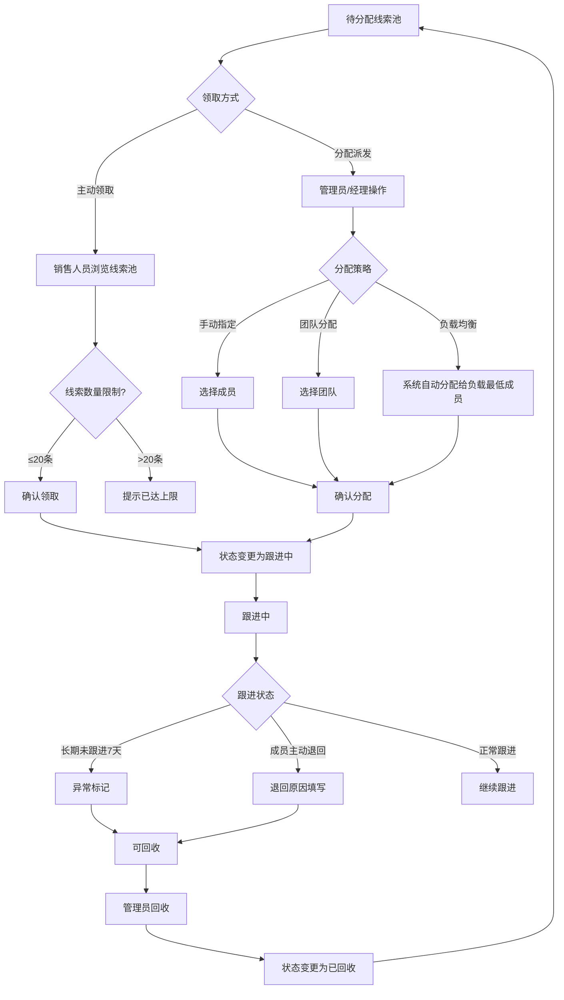

# 线索分配 PRD

## 需求背景

### 痛点
- **问题现象**：线索分配依赖人工手动指定，效率低且容易遗漏；成员负载不均导致部分人过载而其他人空闲；长期未跟进的线索无法及时回收
- **发生频率**：高
- **当前 workaround**：线下协调分配，通过Excel跟踪分配情况

### 业务目标
- **量化指标**：线索分配时效≤2小时，成员负载均衡度偏差≤20%
- **目标期限**：2026-Q2

### 涉及系统/模块
- **模块名称**：线索分配
- **变更类型**：新增
- **对接接口**：线索获取模块、用户管理系统

---

## 用户故事

### 故事1
- **角色**：销售人员
- **功能**：主动从线索池中领取待分配的线索，支持单条领取和批量领取
- **收益**：根据自身工作负载灵活获取线索，提升跟进积极性
- **验收条件**：每人最多同时跟进20条线索，领取后状态自动变更为跟进中

### 故事2
- **角色**：销售经理/管理员
- **功能**：支持手动指定、团队分配、负载均衡三种分配策略
- **收益**：灵活适配不同管理场景，提升分配效率
- **验收条件**：可单选/批量选择线索和成员，完成分配后双方收到通知

### 故事3
- **角色**：管理员
- **功能**：对长期未跟进或成员主动退回的线索进行回收管理
- **收益**：避免线索资源浪费，确保高价值线索不被搁置
- **验收条件**：回收前记录原因，回收后线索回归待分配池

### 故事4
- **角色**：销售经理
- **功能**：查看团队成员的线索工作统计（当前数量/负载率/转化率）
- **收益**：直观了解团队工作情况，为分配决策提供数据支撑
- **验收条件**：负载率可视化展示，满载时禁止继续分配

---

## 需求清单

| 序号 | 需求描述 | 优先级 | 状态 | 负责人 | 截止日期 |
|------|----------|--------|------|--------|----------|
| 1 | 主动领取Tab：线索池展示/领取规则说明/查询筛选/待分配列表/单条领取/批量领取 | P0 | TODO | | |
| 2 | 分配派发Tab：三种分配策略（手动指定/团队分配/负载均衡）/待分配列表/批量分配 | P0 | TODO | | |
| 3 | 线索回收Tab：回收触发条件展示/异常跟进线索列表/回收操作/回收历史 | P0 | TODO | | |
| 4 | 成员统计Tab：团队成员列表/负载率进度条/转化率/状态标签 | P1 | TODO | | |
| 5 | 统计卡片：待分配/已分配/已回收/我的待跟进 | P1 | TODO | | |
| 6 | 回收规则说明（长期未跟进7天/主动退回/强制回收） | P1 | TODO | | |

- **优先级**：P0（核心流程阻塞）/ P1（重要功能）/ P2（体验优化）/ P3（未来规划）
- **状态**：TODO / IN PROGRESS / DONE / BLOCKED

---

## 业务流程图

---

## 页面结构

### 路由信息
- **路由路径**：`/lead-distribution`
- **页面标题**：线索分配
- **访问权限**：登录 / 销售/管理员角色

### 布局结构
- **布局类型**：单栏
- **区域-主内容**：页面标题 + 4个Tab

### Tab 结构
- **Tab名称**：主动领取 / 分配派发 / 线索回收 / 成员统计
- **Tab路由**：通过Tabs组件切换
- **加载方式**：预加载
- **默认激活**：主动领取

---

## 功能描述

### 功能点1：主动领取

#### 页面级
- **字段：功能入口** - 类型：文本；描述：点击「主动领取」Tab
- **字段：前置条件** - 类型：文本；描述：用户已登录，当前有待分配线索
- **字段：后置影响** - 类型：字段列表；描述：领取成功后列表刷新，统计卡片更新

#### 统计卡片
| 字段名 | 类型 | 必填 | 默认值 | 来源 | 校验规则 | 展示形式 | 交互约束 |
|--------|------|------|--------|------|----------|----------|----------|
| 待分配线索 | 数字 | - | 0 | 接口 | - | 橙色渐变卡片 | 只读 |
| 已分配线索 | 数字 | - | 0 | 接口 | - | 蓝色渐变卡片 | 只读 |
| 已回收线索 | 数字 | - | 0 | 接口 | - | 灰色渐变卡片 | 只读 |
| 我的待跟进 | 数字 | - | 0 | 接口 | - | 绿色渐变卡片 | 只读 |

#### 领取规则说明
| 字段名 | 类型 | 必填 | 默认值 | 来源 | 校验规则 | 展示形式 | 交互约束 |
|--------|------|------|--------|------|----------|----------|----------|
| 数量限制 | 规则 | - | - | 配置 | - | 白色卡片：每人最多20条 | 只读 |
| 领取权限 | 规则 | - | - | 配置 | - | 白色卡片：仅可领取待分配状态 | 只读 |
| 自动更新 | 规则 | - | - | 配置 | - | 白色卡片：领取后状态自动变更 | 只读 |

#### 查询条件字段
| 字段名 | 类型 | 必填 | 默认值 | 来源 | 校验规则 | 展示形式 | 交互约束 |
|--------|------|------|--------|------|----------|----------|----------|
| 关键词搜索 | 字符串 | 否 | 空 | 页面输入 | - | Input带搜索图标 | 实时过滤 |
| 线索状态 | 枚举 | 否 | all | 下拉选择 | 枚举：待分配/已分配/已回收/全部 | Select | 选择即过滤 |

#### 字段列表（可领取列表）
| 字段名 | 类型 | 必填 | 默认值 | 来源 | 校验规则 | 展示形式 | 交互约束 |
|--------|------|------|--------|------|----------|----------|----------|
| 全选 | 复选框 | - | false | - | - | 复选框 | 选中所有可领取线索 |
| 线索编号 | 字符串 | - | - | 接口 | - | 文字 | 只读 |
| 公司名称 | 字符串 | - | - | 接口 | - | 文字 | 只读 |
| 所属区域 | 字符串 | - | - | 接口 | - | 文字 | 只读 |
| 预估金额 | 数字 | - | - | 接口 | - | 右对齐+¥X万 | 只读 |
| 线索等级 | 枚举 | - | - | 接口 | - | A级红色/B级橙色/C级黄色标签 | 只读 |
| 创建时间 | 日期时间 | - | - | 接口 | - | 文字 | 只读 |
| 状态 | 枚举 | - | - | 接口 | - | 橙色待分配标签 | 只读 |
| 负责人 | 字符串 | - | - | 接口 | - | 文字/- | 只读 |
| 领取 | 按钮 | - | - | - | - | 主色按钮 | 单条领取 |

#### 批量操作区
| 字段名 | 类型 | 必填 | 默认值 | 来源 | 校验规则 | 展示形式 | 交互约束 |
|--------|------|------|--------|------|----------|----------|----------|
| 已选择提示 | 文字 | - | - | 计算 | - | 蓝色边框区域+已选择X条 | 只读 |
| 批量领取 | 按钮 | - | - | - | - | 主色按钮 | 批量领取选中线索 |

---

### 功能点2：分配派发

#### 分配策略选择
| 字段名 | 类型 | 必填 | 默认值 | 来源 | 校验规则 | 展示形式 | 交互约束 |
|--------|------|------|--------|------|----------|----------|----------|
| 手动指定 | 卡片 | - | 未选中 | 页面点击 | - | 白色卡片+用户图标 | 点击选中 |
| 团队分配 | 卡片 | - | 未选中 | 页面点击 | - | 白色卡片+成员+图标 | 点击选中 |
| 负载均衡 | 卡片 | - | 未选中 | 页面点击 | - | 白色卡片+刷新图标 | 点击选中 |

#### 待分配列表
| 字段名 | 类型 | 必填 | 默认值 | 来源 | 校验规则 | 展示形式 | 交互约束 |
|--------|------|------|--------|------|----------|----------|----------|
| 全选 | 复选框 | - | false | - | - | 复选框 | - |
| 线索编号 | 字符串 | - | - | 接口 | - | 文字 | 只读 |
| 公司名称 | 字符串 | - | - | 接口 | - | 文字 | 只读 |
| 线索等级 | 枚举 | - | - | 接口 | - | A/B/C级标签 | 只读 |
| 预估金额 | 数字 | - | - | 接口 | - | 右对齐+¥X万 | 只读 |
| 创建时间 | 日期时间 | - | - | 接口 | - | 文字 | 只读 |
| 待分配时长 | 数字 | - | - | 计算 | - | 超48小时显示红色标签 | 只读 |
| 分配 | 按钮 | - | - | - | - | 边框按钮 | 单条分配 |

#### 批量分配按钮
| 字段名 | 类型 | 必填 | 默认值 | 来源 | 校验规则 | 展示形式 | 交互约束 |
|--------|------|------|--------|------|----------|----------|----------|
| 批量分配 | 按钮 | - | - | - | - | 主色按钮（Tab内右上角） | 触发分配弹窗 |

---

### 功能点3：线索回收

#### 回收触发条件
| 字段名 | 类型 | 必填 | 默认值 | 来源 | 校验规则 | 展示形式 | 交互约束 |
|--------|------|------|--------|------|----------|----------|----------|
| 长期未跟进 | 条件 | - | - | 配置 | - | 橙色卡片：超过7天未添加跟进记录 | 只读 |
| 成员主动退回 | 条件 | - | - | 配置 | - | 蓝色卡片：需填写退回原因 | 只读 |
| 管理员强制回收 | 条件 | - | - | 配置 | - | 紫色卡片：需填写原因并记录日志 | 只读 |

#### 异常跟进线索列表
| 字段名 | 类型 | 必填 | 默认值 | 来源 | 校验规则 | 展示形式 | 交互约束 |
|--------|------|------|--------|------|----------|----------|----------|
| 线索编号 | 字符串 | - | - | 接口 | - | 文字 | 只读 |
| 公司名称 | 字符串 | - | - | 接口 | - | 文字 | 只读 |
| 当前负责人 | 字符串 | - | - | 接口 | - | 文字 | 只读 |
| 分配时间 | 日期 | - | - | 接口 | - | 文字 | 只读 |
| 未跟进天数 | 数字 | - | - | 计算 | - | 超过7天显示红色标签 | 只读 |
| 上次跟进 | 日期时间 | - | - | 接口 | - | 文字 | 只读 |
| 回收 | 按钮 | - | - | - | - | 橙色边框按钮+回收图标 | 触发回收流程 |

#### 回收历史记录
| 字段名 | 类型 | 必填 | 默认值 | 来源 | 校验规则 | 展示形式 | 交互约束 |
|--------|------|------|--------|------|----------|----------|----------|
| 回收信息 | 字符串 | - | - | 接口 | - | 线索编号+原因 | 只读 |
| 时间 | 日期时间 | - | - | 接口 | - | 右侧时间文字 | 只读 |

---

### 功能点4：成员统计

#### 成员列表
| 字段名 | 类型 | 必填 | 默认值 | 来源 | 校验规则 | 展示形式 | 交互约束 |
|--------|------|------|--------|------|----------|----------|----------|
| 成员姓名 | 字符串 | - | - | 接口 | - | 文字 | 只读 |
| 所属部门 | 字符串 | - | - | 接口 | - | 文字 | 只读 |
| 当前线索数 | 数字 | - | - | 接口 | - | 居中数字 | 只读 |
| 线索上限 | 数字 | - | - | 接口 | - | 居中数字 | 只读 |
| 负载率 | 百分比 | - | - | 计算 | - | 进度条+百分比数值 | 只读，超100%红色 |
| 转化率 | 百分比 | - | - | 接口 | - | 绿色标签 | 只读 |
| 状态 | 枚举 | - | - | 计算 | - | 满载红色/可分配绿色 | 只读 |

---

## 数据流图

### 接口1：获取待分配线索
- **请求路径**：`GET /api/leads/pending`
- **请求方法**：GET
- **请求头**：Authorization
- **请求参数**：
  - `keyword` - 类型：字符串；必填：否；来源：搜索框；校验：
  - `status` - 类型：字符串；必填：否；来源：状态筛选；校验：枚举
  - `page` - 类型：数字；必填：否；来源：分页；校验：正整数
- **响应字段**：
  - `id` / `leadCode` / `companyName` / `region` / `potentialValue` / `leadLevel` / `createTime` / `status` / `assignee`
- **存储位置**：数据库表 lead
- **错误码**：
  - `401` - `无权限`
  - `500` - `服务器异常`

### 接口2：领取线索
- **请求路径**：`POST /api/leads/:id/claim`
- **请求方法**：POST
- **请求头**：Authorization
- **请求参数**：
  - `id` - 类型：字符串；必填：是；来源：路由；校验：非空
- **响应字段**：
  - `success` - 类型：布尔；描述：是否成功
  - `newStatus` - 类型：枚举；描述：新状态
- **存储位置**：数据库表 lead
- **错误码**：
  - `400` - `已达领取上限（20条）`
  - `404` - `线索不存在或非待分配状态`
  - `500` - `领取失败`

### 接口3：批量领取
- **请求路径**：`POST /api/leads/batch-claim`
- **请求方法**：POST
- **请求头**：Authorization / Content-Type: application/json
- **请求参数**：
  - `leadIds` - 类型：字符串数组；必填：是；来源：选中行；校验：非空数组
- **响应字段**：
  - `success` / `failed`（失败条数）/ `message`
- **存储位置**：数据库表 lead
- **错误码**：
  - `400` - `部分线索已达到领取上限`
  - `500` - `批量领取失败`

### 接口4：分配线索
- **请求路径**：`POST /api/leads/:id/distribute`
- **请求方法**：POST
- **请求头**：Authorization / Content-Type: application/json
- **请求参数**：
  - `memberId` - 类型：字符串；必填：是；来源：选择成员；校验：非空
  - `strategy` - 类型：枚举；必填：是；来源：策略选择；校验：手动指定/团队/负载均衡
- **响应字段**：
  - `success` - 类型：布尔
- **存储位置**：数据库表 lead
- **错误码**：
  - `400` - `成员已达线索上限`
  - `404` - `成员不存在`
  - `500` - `分配失败`

### 接口5：回收线索
- **请求路径**：`POST /api/leads/:id/retrieve`
- **请求方法**：POST
- **请求头**：Authorization / Content-Type: application/json
- **请求参数**：
  - `reason` - 类型：字符串；必填：是；来源：页面输入；校验：非空
  - `type` - 类型：枚举；必填：是；来源：回收类型；校验：超时/主动退回/强制
- **响应字段**：
  - `success` - 类型：布尔
- **存储位置**：数据库表 lead / lead_retrieve_log
- **错误码**：
  - `400` - `线索状态不允许回收`
  - `403` - `无回收权限`
  - `500` - `回收失败`

### 数据刷新点
- **刷新时机**：页面加载 / 领取成功 / 分配成功 / 回收成功
- **影响字段**：列表数据 / 统计卡片 / 成员负载率

---

## 验收标准

### 正常流程
- [ ] **操作**：进入主动领取Tab → **预期**：显示统计卡片和待分配线索列表
- [ ] **操作**：点击单条「领取」→ **预期**：线索被当前用户领取，状态变为跟进中
- [ ] **操作**：勾选多条线索后点击「批量领取」→ **预期**：所有选中线索被领取
- [ ] **操作**：领取后查看统计卡片 → **预期**：待分配数-1，我的待跟进+1
- [ ] **操作**：切换到分配派发Tab → **预期**：显示三种分配策略和待分配列表
- [ ] **操作**：选择一条线索点击「分配」→ **预期**：弹出选择成员弹窗
- [ ] **操作**：选择成员确认分配 → **预期**：线索分配成功，负责人变更
- [ ] **操作**：切换到线索回收Tab → **预期**：显示回收规则和异常跟进列表
- [ ] **操作**：点击异常线索「回收」→ **预期**：弹出原因填写，提交后线索回收
- [ ] **操作**：切换到成员统计Tab → **预期**：显示团队成员负载情况
- [ ] **操作**：查看成员负载率 → **预期**：满载成员进度条为红色，显示满载标签

### 异常流程
- [ ] **操作**：已达20条上限时领取 → **预期**：提示「已达领取上限」
- [ ] **操作**：尝试回收已转化线索 → **预期**：提示「该状态不允许回收」
- [ ] **操作**：网络断开时领取 → **预期**：显示网络异常提示
- [ ] **操作**：分配给满载成员 → **预期**：提示「该成员已达线索上限」

---

## 更新记录

### v1 - 2026-05-09
- 初始版本：基于LeadDistribution.tsx源码编写
