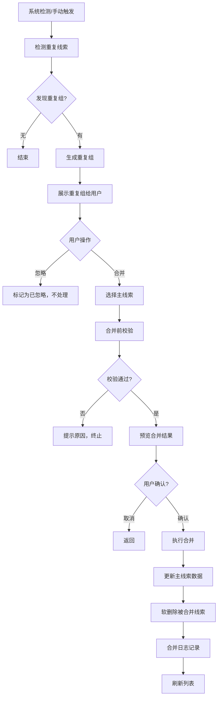

# 线索合并 PRD

## 需求背景

### 痛点
- **问题现象**：同一客户被多次录入产生重复线索，数据冗余导致跟进混乱；合并操作缺乏规范，容易误删有效数据
- **发生频率**：中
- **当前 workaround**：人工比对后手动删除重复数据

### 业务目标
- **量化指标**：重复线索自动识别率≥95%，合并操作可追溯
- **目标期限**：2026-Q2

### 涉及系统/模块
- **模块名称**：线索合并
- **变更类型**：新增
- **对接接口**：线索获取模块、主数据系统

---

## 用户故事

### 故事1
- **角色**：销售人员/管理员
- **功能**：系统自动识别重复线索（按公司名称相似度/联系电话/邮箱），生成重复组供人工确认
- **收益**：减少重复录入，保持数据唯一性
- **验收条件**：相似度≥80%自动检测，重复组清晰展示差异字段

### 故事2
- **角色**：管理员
- **功能**：合并前预览两（多）条线索的信息对比，选择主线索，其他合并到主线索
- **收益**：避免误操作，确保有价值的数据被保留
- **验收条件**：合并前显示字段级对比，支持选择保留字段

### 故事3
- **角色**：管理员
- **功能**：配置字段合并策略（主线索优先/非空值优先/最大值保留/自动合并/全部保留）
- **收益**：适配不同业务场景的合并规则
- **验收条件**：配置后合并操作按配置策略执行

### 故事4
- **角色**：管理员
- **功能**：监控合并任务执行状态，查看失败任务日志，支持手动修复和重试
- **收益**：确保数据迁移可靠性，出现问题可快速定位
- **验收条件**：任务状态实时更新，错误详情可查看

---

## 需求清单

| 序号 | 需求描述 | 优先级 | 状态 | 负责人 | 截止日期 |
|------|----------|--------|------|--------|----------|
| 1 | 重复线索检测Tab：统计卡片/检测规则说明/查询筛选/开始检测按钮/重复线索分组列表 | P0 | TODO | | |
| 2 | 重复组列表：相似度标签/主线索选择（单选）/忽略按钮/执行合并按钮 | P0 | TODO | | |
| 3 | 合并管理Tab：合并流程步骤图/合并前校验规则/最近合并记录 | P1 | TODO | | |
| 4 | 数据迁移配置Tab：字段映射规则表/迁移任务监控/错误处理机制 | P1 | TODO | | |
| 5 | 合并前校验：禁止合并已转化/已关闭状态的线索 | P0 | TODO | | |
| 6 | 字段合并策略配置（公司名称/联系人/预估金额/跟进记录/附件） | P1 | TODO | | |

- **优先级**：P0（核心流程阻塞）/ P1（重要功能）/ P2（体验优化）/ P3（未来规划）
- **状态**：TODO / IN PROGRESS / DONE / BLOCKED

---

## 业务流程图

---

## 页面结构

### 路由信息
- **路由路径**：`/lead-merge`
- **页面标题**：线索合并
- **访问权限**：登录 / 管理员角色

### 布局结构
- **布局类型**：单栏
- **区域-主内容**：页面标题 + 3个Tab

### Tab 结构
- **Tab名称**：重复线索检测 / 合并管理 / 数据迁移配置
- **Tab路由**：通过Tabs组件切换
- **加载方式**：预加载
- **默认激活**：重复线索检测

---

## 功能描述

### 功能点1：重复线索检测

#### 页面级
- **字段：功能入口** - 类型：文本；描述：点击「重复线索检测」Tab
- **字段：前置条件** - 类型：文本；描述：系统中存在多条线索
- **字段：后置影响** - 类型：字段列表；描述：检测结果影响待合并列表

#### 统计卡片
| 字段名 | 类型 | 必填 | 默认值 | 来源 | 校验规则 | 展示形式 | 交互约束 |
|--------|------|------|--------|------|----------|----------|----------|
| 待合并线索 | 数字 | - | 0 | 接口 | - | 橙色渐变卡片 | 只读 |
| 已合并线索 | 数字 | - | 0 | 接口 | - | 绿色渐变卡片 | 只读 |
| 相似度阈值 | 百分比 | - | 80% | 配置 | - | 蓝色渐变卡片 | 只读 |
| 本月检测次数 | 数字 | - | 0 | 接口 | - | 紫色渐变卡片 | 只读 |

#### 检测规则说明
| 字段名 | 类型 | 必填 | 默认值 | 来源 | 校验规则 | 展示形式 | 交互约束 |
|--------|------|------|--------|------|----------|----------|----------|
| 公司名称匹配 | 规则 | - | ≥80% | 配置 | - | 白色卡片：相似度阈值 | 只读 |
| 联系电话匹配 | 规则 | - | 完全相同 | 配置 | - | 白色卡片：精确匹配 | 只读 |
| 电子邮箱匹配 | 规则 | - | 完全相同 | 配置 | - | 白色卡片：精确匹配 | 只读 |

#### 查询条件字段
| 字段名 | 类型 | 必填 | 默认值 | 来源 | 校验规则 | 展示形式 | 交互约束 |
|--------|------|------|--------|------|----------|----------|----------|
| 关键词搜索 | 字符串 | 否 | 空 | 页面输入 | - | Input带搜索图标 | 实时过滤 |

#### 操作按钮
| 字段名 | 类型 | 必填 | 默认值 | 来源 | 校验规则 | 展示形式 | 交互约束 |
|--------|------|------|--------|------|----------|----------|----------|
| 开始检测 | 按钮 | - | - | - | - | 主色按钮 | 触发重复检测 |
| 刷新 | 按钮 | - | - | - | - | 边框按钮 | 重新加载列表 |

#### 重复组列表（分组展示）
| 字段名 | 类型 | 必填 | 默认值 | 来源 | 校验规则 | 展示形式 | 交互约束 |
|--------|------|------|--------|------|----------|----------|----------|
| 重复组编号 | 字符串 | - | - | 接口 | - | #1/#2... | 只读 |
| 相似度标签 | 枚举 | - | - | 计算 | - | ≥90%红色/70-90%橙色/<70%黄色 | 只读 |
| 忽略 | 按钮 | - | - | - | - | 边框按钮 | 标记为已忽略 |
| 执行合并 | 按钮 | - | - | - | - | 橙色主按钮+合并图标 | 触发合并流程 |
| 主线索选择 | 单选框 | - | 未选中 | 页面点击 | - | Radio单选 | 必选一条 |
| 线索编号 | 字符串 | - | - | 接口 | - | 文字 | 只读 |
| 公司名称 | 字符串 | - | - | 接口 | - | 文字 | 只读 |
| 联系电话 | 字符串 | - | - | 接口 | - | 文字（脱敏） | 只读 |
| 电子邮箱 | 字符串 | - | - | 接口 | - | 文字（脱敏） | 只读 |
| 重复原因 | 标签组 | - | - | 接口 | - | 红色小标签列表 | 只读 |
| 检测时间 | 日期时间 | - | - | 接口 | - | 文字 | 只读 |
| 查看 | 按钮 | - | - | - | - | 蓝色图标按钮 | 跳转线索详情 |

#### 提示信息
| 字段名 | 类型 | 必填 | 默认值 | 来源 | 校验规则 | 展示形式 | 交互约束 |
|--------|------|------|--------|------|----------|----------|----------|
| 选择主线索提示 | 文字 | - | - | - | - | 灰色背景区域文字 | 只读 |

---

### 功能点2：合并管理

#### 合并流程步骤
| 字段名 | 类型 | 必填 | 默认值 | 来源 | 校验规则 | 展示形式 | 交互约束 |
|--------|------|------|--------|------|----------|----------|----------|
| 步骤1-检测重复 | 步骤 | - | 完成 | - | - | 蓝色圆圈+图标 | 只读 |
| 步骤2-校验确认 | 步骤 | - | 待办 | - | - | 橙色圆圈+图标 | 只读 |
| 步骤3-预览确认 | 步骤 | - | 待办 | - | - | 紫色圆圈+图标 | 只读 |
| 步骤4-执行合并 | 步骤 | - | 待办 | - | - | 绿色圆圈+图标 | 只读 |

#### 合并前校验规则
| 字段名 | 类型 | 必填 | 默认值 | 来源 | 校验规则 | 展示形式 | 交互约束 |
|--------|------|------|--------|------|----------|----------|----------|
| 允许合并状态 | 规则 | - | - | 配置 | - | 绿色卡片：待分配/跟进中（需负责人确认） | 只读 |
| 禁止合并状态 | 规则 | - | - | 配置 | - | 红色卡片：已转化/已关闭 | 只读 |

#### 合并历史记录
| 字段名 | 类型 | 必填 | 默认值 | 来源 | 校验规则 | 展示形式 | 交互约束 |
|--------|------|------|--------|------|----------|----------|----------|
| 合并时间 | 日期时间 | - | - | 接口 | - | 文字 | 只读 |
| 主线索 | 字符串 | - | - | 接口 | - | 文字（可点击） | 可跳转详情 |
| 被合并线索数 | 数字 | - | - | 接口 | - | 居中数字 | 只读 |
| 操作人 | 字符串 | - | - | 接口 | - | 文字 | 只读 |
| 状态 | 枚举 | - | - | 接口 | - | 成功绿色标签 | 只读 |
| 查看详情 | 按钮 | - | - | - | - | 蓝色文字按钮 | 跳转详情 |

---

### 功能点3：数据迁移配置

#### 字段映射与优先级策略
| 字段名 | 类型 | 必填 | 默认值 | 来源 | 校验规则 | 展示形式 | 交互约束 |
|--------|------|------|--------|------|----------|----------|----------|
| 公司名称 | 策略 | - | 保留主线索 | 配置 | - | 蓝色标签+说明 | 可编辑 |
| 联系人信息 | 策略 | - | 保留非空值 | 配置 | - | 绿色标签+说明 | 可编辑 |
| 预估金额 | 策略 | - | 保留最大值 | 配置 | - | 紫色标签+说明 | 可编辑 |
| 跟进记录 | 策略 | - | 自动合并 | 配置 | - | 橙色标签+说明 | 可编辑 |
| 附件文档 | 策略 | - | 全部保留 | 配置 | - | 青色标签+说明 | 可编辑 |

#### 迁移任务监控
| 字段名 | 类型 | 必填 | 默认值 | 来源 | 校验规则 | 展示形式 | 交互约束 |
|--------|------|------|--------|------|----------|----------|----------|
| 总任务数 | 数字 | - | 0 | 接口 | - | 蓝色卡片 | 只读 |
| 成功 | 数字 | - | 0 | 接口 | - | 绿色卡片 | 只读 |
| 处理中 | 数字 | - | 0 | 接口 | - | 橙色卡片 | 只读 |
| 失败 | 数字 | - | 0 | 接口 | - | 红色卡片 | 只读 |

#### 错误处理机制
| 字段名 | 类型 | 必填 | 默认值 | 来源 | 校验规则 | 展示形式 | 交互约束 |
|--------|------|------|--------|------|----------|----------|----------|
| 错误定位 | 功能 | - | - | 配置 | - | 蓝色卡片勾选列表 | 只读 |
| 手动修复 | 功能 | - | - | 配置 | - | 蓝色卡片勾选列表 | 只读 |
| 任务重试 | 功能 | - | - | 配置 | - | 蓝色卡片勾选列表 | 只读 |

---

## 数据流图

### 接口1：检测重复线索
- **请求路径**：`POST /api/leads/duplicates/detect`
- **请求方法**：POST
- **请求头**：Authorization
- **请求参数**：
  - `similarityThreshold` - 类型：数字；必填：否；来源：配置；校验：0-100
- **响应字段**：
  - `groups[]` - 类型：数组；描述：重复组列表
    - `groupId` - 类型：字符串；描述：组ID
    - `leads[]` - 类型：数组；描述：组内线索
    - `similarityScore` - 类型：数字；描述：相似度百分比
    - `duplicateReasons[]` - 类型：数组；描述：重复原因列表
- **存储位置**：数据库表 lead
- **错误码**：
  - `500` - `检测失败`

### 接口2：执行合并
- **请求路径**：`POST /api/leads/merge`
- **请求方法**：POST
- **请求头**：Authorization / Content-Type: application/json
- **请求参数**：
  - `mainLeadId` - 类型：字符串；必填：是；来源：选择的主线索；校验：非空
  - `duplicateLeadIds` - 类型：字符串数组；必填：是；来源：被合并的线索；校验：非空
- **响应字段**：
  - `success` - 类型：布尔；描述：是否成功
  - `mergedLeadId` - 类型：字符串；描述：合并后的线索ID
- **存储位置**：数据库表 lead（更新主线索，软删除重复线索）/ lead_merge_log
- **错误码**：
  - `400` - `存在禁止合并状态的线索`
  - `404` - `线索不存在`
  - `500` - `合并失败`

### 接口3：忽略重复组
- **请求路径**：`POST /api/leads/duplicates/:groupId/ignore`
- **请求方法**：POST
- **请求头**：Authorization
- **响应字段**：
  - `success` - 类型：布尔
- **存储位置**：数据库表 lead_duplicate_group
- **错误码**：
  - `404` - `组不存在`
  - `500` - `操作失败`

### 接口4：保存字段合并策略
- **请求路径**：`PUT /api/lead-merge/field-strategy`
- **请求方法**：PUT
- **请求头**：Authorization / Content-Type: application/json
- **请求参数**：
  - `fieldStrategies` - 类型：对象；必填：是；来源：页面配置；校验：
    - `{fieldName: string, strategy: "main"/"non-empty"/"max"/"merge"/"all"}`
- **响应字段**：
  - `success` - 类型：布尔
- **存储位置**：数据库表 lead_merge_config
- **错误码**：
  - `400` - `无效的策略配置`
  - `500` - `保存失败`

### 数据刷新点
- **刷新时机**：页面加载 / 检测完成 / 合并成功 / 忽略操作
- **影响字段**：待合并数 / 已合并数 / 重复组列表 / 迁移任务统计

---

## 验收标准

### 正常流程
- [ ] **操作**：进入重复线索检测Tab → **预期**：显示统计卡片和检测规则说明
- [ ] **操作**：点击「开始检测」→ **预期**：调用检测接口，生成重复组列表
- [ ] **操作**：查看重复组 → **预期**：显示组内线索、相似度、重复原因
- [ ] **操作**：选择一条线索作为主线索 → **预期**：Radio选中，背景高亮
- [ ] **操作**：点击「执行合并」→ **预期**：弹出确认，提交后执行合并
- [ ] **操作**：合并成功 → **预期**：提示成功，列表刷新，待合并数-1
- [ ] **操作**：点击「忽略」→ **预期**：提示确认，忽略后该组不再显示
- [ ] **操作**：切换到合并管理Tab → **预期**：显示合并流程和历史记录
- [ ] **操作**：切换到数据迁移配置Tab → **预期**：显示字段策略和迁移监控

### 异常流程
- [ ] **操作**：尝试合并已转化状态的线索 → **预期**：校验不通过，提示禁止合并
- [ ] **操作**：未选择主线索直接点击合并 → **预期**：提示请选择主线索
- [ ] **操作**：合并接口返回500 → **预期**：提示合并失败，数据未变更
- [ ] **操作**：检测接口返回500 → **预期**：提示检测失败，显示重试按钮

---

## 更新记录

### v1 - 2026-05-09
- 初始版本：基于LeadMerge.tsx源码编写
