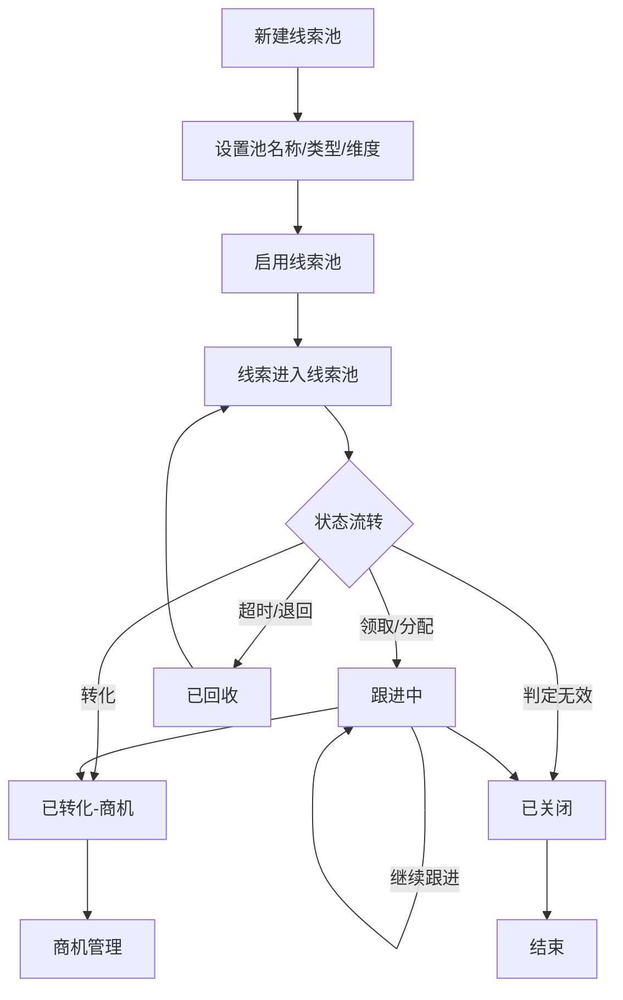

# 商情线索池管理 PRD

## 需求背景

### 痛点
- **问题现象**：线索池分类不清晰，权限管理混乱，不同角色对线索的可见性和操作范围不明确；状态流转缺乏可视化跟踪和预警机制
- **发生频率**：高
- **当前 workaround**：通过部门划分管理，无统一平台支撑

### 业务目标
- **量化指标**：线索池分类覆盖100%线索，权限配置100%精确到角色，预警通知送达率≥95%
- **目标期限**：2026-Q2

### 涉及系统/模块
- **模块名称**：线索池管理
- **变更类型**：新增
- **对接接口**：线索获取模块、用户权限系统

---

## 用户故事

### 故事1
- **角色**：管理员
- **功能**：按区域/产品线/渠道/客户等级/业务阶段创建和管理线索池，支持启用/停用
- **收益**：分类清晰，便于精细化管理
- **验收条件**：可按类型筛选查看，统计各状态数量

### 故事2
- **角色**：管理员
- **功能**：配置线索池权限（管理员/成员/协作人），明确各角色的查看和操作范围
- **收益**：数据安全可控，不同角色各司其职
- **验收条件**：权限配置保存后立即生效，用户只能看到自己有权限的内容

### 故事3
- **角色**：线索池成员
- **功能**：可视化跟踪线索状态流转，了解各状态分布情况，接收预警提醒
- **收益**：及时发现异常线索，避免遗漏
- **验收条件**：状态流转图清晰展示，预警配置可自定义

---

## 需求清单

| 序号 | 需求描述 | 优先级 | 状态 | 负责人 | 截止日期 |
|------|----------|--------|------|--------|----------|
| 1 | 线索池管理Tab：统计卡片/查询筛选/新建线索池/数据列表（编号/名称/类型/维度/各状态数量/状态/时间/人） | P0 | TODO | | |
| 2 | 权限管理Tab：管理员权限/成员权限/协作人权限说明 | P1 | TODO | | |
| 3 | 状态跟踪Tab：状态流转规则图/统计看板/预警提醒配置 | P0 | TODO | | |
| 4 | 查看/编辑/删除操作 | P1 | TODO | | |
| 5 | 线索池类型筛选 | P1 | TODO | | |
| 6 | 状态流转可视化 | P1 | TODO | | |
| 7 | 预警提醒配置 | P2 | TODO | | |

- **优先级**：P0（核心流程阻塞）/ P1（重要功能）/ P2（体验优化）/ P3（未来规划）
- **状态**：TODO / IN PROGRESS / DONE / BLOCKED

---

## 业务流程图

---

## 页面结构

### 路由信息
- **路由路径**：`/lead-pool`
- **页面标题**：商情线索池管理
- **访问权限**：登录 / 管理员角色

### 布局结构
- **布局类型**：单栏
- **区域-主内容**：页面标题 + 3个Tab

### Tab 结构
- **Tab名称**：线索池管理 / 权限管理 / 状态跟踪
- **Tab路由**：通过Tabs组件切换
- **加载方式**：预加载
- **默认激活**：线索池管理

---

## 功能描述

### 功能点1：线索池管理

#### 页面级
- **字段：功能入口** - 类型：文本；描述：点击「线索池管理」Tab
- **字段：前置条件** - 类型：文本；描述：用户已登录且有管理权限
- **字段：后置影响** - 类型：字段列表；描述：新建/编辑/删除影响池列表

#### 统计卡片
| 字段名 | 类型 | 必填 | 默认值 | 来源 | 校验规则 | 展示形式 | 交互约束 |
|--------|------|------|--------|------|----------|----------|----------|
| 线索池总数 | 数字 | - | 0 | 接口 | - | 蓝色渐变卡片 | 只读 |
| 线索总量 | 数字 | - | 0 | 接口 | - | 紫色渐变卡片 | 只读 |
| 跟进中 | 数字 | - | 0 | 接口 | - | 青色渐变卡片 | 只读 |
| 已转化 | 数字 | - | 0 | 接口 | - | 绿色渐变卡片 | 只读 |

#### 查询条件字段
| 字段名 | 类型 | 必填 | 默认值 | 来源 | 校验规则 | 展示形式 | 交互约束 |
|--------|------|------|--------|------|----------|----------|----------|
| 关键词搜索 | 字符串 | 否 | 空 | 页面输入 | - | Input带搜索图标 | 实时过滤 |
| 线索池类型 | 枚举 | 否 | all | 下拉选择 | 枚举：区域/产品线/渠道/客户等级/业务阶段/全部 | Select | 选择即过滤 |

#### 操作按钮
| 字段名 | 类型 | 必填 | 默认值 | 来源 | 校验规则 | 展示形式 | 交互约束 |
|--------|------|------|--------|------|----------|----------|----------|
| 新建线索池 | 按钮 | - | - | - | - | 主色按钮 | 弹出新建弹窗 |
| 刷新 | 按钮 | - | - | - | - | 边框按钮 | 重新加载列表 |

#### 字段列表
| 字段名 | 类型 | 必填 | 默认值 | 来源 | 校验规则 | 展示形式 | 交互约束 |
|--------|------|------|--------|------|----------|----------|----------|
| 序号 | 数字 | - | 自增 | - | - | 居中数字 | 只读 |
| 线索池编号 | 字符串 | - | - | 接口 | - | 文字 | 只读 |
| 线索池名称 | 字符串 | - | - | 接口 | - | 文字 | 只读 |
| 类型 | 枚举 | - | - | 接口 | - | 蓝色标签（区域/产品线/渠道/客户等级/业务阶段） | 只读 |
| 所属维度 | 字符串 | - | - | 接口 | - | 文字 | 只读 |
| 线索总量 | 数字 | - | 0 | 接口 | - | 居中数字 | 只读 |
| 待分配 | 数字 | - | 0 | 接口 | - | 居中橙色数字 | 只读 |
| 跟进中 | 数字 | - | 0 | 接口 | - | 居中蓝色数字 | 只读 |
| 已回收 | 数字 | - | 0 | 接口 | - | 居中灰色数字 | 只读 |
| 已转化 | 数字 | - | 0 | 接口 | - | 居中绿色数字 | 只读 |
| 已关闭 | 数字 | - | 0 | 接口 | - | 居中灰色数字 | 只读 |
| 状态 | 枚举 | - | - | 接口 | - | 启用绿色标签/停用灰色标签 | 只读 |
| 创建时间 | 日期 | - | - | 接口 | - | 文字 | 只读 |
| 创建人 | 字符串 | - | - | 接口 | - | 文字 | 只读 |
| 查看 | 按钮 | - | - | - | - | 蓝色图标按钮 | 查看详情 |
| 编辑 | 按钮 | - | - | - | - | 绿色图标按钮 | 编辑配置 |
| 删除 | 按钮 | - | - | - | - | 红色图标按钮 | 删除确认 |

---

### 功能点2：权限管理

#### 管理员权限区块
| 字段名 | 类型 | 必填 | 默认值 | 来源 | 校验规则 | 展示形式 | 交互约束 |
|--------|------|------|--------|------|----------|----------|----------|
| 查看所有线索完整信息 | 权限项 | - | ✓ | 配置 | - | 蓝色背景卡片 | 只读 |
| 新增/编辑/删除线索 | 权限项 | - | ✓ | 配置 | - | 蓝色背景卡片 | 只读 |
| 导入/导出线索数据 | 权限项 | - | ✓ | 配置 | - | 蓝色背景卡片 | 只读 |
| 线索分配/转移/回收 | 权限项 | - | ✓ | 配置 | - | 蓝色背景卡片 | 只读 |
| 添加/移除协作人 | 权限项 | - | ✓ | 配置 | - | 蓝色背景卡片 | 只读 |
| 管理线索池配置 | 权限项 | - | ✓ | 配置 | - | 蓝色背景卡片 | 只读 |

#### 成员权限区块
| 字段名 | 类型 | 必填 | 默认值 | 来源 | 校验规则 | 展示形式 | 交互约束 |
|--------|------|------|--------|------|----------|----------|----------|
| 查看自己的线索全量信息 | 权限项 | - | ✓ | 配置 | - | 绿色背景卡片 | 只读 |
| 新增/编辑自己的线索 | 权限项 | - | ✓ | 配置 | - | 绿色背景卡片 | 只读 |
| 导出自己的线索数据 | 权限项 | - | ✓ | 配置 | - | 绿色背景卡片 | 只读 |
| 线索池内主动领取线索 | 权限项 | - | ✓ | 配置 | - | 绿色背景卡片 | 只读 |
| 查看他人敏感信息（脱敏） | 权限项 | - | ✗ | 配置 | - | 红色叉卡片 | 只读 |
| 修改他人线索 | 权限项 | - | ✗ | 配置 | - | 红色叉卡片 | 只读 |

#### 协作人权限区块
| 字段名 | 类型 | 必填 | 默认值 | 来源 | 校验规则 | 展示形式 | 交互约束 |
|--------|------|------|--------|------|----------|----------|----------|
| 查看被授权的特定线索 | 权限项 | - | ✓ | 配置 | - | 橙色背景卡片 | 只读 |
| 补充跟进记录 | 权限项 | - | ✓ | 配置 | - | 橙色背景卡片 | 只读 |
| 添加技术方案 | 权限项 | - | ✓ | 配置 | - | 橙色背景卡片 | 只读 |
| 查看敏感联系方式 | 权限项 | - | ✗ | 配置 | - | 红色叉卡片 | 只读 |
| 修改线索核心信息 | 权限项 | - | ✗ | 配置 | - | 红色叉卡片 | 只读 |
| 分配或转移线索 | 权限项 | - | ✗ | 配置 | - | 红色叉卡片 | 只读 |

---

### 功能点3：状态跟踪

#### 状态流转规则
| 字段名 | 类型 | 必填 | 默认值 | 来源 | 校验规则 | 展示形式 | 交互约束 |
|--------|------|------|--------|------|----------|----------|----------|
| 待分配 | 状态 | - | - | 配置 | - | 橙色圆角卡片 | 只读（第一阶段） |
| 跟进中 | 状态 | - | - | 配置 | - | 蓝色圆角卡片 | 只读（第二阶段） |
| 已转化 | 状态 | - | - | 配置 | - | 绿色圆角卡片 | 只读（第三阶段） |
| 已回收 | 状态 | - | - | 配置 | - | 灰色圆角卡片 | 只读（可返回） |
| 已关闭 | 状态 | - | - | 配置 | - | 红色圆角卡片 | 只读（终态） |
| 流转箭头 | 连接 | - | - | 配置 | - | 灰色箭头文字 | 只读 |

#### 统计看板
| 字段名 | 类型 | 必填 | 默认值 | 来源 | 校验规则 | 展示形式 | 交互约束 |
|--------|------|------|--------|------|----------|----------|----------|
| 待分配数 | 数字 | - | 0 | 接口 | - | 橙色卡片+大字数字 | 只读 |
| 跟进中数 | 数字 | - | 0 | 接口 | - | 蓝色卡片+大字数字 | 只读 |
| 已回收数 | 数字 | - | 0 | 接口 | - | 灰色卡片+大字数字 | 只读 |
| 已转化数 | 数字 | - | 0 | 接口 | - | 绿色卡片+大字数字 | 只读 |
| 已关闭数 | 数字 | - | 0 | 接口 | - | 红色卡片+大字数字 | 只读 |

#### 预警提醒配置
| 字段名 | 类型 | 必填 | 默认值 | 来源 | 校验规则 | 展示形式 | 交互约束 |
|--------|------|------|--------|------|----------|----------|----------|
| 待分配超时提醒 | 预警项 | - | 已启用 | 配置 | - | 橙色卡片+启用标签 | 可切换开关 |
| 跟进预警提醒 | 预警项 | - | 已启用 | 配置 | - | 蓝色卡片+启用标签 | 可切换开关 |

---

## 数据流图

### 接口1：获取线索池列表
- **请求路径**：`GET /api/lead-pools`
- **请求方法**：GET
- **请求头**：Authorization
- **请求参数**：
  - `keyword` - 类型：字符串；必填：否；来源：搜索框；校验：
  - `type` - 类型：字符串；必填：否；来源：类型筛选；校验：枚举
  - `page` - 类型：数字；必填：否；来源：分页；校验：正整数
  - `pageSize` - 类型：数字；必填：否；来源：分页；校验：正整数
- **响应字段**：
  - `id` - 类型：字符串；描述：线索池ID
  - `poolCode` - 类型：字符串；描述：线索池编号
  - `poolName` - 类型：字符串；描述：线索池名称
  - `type` - 类型：枚举；描述：类型
  - `dimension` - 类型：字符串；描述：所属维度
  - `totalCount` - 类型：数字；描述：线索总量
  - `toAssignCount` / `followingCount` / `retrievedCount` / `convertedCount` / `closedCount` - 类型：数字
  - `status` - 类型：枚举；描述：启用/停用
  - `createTime` / `creator`
- **存储位置**：数据库表 lead_pool
- **错误码**：
  - `401` - `无权限`
  - `500` - `服务器异常`

### 接口2：新建/编辑线索池
- **请求路径**：`POST /api/lead-pools` 或 `PUT /api/lead-pools/:id`
- **请求方法**：POST / PUT
- **请求头**：Authorization / Content-Type: application/json
- **请求参数**：
  - `poolName` - 类型：字符串；必填：是；来源：页面输入；校验：非空
  - `type` - 类型：枚举；必填：是；来源：页面选择；校验：枚举
  - `dimension` - 类型：字符串；必填：是；来源：页面输入；校验：非空
  - `status` - 类型：枚举；必填：否；来源：页面选择；校验：启用/停用
- **响应字段**：
  - `id` / `success`
- **存储位置**：数据库表 lead_pool
- **错误码**：
  - `400` - `参数校验失败`
  - `500` - `保存失败`

### 接口3：删除线索池
- **请求路径**：`DELETE /api/lead-pools/:id`
- **请求方法**：DELETE
- **请求头**：Authorization
- **请求参数**：
  - `id` - 类型：字符串；必填：是；来源：路由；校验：非空
- **响应字段**：
  - `success` - 类型：布尔
- **存储位置**：数据库表 lead_pool（软删除）
- **错误码**：
  - `400` - `线索池中存在线索，无法删除`
  - `404` - `线索池不存在`
  - `500` - `删除失败`

### 数据刷新点
- **刷新时机**：页面加载 / 新建保存 / 编辑保存 / 删除成功
- **影响字段**：池列表 / 统计卡片 / 状态看板

---

## 验收标准

### 正常流程
- [ ] **操作**：进入线索池管理Tab → **预期**：显示统计卡片和线索池列表
- [ ] **操作**：输入搜索关键词 → **预期**：列表实时过滤
- [ ] **操作**：选择类型筛选 → **预期**：列表按类型过滤
- [ ] **操作**：点击「新建线索池」→ **预期**：弹出新建弹窗
- [ ] **操作**：填写信息并保存 → **预期**：新建成功，列表刷新
- [ ] **操作**：点击「查看」→ **预期**：进入线索池详情页
- [ ] **操作**：点击「编辑」→ **预期**：弹出编辑弹窗
- [ ] **操作**：点击「删除」→ **预期**：弹出确认，删除后列表刷新
- [ ] **操作**：切换到权限管理Tab → **预期**：显示三种角色权限说明
- [ ] **操作**：切换到状态跟踪Tab → **预期**：显示状态流转图和统计看板

### 异常流程
- [ ] **操作**：删除存在线索的池 → **预期**：提示无法删除，需先转移线索
- [ ] **操作**：接口返回500 → **预期**：提示操作失败
- [ ] **操作**：网络断开时刷新 → **预期**：显示网络异常提示

---

## 更新记录

### v1 - 2026-05-09
- 初始版本：基于LeadPoolManagement.tsx源码编写
