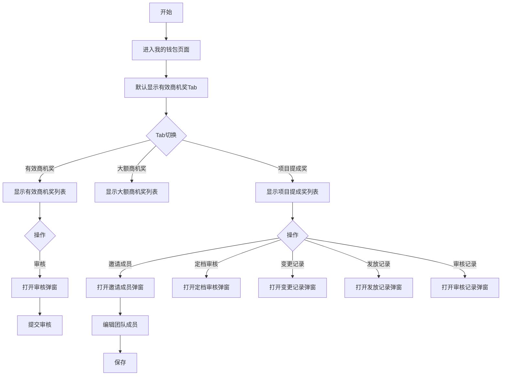

## 需求背景

### 痛点
- **问题现象**：当前登录人员无法一站式查看自己获得的商机奖和项目提成奖情况，需要分别进入不同页面查询
- **发生频率**：高 - 每个员工每月都需要查看自己的奖励到账情况
- **当前 workaround**：登录多个页面分别查看有效商机奖、大额商机奖、项目提成奖数据

### 业务目标
- **量化指标**：实现登录人员奖励数据的一站式查看
- **目标期限**：2026年6月

### 涉及系统/模块
- **模块名称**：宁波产数钱包-我的钱包
- **变更类型**：新增
- **对接接口**：有效商机奖查询接口、大额商机奖查询接口、项目提成奖查询接口

---

## 用户故事

### 故事1：登录人员查看个人奖励
- **角色**：区县分公司员工
- **功能**：查看自己在有效商机奖、大额商机奖、项目提成奖三个模块的数据
- **收益**：一站式查看个人奖励情况，无需登录多个页面
- **验收条件**：可通过Tab切换查看三类奖励数据，支持查询和操作

### 故事2：个人奖励审核
- **角色**：区县分公司员工
- **功能**：对个人有效商机奖进行审核操作，对项目提成奖进行成员定档审核
- **收益**：快速完成奖励相关的审核确认
- **验收条件**：可进行审核操作，可查看变更记录、发放记录、审核记录

---

## 需求清单

| 序号 | 需求描述 | 优先级 | 状态 | 负责人 | 截止日期 |
|------|----------|--------|------|--------|----------|
| 1 | 我的钱包页面三个Tab切换（有效商机奖/大额商机奖/项目提成奖） | P0 | TODO | | |
| 2 | 有效商机奖Tab：查询条件、表格、审核弹窗 | P0 | TODO | | |
| 3 | 大额商机奖Tab：查询条件、表格 | P0 | TODO | | |
| 4 | 项目提成奖Tab：查询条件、表格、操作按钮（邀请成员/定档审核/变更记录/发放记录/审核记录） | P0 | TODO | | |
| 5 | 邀请成员弹窗：人员选择、团队成员编辑 | P0 | TODO | | |
| 6 | 人员选择弹窗 | P0 | TODO | | |

---

## 业务流程图

---

## 页面结构

### 路由信息
- **路由路径** - `/宁波产数钱包/我的钱包`
- **页面标题** - 我的钱包
- **访问权限** - 登录用户

### 布局结构
- **布局类型** - 单栏
- **区域-标题区** - 页面标题"我的钱包"，副标题"查看我的商机奖和项目提成奖"
- **区域-Tab区** - 3个Tab切换：有效商机奖、大额商机奖、项目提成奖
- **区域-主内容** - 查询条件卡片+数据表格

### Tab 结构
| Tab名称 | 说明 | 默认激活 |
|---------|------|----------|
| 有效商机奖 | 显示当前登录人的有效商机奖数据 | 是 |
| 大额商机奖 | 显示当前登录人的大额商机奖数据 | 否 |
| 项目提成奖 | 显示当前登录人的项目提成奖数据 | 否 |

---

## 功能描述

### 功能点1：有效商机奖

#### Tab 级
- **Tab名称** - 有效商机奖

#### 查询条件字段：
| 字段名 | 类型 | 必填 | 默认值 | 来源 | 校验规则 | 展示形式 | 交互约束 |
|--------|------|------|--------|------|----------|----------|----------|
| 商机名称 | 文本 | 否 | 空 | 用户输入 | - | 输入框 | 可编辑 |
| 商机编码 | 文本 | 否 | 空 | 用户输入 | - | 输入框 | 可编辑 |
| 客户名称 | 文本 | 否 | 空 | 用户输入 | - | 输入框 | 可编辑 |
| 客户编码 | 文本 | 否 | 空 | 用户输入 | - | 输入框 | 可编辑 |
| 区县 | 枚举 | 否 | 空 | 用户选择 | - | 下拉选择 | 可编辑 |
| 支局 | 枚举 | 否 | 空 | 用户选择 | - | 下拉选择 | 可编辑 |
| 客户经理 | 文本 | 否 | 空 | 用户输入 | - | 输入框 | 可编辑 |
| 审核状态 | 枚举 | 否 | 空 | 用户选择 | - | 下拉选择 | 可编辑 |
| 录入时间范围 | 日期 | 否 | 空 | 用户选择 | - | 日期范围选择器 | 可编辑 |

#### 操作按钮字段：
| 字段名 | 类型 | 必填 | 默认值 | 来源 | 校验规则 | 展示形式 | 交互约束 |
|--------|------|------|--------|------|----------|----------|----------|
| 查询 | 按钮 | 是 | - | - | - | primary按钮 | 可编辑 |
| 重置 | 按钮 | 是 | - | - | - | outline按钮 | 可编辑 |

#### 字段列表：
| 字段名 | 类型 | 必填 | 默认值 | 来源 | 校验规则 | 展示形式 | 交互约束 |
|--------|------|------|--------|------|----------|----------|----------|
| 商机名称 | 文本 | 是 | - | 接口 | - | 文字 | 只读 |
| 商机编码 | 文本 | 是 | - | 接口 | - | 蓝色文字 | 只读 |
| 客户名称 | 文本 | 是 | - | 接口 | - | 文字 | 只读 |
| 客户编码 | 文本 | 是 | - | 接口 | - | 文字 | 只读 |
| 有效商机奖金额 | 数字 | 是 | - | 接口 | - | 蓝色数字 | 只读 |
| 录入时间 | 日期 | 是 | - | 接口 | - | 日期文字 | 只读 |
| 客户经理 | 文本 | 是 | - | 接口 | - | 文字 | 只读 |
| 区县 | 文本 | 是 | - | 接口 | - | 文字 | 只读 |
| 支局 | 文本 | 是 | - | 接口 | - | 文字 | 只读 |
| 审核状态 | 文本 | 是 | - | 接口 | - | 标签(待审核-黄色/已审核-绿色) | 只读 |
| 操作 | 操作 | 是 | - | - | - | 审核按钮（仅待审核状态显示） | 可编辑 |

#### 弹窗级
- **弹窗：审核有效商机奖**
  - **触发入口**：点击"审核"按钮
  - **关闭方式**：取消按钮
  - **字段列表**：
    | 字段名 | 类型 | 必填 | 默认值 | 来源 | 校验规则 | 展示形式 | 交互约束 |
    |--------|------|------|--------|------|----------|----------|----------|
    | 商机编码 | 文本 | 是 | - | 接口 | - | 文字 | 只读 |
    | 客户名称 | 文本 | 是 | - | 接口 | - | 文字 | 只读 |
    | 有效商机奖金额 | 数字 | 是 | - | 接口 | - | 蓝色数字 | 只读 |
    | 客户经理 | 文本 | 是 | - | 接口 | - | 文字 | 只读 |
    | 审核意见 | 文本 | 否 | 空 | 用户输入 | - | 多行文本输入框 | 可编辑 |
  - **确定按钮**：点击后调用审核接口，成功关闭弹窗刷新列表
  - **取消按钮**：点击后关闭弹窗

### 功能点2：大额商机奖

#### Tab 级
- **Tab名称** - 大额商机奖

#### 查询条件字段：
| 字段名 | 类型 | 必填 | 默认值 | 来源 | 校验规则 | 展示形式 | 交互约束 |
|--------|------|------|--------|------|----------|----------|----------|
| 商机名称 | 文本 | 否 | 空 | 用户输入 | - | 输入框 | 可编辑 |
| 商机编码 | 文本 | 否 | 空 | 用户输入 | - | 输入框 | 可编辑 |
| 区县 | 枚举 | 否 | 空 | 用户选择 | - | 下拉选择 | 可编辑 |
| 支局 | 枚举 | 否 | 空 | 用户选择 | - | 下拉选择 | 可编辑 |
| 客户经理 | 文本 | 否 | 空 | 用户输入 | - | 输入框 | 可编辑 |
| 收款状态 | 枚举 | 否 | 空 | 用户选择 | - | 下拉选择 | 可编辑 |
| 签报状态 | 枚举 | 否 | 空 | 用户选择 | - | 下拉选择 | 可编辑 |

#### 字段列表：
| 字段名 | 类型 | 必填 | 默认值 | 来源 | 校验规则 | 展示形式 | 交互约束 |
|--------|------|------|--------|------|----------|----------|----------|
| 商机名称 | 文本 | 是 | - | 接口 | - | 文字 | 只读 |
| 商机编码 | 文本 | 是 | - | 接口 | - | 蓝色文字 | 只读 |
| 合同金额(万元) | 数字 | 是 | - | 接口 | - | 数字 | 只读 |
| 大额商机奖金额 | 数字 | 是 | - | 接口 | - | 蓝色数字 | 只读 |
| 客户经理 | 文本 | 是 | - | 接口 | - | 文字 | 只读 |
| 区县 | 文本 | 是 | - | 接口 | - | 文字 | 只读 |
| 支局 | 文本 | 是 | - | 接口 | - | 文字 | 只读 |
| 收款状态 | 文本 | 是 | - | 接口 | - | 标签(已收款-绿色/待收款-黄色) | 只读 |
| 签报状态 | 文本 | 是 | - | 接口 | - | 标签(已签报-绿色/待签报-黄色) | 只读 |
| 商机录入时间 | 日期 | 是 | - | 接口 | - | 日期文字 | 只读 |
| 商机转化时间 | 日期 | 是 | - | 接口 | - | 日期文字 | 只读 |
| 关联签报文号 | 文本 | 是 | - | 接口 | - | 文字 | 只读 |
| 审核状态 | 文本 | 是 | - | 接口 | - | 标签 | 只读 |
| 送审人 | 文本 | 是 | - | 接口 | - | 文字 | 只读 |
| 审批时间 | 日期 | 是 | - | 接口 | - | 日期文字 | 只读 |

### 功能点3：项目提成奖

#### Tab 级
- **Tab名称** - 项目提成奖

#### 查询条件字段：
| 字段名 | 类型 | 必填 | 默认值 | 来源 | 校验规则 | 展示形式 | 交互约束 |
|--------|------|------|--------|------|----------|----------|----------|
| 商机名称 | 文本 | 否 | 空 | 用户输入 | - | 输入框 | 可编辑 |
| 商机编码 | 文本 | 否 | 空 | 用户输入 | - | 输入框 | 可编辑 |
| 项目名称 | 文本 | 否 | 空 | 用户输入 | - | 输入框 | 可编辑 |
| 项目编码 | 文本 | 否 | 空 | 用户输入 | - | 输入框 | 可编辑 |
| 区县 | 枚举 | 否 | 空 | 用户选择 | - | 下拉选择 | 可编辑 |
| 支局 | 枚举 | 否 | 空 | 用户选择 | - | 下拉选择 | 可编辑 |
| 第一责任人 | 文本 | 否 | 空 | 用户输入 | - | 输入框 | 可编辑 |
| 成员审核状态 | 枚举 | 否 | 空 | 用户选择 | - | 下拉选择 | 可编辑 |
| 收款状态 | 枚举 | 否 | 空 | 用户选择 | - | 下拉选择 | 可编辑 |
| 签报状态 | 枚举 | 否 | 空 | 用户选择 | - | 下拉选择 | 可编辑 |

#### 操作按钮字段：
| 字段名 | 类型 | 必填 | 默认值 | 来源 | 校验规则 | 展示形式 | 交互约束 |
|--------|------|------|--------|------|----------|----------|----------|
| 查询 | 按钮 | 是 | - | - | - | primary按钮 | 可编辑 |
| 重置 | 按钮 | 是 | - | - | - | outline按钮 | 可编辑 |

#### 字段列表：
| 字段名 | 类型 | 必填 | 默认值 | 来源 | 校验规则 | 展示形式 | 交互约束 |
|--------|------|------|--------|------|----------|----------|----------|
| 商机名称 | 文本 | 是 | - | 接口 | - | 文字 | 只读 |
| 商机编码 | 文本 | 是 | - | 接口 | - | 蓝色文字 | 只读 |
| 项目名称 | 文本 | 是 | - | 接口 | - | 文字 | 只读 |
| 项目编码 | 文本 | 是 | - | 接口 | - | 蓝色文字 | 只读 |
| 合同金额(万元) | 数字 | 是 | - | 接口 | - | 蓝色数字 | 只读 |
| ICT金额(万元) | 数字 | 是 | - | 接口 | - | 蓝色数字 | 只读 |
| 收款金额(万元) | 数字 | 是 | - | 接口 | - | 蓝色数字 | 只读 |
| 项目类型 | 文本 | 是 | - | 接口 | - | 文字 | 只读 |
| 预算毛利 | 文本 | 是 | - | 接口 | - | 文字 | 只读 |
| 结算毛利 | 文本 | 是 | - | 接口 | - | 文字 | 只读 |
| 总奖励(元) | 数字 | 是 | - | 接口 | - | 蓝色数字 | 只读 |
| 已发放(元) | 数字 | 是 | - | 接口 | - | 蓝色数字 | 只读 |
| 责任人 | 文本 | 是 | - | 接口 | - | 文字 | 只读 |
| 团队成员 | 文本 | 是 | - | 接口 | - | 文字 | 只读 |
| 区县 | 文本 | 是 | - | 接口 | - | 文字 | 只读 |
| 支局 | 文本 | 是 | - | 接口 | - | 文字 | 只读 |
| 收款状态 | 文本 | 是 | - | 接口 | - | 标签 | 只读 |
| 签报状态 | 文本 | 是 | - | 接口 | - | 标签 | 只读 |
| 操作 | 操作 | 是 | - | - | - | 5个链接按钮 | 可编辑 |

#### 操作按钮字段（表格操作列）：
| 字段名 | 类型 | 必填 | 默认值 | 来源 | 校验规则 | 展示形式 | 交互约束 |
|--------|------|------|--------|------|----------|----------|----------|
| 邀请成员 | 链接 | 是 | - | - | - | 蓝色链接 | 可编辑 |
| 定档审核 | 链接 | 是 | - | - | - | 蓝色链接 | 可编辑 |
| 变更记录 | 链接 | 是 | - | - | - | 蓝色链接 | 可编辑 |
| 发放记录 | 链接 | 是 | - | - | - | 蓝色链接 | 可编辑 |
| 审核记录 | 链接 | 是 | - | - | - | 蓝色链接 | 可编辑 |

#### 弹窗级
- **弹窗：邀请成员**
  - **触发入口**：点击"邀请成员"链接
  - **关闭方式**：关闭按钮
  - **弹窗尺寸**：max-w-5xl
  - **字段列表**：
    | 字段名 | 类型 | 必填 | 默认值 | 来源 | 校验规则 | 展示形式 | 交互约束 |
    |--------|------|------|--------|------|----------|----------|----------|
    | 团队 | 枚举 | 是 | 4-售前销售团队 | 用户选择 | - | 下拉选择 | 可编辑 |
    | 姓名 | 文本 | 是 | 空 | 用户输入/人员选择弹窗 | - | 输入框+选择按钮 | 可编辑 |
    | 电话 | 文本 | 否 | 空 | 用户输入 | - | 输入框 | 可编辑 |
    | 部门 | 文本 | 否 | 空 | 用户输入 | - | 输入框 | 可编辑 |
    | 角色 | 枚举 | 是 | 空 | 用户选择 | - | 下拉选择 | 可编辑 |
    | 贡献度 | 数字 | 是 | 0 | 用户输入 | 0-100 | 输入框 | 可编辑 |
    | 责任人 | 布尔 | 否 | 否 | 用户选择 | - | 复选框 | 可编辑 |
  - **添加成员按钮**：新增一行可编辑的团队成员
  - **关闭按钮**：点击后关闭弹窗

- **弹窗：人员选择**
  - **触发入口**：点击"选择人员"按钮
  - **关闭方式**：关闭图标
  - **弹窗尺寸**：sm:max-w-[800px]
  - **字段列表**：
    | 字段名 | 类型 | 必填 | 默认值 | 来源 | 校验规则 | 展示形式 | 交互约束 |
    |--------|------|------|--------|------|----------|----------|----------|
    | 姓名 | 文本 | 否 | 空 | 用户输入 | - | 输入框 | 可编辑 |
    | 电话 | 文本 | 否 | 空 | 用户输入 | - | 输入框 | 可编辑 |
  - **表格字段**：姓名、电话、工号、部门、操作（选择按钮）
  - **选择按钮**：选中后回填人员信息到邀请成员弹窗

- **弹窗：定档审核**
  - **触发入口**：点击"定档审核"链接
  - **关闭方式**：取消按钮
  - **字段列表**：
    | 字段名 | 类型 | 必填 | 默认值 | 来源 | 校验规则 | 展示形式 | 交互约束 |
    |--------|------|------|--------|------|----------|----------|----------|
    | 已确认 | 布尔 | 是 | 否 | 用户选择 | - | 复选框 | 可编辑 |
    | 审核意见 | 文本 | 否 | 空 | 用户输入 | - | 多行文本输入框 | 可编辑 |
  - **确定按钮**：点击后提交审核
  - **取消按钮**：点击后关闭弹窗

- **弹窗：变更记录**
  - **触发入口**：点击"变更记录"链接
  - **关闭方式**：关闭按钮
  - **弹窗尺寸**：sm:max-w-3xl
  - **内容**：暂无变更记录占位

- **弹窗：发放记录**
  - **触发入口**：点击"发放记录"链接
  - **关闭方式**：关闭按钮
  - **弹窗尺寸**：sm:max-w-lg
  - **内容**：暂无发放记录占位

- **弹窗：审核记录**
  - **触发入口**：点击"审核记录"链接
  - **关闭方式**：关闭按钮
  - **弹窗尺寸**：sm:max-w-4xl
  - **内容**：暂无审核记录占位

---

## 数据流图

### 接口1：查询有效商机奖（当前登录人）
- **请求路径** - `/api/taskWallet/effectiveBusinessOpp/myList`
- **请求方法** - POST
- **请求参数** - 商机名称、商机编码、客户名称、客户编码、区县、支局、客户经理、审核状态、录入时间范围
- **响应字段** - records, total

### 接口2：查询大额商机奖（当前登录人）
- **请求路径** - `/api/taskWallet/bigBusinessOpp/myList`
- **请求方法** - POST
- **请求参数** - 商机名称、商机编码、区县、支局、客户经理、收款状态、签报状态
- **响应字段** - records, total

### 接口3：查询项目提成奖（当前登录人）
- **请求路径** - `/api/taskWallet/projectCommission/myList`
- **请求方法** - POST
- **请求参数** - 商机名称、商机编码、项目名称、项目编码、区县、支局、第一责任人、成员审核状态、收款状态、签报状态
- **响应字段** - records, total

### 接口4：审核有效商机奖
- **请求路径** - `/api/taskWallet/effectiveBusinessOpp/audit`
- **请求方法** - POST
- **请求参数** - id, auditOpinion
- **响应字段** - success

### 接口5：邀请成员（更新团队）
- **请求路径** - `/api/taskWallet/projectCommission/updateTeam`
- **请求方法** - POST
- **请求参数** - itemId, teamMembers[]
- **响应字段** - success

---

## 验收标准

### 正常流程
- [ ] **操作**：进入我的钱包页面，默认显示"有效商机奖"Tab → **预期**：显示有效商机奖列表
- [ ] **操作**：点击"大额商机奖"Tab → **预期**：显示大额商机奖列表
- [ ] **操作**：点击"项目提成奖"Tab → **预期**：显示项目提成奖列表和5个操作按钮
- [ ] **操作**：点击"邀请成员"按钮 → **预期**：弹出邀请成员弹窗，可添加/编辑团队成员
- [ ] **操作**：点击"定档审核"按钮 → **预期**：弹出定档审核弹窗
- [ ] **操作**：点击"审核"按钮（有效商机奖行） → **预期**：弹出审核弹窗

### 异常流程
- [ ] **操作**：审核时未勾选"已确认" → **预期**：可以提交（仅提示可选）
- [ ] **操作**：审核接口返回错误 → **预期**：弹窗显示错误信息

---

## 更新记录

### v1 - 2026-05-20
- 初始版本：我的钱包页面PRD，包含有效商机奖、大额商机奖、项目提成奖三个Tab