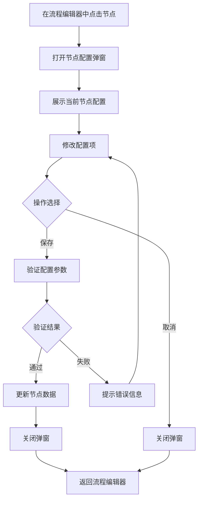

# 节点配置编辑器 PRD

## 需求背景

### 痛点
- **问题现象**：流程编辑器中每个节点需要配置详细的属性（阶段、类型、连接方式、是否必须完成、是否提醒、适用岗位角色），当前缺少统一的节点配置界面
- **发生频率**：高
- **当前 workaround**：通过硬编码方式设置节点属性，无法灵活调整节点配置

### 业务目标
- **量化指标**：流程配置效率提升 40%，节点配置错误率降低 50%
- **目标期限**：2026-Q2

### 涉及系统/模块
- **模块名称**：节点配置编辑器
- **变更类型**：新增
- **对接接口**：ProcessEditor（流程编辑器）

---

## 用户故事

### 故事1：流程管理员配置节点属性
- **角色**：流程管理员
- **功能**：在流程编辑器中点击节点，打开节点配置弹窗，设置节点的阶段、类型、连接方式等属性
- **收益**：可视化配置节点属性，无需修改代码即可调整流程
- **验收条件**：
  - 点击节点后弹窗打开，显示当前节点属性
  - 配置完成后保存，节点数据更新

### 故事2：流程管理员设置节点执行规则
- **角色**：流程管理员
- **功能**：设置节点是否必须完成、是否提醒、适用岗位角色
- **收益**：灵活控制流程执行规则，确保流程合规性
- **验收条件**：
  - 可以设置"是否必须完成"开关
  - 可以设置"是否提醒"开关
  - 可以输入适用岗位角色（多个用逗号分隔）

---

## 需求清单

| 序号 | 需求描述 | 优先级 | 状态 | 负责人 | 截止日期 |
|------|----------|--------|------|--------|----------|
| 1 | 实现节点配置弹窗显示 | P0 | TODO | | |
| 2 | 实现节点基本信息展示（节点名称、阶段、类型） | P0 | TODO | | |
| 3 | 实现连接方式选择（串行/并行） | P0 | TODO | | |
| 4 | 实现是否必须完成开关 | P1 | TODO | | |
| 5 | 实现是否提醒开关 | P1 | TODO | | |
| 6 | 实现适用岗位角色输入 | P1 | TODO | | |
| 7 | 实现配置保存和取消功能 | P0 | TODO | | |

- **优先级**：P0（核心流程阻塞）/ P1（重要功能）/ P2（体验优化）/ P3（未来规划）
- **状态**：TODO / IN PROGRESS / DONE / BLOCKED

---

## 业务流程图

---

## 页面结构

### 路由信息
- **路由路径** - 类型：文本；描述：弹窗组件，无独立路由，由 ProcessEditor 调用
- **页面标题** - 类型：文本；示例：`节点配置`
- **访问权限** - 类型：枚举（公开/登录/角色）；描述：登录用户（流程管理员）

### 布局结构
- **布局类型** - 类型：枚举（单栏/双栏/三栏）；描述：弹窗居中展示
- **区域-主内容** - 字段列表；描述：标题区 + 表单区 + 底部按钮区

---

## 功能描述

### 功能点1：节点配置弹窗

#### 页面级
- **字段：功能入口** - 类型：文本；描述：在 ProcessEditor 中点击节点触发
- **字段：前置条件** - 类型：文本；描述：节点已添加到画布
- **字段：后置影响** - 类型：字段列表；描述：配置保存后影响节点的阶段、类型、连接方式等属性

#### 弹窗级
- **弹窗：节点配置**
  - **触发入口**：点击画布中的节点
  - **关闭方式**：关闭图标 / 取消按钮 / Esc键（不保存）
  - **弹窗尺寸**：宽度 600px，最大高度 80vh
  - **字段列表**：
    | 字段名 | 类型 | 必填 | 默认值 | 来源 | 校验规则 | 展示形式 | 交互约束 |
    |--------|------|------|--------|------|----------|----------|----------|
    | 弹窗标题 | 文本 | - | 节点配置 | - | - | 文字 | 只读 |
    | 节点名称 | 文本 | - | - | node.data.label | - | 输入框 | 只读（禁用） |

### 功能点2：阶段和类型配置

#### 弹窗级
- **字段列表**：
  | 字段名 | 类型 | 必填 | 默认值 | 来源 | 校验规则 | 展示形式 | 交互约束 |
  |--------|------|------|--------|------|----------|----------|----------|
  | 阶段 | 枚举 | 是 | 空 | node.data.stage | 非空 | 下拉选择 | 可编辑 |
  | 阶段-选项-售前 | 枚举值 | - | - | - | - | 下拉选项 | 选择后赋值 |
  | 阶段-选项-售中 | 枚举值 | - | - | - | - | 下拉选项 | 选择后赋值 |
  | 阶段-选项-售后 | 枚举值 | - | - | - | - | 下拉选项 | 选择后赋值 |
  | 类型 | 枚举 | 是 | 空 | node.data.type | 非空 | 下拉选择 | 可编辑 |
  | 类型-选项-业务流 | 枚举值 | - | - | - | - | 下拉选项 | 选择后赋值 |
  | 类型-选项-财务流 | 枚举值 | - | - | - | - | 下拉选项 | 选择后赋值 |

### 功能点3：连接方式配置

#### 弹窗级
- **字段列表**：
  | 字段名 | 类型 | 必填 | 默认值 | 来源 | 校验规则 | 展示形式 | 交互约束 |
  |--------|------|------|--------|------|----------|----------|----------|
  | 连接方式 | 枚举 | 否 | serial | node.data.connectionType | - | 单选按钮组 | 可编辑 |
  | 连接方式-串行 | 枚举值 | - | - | - | - | 单选按钮 | 选择后赋值 serial |
  | 连接方式-并行 | 枚举值 | - | - | - | - | 单选按钮 | 选择后赋值 parallel |

### 功能点4：执行规则配置

#### 弹窗级
- **字段列表**：
  | 字段名 | 类型 | 必填 | 默认值 | 来源 | 校验规则 | 展示形式 | 交互约束 |
  |--------|------|------|--------|------|----------|----------|----------|
  | 是否必须完成 | 布尔 | 否 | false | node.data.required | - | 复选框 | 可编辑 |
  | 是否提醒 | 布尔 | 否 | false | node.data.reminder | - | 复选框 | 可编辑 |

### 功能点5：岗位角色配置

#### 弹窗级
- **字段列表**：
  | 字段名 | 类型 | 必填 | 默认值 | 来源 | 校验规则 | 展示形式 | 交互约束 |
  |--------|------|------|--------|------|----------|----------|----------|
  | 适用岗位角色 | 文本 | 否 | 空 | node.data.roles | - | 输入框 | 可编辑 |
  | 适用岗位角色-提示 | 文本 | - | 请输入适用岗位角色，多个用逗号分隔 | - | - | 占位符文本 | - |

### 功能点6：底部按钮

#### 弹窗级
- **字段列表**：
  | 字段名 | 类型 | 必填 | 默认值 | 来源 | 校验规则 | 展示形式 | 交互约束 |
  |--------|------|------|--------|------|----------|----------|----------|
  | 取消 | 按钮 | - | - | - | - | 次要按钮 | 点击关闭弹窗，不保存 |
  | 确认 | 按钮 | - | - | - | - | 主操作按钮 | 点击验证并保存配置 |

---

## 数据流图

### 接口1：保存节点配置
- **请求路径** - 类型：文本；示例：`POST /api/process/node/config`
- **请求方法** - 类型：枚举；必填：是
- **请求头** - 字段列表；描述：Authorization: Bearer {token}
- **请求参数** - 字段列表：
  - `nodeId` - 类型：字符串；必填：是；来源：节点ID；校验：非空
  - `stage` - 类型：字符串；必填：是；来源：阶段下拉；校验：枚举值（售前/售中/售后）
  - `type` - 类型：字符串；必填：是；来源：类型下拉；校验：枚举值（业务流/财务流）
  - `connectionType` - 类型：字符串；必填：否；来源：连接方式单选；校验：枚举值（serial/parallel）
  - `required` - 类型：布尔；必填：否；来源：是否必须完成复选框；校验：-
  - `reminder` - 类型：布尔；必填：否；来源：是否提醒复选框；校验：-
  - `roles` - 类型：字符串；必填：否；来源：适用岗位角色输入框；校验：最大长度500
- **响应字段** - 字段列表：
  - `success` - 类型：布尔；描述：是否保存成功
  - `message` - 类型：字符串；描述：操作结果信息
  - `node` - 类型：对象；描述：更新后的节点数据
- **存储位置** - 类型：文本；示例：`数据库表 process_node_config`
- **错误码** - 字段列表：
  - `400` - `参数校验失败`
  - `401` - `用户未登录或登录已过期`
  - `403` - `无配置权限`
  - `404` - `节点不存在`
  - `500` - `服务器异常`

### 数据刷新点
- **刷新时机** - 类型：枚举（配置保存成功后）
- **影响字段** - 字段列表；描述：节点在画布上的显示（阶段、类型标签）

---

## 验收标准

### 正常流程
- [ ] **操作**：在流程编辑器中点击节点 → **预期**：节点配置弹窗打开，显示节点名称（只读）、阶段、类型下拉等
- [ ] **操作**：选择阶段为"售前" → **预期**：阶段下拉显示"售前"
- [ ] **操作**：选择类型为"业务流" → **预期**：类型下拉显示"业务流"
- [ ] **操作**：选择连接方式为"并行" → **预期**：并行单选按钮选中
- [ ] **操作**：勾选"是否必须完成" → **预期**：复选框选中
- [ ] **操作**：勾选"是否提醒" → **预期**：复选框选中
- [ ] **操作**：在适用岗位角色输入"销售经理,财务主管" → **预期**：输入框显示内容
- [ ] **操作**：点击"确认"按钮 → **预期**：验证通过后关闭弹窗，节点数据更新
- [ ] **操作**：点击"取消"按钮 → **预期**：弹窗关闭，不保存任何数据

### 异常流程
- [ ] **操作**：不选择阶段直接点击确认 → **预期**：显示"请选择阶段"提示
- [ ] **操作**：不选择类型直接点击确认 → **预期**：显示"请选择类型"提示
- [ ] **操作**：适用岗位角色输入超长文本 → **预期**：前端截断或提示输入超长
- [ ] **操作**：点击关闭图标 → **预期**：弹窗关闭，不保存数据
- [ ] **操作**：按 Esc 键 → **预期**：弹窗关闭，不保存数据

---

## 更新记录

### v1 - 2026-05-09
- 初始版本
