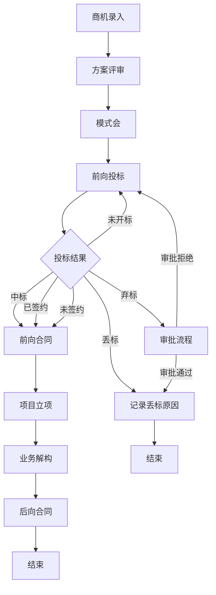

# 商机详情页 PRD

## 需求背景

### 痛点
- **问题现象**：商机详情信息分散在多个视图（售前/售中/资金），流程步骤多（商机→方案评审→模式会→前向投标→前向合同→项目立项→业务解构→后向合同），投标结果状态复杂（中标/丢标/弃标/已签约/未签约/未开标）
- **发生频率**：高
- **当前 workaround**：通过集团系统和多个子系统分别查看

### 业务目标
- **量化指标**：详情页加载时间≤3秒，投标信息维护覆盖率100%
- **目标期限**：2026-Q2

### 涉及系统/模块
- **模块名称**：商机详情
- **变更类型**：新增（对接投标系统/合同系统/资金系统）
- **对接接口**：投标管理模块、合同管理模块、集采竞价模块

---

## 用户故事

### 故事1
- **角色**：客户经理
- **功能**：在详情页顶部快速查看商机基本信息（编号/客户/省商机编码/集团商机编码），一键返回列表
- **收益**：快速定位当前查看的商机，避免迷失
- **验收条件**：信息完整，返回按钮可用

### 故事2
- **角色**：客户经理
- **功能**：在一级Tab（售前视图/售中视图/资金视图）和右侧常用工具按钮间快速切换，查看不同视角的数据
- **收益**：一个页面搞定全链路管理，减少跳转
- **验收条件**：Tab切换正确，工具按钮有响应

### 故事3
- **角色**：客户经理
- **功能**：左侧流程步骤导航（商机→方案评审→模式会→前向投标→前向合同→项目立项→业务解构→后向合同），点击进入各阶段详情
- **收益**：直观了解项目所处阶段，可快速跳转
- **验收条件**：步骤高亮准确，已完成步骤显示对勾

### 故事4
- **角色**：客户经理
- **功能**：前向投标流程中的投标管理：维护发标信息/发标应对信息/中标信息/丢标信息/弃标信息/签约信息
- **收益**：完整记录投标全流程，支持多结果状态
- **验收条件**：各类信息按结果类型条件渲染，资质证书区域完整

### 故事5
- **角色**：客户经理
- **功能**：投标记录三级Tab（投标记录/合作伙伴解决方案评分/施工单）和资质证书管理
- **收益**：管理投标全生命周期数据
- **验收条件**：Tab切换流畅，证书状态筛选可用

---

## 需求清单

| 序号 | 需求描述 | 优先级 | 状态 | 负责人 | 截止日期 |
|------|----------|--------|------|--------|----------|
| 1 | 顶部信息栏：返回按钮/商机编号/客户/省商机编码/集团商机编码/状态标签/操作按钮 | P0 | TODO | | |
| 2 | 一级Tab（售前视图/售中视图/资金视图）+ 右侧12个工具按钮 | P0 | TODO | | |
| 3 | 左侧流程步骤导航（8步：商机/方案评审/模式会/前向投标/前向合同/项目立项/业务解构/后向合同） | P0 | TODO | | |
| 4 | 流程内容区：根据选中步骤渲染不同内容面板 | P0 | TODO | | |
| 5 | 前向投标-投标记录：发标信息/发标应对信息/中标信息/丢标信息/弃标信息/已签约信息/未签约信息/未开标信息 | P0 | TODO | | |
| 6 | 前向投标-投标记录的三级Tab（投标记录/合作伙伴解决方案评分/施工单） | P1 | TODO | | |
| 7 | 资质证书区域：下载状态筛选/证书使用情况表/公司资质表 | P1 | TODO | | |
| 8 | 维护投标信息按钮 + AddBidDialog弹窗 | P1 | TODO | | |
| 9 | 右下角悬浮目标按钮 | P2 | TODO | | |
| 10 | 流程步骤图例说明 | P2 | TODO | | |

- **优先级**：P0（核心流程阻塞）/ P1（重要功能）/ P2（体验优化）/ P3（未来规划）
- **状态**：TODO / IN PROGRESS / DONE / BLOCKED

---

## 业务流程图

---

## 页面结构

### 路由信息
- **路由路径**：`/opportunity/detail/:id`
- **页面标题**：商机详情
- **访问权限**：登录 / 客户经理/管理员角色

### 布局结构
- **布局类型**：三栏（顶部信息栏 + 左侧流程导航 + 右侧内容区）
- **区域-顶部信息栏**：返回/商机编号/客户/编码/状态标签/操作按钮
- **区域-顶部Tab行**：一级Tab + 工具按钮
- **区域-左侧流程**：流程步骤列表 + 推进按钮 + 图例
- **区域-右侧内容**：流程内容面板

---

## 功能描述

### 功能点1：顶部信息栏

#### 页面级
- **字段：功能入口** - 类型：文本；描述：从商机列表点击商机名称进入
- **字段：前置条件** - 类型：文本；描述：商机ID有效且有访问权限
- **字段：后置影响** - 类型：字段列表；描述：详情数据只读，不修改

#### 返回区域
| 字段名 | 类型 | 必填 | 默认值 | 来源 | 校验规则 | 展示形式 | 交互约束 |
|--------|------|------|--------|------|----------|----------|----------|
| 返回按钮 | 图标按钮 | - | - | - | - | 左箭头图标 | 点击返回列表页 |

#### 商机基本信息
| 字段名 | 类型 | 必填 | 默认值 | 来源 | 校验规则 | 展示形式 | 交互约束 |
|--------|------|------|--------|------|----------|----------|----------|
| 商机编号 | 字符串 | - | - | 接口 | - | 文字 | 只读 |
| 客户 | 字符串 | - | - | 接口 | - | 文字 | 只读 |
| 省商机编码 | 字符串 | - | - | 接口 | - | 文字 | 只读 |
| 集团商机编码 | 字符串 | - | - | 接口 | - | 文字/- | 只读 |

#### 状态与操作按钮
| 字段名 | 类型 | 必填 | 默认值 | 来源 | 校验规则 | 展示形式 | 交互约束 |
|--------|------|------|--------|------|----------|----------|----------|
| 已同步集团 | 标签 | - | - | 接口 | - | 绿色小标签 | 只读 |
| 商机状态 | 标签 | - | - | 接口 | - | 蓝色小标签 | 只读 |
| 相似案例 | 按钮 | - | - | - | - | 边框按钮 | 触发推荐 |
| 推荐伙伴 | 按钮 | - | - | - | - | 边框按钮 | 触发推荐 |
| 绑定项目 | 按钮 | - | - | - | - | 绿色按钮 | 触发绑定 |
| 商机轨迹 | 按钮 | - | - | - | - | 边框按钮 | 跳转轨迹 |
| 商机两级上报节点 | 按钮 | - | - | - | - | 边框按钮 | 跳转节点 |
| 关闭此商机 | 按钮 | - | - | - | - | 橙色边框按钮 | 触发关闭 |

---

### 功能点2：一级Tab + 工具按钮

#### 一级Tab
| 字段名 | 类型 | 必填 | 默认值 | 来源 | 校验规则 | 展示形式 | 交互约束 |
|--------|------|------|--------|------|----------|----------|----------|
| 售前视图 | Tab | - | 选中 | - | - | 文字Tab+下划线 | 点击切换 |
| 售中视图 | Tab | - | 未选中 | - | - | 文字Tab+下划线 | 点击切换 |
| 资金视图 | Tab | - | 未选中 | - | - | 文字Tab+下划线 | 点击切换 |

#### 工具按钮（12个）
| 字段名 | 类型 | 必填 | 默认值 | 来源 | 校验规则 | 展示形式 | 交互约束 |
|--------|------|------|--------|------|----------|----------|----------|
| 商机奖励 | 图标+文字 | - | 未激活 | - | - | 图标+文字，激活时蓝色 | 点击激活 |
| 前后匹配表 | 图标+文字 | - | 未激活 | - | - | 同上 | 点击激活 |
| 派单 | 图标+文字 | - | 未激活 | - | - | 同上 | 点击激活 |
| 参会人员组 | 图标+文字 | - | 未激活 | - | - | 同上 | 点击激活 |
| 跟踪日志 | 图标+文字 | - | 未激活 | - | - | 同上 | 点击激活 |
| 团队 | 图标+文字 | - | 未激活 | - | - | 同上 | 点击激活 |
| 积分 | 图标+文字 | - | 未激活 | - | - | 同上 | 点击激活 |
| 合同 | 图标+文字 | - | 未激活 | - | - | 同上 | 点击激活 |
| 资料 | 图标+文字 | - | 未激活 | - | - | 同上 | 点击激活 |
| 集采竞价 | 图标+文字 | - | 未激活 | - | - | 同上 | 点击激活 |
| 合作伙伴 | 图标+文字 | - | 未激活 | - | - | 同上 | 点击激活 |
| 资质证书 | 图标+文字 | - | 未激活 | - | - | 同上 | 点击激活 |

---

### 功能点3：左侧流程步骤导航

#### 流程步骤（8步）
| 字段名 | 类型 | 必填 | 默认值 | 来源 | 校验规则 | 展示形式 | 交互约束 |
|--------|------|------|--------|------|----------|----------|----------|
| 商机 | 步骤 | - | - | 接口 | - | 蓝色圆圈1+文字 | 点击跳转 |
| 方案评审 | 步骤 | - | - | 接口 | - | 同上 | 点击跳转 |
| 模式会 | 步骤 | - | - | 接口 | - | 同上 | 点击跳转 |
| 前向投标 | 步骤 | - | 激活 | 接口 | - | 蓝色填充圆圈+文字 | 点击跳转 |
| 前向合同 | 步骤 | - | - | 接口 | - | 圆圈+文字 | 点击跳转 |
| 项目立项 | 步骤 | - | - | 接口 | - | 圆圈+文字 | 点击跳转 |
| 业务解构 | 步骤 | - | - | 接口 | - | 圆圈+文字 | 点击跳转 |
| 后向合同 | 步骤 | - | - | 接口 | - | 圆圈+文字 | 点击跳转 |

#### 步骤状态
| 字段名 | 类型 | 必填 | 默认值 | 来源 | 校验规则 | 展示形式 | 交互约束 |
|--------|------|------|--------|------|----------|----------|----------|
| 进行中 | 状态 | - | - | 接口 | - | 蓝色填充圆圈 | 只读 |
| 已完成 | 状态 | - | - | 接口 | - | 绿色圆圈+✓ | 只读 |
| 待进行 | 状态 | - | - | 接口 | - | 白色圆圈+序号 | 只读 |
| 超时完成 | 状态 | - | - | 接口 | - | 红色圆圈 | 只读 |

#### 操作按钮
| 字段名 | 类型 | 必填 | 默认值 | 来源 | 校验规则 | 展示形式 | 交互约束 |
|--------|------|------|--------|------|----------|----------|----------|
| 推进 | 按钮 | - | - | - | - | 主色按钮（底部） | 触发流程推进 |

#### 图例
| 字段名 | 类型 | 必填 | 默认值 | 来源 | 校验规则 | 展示形式 | 交互约束 |
|--------|------|------|--------|------|----------|----------|----------|
| 进行中 | 图例 | - | - | - | - | 蓝色圆点+文字 | 只读 |
| 超时完成 | 图例 | - | - | - | - | 红色圆点+文字 | 只读 |
| 已完成 | 图例 | - | - | - | - | 绿色圆点+文字 | 只读 |
| 待进行 | 图例 | - | - | - | - | 白边圆点+文字 | 只读 |

---

### 功能点4：前向投标流程内容

#### 三级Tab
| 字段名 | 类型 | 必填 | 默认值 | 来源 | 校验规则 | 展示形式 | 交互约束 |
|--------|------|------|--------|------|----------|----------|----------|
| 投标记录 | Tab | - | 选中 | - | - | 下划线Tab | 点击切换 |
| 合作伙伴解决方案评分 | Tab | - | 未选中 | - | - | 下划线Tab | 点击切换 |
| 施工单 | Tab | - | 未选中 | - | - | 下划线Tab | 点击切换 |

#### 投标管理区块（投标记录Tab内）
| 字段名 | 类型 | 必填 | 默认值 | 来源 | 校验规则 | 展示形式 | 交互约束 |
|--------|------|------|--------|------|----------|----------|----------|
| 投标管理标题 | 标题 | - | - | - | - | 文字+操作按钮 | - |
| 维护投标信息 | 按钮 | - | - | - | - | 主色小按钮 | 打开AddBidDialog |

#### 投标记录卡片（多条，动态渲染）
| 字段名 | 类型 | 必填 | 默认值 | 来源 | 校验规则 | 展示形式 | 交互约束 |
|--------|------|------|--------|------|----------|----------|----------|
| 是否发标 | 字段 | - | - | 接口 | - | 卡片顶部文字 | 只读 |
| 是否应标 | 字段 | - | - | 接口 | - | 卡片顶部文字 | 只读 |
| 应标结果 | 标签 | - | - | 接口 | - | 彩色标签（中标绿色/丢标红色/弃标橙色/已签约紫色/未签约灰色） | 只读 |

##### 发标信息区块（始终显示）
| 字段名 | 类型 | 必填 | 默认值 | 来源 | 校验规则 | 展示形式 | 交互约束 |
|--------|------|------|--------|------|----------|----------|----------|
| 是否发标 | 枚举 | - | - | 接口 | - | 是/否文字 | 只读 |
| 发标类型 | 字符串 | - | - | 接口 | - | 文字 | 只读 |
| 发标时间 | 日期 | - | - | 接口 | - | 文字 | 只读 |
| 招标文件 | 文件列表 | - | - | 接口 | - | 蓝色小标签（文件名） | 可下载 |

##### 发标应对信息区块（始终显示）
| 字段名 | 类型 | 必填 | 默认值 | 来源 | 校验规则 | 展示形式 | 交互约束 |
|--------|------|------|--------|------|----------|----------|----------|
| 投标/签约主体 | 字符串 | - | - | 接口 | - | 文字 | 只读 |
| 预计合作伙伴 | 字符串 | - | - | 接口 | - | 文字 | 只读 |
| 标前会议决策记录 | 文件列表 | - | - | 接口 | - | 蓝色小标签 | 可下载 |
| 是否应标 | 枚举 | - | - | 接口 | - | 是/否文字 | 只读 |
| 投标依据/标书 | 文件列表 | - | - | 接口 | - | 蓝色小标签 | 可下载 |
| 应标结果 | 字符串 | - | - | 接口 | - | 文字 | 只读 |

##### 中标信息区块（仅应标结果=中标时显示）
| 字段名 | 类型 | 必填 | 默认值 | 来源 | 校验规则 | 展示形式 | 交互约束 |
|--------|------|------|--------|------|----------|----------|----------|
| 投标时间 | 日期 | - | - | 接口 | - | 文字 | 只读 |
| 中标金额（万元） | 数字 | - | - | 接口 | - | 橙色大号数字 | 只读 |
| 中标时间 | 日期 | - | - | 接口 | - | 文字 | 只读 |
| 签约对象 | 字符串 | - | - | 接口 | - | 文字 | 只读 |
| 客户项目联系人 | 字符串 | - | - | 接口 | - | 文字 | 只读 |
| 客户项目联系方式 | 字符串 | - | - | 接口 | - | 文字 | 只读 |
| 项目期望完成时间 | 日期 | - | - | 接口 | - | 文字 | 只读 |
| 中标通知书 | 文件列表 | - | - | 接口 | - | 蓝色小标签 | 可下载 |

##### 丢标信息区块（仅应标结果=丢标时显示）
| 字段名 | 类型 | 必填 | 默认值 | 来源 | 校验规则 | 展示形式 | 交互约束 |
|--------|------|------|--------|------|----------|----------|----------|
| 投标时间 | 日期 | - | - | 接口 | - | 文字 | 只读 |
| 丢标原因 | 字符串 | - | - | 接口 | - | 文字 | 只读 |
| 其他丢标原因 | 字符串 | - | - | 接口 | - | 文字（可空） | 只读 |

##### 弃标信息区块（仅应标结果=弃标时显示）
| 字段名 | 类型 | 必填 | 默认值 | 来源 | 校验规则 | 展示形式 | 交互约束 |
|--------|------|------|--------|------|----------|----------|----------|
| 是否完成弃标审批 | 枚举 | - | - | 接口 | - | 是/否 | 只读 |
| 弃标审批人 | 字符串 | - | - | 接口 | - | 文字 | 只读 |
| 审批人人力编码 | 字符串 | - | - | 接口 | - | 文字 | 只读 |
| 审批人手机号 | 字符串 | - | - | 接口 | - | 文字 | 只读 |
| 审批人角色 | 字符串 | - | - | 接口 | - | 文字 | 只读 |
| 弃标审批结果 | 字符串 | - | - | 接口 | - | 文字 | 只读 |
| 弃标原因 | 字符串 | - | - | 接口 | - | 文字 | 只读 |
| 弃标审批发起时间 | 日期时间 | - | - | 接口 | - | 文字 | 只读 |
| 弃标审批通过时间 | 日期时间 | - | - | 接口 | - | 文字 | 只读 |

##### 已签约信息区块（仅应标结果=已签约时显示）
| 字段名 | 类型 | 必填 | 默认值 | 来源 | 校验规则 | 展示形式 | 交互约束 |
|--------|------|------|--------|------|----------|----------|----------|
| 商务谈判时间 | 日期 | - | - | 接口 | - | 文字 | 只读 |
| 客户项目联系人 | 字符串 | - | - | 接口 | - | 文字 | 只读 |
| 客户项目联系方式 | 字符串 | - | - | 接口 | - | 文字 | 只读 |
| 项目期望完成时间 | 日期 | - | - | 接口 | - | 文字 | 只读 |

##### 未签约信息区块（仅应标结果=未签约时显示）
| 字段名 | 类型 | 必填 | 默认值 | 来源 | 校验规则 | 展示形式 | 交互约束 |
|--------|------|------|--------|------|----------|----------|----------|
| 签约失败原因 | 字符串 | - | - | 接口 | - | 文字 | 只读 |
| 其他签约失败原因 | 字符串 | - | - | 接口 | - | 文字（可空） | 只读 |

##### 未开标信息区块（仅应标结果=未开标时显示）
| 字段名 | 类型 | 必填 | 默认值 | 来源 | 校验规则 | 展示形式 | 交互约束 |
|--------|------|------|--------|------|----------|----------|----------|
| 未开标原因 | 字符串 | - | - | 接口 | - | 文字 | 只读 |

---

### 功能点5：资质证书区域

#### 下载状态筛选
| 字段名 | 类型 | 必填 | 默认值 | 来源 | 校验规则 | 展示形式 | 交互约束 |
|--------|------|------|--------|------|----------|----------|----------|
| 下载状态 | Select | 否 | 全部 | 页面选择 | 枚举：全部/已下载/未下载 | Select | 选择即过滤 |
| 查询 | 按钮 | - | - | - | - | 主色小按钮 | 触发筛选 |

#### 快捷操作按钮
| 字段名 | 类型 | 必填 | 默认值 | 来源 | 校验规则 | 展示形式 | 交互约束 |
|--------|------|------|--------|------|----------|----------|----------|
| 资质证书调用 | 按钮 | - | - | - | - | 蓝色边框按钮 | 触发操作 |
| 证书及资质下载 | 按钮 | - | - | - | - | 蓝色边框按钮 | 触发操作 |
| 申请记录 | 按钮 | - | - | - | - | 蓝色边框按钮 | 触发操作 |
| 实际使用 | 按钮 | - | - | - | - | 蓝色边框按钮 | 触发操作 |

#### 证书使用情况表
| 字段名 | 类型 | 必填 | 默认值 | 来源 | 校验规则 | 展示形式 | 交互约束 |
|--------|------|------|--------|------|----------|----------|----------|
| 全选 | 复选框 | - | false | - | - | Checkbox | - |
| 序号 | 数字 | - | - | - | - | 居中数字 | 只读 |
| 实际使用情况 | 字符串 | - | - | 接口 | - | 文字 | 只读 |
| 证书编号 | 字符串 | - | - | 接口 | - | 文字 | 只读 |
| 证书名称 | 字符串 | - | - | 接口 | - | 文字 | 只读 |
| 证书所属人/人力编码 | 字符串 | - | - | 接口 | - | 文字 | 只读 |
| 证书所属人电话 | 字符串 | - | - | 接口 | - | 文字 | 只读 |
| 所属部门 | 字符串 | - | - | 接口 | - | 文字 | 只读 |
| 证书类别 | 字符串 | - | - | 接口 | - | 文字 | 只读 |
| 专业/领域 | 字符串 | - | - | 接口 | - | 文字 | 只读 |
| 级别 | 字符串 | - | - | 接口 | - | 文字 | 只读 |
| 操作 | 操作 | - | - | - | - | - | - |

#### 公司资质表
| 字段名 | 类型 | 必填 | 默认值 | 来源 | 校验规则 | 展示形式 | 交互约束 |
|--------|------|------|--------|------|----------|----------|----------|
| 全选 | 复选框 | - | false | - | - | Checkbox | - |
| 序号 | 数字 | - | - | - | - | 居中数字 | 只读 |
| 资质编号 | 字符串 | - | - | 接口 | - | 文字 | 只读 |
| 公司资质名称 | 字符串 | - | - | 接口 | - | 文字 | 只读 |
| 授予主体 | 字符串 | - | - | 接口 | - | 文字 | 只读 |
| 资质类型 | 字符串 | - | - | 接口 | - | 文字 | 只读 |
| 所属公司 | 字符串 | - | - | 接口 | - | 文字 | 只读 |
| 获取时间 | 日期 | - | - | 接口 | - | 文字 | 只读 |
| 资质到期时间 | 日期 | - | - | 接口 | - | 文字 | 只读 |
| 申请流水 | 字符串 | - | - | 接口 | - | 文字 | 只读 |

---

### 功能点6：维护投标信息弹窗（AddBidDialog）

- **触发入口**：点击投标管理区域的「维护投标信息」按钮
- **关闭方式**：关闭图标 / 取消按钮 / 遮罩层点击
- **具体字段配置**：参见 `_add-bid-dialog.md` PRD文件
- **确定按钮**：调用 `POST /api/bids`，成功关闭弹窗刷新投标记录，失败显示错误
- **取消按钮**：关闭弹窗，不修改任何数据

---

## 数据流图

### 接口1：获取商机详情
- **请求路径**：`GET /api/opportunities/:id`
- **请求方法**：GET
- **请求头**：Authorization
- **请求参数**：
  - `id` - 类型：字符串；必填：是；来源：路由参数；校验：非空
- **响应字段**：
  - `id` / `oppName` / `provinceCode` / `groupCode` / `customerName` / `status` / `isSynced`
  - `bidRecords[]` - 类型：数组；描述：投标记录列表
  - `certificates[]` - 类型：数组；描述：资质证书列表
  - `currentProcessStep` - 类型：字符串；描述：当前流程步骤ID
- **存储位置**：数据库表 opportunity / opportunity_bid
- **错误码**：
  - `404` - `商机不存在`
  - `500` - `获取失败`

### 接口2：维护投标信息（新增/编辑）
- **请求路径**：`POST /api/opportunities/:id/bids`
- **请求方法**：POST
- **请求头**：Authorization / Content-Type: application/json
- **请求参数**：
  - `isStart` / `bidType` / `startTime` / `biddingDocumentsFiles[]` / `bidBody` / `expectedPartners` / `tagMeetingDecisionFiles[]` / `isBid` / `tenderDocumentFiles[]` / `bidResult` / `bidTime` 等
- **响应字段**：
  - `id` - 类型：字符串；描述：投标记录ID
  - `success` - 类型：布尔
- **存储位置**：数据库表 opportunity_bid
- **错误码**：
  - `400` - `必填字段校验失败`
  - `500` - `保存失败`

### 接口3：推进流程
- **请求路径**：`POST /api/opportunities/:id/process/advance`
- **请求方法**：POST
- **请求头**：Authorization
- **响应字段**：
  - `success` / `currentStep`
- **存储位置**：数据库表 opportunity
- **错误码**：
  - `400` - `当前步骤不允许推进`
  - `500` - `推进失败`

### 数据刷新点
- **刷新时机**：页面加载 / 维护投标信息成功 / 推进流程成功
- **影响字段**：投标记录列表 / 流程步骤状态 / 资质证书数据

---

## 验收标准

### 正常流程
- [ ] **操作**：点击商机名称进入详情页 → **预期**：页面加载，显示顶部信息栏和流程步骤
- [ ] **操作**：点击返回按钮 → **预期**：返回商机列表页
- [ ] **操作**：点击左侧「前向投标」步骤 → **预期**：右侧内容区显示投标管理面板
- [ ] **操作**：点击三级Tab「投标记录」→ **预期**：显示投标记录列表
- [ ] **操作**：查看应标结果为中标的记录 → **预期**：卡片中展示中标信息区块
- [ ] **操作**：查看应标结果为丢标的记录 → **预期**：卡片中展示丢标信息区块
- [ ] **操作**：查看应标结果为弃标的记录 → **预期**：卡片中展示弃标信息区块
- [ ] **操作**：点击「维护投标信息」→ **预期**：弹出AddBidDialog
- [ ] **操作**：点击「资质证书」工具按钮 → **预期**：激活资质证书Tab
- [ ] **操作**：选择下载状态筛选 → **预期**：证书使用情况表按条件过滤

### 异常流程
- [ ] **操作**：商机ID无效 → **预期**：显示404页面
- [ ] **操作**：接口返回500 → **预期**：显示错误提示，可重试
- [ ] **操作**：维护投标信息表单校验失败 → **预期**：高亮提示错误字段

---

## 更新记录

### v1 - 2026-05-09
- 初始版本：基于OpportunityDetail.tsx源码编写，包含完整的投标结果多状态、资质证书管理等复杂逻辑
