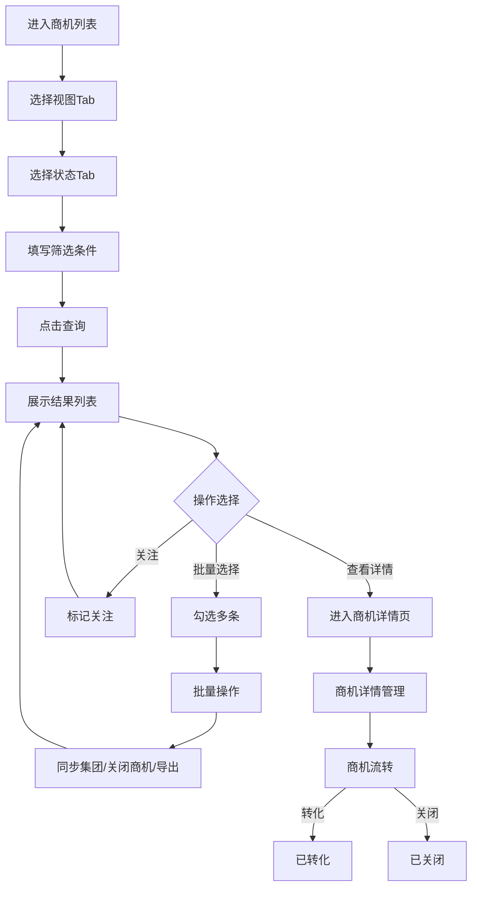

# 商机管理（列表页）PRD

## 需求背景

### 痛点
- **问题现象**：商机数量大，状态分散，查询条件复杂（日期/金额/客户/合同/项目等多维度），字段多导致表格横向滚动频繁，无法快速定位目标商机
- **发生频率**：高
- **当前 workaround**：通过集团系统查询后导出Excel，人工筛选

### 业务目标
- **量化指标**：查询响应时间≤2秒，列表加载时间≤3秒
- **目标期限**：2026-Q2

### 涉及系统/模块
- **模块名称**：商机管理
- **变更类型**：新增（对接集团系统）
- **对接接口**：集团商机系统（同步数据）

---

## 用户故事

### 故事1
- **角色**：客户经理
- **功能**：按我发起的/我管理的/我支撑的/我关注的等多视角查看商机列表，支持多维度筛选
- **收益**：快速定位自己负责的商机，提升工作效率
- **验收条件**：视图Tab切换正确，筛选条件互不影响

### 故事2
- **角色**：客户经理
- **功能**：按商机状态（全部/跟进中/推进中/已转化/已关闭）快速过滤
- **收益**：聚焦当前工作重点
- **验收条件**：状态Tab切换后列表立即更新

### 故事3
- **角色**：客户经理
- **功能**：商机列表字段可调整宽度，支持拖拽调整列顺序（可选）
- **收益**：根据个人习惯优化显示效果
- **验收条件**：列宽拖拽流畅，刷新后保持（可选持久化）

### 故事4
- **角色**：客户经理
- **功能**：勾选多条商机后批量操作（关闭/导出/编辑/分配）
- **收益**：减少重复操作
- **验收条件**：批量选择功能正常，操作确认时有选中数量提示

### 故事5
- **角色**：客户经理
- **功能**：点击商机名称进入详情页，支持关注/取消关注
- **收益**：快速查看详情，持续跟踪目标商机
- **验收条件**：点击名称跳转详情，关注状态实时更新

---

## 需求清单

| 序号 | 需求描述 | 优先级 | 状态 | 负责人 | 截止日期 |
|------|----------|--------|------|--------|----------|
| 1 | 视图Tab切换（我发起的/我管理的/我支撑的/我管理人员所支撑的/我关注的） | P0 | TODO | | |
| 2 | 状态Tab（全部/跟进中/推进中/已转化/已关闭） | P0 | TODO | | |
| 3 | 多维度查询筛选（创建日期/商机金额/合同金额/商机名称/编码/项目名称/编码/合同名称/编码/客户名称/编码） | P0 | TODO | | |
| 4 | 操作按钮（查询/重置/同步集团/新建项目/关闭商机/更多下拉菜单） | P0 | TODO | | |
| 5 | 全屏数据表格（26个字段，含列宽拖拽调整） | P0 | TODO | | |
| 6 | 复选框批量选择（全选/单选） | P1 | TODO | | |
| 7 | 关注/取消关注功能 | P1 | TODO | | |
| 8 | 分页组件（条数选择/页码/跳转） | P0 | TODO | | |
| 9 | ICT标签识别和展示 | P2 | TODO | | |
| 10 | 更多菜单（下拉：导出数据/批量编辑/分配商机） | P2 | TODO | | |

- **优先级**：P0（核心流程阻塞）/ P1（重要功能）/ P2（体验优化）/ P3（未来规划）
- **状态**：TODO / IN PROGRESS / DONE / BLOCKED

---

## 业务流程图

---

## 页面结构

### 路由信息
- **路由路径**：`/opportunity`
- **页面标题**：商机管理
- **访问权限**：登录 / 客户经理/管理员角色

### 布局结构
- **布局类型**：单栏（全屏表格布局）
- **区域-主内容**：页面标题 + 视图Tab + 查询筛选区 + 操作按钮区 + 状态Tab + 数据表格 + 底部分页

### Tab 结构（视图Tab）
- **Tab名称**：我发起的商机 / 我管理的商机 / 我支撑的商机 / 我管理人员所支撑的商机 / 我关注的商机
- **Tab路由**：无独立路由，通过状态切换
- **加载方式**：预加载（切换时重新查询）
- **默认激活**：我发起的商机

### Tab 结构（状态Tab）
- **Tab名称**：全部 / 跟进中 / 推进中 / 已转化 / 已关闭
- **加载方式**：预加载
- **默认激活**：全部

---

## 功能描述

### 功能点1：视图Tab切换

#### 页面级
- **字段：功能入口** - 类型：按钮组；描述：顶部Tab按钮组
- **字段：前置条件** - 类型：文本；描述：用户已登录
- **字段：后置影响** - 类型：字段列表；描述：视图切换影响列表数据范围

#### Tab列表
| 字段名 | 类型 | 必填 | 默认值 | 来源 | 校验规则 | 展示形式 | 交互约束 |
|--------|------|------|--------|------|----------|----------|----------|
| 我发起的商机 | Tab | - | 选中 | - | - | 圆角按钮组 | 点击切换 |
| 我管理的商机 | Tab | - | 未选中 | - | - | 圆角按钮组 | 点击切换 |
| 我支撑的商机 | Tab | - | 未选中 | - | - | 圆角按钮组 | 点击切换 |
| 我管理人员所支撑的商机 | Tab | - | 未选中 | - | - | 圆角按钮组 | 点击切换 |
| 我关注的商机 | Tab | - | 未选中 | - | - | 圆角按钮组 | 点击切换 |

---

### 功能点2：查询筛选区

#### 查询条件字段（第1行）
| 字段名 | 类型 | 必填 | 默认值 | 来源 | 校验规则 | 展示形式 | 交互约束 |
|--------|------|------|--------|------|----------|----------|----------|
| 商机创建日期-开始 | 日期 | 否 | 空 | 页面选择 | - | date Input | 不晚于结束日期 |
| 商机创建日期-结束 | 日期 | 否 | 空 | 页面选择 | - | date Input | 不早于开始日期 |
| 商机金额-最小值 | 数字 | 否 | 空 | 页面输入 | 正数 | Input+万元 | 不大于最大值 |
| 商机金额-最大值 | 数字 | 否 | 空 | 页面输入 | 正数 | Input+万元 | 不小于最小值 |
| 合同金额-最小值 | 数字 | 否 | 空 | 页面输入 | 正数 | Input+万元 | - |
| 合同金额-最大值 | 数字 | 否 | 空 | 页面输入 | 正数 | Input+万元 | - |
| 商机名称 | 字符串 | 否 | 空 | 页面输入 | - | Input | 模糊匹配 |
| 商机编码 | 字符串 | 否 | 空 | 页面输入 | - | Input | 精确匹配 |

#### 查询条件字段（第2行）
| 字段名 | 类型 | 必填 | 默认值 | 来源 | 校验规则 | 展示形式 | 交互约束 |
|--------|------|------|--------|------|----------|----------|----------|
| 项目名称 | 字符串 | 否 | 空 | 页面输入 | - | Input | 模糊匹配 |
| 项目编码 | 字符串 | 否 | 空 | 页面输入 | - | Input | 精确匹配 |
| 合同名称 | 字符串 | 否 | 空 | 页面输入 | - | Input | 模糊匹配 |
| 合同编码 | 字符串 | 否 | 空 | 页面输入 | - | Input | 精确匹配 |
| 客户名称 | 字符串 | 否 | 空 | 页面输入 | - | Input | 模糊匹配 |
| 客户编码 | 字符串 | 否 | 空 | 页面输入 | - | Input | 精确匹配 |

---

### 功能点3：操作按钮区

#### 操作按钮字段
| 字段名 | 类型 | 必填 | 默认值 | 来源 | 校验规则 | 展示形式 | 交互约束 |
|--------|------|------|--------|------|----------|----------|----------|
| 查询 | 按钮 | - | - | - | - | 主色按钮 | 触发查询接口 |
| 重置 | 按钮 | - | - | - | - | 边框按钮 | 清空所有筛选字段 |
| 同步集团 | 按钮 | - | - | - | - | 绿色按钮 | 触发集团数据同步 |
| 新建项目 | 按钮 | - | - | - | - | 绿色按钮 | 跳转新建页 |
| 关闭商机 | 按钮 | - | - | - | - | 青色按钮 | 批量关闭选中商机 |
| 更多 | 按钮 | - | - | - | - | 边框按钮+下拉箭头 | 下拉显示更多选项 |

#### 更多下拉菜单
| 字段名 | 类型 | 必填 | 默认值 | 来源 | 校验规则 | 展示形式 | 交互约束 |
|--------|------|------|--------|------|----------|----------|----------|
| 导出数据 | 菜单项 | - | - | - | - | 下拉选项 | 触发导出 |
| 批量编辑 | 菜单项 | - | - | - | - | 下拉选项 | 触发批量编辑弹窗 |
| 分配商机 | 菜单项 | - | - | - | - | 下拉选项 | 触发分配弹窗 |

---

### 功能点4：状态Tab

#### 状态Tab字段
| 字段名 | 类型 | 必填 | 默认值 | 来源 | 校验规则 | 展示形式 | 交互约束 |
|--------|------|------|--------|------|----------|----------|----------|
| 全部 | Tab | - | 选中 | - | - | 文字按钮 | 点击切换 |
| 跟进中 | Tab | - | 未选中 | - | - | 文字按钮 | 点击切换 |
| 推进中 | Tab | - | 未选中 | - | - | 文字按钮 | 点击切换 |
| 已转化 | Tab | - | 未选中 | - | - | 文字按钮 | 点击切换 |
| 已关闭 | Tab | - | 未选中 | - | - | 文字按钮 | 点击切换 |

---

### 功能点5：数据表格

#### 表头字段（26列）
| 字段名 | 类型 | 必填 | 默认值 | 来源 | 校验规则 | 展示形式 | 交互约束 |
|--------|------|------|--------|------|----------|----------|----------|
| 全选 | 复选框 | - | false | - | - | Checkbox | 全选/取消全选 |
| 商机名称 | 字符串 | - | - | 接口 | - | 蓝色文字+ICT橙色标签 | 可点击跳转详情 |
| 阶段 | 字符串 | - | - | 接口 | - | 文字 | 只读 |
| 省内商机编码 | 字符串 | - | - | 接口 | - | 等宽字体 | 只读 |
| 集团商机编码 | 字符串 | - | - | 接口 | - | 等宽字体/- | 只读 |
| 商机接收日期 | 日期时间 | - | - | 接口 | - | 文字 | 只读 |
| 商机修改日期 | 日期时间 | - | - | 接口 | - | 文字 | 只读 |
| 政企客户身份证 | 字符串 | - | - | 接口 | - | 等宽字体 | 只读 |
| 客户名称 | 字符串 | - | - | 接口 | - | 文字（超长截断） | 只读 |
| 市 | 字符串 | - | - | 接口 | - | 文字 | 只读 |
| 区/县 | 字符串 | - | - | 接口 | - | 文字 | 只读 |
| BU | 字符串 | - | - | 接口 | - | 文字 | 只读 |
| 客户行业 | 字符串 | - | - | 接口 | - | 文字 | 只读 |
| 管控部门 | 字符串 | - | - | 接口 | - | 文字 | 只读 |
| 合同名称 | 字符串 | - | - | 接口 | - | 文字/- | 只读 |
| 合同编码 | 字符串 | - | - | 接口 | - | 等宽字体/- | 只读 |
| 合同金额(万元) | 数字 | - | - | 接口 | - | 右对齐数字/- | 只读 |
| 项目名称 | 字符串 | - | - | 接口 | - | 文字/- | 只读 |
| 项目编码 | 字符串 | - | - | 接口 | - | 等宽字体/- | 只读 |
| 商机状态 | 枚举 | - | - | 接口 | - | 跟进中蓝色/已转化绿色/已关闭灰色标签 | 只读 |
| 是否组建团队 | 枚举 | - | - | 接口 | - | 是/否 | 只读 |
| 商机金额(万元) | 数字 | - | - | 接口 | - | 右对齐橙色数字 | 只读 |
| 我的积分 | 字符串 | - | - | 接口 | - | 右对齐/- | 只读 |
| 项目积分已分配比例 | 字符串 | - | - | 接口 | - | 右对齐/- | 只读 |
| 集团客户编码 | 字符串 | - | - | 接口 | - | 等宽字体 | 只读 |
| 商机来源 | 字符串 | - | - | 接口 | - | 文字 | 只读 |
| 客户经理 | 字符串 | - | - | 接口 | - | 文字 | 只读 |
| 操作 | 操作 | - | - | - | - | 关注/已关注文字按钮 | 点击切换 |

#### 列宽拖拽
| 字段名 | 类型 | 必填 | 默认值 | 来源 | 校验规则 | 展示形式 | 交互约束 |
|--------|------|------|--------|------|----------|----------|----------|
| 拖拽分隔线 | 交互 | - | - | - | - | 列头右侧6px宽可拖拽区域 | 鼠标按住拖动 |
| 列宽最小值 | 约束 | - | 50px | - | - | 拖拽限制 | 拖动时不低于50px |

---

### 功能点6：分页组件

#### 分页字段
| 字段名 | 类型 | 必填 | 默认值 | 来源 | 校验规则 | 展示形式 | 交互约束 |
|--------|------|------|--------|------|----------|----------|----------|
| 总记录数 | 数字 | - | 0 | 接口 | - | 文字 | 只读 |
| 每页条数选择 | Select | - | 10 | 下拉选择 | - | Select 10/20/50/100条/页 | 选择后刷新 |
| 上一页 | 按钮 | - | 禁用 | - | - | 边框按钮 | 首页禁用 |
| 页码按钮 | 数字 | - | 1 | 接口 | - | 边框按钮，当前页蓝色填充 | 点击跳转 |
| 下一页 | 按钮 | - | - | - | - | 边框按钮 | 末页禁用 |
| 跳转页码 | Input | - | 1 | 页面输入 | 正整数 | 数字输入框 | 输入后回车跳转 |

---

## 数据流图

### 接口1：查询商机列表
- **请求路径**：`GET /api/opportunities`
- **请求方法**：GET
- **请求头**：Authorization
- **请求参数**：
  - `viewType` - 类型：字符串；必填：是；来源：视图Tab；校验：枚举（my-initiated/my-managed/my-support/my-managed-support/my-follow）
  - `status` - 类型：字符串；必填：否；来源：状态Tab；校验：枚举（全部/跟进中/推进中/已转化/已关闭）
  - `createDateStart` / `createDateEnd` - 类型：日期；必填：否；来源：筛选；校验：YYYY-MM-DD
  - `amountMin` / `amountMax` - 类型：数字；必填：否；来源：筛选；校验：正数
  - `contractAmountMin` / `contractAmountMax` - 类型：数字；必填：否；来源：筛选；校验：正数
  - `oppName` / `oppCode` / `projectName` / `projectCode` / `contractName` / `contractCode` / `customerName` / `customerCode` - 类型：字符串；必填：否
  - `page` - 类型：数字；必填：否；来源：分页；校验：正整数
  - `pageSize` - 类型：数字；必填：否；来源：分页；校验：10/20/50/100
- **响应字段**：
  - `id` / `oppName` / `stage` / `provinceCode` / `groupCode` / `receiveDate` / `modifyDate` / `customerId` / `customerName` / `city` / `district` / `bu` / `customerIndustry` / `controlDept` / `contractName` / `contractCode` / `contractAmount` / `projectName` / `projectCode` / `status` / `isTeamFormed` / `amount` / `myScore` / `scoreDistRate` / `groupCustomerCode` / `source` / `customerManager` / `followed`
  - `total` - 类型：数字；描述：总记录数
- **存储位置**：数据库表 opportunity（对接集团同步数据）
- **错误码**：
  - `401` - `无权限`
  - `500` - `查询失败`

### 接口2：关注/取消关注商机
- **请求路径**：`POST /api/opportunities/:id/follow`
- **请求方法**：POST
- **请求头**：Authorization
- **请求参数**：
  - `id` - 类型：字符串；必填：是；来源：路由；校验：非空
- **响应字段**：
  - `followed` - 类型：布尔；描述：新的关注状态
- **存储位置**：数据库表 opportunity_follow
- **错误码**：
  - `404` - `商机不存在`
  - `500` - `操作失败`

### 接口3：同步集团数据
- **请求路径**：`POST /api/opportunities/sync`
- **请求方法**：POST
- **请求头**：Authorization
- **响应字段**：
  - `syncedCount` - 类型：数字；描述：同步条数
  - `success` - 类型：布尔
- **存储位置**：调用集团接口同步数据到本地表
- **错误码**：
  - `500` - `同步失败`

### 接口4：批量关闭商机
- **请求路径**：`POST /api/opportunities/batch-close`
- **请求方法**：POST
- **请求头**：Authorization / Content-Type: application/json
- **请求参数**：
  - `ids` - 类型：字符串数组；必填：是；来源：选中行；校验：非空
- **响应字段**：
  - `success` / `failed`
- **存储位置**：数据库表 opportunity
- **错误码**：
  - `400` - `部分商机状态不允许关闭`
  - `500` - `操作失败`

### 数据刷新点
- **刷新时机**：页面加载 / 查询按钮点击 / 状态Tab切换 / 视图Tab切换 / 操作成功后
- **影响字段**：整个列表数据、分页信息

---

## 验收标准

### 正常流程
- [ ] **操作**：进入商机列表 → **预期**：默认显示「我发起的商机」视图，「全部」状态Tab
- [ ] **操作**：切换视图Tab → **预期**：列表数据更新为对应视图范围
- [ ] **操作**：切换状态Tab → **预期**：列表过滤为对应状态
- [ ] **操作**：填写日期范围和金额区间，点击查询 → **预期**：列表按条件过滤
- [ ] **操作**：点击重置 → **预期**：所有筛选字段清空，列表恢复默认
- [ ] **操作**：勾选多条记录前的复选框 → **预期**：全选复选框状态更新，选中计数
- [ ] **操作**：点击商机名称 → **预期**：跳转商机详情页
- [ ] **操作**：点击「关注」→ **预期**：按钮变为「已关注」，调用关注接口
- [ ] **操作**：拖拽列头右侧分隔线 → **预期**：列宽调整，拖动流畅
- [ ] **操作**：点击分页「2」→ **预期**：跳转第2页
- [ ] **操作**：选择每页50条 → **预期**：每页显示50条记录

### 异常流程
- [ ] **操作**：查询接口返回500 → **预期**：显示「查询失败」toast
- [ ] **操作**：网络断开时查询 → **预期**：显示网络异常提示
- [ ] **操作**：同步集团失败 → **预期**：显示同步失败提示，列表不变
- [ ] **操作**：批量关闭已转化商机 → **预期**：提示部分商机无法关闭

---

## 更新记录

### v1 - 2026-05-09
- 初始版本：基于OpportunityQuery.tsx源码编写，包含完整的26列字段和所有交互逻辑
