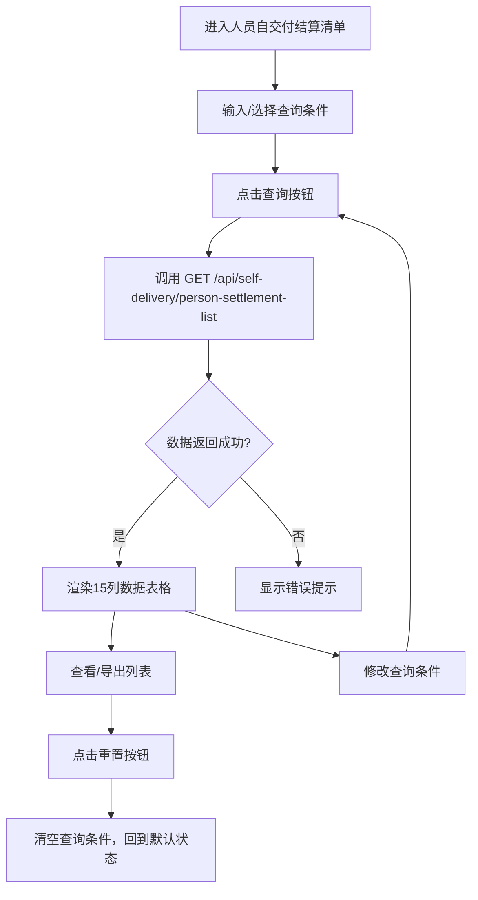

# 人员自交付结算清单 PRD

## 需求背景

### 痛点
- **问题现象**：自交付结算按人员维度查询缺失，业务人员无法快速知道"某员工在哪些项目中参与了多少结算"
- **发生频率**：高
- **当前 workaround**：人工汇总人员参与的结算单，效率低且易遗漏

### 业务目标
- **量化指标**：按人员维度查询响应 < 2s；支持按人员姓名/工号/部门/结算状态等多维度查询
- **目标期限**：2026-Q2 上线

### 涉及系统/模块
- **模块名称**：人员自交付结算清单（PersonSettlementList）
- **变更类型**：新增
- **对接接口**：`GET /api/self-delivery/person-settlement-list`

---

## 用户故事

### 故事1
- **角色**：业务人员
- **功能**：按人员姓名/工号查询该人员参与的所有结算单
- **收益**：快速了解某员工在所有项目中的结算情况
- **验收条件**：在结算人员输入框输入"张三"，点击查询，列表显示所有结算单名称/编码中包含张三的记录

### 故事2
- **角色**：业务人员
- **功能**：按结算状态过滤（审核中/审核通过/审核驳回/待发放/可发放/已发放）
- **收益**：快速定位某人员需要跟进的结算单
- **验收条件**：选择结算状态=待发放，列表仅显示该状态的结算单

### 故事3
- **角色**：业务人员
- **功能**：按申请时间范围筛选人员结算
- **收益**：查看某员工在某时间段的结算申请情况
- **验收条件**：设置时间范围，列表仅显示该范围内的结算单

### 故事4
- **角色**：业务人员
- **功能**：导出人员结算清单为Excel
- **收益**：便于人员级的结算汇总与汇报
- **验收条件**：点击导出按钮，下载Excel文件

---

## 需求清单

| 序号 | 需求描述 | 优先级 | 状态 | 负责人 | 截止日期 |
|------|----------|--------|------|--------|----------|
| 1 | 实现人员自交付结算清单页面 | P0 | DONE | | |
| 2 | 列表展示15列：序号/经营单元/支局/姓名/电话/工号/部门/结算单名称/结算单号/结算状态/结算金额/业务类型/合同编码/申请人/申请时间 | P0 | DONE | | |
| 3 | 电话字段显示脱敏手机号（138****1234） | P1 | DONE | | |
| 4 | 结算状态/业务类型字段以彩色标签展示 | P1 | DONE | | |
| 5 | 支持9个查询条件 | P0 | DONE | | |
| 6 | 支持导出 | P1 | TODO | | |

- **优先级**：P0（核心流程阻塞）/ P1（重要功能）/ P2（体验优化）/ P3（未来规划）
- **状态**：TODO / IN PROGRESS / DONE / BLOCKED

---

## 业务流程图

---

## 页面结构

### 路由信息
- **路由路径**：`/person-settlement-list`
- **页面标题**：人员自交付结算清单
- **访问权限**：登录

### 布局结构
- **布局类型**：单栏
- **区域-页面标题**：页面标题 + 副标题
- **区域-查询条件卡片**：11个查询条件
- **区域-操作栏**：记录数 + 导出按钮
- **区域-数据表格**：17列人员结算清单

---

## 功能描述

### 功能点1：人员自交付结算清单查询

#### 页面级
- **字段：功能入口** - 类型：文本；描述：左侧菜单"自交付结算管理 → 人员自交付结算清单"进入
- **字段：前置条件** - 类型：文本；描述：用户已登录
- **字段：后置影响** - 类型：字段列表；描述：查询后表格区域显示人员结算单

**查询条件字段**（11个）：
| 字段名 | 类型 | 必填 | 默认值 | 来源 | 校验规则 | 展示形式 | 交互约束 |
|--------|------|------|--------|------|----------|----------|----------|
| businessUnit（经营单元） | 文本 | 否 | - | 用户输入 | 模糊匹配 | 输入框 | 可编辑 |
| branch（支局） | 文本 | 否 | - | 用户输入 | 模糊匹配 | 输入框 | 可编辑 |
| payPerson（结算人员） | 文本 | 否 | - | 用户输入 | 模糊匹配 | 输入框 | 可编辑 |
| businessType（业务类型） | 枚举 | 否 | 全部 | 用户选择 | 非空 | 下拉选择（项目型/小微标品/三联单/全部） | 可编辑 |
| settlementStatus（结算状态） | 枚举 | 否 | 全部 | 用户选择 | 非空 | 下拉选择（审核中/审核通过/审核驳回/待发放/可发放/已发放/全部） | 可编辑 |
| businessCode（合同/小微工单/三联单编码） | 文本 | 否 | - | 用户输入 | 模糊匹配 | 输入框 | 可编辑 |
| applicant（申请人） | 文本 | 否 | - | 用户输入 | 模糊匹配 | 输入框 | 可编辑 |
| applyTimeStart（申请时间起） | 日期 | 否 | - | 用户选择 | <= 申请时间止 | 日期控件 | 可编辑 |
| applyTimeEnd（申请时间止） | 日期 | 否 | - | 用户选择 | >= 申请时间起 | 日期控件 | 可编辑 |
| isCycle（是否周期项目） | 枚举 | 否 | 全部 | 用户选择 | 非空 | 下拉选择（是/否/全部） | 可编辑 |
| paymentPeriod（发放账期） | 月份 | 否 | - | 用户选择 | YYYY-MM | 月份控件 | 可编辑 |

**操作按钮字段**：
| 字段名 | 类型 | 必填 | 默认值 | 来源 | 校验规则 | 展示形式 | 交互约束 |
|--------|------|------|--------|------|----------|----------|----------|
| 查询按钮 | 按钮 | 是 | - | 系统 | 非空 | 主按钮 | 可点击 |
| 重置按钮 | 按钮 | 是 | - | 系统 | 非空 | 次按钮 | 可点击 |
| 导出按钮 | 按钮 | 是 | - | 系统 | 非空 | 次按钮 | 可点击 |

**字段列表**（17列）：
| 字段名 | 类型 | 必填 | 默认值 | 来源 | 校验规则 | 展示形式 | 交互约束 |
|--------|------|------|--------|------|----------|----------|----------|
| index（序号） | 数字 | 是 | - | 系统 | 自动编号 | 居中 | 只读 |
| businessUnit（经营单元） | 文本 | 是 | - | 接口返回 | 非空 | 文本 | 只读 |
| branch（支局） | 文本 | 是 | - | 接口返回 | 非空 | 文本 | 只读 |
| personName（姓名） | 文本 | 是 | - | 接口返回 | 非空 | 文本加粗 | 只读 |
| phone（电话） | 文本 | 是 | - | 接口返回 | 脱敏 | 灰色脱敏手机号 | 只读 |
| empNo（工号） | 文本 | 是 | - | 接口返回 | 非空 | 文本 | 只读 |
| dept（部门） | 文本 | 是 | - | 接口返回 | 非空 | 文本 | 只读 |
| settlementName（结算单名称） | 文本 | 是 | - | 接口返回 | 非空 | 文本 | 只读 |
| settlementCode（结算单号） | 文本 | 是 | - | 接口返回 | 非空 | 文本 | 只读 |
| isCycle（是否周期项目） | 布尔 | 是 | - | 接口返回 | 是/否 | 居中文本 | 只读 |
| paymentPeriod（发放账期） | 月份 | 是 | - | 接口返回 | YYYY-MM | 居中 | 只读 |
| status（结算状态） | 枚举 | 是 | - | 接口返回 | 枚举值 | 状态徽章 | 只读 |
| settlementAmount（结算金额） | 金额 | 是 | - | 接口返回 | >=0 | 右对齐绿色 | 只读 |
| businessType（业务类型） | 枚举 | 是 | - | 接口返回 | 项目型/小微标品/三联单 | 彩色标签 | 只读 |
| businessCode（合同/小微工单/三联单编码） | 文本 | 是 | - | 接口返回 | 非空 | 文本 | 只读 |
| applicant（申请人） | 文本 | 是 | - | 接口返回 | 非空 | 文本 | 只读 |
| applyTime（申请时间） | 日期时间 | 是 | - | 接口返回 | 非空 | 居中 | 只读 |

---

## 数据流图

### 接口1：人员自交付结算清单查询
- **请求路径**：`GET /api/self-delivery/person-settlement-list`
- **请求方法**：GET
- **请求头**：Authorization
- **请求参数**：
  - `businessUnit` - 类型：字符串；必填：否；校验：模糊匹配
  - `branch` - 类型：字符串；必填：否；校验：模糊匹配
  - `payPerson` - 类型：字符串；必填：否；校验：模糊匹配
  - `businessType` - 类型：字符串；必填：否；校验：枚举值
  - `status` - 类型：字符串；必填：否；校验：枚举值
  - `businessCode` - 类型：字符串；必填：否；校验：模糊匹配
  - `applicant` - 类型：字符串；必填：否；校验：模糊匹配
  - `applyTimeStart` - 类型：字符串；必填：否；校验：YYYY-MM-DD
  - `applyTimeEnd` - 类型：字符串；必填：否；校验：YYYY-MM-DD
- **响应字段**：
  - `id` - 类型：数字；描述：记录ID
  - `businessUnit` - 类型：字符串；描述：经营单元
  - `branch` - 类型：字符串；描述：支局
  - `personName` - 类型：字符串；描述：人员姓名
  - `phone` - 类型：字符串；描述：脱敏电话
  - `empNo` - 类型：字符串；描述：工号
  - `dept` - 类型：字符串；描述：部门
  - `settlementName` - 类型：字符串；描述：结算单名称
  - `settlementCode` - 类型：字符串；描述：结算单号
  - `status` - 类型：字符串；描述：结算状态
  - `settlementAmount` - 类型：字符串；描述：结算金额
  - `businessType` - 类型：字符串；描述：业务类型
  - `businessCode` - 类型：字符串；描述：合同/小微工单/三联单编码
  - `applicant` - 类型：字符串；描述：申请人
  - `applyTime` - 类型：字符串；描述：申请时间
- **存储位置**：数据库表 `person_settlement_list`
- **错误码**：
  - `401` - `未授权，请重新登录`
  - `500` - `服务器异常，请稍后重试`

### 数据刷新点
- **刷新时机**：查询按钮点击后 / 重置按钮点击后
- **影响字段**：表格数据、记录数

---

## 验收标准

### 正常流程
- [ ] **操作**：进入页面，所有查询条件为空，表格显示全部数据 → **预期**：表格渲染15列数据
- [ ] **操作**：在"结算人员"输入"张三"，点击查询 → **预期**：表格仅显示姓名为张三的记录
- [ ] **操作**：选择"结算状态=待发放"，点击查询 → **预期**：表格仅显示待发放的记录
- [ ] **操作**：设置"申请时间起=2026-04-01"和"申请时间止=2026-04-30"，点击查询 → **预期**：表格仅显示4月记录
- [ ] **操作**：点击重置按钮 → **预期**：所有查询条件恢复默认
- [ ] **操作**：点击导出按钮 → **预期**：下载Excel文件

### 异常流程
- [ ] **操作**：查询接口返回 401 → **预期**：页面顶部显示"未授权，请重新登录"
- [ ] **操作**：查询接口返回 500 → **预期**：表格区域显示"服务器异常，请稍后重试"
- [ ] **操作**：网络断开时点击查询 → **预期**：显示"网络异常"提示

---

## 更新记录

### v2 - 2026-06-23
- 表格新增 2 列：是否周期项目（是/否）/ 发放账期（YYYY-MM）
- 位置：结算单号后、结算状态前
- 查询条件新增 2 个：是否周期项目下拉（全部/是/否）+ 发放账期月份控件
- 列表总列数 15 → 17；查询条件 9 → 11

### v1 - 2026-06-08
- 初始版本：基于 PersonSettlementList.tsx 源码生成，15列人员结算清单，支持9维度查询
