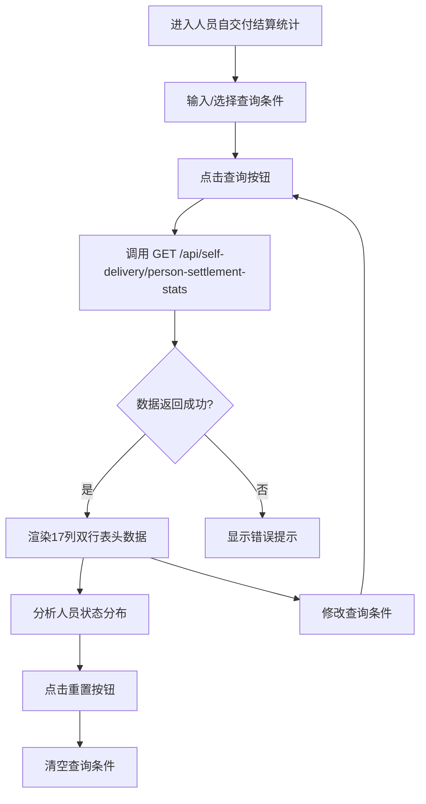

# 人员自交付结算统计 PRD

## 需求背景

### 痛点
- **问题现象**：人员级别的结算状态（审核中/审核通过/待发放/可发放/已发放）分散在多个模块，无法按人员维度统一统计各状态的单数和金额
- **发生频率**：中
- **当前 workaround**：人工逐个状态统计人员结算情况，效率低

### 业务目标
- **量化指标**：报表加载时间 < 3s；按人员展示5个状态的单数和金额矩阵
- **目标期限**：2026-Q2 上线

### 涉及系统/模块
- **模块名称**：人员自交付结算统计（PersonSettlementStats）
- **变更类型**：新增
- **对接接口**：`GET /api/self-delivery/person-settlement-stats`

---

## 用户故事

### 故事1
- **角色**：业务管理员
- **功能**：按人员姓名/工号查询该人员的5状态结算统计
- **收益**：了解每位员工在各状态的单数和金额
- **验收条件**：在结算人员输入框输入"张三"，点击查询，表格仅显示张三的5状态统计

### 故事2
- **角色**：业务管理员
- **功能**：按经营单元/支局过滤人员
- **收益**：快速对比同一支局内不同人员的结算情况
- **验收条件**：选择经营单元=杭州分公司，支局=西湖支局，表格仅显示西湖支局的人员

### 故事3
- **角色**：业务管理员
- **功能**：通过5状态矩阵识别异常人员
- **收益**：某人员"待发放"状态金额过高时，可主动跟进
- **验收条件**：表格中"待发放"金额>5万的行高亮显示

---

## 需求清单

| 序号 | 需求描述 | 优先级 | 状态 | 负责人 | 截止日期 |
|------|----------|--------|------|--------|----------|
| 1 | 实现人员自交付结算统计页面 | P0 | DONE | | |
| 2 | 列表展示7公共列+5状态×2列=17列（双行表头） | P0 | DONE | | |
| 3 | 5个状态用不同背景色：审核中=蓝/审核通过=绿/待发放=灰/可发放=橙/已发放=翠绿 | P1 | DONE | | |
| 4 | 支持3个查询条件 | P0 | DONE | | |

- **优先级**：P0（核心流程阻塞）/ P1（重要功能）/ P2（体验优化）/ P3（未来规划）
- **状态**：TODO / IN PROGRESS / DONE / BLOCKED

---

## 业务流程图

---

## 页面结构

### 路由信息
- **路由路径**：`/person-settlement-stats`
- **页面标题**：人员自交付结算统计
- **访问权限**：登录

### 布局结构
- **布局类型**：单栏
- **区域-页面标题**：页面标题 + 副标题
- **区域-查询条件卡片**：经营单元/支局/结算人员
- **区域-操作栏**：记录数 + 导出按钮
- **区域-数据表格**：17列人员状态统计

---

## 功能描述

### 功能点1：人员自交付结算统计

#### 页面级
- **字段：功能入口** - 类型：文本；描述：左侧菜单"自交付结算管理 → 人员自交付结算统计"进入
- **字段：前置条件** - 类型：文本；描述：用户已登录
- **字段：后置影响** - 类型：字段列表；描述：查询后表格区域显示人员状态矩阵

**查询条件字段**（3个）：
| 字段名 | 类型 | 必填 | 默认值 | 来源 | 校验规则 | 展示形式 | 交互约束 |
|--------|------|------|--------|------|----------|----------|----------|
| businessUnit（经营单元） | 文本 | 否 | - | 用户输入 | 模糊匹配 | 输入框 | 可编辑 |
| branch（支局） | 文本 | 否 | - | 用户输入 | 模糊匹配 | 输入框 | 可编辑 |
| payPerson（结算人员） | 文本 | 否 | - | 用户输入 | 模糊匹配 | 输入框 | 可编辑 |

**操作按钮字段**：
| 字段名 | 类型 | 必填 | 默认值 | 来源 | 校验规则 | 展示形式 | 交互约束 |
|--------|------|------|--------|------|----------|----------|----------|
| 查询按钮 | 按钮 | 是 | - | 系统 | 非空 | 主按钮 | 可点击 |
| 重置按钮 | 按钮 | 是 | - | 系统 | 非空 | 次按钮 | 可点击 |
| 导出按钮 | 按钮 | 是 | - | 系统 | 非空 | 次按钮 | 可点击 |

**字段列表**（17列，双行表头）：
- 第一行：左侧7列公共列 + 右侧5个状态组（各占2列：单数+金额）
- 第二行：左侧空（rowSpan=2） + 右侧5个状态的"单数"和"金额"列细分

公共列（7列）：
| 字段名 | 类型 | 必填 | 默认值 | 来源 | 校验规则 | 展示形式 | 交互约束 |
|--------|------|------|--------|------|----------|----------|----------|
| index（序号） | 数字 | 是 | - | 系统 | 自动编号 | 居中 | 只读 |
| businessUnit（经营单元） | 文本 | 是 | - | 接口返回 | 非空 | 文本 | 只读 |
| branch（支局） | 文本 | 是 | - | 接口返回 | 非空 | 文本 | 只读 |
| personName（姓名） | 文本 | 是 | - | 接口返回 | 非空 | 文本 | 只读 |
| phone（电话） | 文本 | 是 | - | 接口返回 | 脱敏 | 灰色脱敏手机号 | 只读 |
| empNo（工号） | 文本 | 是 | - | 接口返回 | 非空 | 文本 | 只读 |
| dept（部门） | 文本 | 是 | - | 接口返回 | 非空 | 文本 | 只读 |

5状态矩阵列（每状态2列：单数+金额）：
| 字段名 | 类型 | 必填 | 默认值 | 来源 | 校验规则 | 展示形式 | 交互约束 |
|--------|------|------|--------|------|----------|----------|----------|
| reviewCount（审核中单数） | 数字 | 是 | 0 | 接口返回 | >=0 | 居中数字（蓝底） | 只读 |
| reviewAmount（审核中金额） | 金额 | 是 | 0 | 接口返回 | >=0 | 右对齐金额（蓝底） | 只读 |
| approvedCount（审核通过单数） | 数字 | 是 | 0 | 接口返回 | >=0 | 居中数字（绿底） | 只读 |
| approvedAmount（审核通过金额） | 金额 | 是 | 0 | 接口返回 | >=0 | 右对齐金额（绿底） | 只读 |
| pendingCount（待发放单数） | 数字 | 是 | 0 | 接口返回 | >=0 | 居中数字（灰底） | 只读 |
| pendingAmount（待发放金额） | 金额 | 是 | 0 | 接口返回 | >=0 | 右对齐金额（灰底） | 只读 |
| availableCount（可发放单数） | 数字 | 是 | 0 | 接口返回 | >=0 | 居中数字（橙底） | 只读 |
| availableAmount（可发放金额） | 金额 | 是 | 0 | 接口返回 | >=0 | 右对齐金额（橙底） | 只读 |
| paidCount（已发放单数） | 数字 | 是 | 0 | 接口返回 | >=0 | 居中数字（翠绿底） | 只读 |
| paidAmount（已发放金额） | 金额 | 是 | 0 | 接口返回 | >=0 | 右对齐金额（翠绿底） | 只读 |

---

## 数据流图

### 接口1：人员自交付结算统计查询
- **请求路径**：`GET /api/self-delivery/person-settlement-stats`
- **请求方法**：GET
- **请求头**：Authorization
- **请求参数**：
  - `businessUnit` - 类型：字符串；必填：否；校验：模糊匹配
  - `branch` - 类型：字符串；必填：否；校验：模糊匹配
  - `payPerson` - 类型：字符串；必填：否；校验：模糊匹配
- **响应字段**：
  - `id` - 类型：字符串；描述：记录ID
  - `businessUnit` - 类型：字符串；描述：经营单元
  - `branch` - 类型：字符串；描述：支局
  - `personName` - 类型：字符串；描述：人员姓名
  - `phone` - 类型：字符串；描述：脱敏电话
  - `empNo` - 类型：字符串；描述：工号
  - `dept` - 类型：字符串；描述：部门
  - `reviewCount` - 类型：数字；描述：审核中单数
  - `reviewAmount` - 类型：字符串；描述：审核中金额
  - `approvedCount` - 类型：数字；描述：审核通过单数
  - `approvedAmount` - 类型：字符串；描述：审核通过金额
  - `pendingCount` - 类型：数字；描述：待发放单数
  - `pendingAmount` - 类型：字符串；描述：待发放金额
  - `availableCount` - 类型：数字；描述：可发放单数
  - `availableAmount` - 类型：字符串；描述：可发放金额
  - `paidCount` - 类型：数字；描述：已发放单数
  - `paidAmount` - 类型：字符串；描述：已发放金额
- **存储位置**：数据库表 `person_settlement_stats`
- **错误码**：
  - `401` - `未授权，请重新登录`
  - `500` - `服务器异常，请稍后重试`

### 数据刷新点
- **刷新时机**：查询按钮点击后 / 重置按钮点击后
- **影响字段**：表格数据、记录数

---

## 验收标准

### 正常流程
- [ ] **操作**：进入页面，所有查询条件为空，表格显示全部数据 → **预期**：表格渲染17列数据
- [ ] **操作**：在"结算人员"输入"张三"，点击查询 → **预期**：表格仅显示姓名为张三的记录
- [ ] **操作**：选择"经营单元=杭州分公司，支局=西湖支局"，点击查询 → **预期**：表格仅显示西湖支局的人员
- [ ] **操作**：点击重置按钮 → **预期**：所有查询条件恢复默认
- [ ] **操作**：点击导出按钮 → **预期**：下载Excel文件

### 异常流程
- [ ] **操作**：查询接口返回 401 → **预期**：页面顶部显示"未授权，请重新登录"
- [ ] **操作**：查询接口返回 500 → **预期**：表格区域显示"服务器异常，请稍后重试"
- [ ] **操作**：网络断开时点击查询 → **预期**：显示"网络异常"提示

---

## 更新记录

### v1 - 2026-06-08
- 初始版本：基于 PersonSettlementStats.tsx 源码生成
- 17列双行表头（7公共+5状态×2列）
- 5状态颜色编码：审核中=蓝、审核通过=绿、待发放=灰、可发放=橙、已发放=翠绿
