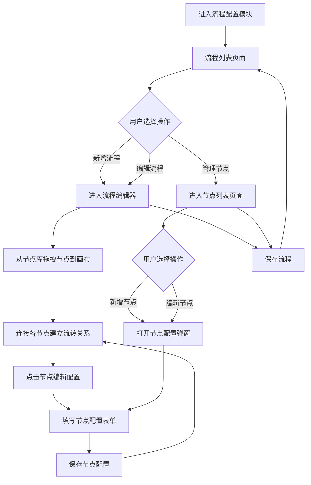

# ProcessConfig（流程配置）PRD

## 需求背景

### 痛点
- **问题现象**：不同区域、业务类型、产品对应的销售流程和管理节点存在差异，目前缺少可视化的流程配置工具，管理员无法灵活定义流程节点和流转规则。
- **发生频率**：中
- **当前 workaround**：通过代码硬编码流程逻辑，每次变更需开发人员介入。

### 业务目标
- **量化指标**：流程配置变更无需代码改动；节点配置时间从 3 人日降至 0.5 人日。
- **目标期限**：2026 Q2

### 涉及系统/模块
- **模块名称**：流程配置（ProcessConfig），包含流程列表（ProcessList）、流程编辑器（ProcessEditor）、节点列表（NodeList）、节点配置（NodeConfigEditor）
- **变更类型**：新增
- **对接接口**：流程 CRUD 接口、节点库 CRUD 接口

---

## 用户故事

### 故事1
- **角色**：系统管理员
- **功能**：通过流程列表查看所有已配置流程，支持新增、编辑、删除、启用/禁用流程。
- **收益**：集中管理所有业务流程配置。
- **验收条件**：流程列表显示所有流程；新增/编辑/删除操作生效。

### 故事2
- **角色**：系统管理员
- **功能**：通过拖拽节点库中的节点到画布上，配置流程拓扑结构，并连接各节点定义流转关系。
- **收益**：可视化地构建流程，无需编写代码。
- **验收条件**：节点可拖拽到画布；节点之间可连线；保存后拓扑结构持久化。

### 故事3
- **角色**：系统管理员
- **功能**：通过节点列表管理预定义的节点模板（节点库），支持新增、编辑、删除节点配置。
- **收益**：构建可复用的节点模板库，便于流程编辑器调用。
- **验收条件**：节点列表展示节点模板；新增/编辑节点可配置适用区域、业务类型、阶段、类型。

### 故事4
- **角色**：系统管理员
- **功能**：在流程编辑器中点击已放置的节点，编辑该节点的具体配置（阶段、类型、是否必须完成、是否提醒、适用角色、串行/并行）。
- **收益**：精细化配置每个节点的执行要求。
- **验收条件**：节点配置弹窗正确展示字段；保存后节点配置更新。

---

## 需求清单

| 序号 | 需求描述 | 优先级 | 状态 | 负责人 | 截止日期 |
|------|----------|--------|------|--------|----------|
| 1 | 流程列表页面（ProcessList）— 查询 + 列表 + 分页 | P0 | TODO | | |
| 2 | 新增/编辑流程（ProcessEditor）— 基本信息表单 + 节点库面板 + ReactFlow 画布 | P0 | TODO | | |
| 3 | 节点列表页面（NodeList）— 查询 + 列表 | P0 | TODO | | |
| 4 | 节点配置编辑器（NodeConfigEditor）— 配置弹窗表单 | P0 | TODO | | |
| 5 | 节点拖拽至画布（Drag & Drop） | P0 | TODO | | |
| 6 | 节点连线创建（ReactFlow Connection） | P0 | TODO | | |
| 7 | 节点配置弹窗（NodeEditor）— 阶段/类型/是否必须完成/是否提醒/角色/连接方式 | P0 | TODO | | |
| 8 | 流程启用/禁用状态切换 | P1 | TODO | | |
| 9 | 后端 CRUD 接口对接 | P1 | TODO | | |

- **优先级**：P0（核心流程阻塞）/ P1（重要功能）/ P2（体验优化）/ P3（未来规划）
- **状态**：TODO / IN PROGRESS / DONE / BLOCKED

---

## 业务流程图

---

## 页面结构

### 路由信息
- **路由路径**：`/process-config`（流程列表）、`/process-config/nodes`（节点列表）
- **页面标题**：流程配置 / 节点配置
- **访问权限**：登录（系统管理员角色）

### 布局结构（流程编辑器）
- **布局类型**：三栏
  - 左侧（w-64）：节点库面板（可展开树形列表）
  - 中间（flex-1）：ReactFlow 可视化画布
  - 顶部：基本信息表单（流程名称、适用区域、业务类型、适用产品）
  - 底部：操作按钮区（取消/保存）

### Tab 结构
- 流程编辑器内部：节点库 / 画布（无 Tab 级路由）

---

## 功能描述

### 功能点1：流程列表（ProcessList）

#### 页面级
- 查询字段：流程名称、适用区域、业务类型、适用产品
- 操作按钮：查询、重置、新增流程
- 列表字段：流程名称、适用区域、业务类型、适用产品、流程节点数、页面数量、创建时间、状态、操作（编辑/删除）
- 状态切换：支持启用/禁用

#### 字段列表
  | 字段名 | 类型 | 必填 | 默认值 | 来源 | 校验规则 | 展示形式 | 交互约束 |
  |--------|------|------|--------|------|----------|----------|----------|
  | 流程名称 | 文本 | | | 系统 | | | 左侧冻结 |
  | 适用区域 | 标签组 | | | 系统 | | 多标签 | |
  | 业务类型 | 标签组 | | | 系统 | | 多标签 | |
  | 适用产品 | 标签组 | | | 系统 | | 多标签 | |
  | 流程节点数 | 数字 | | | 系统 | | | |
  | 页面数量 | 数字 | | | 系统 | | | |
  | 创建时间 | 日期 | | | 系统 | | | |
  | 状态 | 标签 | | | 系统 | | 启用(绿)/禁用(灰) | 点击切换 |
  | 操作 | 操作组 | | | | | | 编辑+删除按钮 | 右侧冻结 |

---

### 功能点2：流程编辑器（ProcessEditor）

#### 页面级
- **字段：功能入口** - 类型：按钮；描述：流程列表点击"新增流程"或"编辑"
- **字段：前置条件** - 类型：文本；描述：进入编辑器前需选择或新建流程基本信息
- **字段：后置影响** - 类型：字段列表；描述：保存后更新流程列表

#### 基本信息表单
  | 字段名 | 类型 | 必填 | 默认值 | 来源 | 校验规则 | 展示形式 | 交互约束 |
  |--------|------|------|--------|------|----------|----------|----------|
  | 流程名称 | 文本 | 是 | 空 | 用户输入 | 不能为空 | 输入框 | |
  | 适用区域 | 多选 | 否 | 空 | 字典 | | 多选框 | |
  | 业务类型 | 多选 | 否 | 空 | 字典 | | 多选框 | |
  | 适用产品 | 多选 | 否 | 空 | 字典 | | 多选框 | |

#### 节点库面板（左侧）
- 模拟节点库数据（4个节点）：
  - 商机录入（售前/业务流，含2个子节点）
  - 合同解构（售中/业务流，含2个子节点）
  - 开票申请（售后/财务流）
  - 回款确认（售后/财务流）
- 支持展开/折叠子节点
- 节点支持拖拽至画布

#### ReactFlow 画布（中间）
- **功能**：
  - 拖拽节点到画布：从左侧节点库拖拽节点，放置到画布上
  - 连接节点：拖拽节点的下连接点到另一节点的上连接点，创建流程连线
  - 删除节点：点击节点上的删除图标移除节点
  - 编辑节点：点击节点打开节点配置弹窗
  - 展开/折叠子节点：点击节点上的箭头展开或折叠子节点列表

#### 弹窗级（节点配置）
- **弹窗：节点配置（NodeEditor）**
  - **触发入口**：点击画布中的节点
  - **关闭方式**：取消按钮 / 关闭图标
  - **字段列表**：
    | 字段名 | 类型 | 必填 | 默认值 | 来源 | 校验规则 | 展示形式 | 交互约束 |
    |--------|------|------|--------|------|----------|----------|----------|
    | 节点名称 | 文本 | | | 只读 | | 输入框 | 禁用 |
    | 阶段 | 下拉 | 是 | | 用户选择 | 不能为空 | 下拉选择 | 售前/售中/售后 |
    | 类型 | 下拉 | 是 | | 用户选择 | 不能为空 | 下拉选择 | 业务流/财务流 |
    | 连接方式 | 单选 | 否 | 串行 | 用户选择 | | 单选按钮 | 串行/并行 |
    | 是否必须完成 | 复选框 | 否 | false | 用户选择 | | 复选框 | |
    | 是否提醒 | 复选框 | 否 | false | 用户选择 | | 复选框 | |
    | 适用岗位角色 | 文本 | 否 | | 用户输入 | | 输入框 | 多角色用逗号分隔 |
  - **确定按钮**：保存节点配置，返回画布
  - **取消按钮**：关闭弹窗，不保存

---

### 功能点3：节点列表（NodeList）

#### 页面级
- 查询字段：节点名称、适用区域、业务类型、阶段
- 操作按钮：查询、重置、新增节点
- 列表字段：节点名称、节点编码、节点描述、页面数量、适用区域、业务类型、阶段、类型、状态、操作（编辑/删除）
- 状态切换：支持启用/禁用

#### 字段列表
  | 字段名 | 类型 | 必填 | 默认值 | 来源 | 校验规则 | 展示形式 | 交互约束 |
  |--------|------|------|--------|------|----------|----------|----------|
  | 节点名称 | 文本 | | | 系统 | | | | 左侧冻结 |
  | 节点编码 | 文本 | | | 系统 | | 等宽字体 | |
  | 节点描述 | 文本 | | | 系统 | | | |
  | 页面数量 | 数字 | | | 系统 | | | |
  | 适用区域 | 标签组 | | | 系统 | | 多标签 | |
  | 业务类型 | 标签组 | | | 系统 | | 多标签 | |
  | 阶段 | 标签组 | | | 系统 | | 标签 | |
  | 类型 | 标签组 | | | 系统 | | 标签 | |
  | 状态 | 标签 | | | 系统 | | 启用(绿)/禁用(灰) | |
  | 操作 | 操作组 | | | | | | 编辑+删除 | 右侧冻结 |

---

## 数据流图

### 接口1：流程列表查询
- **请求路径**：`GET /api/process/list`
- **请求方法**：GET
- **请求参数**：
  - `name` - 类型：字符串；必填：否；来源：查询表单
  - `region` - 类型：字符串；必填：否；来源：查询表单
  - `page` - 类型：数字；必填：是；来源：分页
- **响应字段**：
  - `data[]` - 类型：数组；描述：流程列表
  - `total` - 类型：数字；描述：总记录数

### 接口2：流程保存
- **请求路径**：`POST /api/process/save`
- **请求方法**：POST
- **请求体**：
  - `name` - 类型：字符串；必填：是；描述：流程名称
  - `regions[]` - 类型：数组；描述：适用区域
  - `businessTypes[]` - 类型：数组；描述：业务类型
  - `products[]` - 类型：数组；描述：适用产品
  - `nodes` - 类型：对象；描述：流程节点配置（ReactFlow nodes）
  - `edges` - 类型：对象；描述：流程连线配置（ReactFlow edges）

### 接口3：节点列表查询
- **请求路径**：`GET /api/process/nodes`
- **请求方法**：GET
- **响应字段**：
  - `data[]` - 类型：数组；描述：节点列表
  - `total` - 类型：数字；描述：总记录数

### 接口4：节点保存
- **请求路径**：`POST /api/process/node/save`
- **请求方法**：POST
- **请求体**：
  - `name` - 类型：字符串；必填：是
  - `code` - 类型：字符串；必填：是
  - `description` - 类型：字符串
  - `regions[]` - 类型：数组
  - `businessTypes[]` - 类型：数组
  - `stages[]` - 类型：数组
  - `types[]` - 类型：数组

### 数据刷新点
- **刷新时机**：保存后自动刷新列表
- **影响字段**：列表全部字段

---

## 验收标准

### 正常流程
- [ ] **操作**：进入流程列表，点击"新增流程" → **预期**：进入流程编辑器
- [ ] **操作**：在流程编辑器填写流程名称，拖拽节点到画布，连接节点，点击保存 → **预期**：返回列表，新流程显示
- [ ] **操作**：点击节点配置弹窗，选择阶段"售前"、类型"业务流"，点击确认 → **预期**：节点配置更新
- [ ] **操作**：点击节点删除图标 → **预期**：节点从画布移除
- [ ] **操作**：点击"启用/禁用"状态按钮 → **预期**：状态切换，按钮颜色变化

### 异常流程
- [ ] **操作**：不填写流程名称直接保存 → **预期**：表单校验提示"流程名称不能为空"
- [ ] **操作**：点击节点配置但未保存，切换到其他节点 → **预期**：弹出确认提示

---

## 更新记录

### v1 - 2026-05-09
- 初始版本
