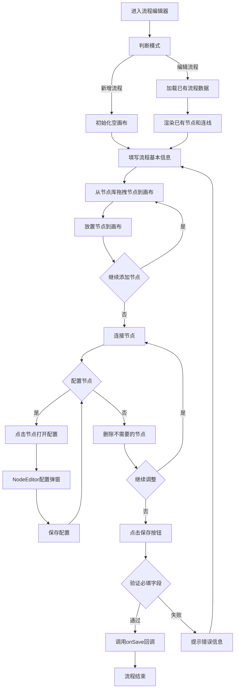

# 流程编辑器 PRD

## 需求背景

### 痛点
- **问题现象**：业务流程配置涉及多个阶段（售前/售中/售后）和类型（业务流/财务流），当前缺乏可视化的流程配置工具，无法直观地设计和调整流程
- **发生频率**：高
- **当前 workaround**：通过配置文件或数据库手动维护流程节点和连接关系，维护成本高且易出错

### 业务目标
- **量化指标**：流程配置时间缩短 60%，流程设计错误率降低 70%
- **目标期限**：2026-Q2

### 涉及系统/模块
- **模块名称**：流程编辑器
- **变更类型**：新增
- **对接接口**：NodeEditor（节点配置编辑器）

---

## 用户故事

### 故事1：流程管理员设计业务流程
- **角色**：流程管理员
- **功能**：通过拖拽方式将节点库中的节点拖到画布上，连接节点形成业务流程
- **收益**：可视化设计流程，无需编写代码即可完成流程配置
- **验收条件**：
  - 节点库支持分类展示（售前/售中/售后，业务流/财务流）
  - 支持拖拽节点到画布
  - 支持拖拽节点边缘创建连接线

### 故事2：流程管理员配置流程基本信息
- **角色**：流程管理员
- **功能**：填写流程名称、选择适用区域、业务类型、适用产品
- **收益**：实现流程的精细化管理，不同条件触发不同流程
- **验收条件**：
  - 流程名称为必填项
  - 适用区域、业务类型、适用产品支持多选

### 故事3：流程管理员配置节点属性
- **角色**：流程管理员
- **功能**：点击画布上的节点，打开节点配置弹窗，设置节点的详细属性
- **收益**：灵活配置每个节点的执行规则和责任人
- **验收条件**：
  - 点击节点打开 NodeEditor 组件
  - 配置完成后节点数据更新，画布刷新显示

### 故事4：流程管理员保存流程
- **角色**：流程管理员
- **功能**：完成流程设计后点击保存，将流程配置保存到系统
- **收益**：流程配置持久化，其他用户可以使用该流程
- **验收条件**：
  - 保存时验证必填字段
  - 保存成功后回调通知父组件

---

## 需求清单

| 序号 | 需求描述 | 优先级 | 状态 | 负责人 | 截止日期 |
|------|----------|--------|------|--------|----------|
| 1 | 实现流程基本信息表单（名称、区域、业务类型、产品） | P0 | TODO | | |
| 2 | 实现节点库面板（可折叠分类节点列表） | P0 | TODO | | |
| 3 | 实现画布区域（ReactFlow 拖拽、缩放、连接） | P0 | TODO | | |
| 4 | 实现自定义节点渲染（显示节点图标、名称、阶段、类型） | P0 | TODO | | |
| 5 | 实现节点展开/收起功能（显示子节点） | P1 | TODO | | |
| 6 | 实现节点删除功能 | P0 | TODO | | |
| 7 | 实现节点配置功能（调用 NodeEditor） | P0 | TODO | | |
| 8 | 实现流程保存功能 | P0 | TODO | | |
| 9 | 实现流程取消功能 | P0 | TODO | | |

- **优先级**：P0（核心流程阻塞）/ P1（重要功能）/ P2（体验优化）/ P3（未来规划）
- **状态**：TODO / IN PROGRESS / DONE / BLOCKED

---

## 业务流程图

---

## 页面结构

### 路由信息
- **路由路径** - 类型：文本；描述：弹窗/全屏组件，由父组件调用，无独立路由
- **页面标题** - 类型：文本；示例：`编辑流程` / `新增流程`
- **访问权限** - 类型：枚举（公开/登录/角色）；描述：登录用户（流程管理员）

### 布局结构
- **布局类型** - 类型：枚举（单栏/双栏/三栏）；描述：垂直三段式布局（Header + 内容 + Footer）
- **区域-顶部栏** - 字段列表；描述：标题 + 关闭按钮
- **区域-基本信息栏** - 字段列表；描述：流程名称 + 适用区域 + 业务类型 + 适用产品
- **区域-左侧栏（节点库）** - 字段列表；描述：节点分类列表，支持折叠展开
- **区域-主内容（画布）** - 字段列表；描述：ReactFlow 画布 + 操作提示
- **区域-底部栏** - 字段列表；描述：取消 + 保存按钮

---

## 功能描述

### 功能点1：基本信息表单

#### 页面级
- **字段：功能入口** - 类型：文本；描述：页面顶部基本信息区域
- **字段：前置条件** - 类型：文本；描述：用户进入流程编辑器
- **字段：后置影响** - 类型：字段列表；描述：表单数据影响流程的匹配和执行

#### 字段列表
| 字段名 | 类型 | 必填 | 默认值 | 来源 | 校验规则 | 展示形式 | 交互约束 |
|--------|------|------|--------|------|----------|----------|----------|
| 流程名称 | 文本 | 是 | 空 | 用户输入 | 非空，最大长度100 | 输入框 | 可编辑 |
| 适用区域（多选） | 文本 | 否 | 空 | 用户输入 | - | 输入框 | 可编辑，占位符提示 |
| 业务类型（多选） | 文本 | 否 | 空 | 用户输入 | - | 输入框 | 可编辑，占位符提示 |
| 适用产品（多选） | 文本 | 否 | 空 | 用户输入 | - | 输入框 | 可编辑，占位符提示 |

### 功能点2：节点库面板

#### 页面级
- **字段：功能入口** - 类型：文本；描述：页面左侧节点库区域
- **字段：前置条件** - 类型：文本；描述：用户需要添加节点到画布
- **字段：后置影响** - 类型：字段列表；描述：拖拽节点到画布后，画布显示对应节点

#### 字段列表
| 字段名 | 类型 | 必填 | 默认值 | 来源 | 校验规则 | 展示形式 | 交互约束 |
|--------|------|------|--------|------|----------|----------|----------|
| 节点库标题 | 文本 | - | 流程节点库 | - | - | 文字 | 只读 |
| 节点-商机录入 | 节点项 | - | - | 模拟数据 | - | 可拖拽卡片 | 拖拽到画布添加节点 |
| 节点-合同解构 | 节点项 | - | - | 模拟数据 | - | 可拖拽卡片 | 拖拽到画布添加节点 |
| 节点-开票申请 | 节点项 | - | - | 模拟数据 | - | 可拖拽卡片 | 拖拽到画布添加节点 |
| 节点-回款确认 | 节点项 | - | - | 模拟数据 | - | 可拖拽卡片 | 拖拽到画布添加节点 |
| 子节点-商机基本信息 | 子节点项 | - | - | 模拟数据 | - | 可拖拽小卡片 | 商机录入展开后显示 |
| 子节点-客户信息 | 子节点项 | - | - | 模拟数据 | - | 可拖拽小卡片 | 商机录入展开后显示 |
| 子节点-合同明细 | 子节点项 | - | - | 模拟数据 | - | 可拖拽小卡片 | 合同解构展开后显示 |
| 子节点-科目分配 | 子节点项 | - | - | 模拟数据 | - | 可拖拽小卡片 | 合同解构展开后显示 |
| 展开/收起按钮 | 图标按钮 | - | 收起 | 用户点击 | - | 展开/收起图标 | 切换子节点显示 |

### 功能点3：画布区域（ReactFlow）

#### 页面级
- **字段：功能入口** - 类型：文本；描述：页面右侧主画布区域
- **字段：前置条件** - 类型：文本；描述：节点库中有可拖拽的节点
- **字段：后置影响** - 类型：字段列表；描述：画布上的节点和连线数据构成完整的流程配置

#### 字段列表
| 字段名 | 类型 | 必填 | 默认值 | 来源 | 校验规则 | 展示形式 | 交互约束 |
|--------|------|------|--------|------|----------|----------|----------|
| 操作提示 | 文本 | - | - | - | - | 浮动提示卡片 | 显示拖拽说明 |
| 节点-图标 | 装饰 | - | - | 根据类型选择 | - | 彩色图标 | 根据节点类型显示 |
| 节点-名称 | 文本 | - | - | 节点数据 | - | 文字 | 只读 |
| 节点-阶段 | 文本 | - | - | 节点数据 | - | 小标签 | 只读 |
| 节点-类型 | 文本 | - | - | 节点数据 | - | 小标签 | 只读 |
| 节点-展开按钮 | 图标按钮 | - | 收起 | 用户点击 | - | 展开/收起图标 | 有子节点时显示 |
| 节点-删除按钮 | 图标按钮 | - | - | 用户点击 | - | 垃圾桶图标 | 点击删除节点 |
| 连接线 | 装饰 | - | - | 用户拖拽 | - | 带箭头的曲线 | 连接两个节点 |
| 缩放控件 | 控件 | - | - | - | - | 缩放按钮组 | 控制画布缩放 |
| 背景网格 | 装饰 | - | - | - | - | 网格背景 | 提供视觉参考 |

### 功能点4：自定义节点（CustomNode）

#### 页面级
- **字段：功能入口** - 类型：文本；描述：画布上渲染的可视化节点
- **字段：前置条件** - 类型：文本；描述：节点已从节点库拖拽到画布
- **字段：后置影响** - 类型：字段列表；描述：点击节点打开 NodeEditor 进行配置

#### 字段列表
| 字段名 | 类型 | 必填 | 默认值 | 来源 | 校验规则 | 展示形式 | 交互约束 |
|--------|------|------|--------|------|----------|----------|----------|
| 节点主体 | 容器 | - | - | 节点数据 | - | 白色卡片+蓝色边框 | 包含头部和内容 |
| 节点图标 | 图标 | - | Package | 节点数据.icon | - | 蓝色图标 | 根据节点类型显示 |
| 节点名称 | 文本 | - | - | 节点数据.label | - | 加粗文字 | 只读 |
| 节点阶段 | 文本 | - | 未设置 | 节点数据.stage | - | 小标签灰色文字 | 只读 |
| 节点类型 | 文本 | - | 未设置 | 节点数据.type | - | 小标签灰色文字 | 只读 |
| 展开/收起图标 | 图标按钮 | - | ChevronRight | 用户点击 | - | 展开/收起图标 | 有子节点时显示 |
| 删除图标 | 图标按钮 | - | - | 用户点击 | - | 红色垃圾桶 | 点击删除节点 |
| 子节点列表 | 列表 | - | 空 | 节点数据.children | - | 灰色背景区域 | 展开后显示 |
| 子节点项 | 文本 | - | - | 子节点数据 | - | 小卡片 | 显示子节点名称 |
| 连接点-顶部 | 连接点 | - | - | 系统 | - | 圆点 | 作为连线的起点 |
| 连接点-底部 | 连接点 | - | - | 系统 | - | 圆点 | 作为连线的终点 |

### 功能点5：底部按钮

#### 页面级
- **字段：功能入口** - 类型：文本；描述：页面底部的操作按钮区域
- **字段：前置条件** - 类型：文本；描述：流程配置已完成
- **字段：后置影响** - 类型：字段列表；描述：保存后流程数据持久化，取消后返回父页面

#### 字段列表
| 字段名 | 类型 | 必填 | 默认值 | 来源 | 校验规则 | 展示形式 | 交互约束 |
|--------|------|------|--------|------|----------|----------|----------|
| 取消 | 按钮 | - | - | - | - | 次要按钮 | 点击调用onCancel回调 |
| 保存 | 按钮 | - | - | - | - | 主操作按钮，蓝色 | 点击验证并调用onSave回调 |

---

## 数据流图

### 接口1：获取流程详情
- **请求路径** - 类型：文本；示例：`GET /api/process/{id}`
- **请求方法** - 类型：枚举；必填：是
- **请求头** - 字段列表；描述：Authorization: Bearer {token}
- **请求参数** - 字段列表：
  - `id` - 类型：字符串；必填：是；来源：流程ID；校验：非空
- **响应字段** - 字段列表：
  - `id` - 类型：字符串；描述：流程ID
  - `name` - 类型：字符串；描述：流程名称
  - `regions` - 类型：数组；描述：适用区域列表
  - `businessTypes` - 类型：数组；描述：业务类型列表
  - `products` - 类型：数组；描述：适用产品列表
  - `nodes` - 类型：数组；描述：节点列表
  - `edges` - 类型：数组；描述：连线列表
- **存储位置** - 类型：文本；示例：`数据库表 process_config`
- **错误码** - 字段列表：
  - `404` - `流程不存在`
  - `500` - `服务器异常`

### 接口2：保存流程配置
- **请求路径** - 类型：文本；示例：`POST /api/process/save`
- **请求方法** - 类型：枚举；必填：是
- **请求头** - 字段列表；描述：Authorization: Bearer {token}
- **请求参数** - 字段列表：
  - `name` - 类型：字符串；必填：是；来源：表单输入；校验：非空，最大长度100
  - `regions` - 类型：数组；必填：否；来源：表单选择；校验：-
  - `businessTypes` - 类型：数组；必填：否；来源：表单选择；校验：-
  - `products` - 类型：数组；必填：否；来源：表单选择；校验：-
  - `nodes` - 类型：数组；必填：是；来源：画布节点数据；校验：至少包含一个节点
  - `edges` - 类型：数组；必填：是；来源：画布连线数据；校验：-
- **响应字段** - 字段列表：
  - `success` - 类型：布尔；描述：是否保存成功
  - `message` - 类型：字符串；描述：操作结果信息
  - `processId` - 类型：字符串；描述：新创建的流程ID或更新的流程ID
- **存储位置** - 类型：文本；示例：`数据库表 process_config`
- **错误码** - 字段列表：
  - `400` - `参数校验失败：流程名称不能为空`
  - `401` - `用户未登录或登录已过期`
  - `403` - `无保存权限`
  - `409` - `流程名称已存在`
  - `500` - `服务器异常`

### 接口3：获取节点库数据
- **请求路径** - 类型：文本；示例：`GET /api/node-library`
- **请求方法** - 类型：枚举；必填：是
- **请求头** - 字段列表；描述：Authorization: Bearer {token}
- **请求参数** - 字段列表：空
- **响应字段** - 字段列表：
  - `id` - 类型：字符串；描述：节点ID
  - `name` - 类型：字符串；描述：节点名称
  - `code` - 类型：字符串；描述：节点编码
  - `stage` - 类型：字符串；描述：阶段（售前/售中/售后）
  - `type` - 类型：字符串；描述：类型（业务流/财务流）
  - `icon` - 类型：字符串；描述：图标名称
  - `children` - 类型：数组；描述：子节点列表
- **存储位置** - 类型：文本；示例：`数据库表 node_library`
- **错误码** - 字段列表：
  - `401` - `用户未登录或登录已过期`
  - `500` - `服务器异常`

### 数据刷新点
- **刷新时机** - 类型：枚举（页面加载/保存成功后/节点配置保存后）
- **影响字段** - 字段列表；描述：基本信息表单、节点库、画布节点

---

## 验收标准

### 正常流程
- [ ] **操作**：进入流程编辑器（新增模式） → **预期**：标题显示"新增流程"，基本信息表单为空，画布为空
- [ ] **操作**：进入流程编辑器（编辑模式） → **预期**：标题显示"编辑流程"，基本信息表单和画布显示已有数据
- [ ] **操作**：填写流程名称"商机跟进流程" → **预期**：表单显示输入内容
- [ ] **操作**：从节点库拖拽"商机录入"到画布 → **预期**：画布上显示商机录入节点
- [ ] **操作**：从节点库拖拽"合同解构"到画布 → **预期**：画布上显示合同解构节点
- [ ] **操作**：拖拽商机录入节点底部连接到合同解构节点顶部 → **预期**：两节点之间显示带箭头的连线
- [ ] **操作**：点击画布上的节点 → **预期**：NodeEditor 弹窗打开，显示节点配置表单
- [ ] **操作**：在 NodeEditor 中配置阶段为"售前"，类型为"业务流"，点击确认 → **预期**：弹窗关闭，画布上节点标签更新
- [ ] **操作**：点击节点上的删除按钮 → **预期**：节点从画布上移除
- [ ] **操作**：点击"保存"按钮 → **预期**：验证通过后调用 onSave 回调，传递完整流程数据

### 异常流程
- [ ] **操作**：不填写流程名称直接点击保存 → **预期**：提示"流程名称不能为空"
- [ ] **操作**：画布上没有任何节点时点击保存 → **预期**：提示"请至少添加一个节点"
- [ ] **操作**：点击"取消"按钮 → **预期**：调用 onCancel 回调，不保存任何数据
- [ ] **操作**：点击关闭图标 → **预期**：调用 onCancel 回调，不保存任何数据
- [ ] **操作**：拖拽节点到画布外区域 → **预期**：节点不放置，保持在节点库中

---

## 更新记录

### v1 - 2026-05-09
- 初始版本
