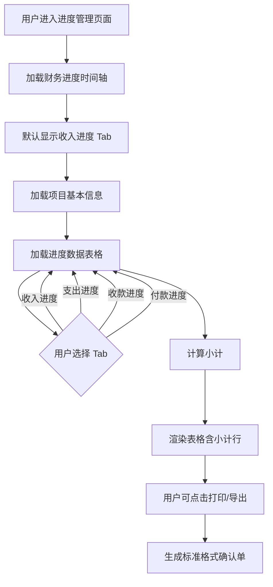

# ProgressManagement（进度管理）PRD

## 需求背景

### 痛点
- **问题现象**：项目经理需要跟踪收入、支出、收款、付款的确认进度，当前缺少统一的进度管理页面，财务进度信息分散在多个业务系统。
- **发生频率**：高
- **当前 workaround**：通过财务系统导出数据后线下加工。

### 业务目标
- **量化指标**：覆盖 100% 签约项目的财务进度跟踪；进度数据 T+1 更新。
- **目标期限**：2026 Q2

### 涉及系统/模块
- **模块名称**：进度管理（ProgressManagement）
- **变更类型**：新增
- **对接接口**：财务进度数据接口

---

## 用户故事

### 故事1
- **角色**：项目经理 / 财务人员
- **功能**：通过 Tab 页切换查看收入进度、支出进度、收款进度、付款进度四个视图，查看每个科目的前期已确认、本期确认、累计确认金额和进度。
- **收益**：集中获取项目财务进度全貌，无需切换多个系统。
- **验收条件**：Tab 切换正常；数据按类型（收入/支出/收款/付款）分组展示；进度计算公式正确。

### 故事2
- **角色**：项目经理 / 财务人员
- **功能**：查看项目的会计期、ICT项目信息、合同信息汇总。
- **收益**：快速了解项目基本信息上下文。
- **验收条件**：汇总信息与合同信息一致。

### 故事3
- **角色**：财务人员
- **功能**：导出进度确认单据（含甲乙方签字栏）。
- **收益**：支持线下签署和归档。
- **验收条件**：打印格式符合财务规范。

---

## 需求清单

| 序号 | 需求描述 | 优先级 | 状态 | 负责人 | 截止日期 |
|------|----------|--------|------|--------|----------|
| 1 | 财务进度时间轴（FinancialProgressTimeline 组件） | P0 | TODO | | |
| 2 | 四个 Tab：收入进度/支出进度/收款进度/付款进度 | P0 | TODO | | |
| 3 | 财务进度表格（16列，含前期/本期/累计确认字段） | P0 | TODO | | |
| 4 | 项目信息汇总区（会计期、ICT项目、合同信息） | P1 | TODO | | |
| 5 | 小计行（汇总各列金额） | P1 | TODO | | |
| 6 | 签字区（甲乙方单位签字人/盖章/日期） | P2 | TODO | | |
| 7 | 后端接口对接 | P1 | TODO | | |

- **优先级**：P0（核心流程阻塞）/ P1（重要功能）/ P2（体验优化）/ P3（未来规划）
- **状态**：TODO / IN PROGRESS / DONE / BLOCKED

---

## 业务流程图

---

## 页面结构

### 路由信息
- **路由路径**：`/progress`
- **页面标题**：进度管理
- **访问权限**：登录（项目经理/财务人员角色）

### 布局结构
- **布局类型**：单栏
- **区域-主内容**：财务进度时间轴 + Tab 切换区 + 汇总信息 + 进度表格 + 签字区

### Tab 结构
- **Tab名称**：收入进度 / 支出进度 / 收款进度 / 付款进度
- **Tab路由**：无子路由，纯前端 Tab 切换
- **加载方式**：懒加载（切换时加载）
- **默认激活**：收入进度

---

## 功能描述

### 功能点1：财务进度时间轴（FinancialProgressTimeline）

#### 页面级
- **字段：功能入口** - 类型：文本；描述：页面顶部固定展示
- **字段：前置条件** - 类型：文本；描述：已加载项目基本信息
- **字段：后置影响** - 类型：字段列表；描述：无

#### Tab 级
- 时间轴展示项目全生命周期节点（线索→商机→合同签订→实施→验收→开票→结算→归档）
- 当前节点高亮

---

### 功能点2：进度数据表格（4个 Tab 共享结构）

#### 页面级
- 表格字段（16列）：
  | 字段名 | 类型 | 必填 | 默认值 | 来源 | 校验规则 | 展示形式 | 交互约束 |
  |--------|------|------|--------|------|----------|----------|----------|
  | 序号 | 数字 | | | 系统 | | | |
  | 类型 | 文本 | | | 系统 | | | 收入/支出/收款/付款 |
  | 合同编码 | 文本 | | | 系统 | | | |
  | 科目 | 文本 | | | 系统 | | | |
  | A.金额（含税） | 金额 | | | 系统 | | ¥元 | 右对齐，含千分位 |
  | B.增值税税率(%) | 数字 | | | 系统 | | % | |
  | C.金额（不含税） | 金额 | | | 计算 | | ¥元 | C=A/(1+B) |
  | D.前期已确认进度(%) | 数字 | | | 系统 | | % | |
  | E.前期已确认金额（含税） | 金额 | | | 系统 | | ¥元 | E=A*D |
  | F.前期已确认金额（不含税） | 金额 | | | 计算 | | ¥元 | F=C*D |
  | G.本期确认进度(%) | 数字 | | | 系统 | 高亮列 | % | 黄色背景 |
  | H.本期确认金额（含税） | 金额 | | | 系统 | 高亮列 | ¥元 | H=A*G，黄色背景 |
  | I.本期确认金额（不含税） | 金额 | | | 系统 | 高亮列 | ¥元 | I=C*G，黄色背景 |
  | J.累计确认进度(%) | 数字 | | | 计算 | | % | J=D+G |
  | K.累计确认金额（含税） | 金额 | | | 计算 | | ¥元 | K=E+H |
  | L.累计确认金额（不含税） | 金额 | | | 计算 | | ¥元 | L=F+I |

- 小计行：汇总 A-L 各列合计值
- 斑马纹：奇偶行交替白色/#fafafa

---

## 数据流图

### 接口1：进度数据查询
- **请求路径**：`GET /api/progress/:ictProjectId`
- **请求方法**：GET
- **请求头**：Authorization
- **请求参数**：
  - `ictProjectId` - 类型：字符串；必填：是；来源：URL 参数
  - `type` - 类型：字符串；必填：是；来源：Tab 类型；校验：income/expense/receipt/payment
- **响应字段**：
  - `projectInfo` - 类型：对象；描述：ICT项目信息
  - `contractInfo` - 类型：对象；描述：合同信息
  - `data[]` - 类型：数组；描述：进度数据行
- **存储位置**：数据库表
- **错误码**：
  - `404` - 项目不存在
  - `500` - 服务器异常

### 数据刷新点
- **刷新时机**：Tab 切换 / 页面加载
- **影响字段**：表格数据、类型标签

---

## 验收标准

### 正常流程
- [ ] **操作**：点击"收入进度" Tab → **预期**：显示收入类型进度数据
- [ ] **操作**：点击"支出进度" Tab → **预期**：显示支出类型进度数据
- [ ] **操作**：查看表格数据 → **预期**：公式列（C/E/F/J/K/L）计算正确
- [ ] **操作**：查看黄色高亮列（G/H/I） → **预期**：本期确认数据高亮显示

### 异常流程
- [ ] **操作**：接口返回空数据 → **预期**：显示"暂无数据"
- [ ] **操作**：无权限访问某项目 → **预期**：显示 403 错误

---

## 更新记录

### v1 - 2026-05-09
- 初始版本
