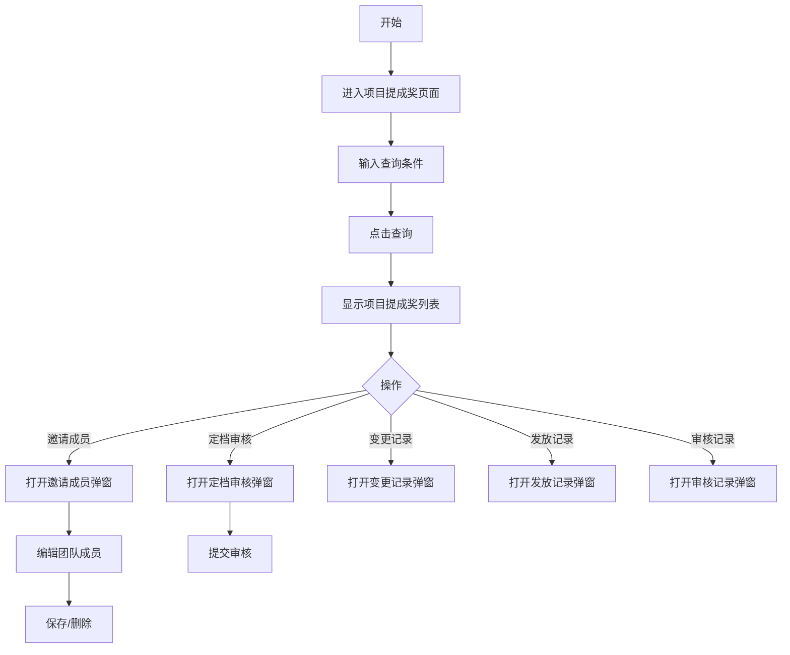

## 需求背景

### 痛点
- **问题现象**：项目提成奖需要复杂的成员管理和发放流程，当前无统一管理入口
- **发生频率**：高 - 每月有大量项目需要管理提成奖
- **当前 workaround**：通过线下流程或分散的系统处理

### 业务目标
- **量化指标**：提供统一的提成奖管理入口，支持成员管理、审核、发放等全流程
- **目标期限**：2026年6月

### 涉及系统/模块
- **模块名称**：宁波产数钱包-项目提成奖
- **变更类型**：新增

---

## 用户故事

### 故事1：管理人员
- **角色**：区县分公司管理人员
- **功能**：查询、分配项目提成奖，管理团队成员，审核发放
- **收益**：快速处理提成奖分配，提升工作效率
- **验收条件**：可按多种条件筛选，支持多种操作入口

---

## 需求清单

| 序号 | 需求描述 | 优先级 | 状态 | 负责人 | 截止日期 |
|------|----------|--------|------|--------|----------|
| 1 | 实现查询条件（10个字段） | P0 | DONE | | |
| 2 | 实现数据表格展示（19列） | P0 | DONE | | |
| 3 | 邀请成员弹窗 | P0 | DONE | | |
| 4 | 定档审核弹窗 | P0 | DONE | | |
| 5 | 变更记录弹窗（含详情） | P0 | DONE | | |
| 6 | 发放记录弹窗 | P0 | DONE | | |
| 7 | 审核记录弹窗 | P0 | DONE | | |

---

## 业务流程图

---

## 页面结构

### 路由信息
- **路由路径** - `/宁波产数钱包/项目提成奖`
- **页面标题** - 项目提成奖
- **访问权限** - 登录用户

### 布局结构
- **布局类型** - 单栏
- **区域-标题区** - 页面标题"项目提成奖"，副标题"查询和分配项目提成奖，管理团队成员"
- **区域-查询区** - 查询条件卡片（5列布局）
- **区域-主内容** - 数据表格，含操作列（5个操作按钮）

---

## 功能描述

### 功能点1：项目提成奖查询

#### 查询条件字段（5列布局）：
| 字段名 | 类型 | 必填 | 默认值 | 来源 | 校验规则 | 展示形式 | 交互约束 |
|--------|------|------|--------|------|----------|----------|----------|
| 商机名称 | 文本 | 否 | 空 | 用户输入 | - | 输入框 | 可编辑 |
| 商机编码 | 文本 | 否 | 空 | 用户输入 | - | 输入框 | 可编辑 |
| 项目名称 | 文本 | 否 | 空 | 用户输入 | - | 输入框 | 可编辑 |
| 项目编码 | 文本 | 否 | 空 | 用户输入 | - | 输入框 | 可编辑 |
| 区县 | 枚举 | 否 | 空 | 用户选择 | - | 下拉选择 | 可编辑 |
| 支局 | 枚举 | 否 | 空 | 用户选择 | - | 下拉选择 | 可编辑 |
| 第一责任人 | 文本 | 否 | 空 | 用户输入 | - | 输入框 | 可编辑 |
| 成员审核状态 | 枚举 | 否 | 空 | 用户选择 | - | 下拉选择 | 可编辑 |
| 收款状态 | 枚举 | 否 | 空 | 用户选择 | - | 下拉选择 | 可编辑 |
| 签报状态 | 枚举 | 否 | 空 | 用户选择 | - | 下拉选择 | 可编辑 |

#### 操作按钮字段：
| 字段名 | 类型 | 必填 | 默认值 | 来源 | 校验规则 | 展示形式 | 交互约束 |
|--------|------|------|--------|------|----------|----------|----------|
| 查询 | 按钮 | 是 | - | - | - | primary按钮 | 可编辑 |
  | 导出 | 按钮 | 否 | - | - | - | outline按钮 | 点击输出导出日志 |
| 重置 | 按钮 | 是 | - | - | - | outline按钮 | 可编辑 |

#### 字段列表（19列）：
| 字段名 | 类型 | 必填 | 默认值 | 来源 | 校验规则 | 展示形式 | 交互约束 |
|--------|------|------|--------|------|----------|----------|----------|
| 商机名称 | 文本 | 是 | - | 接口 | - | 文字(最大宽度截断) | 只读 |
| 商机编码 | 文本 | 是 | - | 接口 | - | 蓝色文字 | 只读 |
| 项目名称 | 文本 | 是 | - | 接口 | - | 文字(最大宽度截断) | 只读 |
| 项目编码 | 文本 | 是 | - | 接口 | - | 蓝色文字 | 只读 |
| 合同金额(万元) | 数字 | 是 | - | 接口 | - | 蓝色数字 | 只读 |
| ICT金额(万元) | 数字 | 是 | - | 接口 | - | 蓝色数字 | 只读 |
| 收款金额(万元) | 数字 | 是 | - | 接口 | - | 蓝色数字 | 只读 |
| 项目类型 | 文本 | 是 | - | 接口 | - | 文字 | 只读 |
| 预算毛利 | 文本 | 是 | - | 接口 | - | 文字 | 只读 |
| 结算毛利 | 文本 | 是 | - | 接口 | - | 文字 | 只读 |
| 总奖励(元) | 数字 | 是 | - | 接口 | - | 蓝色数字 | 只读 |
| 已发放(元) | 数字 | 是 | - | 接口 | - | 蓝色数字 | 只读 |
| 第一责任人 | 文本 | 是 | - | 接口 | - | 文字 | 只读 |
| 团队成员 | 文本 | 是 | - | 接口 | - | 文字 | 只读 |
| 区县 | 文本 | 是 | - | 接口 | - | 文字 | 只读 |
| 支局 | 文本 | 是 | - | 接口 | - | 文字 | 只读 |
| 收款状态 | 文本 | 是 | - | 接口 | - | 标签(已收款-绿色/部分收款-黄色/未收款-灰色) | 只读 |
| 签报状态 | 文本 | 是 | - | 接口 | - | 标签(已签报-绿色/待签报-黄色) | 只读 |
| 操作 | 操作 | 是 | - | - | - | 5个蓝色链接按钮 | 可编辑 |

#### 操作按钮字段（表格操作列）：
| 字段名 | 类型 | 必填 | 默认值 | 来源 | 校验规则 | 展示形式 | 交互约束 |
|--------|------|------|--------|------|----------|----------|----------|
| 邀请成员 | 链接 | 是 | - | - | - | 蓝色链接，可换行 | 可编辑 |
| 定档审核 | 链接 | 是 | - | - | - | 蓝色链接，可换行 | 可编辑 |
| 变更记录 | 链接 | 是 | - | - | - | 蓝色链接，可换行 | 可编辑 |
| 发放记录 | 链接 | 是 | - | - | - | 蓝色链接，可换行 | 可编辑 |
| 审核记录 | 链接 | 是 | - | - | - | 蓝色链接，可换行 | 可编辑 |

### 功能点2：邀请成员弹窗

#### 弹窗级
- **弹窗：邀请成员**
  - **触发入口**：点击"邀请成员"链接
  - **关闭方式**：关闭按钮
  - **弹窗尺寸**：max-w-5xl，max-h-[85vh]
  - **内容**：
    - 标题显示项目名称
    - 成员列表表格（可横向滚动）
    - 添加成员按钮
  - **字段列表（成员表格）**：
    | 字段名 | 类型 | 必填 | 默认值 | 来源 | 校验规则 | 展示形式 | 交互约束 |
    |--------|------|------|--------|------|----------|----------|----------|
    | 团队 | 枚举 | 是 | 4-售前销售团队 | 用户选择 | - | 下拉选择(4/3/2/1团队) | 可编辑 |
    | 姓名 | 文本 | 是 | 空 | 用户输入/人员选择弹窗 | - | 输入框+选择按钮 | 可编辑 |
    | 电话 | 文本 | 否 | 空 | 用户输入 | - | 输入框 | 可编辑 |
    | 部门 | 文本 | 否 | 空 | 用户输入 | - | 输入框 | 可编辑 |
    | 角色 | 枚举 | 是 | 空 | 用户选择 | - | 下拉选择 | 可编辑 |
    | 贡献度 | 数字 | 是 | 0 | 用户输入 | 0-100 | 输入框 | 可编辑 |
    | 责任人 | 布尔 | 否 | 否 | 用户选择 | - | 复选框 | 可编辑 |
    | 可发放奖励 | 文本 | 是 | - | 计算 | - | 文字 | 只读 |
    | 操作 | 操作 | 是 | - | - | - | 删除/修改按钮 | 可编辑 |
  - **关闭按钮**：点击后关闭弹窗

### 功能点3：人员选择弹窗

#### 弹窗级
- **弹窗：选择人员**
  - **触发入口**：点击"选择人员"按钮
  - **关闭方式**：关闭图标
  - **弹窗尺寸**：sm:max-w-[900px]，max-h-[80vh]
  - **内容**：
    - 左侧组织树（可展开子部门）
    - 右侧人员列表（姓名/电话/工号/部门/操作）
  - **字段列表**：
    | 字段名 | 类型 | 必填 | 默认值 | 来源 | 校验规则 | 展示形式 | 交互约束 |
    |--------|------|------|--------|------|----------|----------|----------|
    | 姓名 | 文本 | 否 | 空 | 用户输入 | - | 输入框 | 可编辑 |
    | 电话 | 文本 | 否 | 空 | 用户输入 | - | 输入框 | 可编辑 |
    | 部门 | 文本 | 否 | 空 | 用户输入 | - | 输入框 | 可编辑 |
  - **选择按钮**：选中后回填人员信息到邀请成员弹窗

### 功能点4：定档审核弹窗

#### 弹窗级
- **弹窗：成员定档审核弹窗**
  - **触发入口**：点击"成员定档审核"按钮
  - **关闭方式**：关闭图标 / 取消按钮 / Esc键
  - **字段列表**：
    | 字段名 | 类型 | 必填 | 默认值 | 来源 | 校验规则 | 展示形式 | 交互约束 |
    |--------|------|------|--------|------|----------|----------|----------|
    | 已确认 | 布尔 | 是 | 否 | 用户选择 | - | 复选框 | 可编辑 |
    | 审核意见 | 文本 | 否 | 空 | 用户输入 | - | 多行文本输入框 | 可编辑 |
  - **确定按钮**：点击后调用审核接口，成功关闭弹窗
  - **取消按钮**：点击后关闭弹窗

### 功能点5：变更记录弹窗

#### 弹窗级
- **弹窗：成员变更记录**
  - **触发入口**：点击"变更记录"链接
  - **关闭方式**：关闭按钮
  - **弹窗尺寸**：sm:max-w-3xl，max-h-[80vh]
  - **字段列表**：
    | 字段名 | 类型 | 必填 | 默认值 | 来源 | 校验规则 | 展示形式 | 交互约束 |
    |--------|------|------|--------|------|----------|----------|----------|
    | 序号 | 数字 | 是 | - | 接口 | - | 数字 | 只读 |
    | 变更人 | 文本 | 是 | - | 接口 | - | 文字 | 只读 |
    | 变更时间 | 日期 | 是 | - | 接口 | - | 日期时间文字 | 只读 |
    | 状态 | 文本 | 是 | - | 接口 | - | 标签(已确认-绿色/待确认-黄色) | 只读 |
    | 变更详情 | 操作 | 是 | - | - | - | 查看链接 | 可编辑 |
  - **关闭按钮**：点击后关闭弹窗

### 功能点6：变更详情弹窗

#### 弹窗级
- **弹窗：变更详情**
  - **触发入口**：点击变更记录中的"查看"链接
  - **关闭方式**：关闭按钮
  - **弹窗尺寸**：sm:max-w-xl
  - **字段列表**：
    | 字段名 | 类型 | 必填 | 默认值 | 来源 | 校验规则 | 展示形式 | 交互约束 |
    |--------|------|------|--------|------|----------|----------|----------|
    | 团队 | 文本 | 是 | - | 接口 | - | 文字 | 只读 |
    | 姓名 | 文本 | 是 | - | 接口 | - | 文字 | 只读 |
    | 角色 | 文本 | 是 | - | 接口 | - | 文字 | 只读 |
    | 类型 | 文本 | 是 | - | 接口 | - | 标签(加入-蓝色/离开-红色/比例调整-黄色) | 只读 |
    | 原比例 | 文本 | 是 | - | 接口 | - | 文字 | 只读 |
    | 新比例 | 文本 | 是 | - | 接口 | - | 文字 | 只读 |
  - **关闭按钮**：点击后关闭弹窗

### 功能点7：发放记录弹窗

#### 弹窗级
- **弹窗：发放记录**
  - **触发入口**：点击"发放记录"链接
  - **关闭方式**：关闭按钮
  - **弹窗尺寸**：sm:max-w-lg
  - **内容**：
    - 汇总信息卡片（合同金额/本期收款金额/提成奖发放比例/发放项目提成奖）
    - 发放明细表格（类型/姓名/团队/角色/贡献值/金额）
  - **关闭按钮**：点击后关闭弹窗

### 功能点8：审核记录弹窗

#### 弹窗级
- **弹窗：审核记录**
  - **触发入口**：点击"审核记录"链接
  - **关闭方式**：关闭按钮
  - **弹窗尺寸**：sm:max-w-4xl，max-h-[80vh]
  - **字段列表**：
    | 字段名 | 类型 | 必填 | 默认值 | 来源 | 校验规则 | 展示形式 | 交互约束 |
    |--------|------|------|--------|------|----------|----------|----------|
    | 审核记录 | 文本 | 是 | - | 接口 | - | 文字 | 只读 |
    | 送审人 | 文本 | 是 | - | 接口 | - | 文字 | 只读 |
    | 所在组织 | 文本 | 是 | - | 接口 | - | 文字 | 只读 |
    | 审批时间 | 日期 | 是 | - | 接口 | - | 日期时间文字 | 只读 |
    | 签报文件 | 文本/文件 | 是 | - | 接口 | - | 蓝色链接/横线 | 可下载 |
    | 签报文号 | 文本 | 是 | - | 接口 | - | 文字 | 只读 |
    | 审核状态 | 文本 | 是 | - | 接口 | - | 标签(已审核-绿色) | 只读 |
  - **关闭按钮**：点击后关闭弹窗

---

## 数据流图

### 接口1：查询项目提成奖列表
- **请求路径** - `/api/taskWallet/projectCommission/list`
- **请求方法** - POST
- **请求参数** - 商机名称、商机编码、项目名称、项目编码、区县、支局、第一责任人、成员审核状态、收款状态、签报状态、pageNum, pageSize
- **响应字段** - records, total

### 接口2：更新团队成员
- **请求路径** - `/api/taskWallet/projectCommission/updateTeam`
- **请求方法** - POST
- **请求参数** - itemId, teamMembers[]
- **响应字段** - success

### 接口3：成员定档审核
- **请求路径** - `/api/taskWallet/projectCommission/audit`
- **请求方法** - POST
- **请求参数** - itemId, confirmed, auditOpinion
- **响应字段** - success

### 接口4：获取变更记录
- **请求路径** - `/api/taskWallet/projectCommission/changeRecords`
- **请求方法** - GET
- **请求参数** - itemId
- **响应字段** - records

### 接口5：获取发放记录
- **请求路径** - `/api/taskWallet/projectCommission/grantRecords`
- **请求方法** - GET
- **请求参数** - itemId
- **响应字段** - records

### 接口6：获取审核记录
- **请求路径** - `/api/taskWallet/projectCommission/auditRecords`
- **请求方法** - GET
- **请求参数** - itemId
- **响应字段** - records

---

## 验收标准

### 正常流程
- [ ] **操作**：进入项目提成奖页面 → **预期**：显示查询条件和空列表
- [ ] **操作**：输入查询条件，点击查询 → **预期**：显示项目提成奖列表
- [ ] **操作**：点击"邀请成员" → **预期**：弹出邀请成员弹窗，显示当前团队成员
- [ ] **操作**：点击"添加成员" → **预期**：新增一行可编辑的团队成员
- [ ] **操作**：点击"选择人员" → **预期**：弹出人员选择弹窗
- [ ] **操作**：选择人员后回填 → **预期**：姓名/电话/部门回填到编辑行
- [ ] **操作**：点击"定档审核" → **预期**：弹出定档审核弹窗
- [ ] **操作**：勾选"已确认"，点击确定 → **预期**：审核成功，弹窗关闭
- [ ] **操作**：点击"变更记录" → **预期**：弹出变更记录弹窗
- [ ] **操作**：点击变更记录中的"查看" → **预期**：弹出变更详情弹窗
- [ ] **操作**：点击"发放记录" → **预期**：打开发放记录弹窗，显示汇总和明细
- [ ] **操作**：点击"审核记录" → **预期**：打开审核记录弹窗

### 异常流程
- [ ] **操作**：定档审核时不勾选"已确认"直接提交 → **预期**：可以提交（仅提示可选）
- [ ] **操作**：未选择区县直接选择支局 → **预期**：支局下拉框禁用

---

## 更新记录

### v1 - 2026-05-20
- 更新版本：项目提成奖页面PRD（移除Tab，更新弹窗描述）