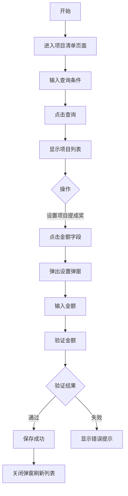

## 需求背景

### 痛点
- **问题现象**：项目提成奖管理员需要查看和管理所有项目的数据，当前无统一的项目清单页面
- **发生频率**：高 - 每月需要根据项目情况进行提成奖发放
- **当前 workaround**：需要通过多个系统或报表获取项目数据

### 业务目标
- **量化指标**：提供56个字段的完整项目清单视图，支持项目提成奖金额设置
- **目标期限**：2026年6月

### 涉及系统/模块
- **模块名称**：宁波产数钱包-项目清单
- **变更类型**：新增
- **对接接口**：项目清单查询接口、项目提成奖设置接口

---

## 用户故事

### 故事1：项目提成奖管理员
- **角色**：区县分公司项目提成奖管理员
- **功能**：查看项目清单56个字段数据、设置项目提成奖金额
- **收益**：快速定位项目信息，完成提成奖发放前的准备工作
- **验收条件**：可查看全部56个字段，可修改项目提成奖金额

### 故事2：奖励发放人员
- **角色**：区县分公司奖励发放人员
- **功能**：按账期、项目类型等条件筛选项目
- **收益**：快速筛选出需要处理的项目
- **验收条件**：支持多条件筛选，支持展开更多条件

---

## 需求清单

| 序号 | 需求描述 | 优先级 | 状态 | 负责人 | 截止日期 |
|------|----------|--------|------|--------|----------|
| 1 | 项目清单页面56个字段可拖动表头表格 | P0 | TODO | | |
| 2 | 8个分组表头（项目基本信息/奖励信息/前向收入计划/前向实际/后向计划/实际支出/前向收款/后向付款） | P0 | TODO | | |
| 3 | 查询条件卡片（基本条件+展开更多条件） | P0 | TODO | | |
| 4 | 项目提成奖金额可点击修改弹窗 | P0 | TODO | | |

---

## 业务流程图

---

## 页面结构

### 路由信息
- **路由路径** - `/宁波产数钱包/项目清单`
- **页面标题** - 项目清单
- **访问权限** - 登录用户

### 布局结构
- **布局类型** - 单栏
- **区域-标题区** - 页面标题"项目清单"，副标题"项目清单查询"
- **区域-查询区** - 查询条件卡片（支持展开更多条件）
- **区域-主内容** - 56字段数据表格，表头可拖动调整宽度

---

## 功能描述

### 功能点1：查询条件

#### 查询条件字段（基础）：
| 字段名 | 类型 | 必填 | 默认值 | 来源 | 校验规则 | 展示形式 | 交互约束 |
|--------|------|------|--------|------|----------|----------|----------|
| 账期 | 文本 | 否 | 空 | 用户选择 | type=month | 月份选择器 | 可编辑 |
| 商机编码 | 文本 | 否 | 空 | 用户输入 | - | 输入框 | 可编辑 |
| 项目名称 | 文本 | 否 | 空 | 用户输入 | - | 输入框 | 可编辑 |
| 项目编码 | 文本 | 否 | 空 | 用户输入 | - | 输入框 | 可编辑 |

#### 查询条件字段（展开更多）：
| 字段名 | 类型 | 必填 | 默认值 | 来源 | 校验规则 | 展示形式 | 交互约束 |
|--------|------|------|--------|------|----------|----------|----------|
| 合同编码 | 文本 | 否 | 空 | 用户输入 | - | 输入框 | 可编辑 |
| 项目提成奖状态 | 枚举 | 否 | 空 | 用户选择 | - | 下拉选择 | 可编辑 |
| 是否列收完成 | 枚举 | 否 | 空 | 用户选择 | - | 下拉选择 | 可编辑 |
| 是否收款完成 | 枚举 | 否 | 空 | 用户选择 | - | 下拉选择 | 可编辑 |

#### 操作按钮字段：
| 字段名 | 类型 | 必填 | 默认值 | 来源 | 校验规则 | 展示形式 | 交互约束 |
|--------|------|------|--------|------|----------|----------|----------|
| 查询 | 按钮 | 是 | - | - | - | primary按钮 | 可编辑 |
  | 导出 | 按钮 | 否 | - | - | - | outline按钮 | 点击输出导出日志 |
| 重置 | 按钮 | 是 | - | - | - | outline按钮 | 可编辑 |
| 展开更多条件 | 链接 | 否 | - | - | - | link按钮 | 可编辑 |

### 功能点2：项目清单表格

#### 字段列表（8个分组，56个字段）：

**项目基本信息（13列）**：
| 字段名 | 类型 | 必填 | 默认值 | 来源 | 校验规则 | 展示形式 | 交互约束 |
|--------|------|------|--------|------|----------|----------|----------|
| 账期 | 文本 | 是 | - | 接口 | - | 文字 | 只读 |
| 地市 | 文本 | 是 | - | 接口 | - | 文字 | 只读 |
| 区县分局 | 文本 | 是 | - | 接口 | - | 文字 | 只读 |
| 支局 | 文本 | 是 | - | 接口 | - | 文字 | 只读 |
| 商机编码 | 文本 | 是 | - | 接口 | - | 蓝色文字 | 只读 |
| 合同编码 | 文本 | 是 | - | 接口 | - | 文字 | 只读 |
| 项目名称 | 文本 | 是 | - | 接口 | - | 文字 | 只读 |
| 项目编码 | 文本 | 是 | - | 接口 | - | 蓝色文字 | 只读 |
| 立项开始时间 | 文本 | 是 | - | 接口 | - | 日期 | 只读 |
| 项目状态 | 文本 | 是 | - | 接口 | - | 文字 | 只读 |
| 客户名称 | 文本 | 是 | - | 接口 | - | 文字 | 只读 |
| 客户p码 | 文本 | 是 | - | 接口 | - | 文字 | 只读 |
| 项目金额 | 数字 | 是 | - | 接口 | - | 蓝色数字 | 只读 |

**项目奖励信息（12列，橙色背景）**：
| 字段名 | 类型 | 必填 | 默认值 | 来源 | 校验规则 | 展示形式 | 交互约束 |
|--------|------|------|--------|------|----------|----------|----------|
| 项目类型 | 文本 | 是 | - | 接口 | - | 文字 | 只读 |
| 大额商机奖金额 | 数字 | 是 | - | 接口 | - | 数字 | 只读 |
| 奖励状态 | 文本 | 是 | - | 接口 | - | 标签(已发放-绿色/待发放-黄色) | 只读 |
| 项目提成奖金额 | 数字 | 是 | - | 接口 | - | 数字 | 只读 |
| 设置项目提成奖金额 | 数字 | 是 | - | 接口 | - | 蓝色可点击链接 | 可编辑 |
| 已发放金额 | 数字 | 是 | - | 接口 | - | 数字 | 只读 |
| 项目提成奖状态 | 文本 | 是 | - | 接口 | - | 标签 | 只读 |
| 成员状态 | 文本 | 是 | - | 接口 | - | 文字 | 只读 |
| 是否列收完成 | 文本 | 是 | - | 接口 | - | 文字 | 只读 |
| 是否收款完成 | 文本 | 是 | - | 接口 | - | 文字 | 只读 |
| 收款≥已列收 | 文本 | 是 | - | 接口 | - | 文字 | 只读 |
| 收款≥已付款 | 文本 | 是 | - | 接口 | - | 文字 | 只读 |

**前向收入计划（4列，浅橙色背景）**：
| 字段名 | 类型 | 必填 | 默认值 | 来源 | 校验规则 | 展示形式 | 交互约束 |
|--------|------|------|--------|------|----------|----------|----------|
| 计划总收入(含税) | 数字 | 是 | - | 接口 | - | 数字 | 只读 |
| 计划总收入(不含税) | 数字 | 是 | - | 接口 | - | 数字 | 只读 |
| ICT计划总金额(含税) | 数字 | 是 | - | 接口 | - | 数字 | 只读 |
| ICT计划总金额(不含税) | 数字 | 是 | - | 接口 | - | 数字 | 只读 |

**前向实际（4列，中橙色背景）**：
| 字段名 | 类型 | 必填 | 默认值 | 来源 | 校验规则 | 展示形式 | 交互约束 |
|--------|------|------|--------|------|----------|----------|----------|
| 实际总收入(含税) | 数字 | 是 | - | 接口 | - | 数字 | 只读 |
| 实际总收入(不含税) | 数字 | 是 | - | 接口 | - | 数字 | 只读 |
| ICT实际总金额(含税) | 数字 | 是 | - | 接口 | - | 数字 | 只读 |
| ICT实际总金额(不含税) | 数字 | 是 | - | 接口 | - | 数字 | 只读 |

**后向计划（11列，浅蓝色背景）**：
| 字段名 | 类型 | 必填 | 默认值 | 来源 | 校验规则 | 展示形式 | 交互约束 |
|--------|------|------|--------|------|----------|----------|----------|
| 后向合同名称 | 文本 | 是 | - | 接口 | - | 文字(最大宽度截断) | 只读 |
| 后向合同编码 | 文本 | 是 | - | 接口 | - | 文字 | 只读 |
| 计划支出总金额(含税) | 数字 | 是 | - | 接口 | - | 数字 | 只读 |
| 计划支出总金额(不含税) | 数字 | 是 | - | 接口 | - | 数字 | 只读 |
| 其中成本列账 | 数字 | 是 | - | 接口 | - | 数字 | 只读 |
| 其中采购订单 | 数字 | 是 | - | 接口 | - | 数字 | 只读 |
| 其中原子能力 | 数字 | 是 | - | 接口 | - | 数字 | 只读 |
| 其中分成 | 数字 | 是 | - | 接口 | - | 数字 | 只读 |
| 其中投资 | 数字 | 是 | - | 接口 | - | 数字 | 只读 |
| 计划毛利率(含税) | 文本 | 是 | - | 接口 | - | 文字 | 只读 |
| 计划毛利率(不含税) | 文本 | 是 | - | 接口 | - | 文字 | 只读 |

**项目实际支出（9列，淡蓝色背景）**：
| 字段名 | 类型 | 必填 | 默认值 | 来源 | 校验规则 | 展示形式 | 交互约束 |
|--------|------|------|--------|------|----------|----------|----------|
| 实际支出(含税) | 数字 | 是 | - | 接口 | - | 数字 | 只读 |
| 实际支出(不含税) | 数字 | 是 | - | 接口 | - | 数字 | 只读 |
| 其中成本列账 | 数字 | 是 | - | 接口 | - | 数字 | 只读 |
| 其中采购订单 | 数字 | 是 | - | 接口 | - | 数字 | 只读 |
| 其中原子能力 | 数字 | 是 | - | 接口 | - | 数字 | 只读 |
| 其中分成 | 数字 | 是 | - | 接口 | - | 数字 | 只读 |
| 其中投资 | 数字 | 是 | - | 接口 | - | 数字 | 只读 |
| 实际毛利率(含税) | 文本 | 是 | - | 接口 | - | 文字 | 只读 |
| 实际毛利率(不含税) | 文本 | 是 | - | 接口 | - | 文字 | 只读 |

**前向收款（2列，粉红色背景）**：
| 字段名 | 类型 | 必填 | 默认值 | 来源 | 校验规则 | 展示形式 | 交互约束 |
|--------|------|------|--------|------|----------|----------|----------|
| 累计实收金额 | 数字 | 是 | - | 接口 | - | 蓝色数字 | 只读 |
| 累计应收账款 | 数字 | 是 | - | 接口 | - | 数字 | 只读 |

**后向付款（2列，淡紫色背景）**：
| 字段名 | 类型 | 必填 | 默认值 | 来源 | 校验规则 | 展示形式 | 交互约束 |
|--------|------|------|--------|------|----------|----------|----------|
| 累计付款金额 | 数字 | 是 | - | 接口 | - | 橙色数字 | 只读 |
| 累计未付款金额 | 数字 | 是 | - | 接口 | - | 数字 | 只读 |

#### 表头拖拽功能
- **功能**：鼠标悬停在表头右侧边缘，显示蓝色拖拽条
- **交互**：按住拖拽可调整列宽，最小宽度50px
- **状态管理**：列宽状态保存在组件state中

### 功能点3：设置项目提成奖金额弹窗

#### 弹窗级
- **弹窗：设置项目提成奖金额**
  - **触发入口**：点击"设置项目提成奖金额"蓝色字段
  - **关闭方式**：取消按钮
  - **字段列表**：
    | 字段名 | 类型 | 必填 | 默认值 | 来源 | 校验规则 | 展示形式 | 交互约束 |
    |--------|------|------|--------|------|----------|----------|----------|
    | 项目名称 | 文本 | 是 | 当前项目名 | 接口 | - | 文字 | 只读 |
    | 奖励金额 | 数字 | 是 | 当前设置值 | 用户输入 | 数字格式，不超过最大奖励金额 | 输入框 | 可编辑 |
    | 最大奖励金额 | 文本 | 是 | - | 接口 | - | 灰色提示文字 | 只读 |
  - **确定按钮**：验证输入，调用保存接口，成功关闭弹窗
  - **取消按钮**：关闭弹窗，不保存

---

## 数据流图

### 接口1：查询项目清单
- **请求路径** - `/dict/report/getReportListPage`
- **请求方法** - POST
- **请求头** - Content-Type: application/json
- **请求参数** - 账期、商机编码、项目名称、项目编码、合同编码、项目提成奖状态、是否列收完成、是否收款完成、pageNum, pageSize
- **响应字段** - records, total, 各字段数据

### 接口2：修改项目提成奖金额
- **请求路径** - `/api/taskWallet/updateItemDrawAmtSet`
- **请求方法** - POST
- **请求参数** - id, itemDrawAmtSet
- **响应字段** - code, msg

---

## 验收标准

### 正常流程
- [ ] **操作**：进入项目清单页面 → **预期**：显示项目清单表格，56个字段正确显示
- [ ] **操作**：鼠标悬停在表头边缘 → **预期**：显示蓝色拖拽条
- [ ] **操作**：拖拽调整列宽 → **预期**：列宽实时调整，松开后保持
- [ ] **操作**：点击"设置项目提成奖金额"字段 → **预期**：弹出修改弹窗
- [ ] **操作**：输入金额（不超过最大值），点击确定 → **预期**：保存成功，弹窗关闭，列表刷新
- [ ] **操作**：点击"展开更多条件" → **预期**：显示更多查询条件

### 异常流程
- [ ] **操作**：输入金额超过最大奖励金额 → **预期**：显示红色错误提示，确认按钮置灰
- [ ] **操作**：输入非数字格式 → **预期**：显示红色错误提示

---

## 更新记录

### v1 - 2026-05-20
- 初始版本：项目清单页面PRD，包含56个字段表格和项目提成奖金额设置功能