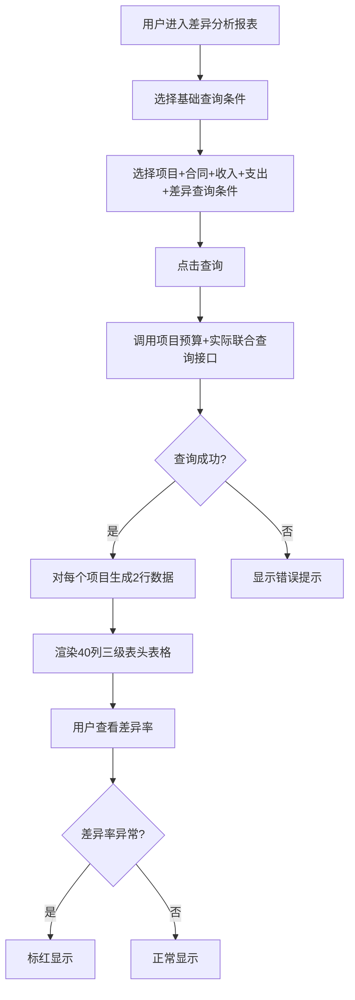

# RevenueCostDiff（收入确认与成本列账进度差异）PRD

## 需求背景

### 痛点
- **问题现象**：ICT 项目执行过程中，收入确认进度与成本列账进度往往存在差异（收入进度快于成本进度，或反之），缺少可视化的差异分析报表，难以快速识别异常项目。
- **发生频率**：高
- **当前 workaround**：通过财务系统导出 Excel，对比计划值与实际值，人工计算差异率。

### 业务目标
- **量化指标**：支持 40 列超宽表格；差异率计算误差 0；差异率异常自动标红。
- **目标期限**：2026 Q2

### 涉及系统/模块
- **模块名称**：收入确认与成本列账进度差异（RevenueCostDiff）
- **变更类型**：新增
- **对接接口**：项目预算计划接口、项目实际收支接口

---

## 用户故事

### 故事1
- **角色**：项目经理 / 财务人员 / 管理层
- **功能**：通过多维度查询条件筛选项目，查看每个项目的预算计划金额与实际收支金额对比，以及进度和差异率。
- **收益**：一站式了解项目收入成本执行偏差，快速定位风险项目。
- **验收条件**：查询条件支持多维度组合；每个项目展示收入行+支出行；差异率计算正确。

---

## 需求清单

| 序号 | 需求描述 | 优先级 | 状态 | 负责人 | 截止日期 |
|------|----------|--------|------|--------|----------|
| 1 | 基于 ReportTemplate 构建报表（40列三级表头） | P0 | TODO | | |
| 2 | 基础信息查询区（地市、区县、帐套、商机编码、客户管控部门） | P0 | TODO | | |
| 3 | 项目信息查询区（项目7字段） | P1 | TODO | | |
| 4 | 合同信息查询区（合同7字段） | P1 | TODO | | |
| 5 | 收入情况查询区（收入3字段，含进度百分号支持） | P1 | TODO | | |
| 6 | 支出情况查询区（支出3字段） | P1 | TODO | | |
| 7 | 差异情况查询区（差异4字段，含百分号支持） | P1 | TODO | | |
| 8 | 三级分组表头（5大组40列：基本信息10+预算11+结算11+进度4+差异率4） | P0 | TODO | | |
| 9 | 双重行数据（每个项目2行：收入行+支出行） | P0 | TODO | | |
| 10 | 后端接口对接 | P1 | TODO | | |

- **优先级**：P0（核心流程阻塞）/ P1（重要功能）/ P2（体验优化）/ P3（未来规划）
- **状态**：TODO / IN PROGRESS / DONE / BLOCKED

---

## 业务流程图

---

## 页面结构

### 路由信息
- **路由路径**：`/revenue-cost-diff`
- **页面标题**：收入确认与成本列账进度差异
- **访问权限**：登录（项目经理/财务人员/管理层角色）

### 布局结构
- **布局类型**：单栏
- **区域-主内容**：6个分组查询区（基础/项目/合同/收入/支出/差异）+ 三级分组表头40列表格

### Tab 结构
- 无 Tab

---

## 功能描述

### 功能点1：6分组查询表单

#### 页面级
- **基础数据**（默认展示）：
  | 字段名 | 类型 | 必填 | 默认值 | 来源 | 校验规则 | 展示形式 | 交互约束 |
  |--------|------|------|--------|------|----------|----------|----------|
  | 地市 | 下拉单选 | 否 | 全部 | 字典 | | | |
  | 区县 | 下拉单选 | 否 | 全部 | 字典 | | | |
  | 帐套 | 下拉单选 | 否 | 全部 | 字典 | | | |
  | 商机编码 | 文本 | 否 | | 用户输入 | | | |
  | 客户管控部门名称 | 下拉 | 否 | 全部 | 字典 | | | |

- **项目信息**（需展开）：
  | 字段名 | 类型 | 必填 | 默认值 | 来源 | 校验规则 | 展示形式 | 交互约束 |
  |--------|------|------|--------|------|----------|----------|----------|
  | 项目编码 | 文本 | 否 | | 用户输入 | | | |
  | 项目名称 | 文本 | 否 | | 用户输入 | | | |
  | 项目类型 | 下拉 | 否 | | 字典 | | | |
  | 立项时间 | 日期范围 | 否 | | 用户输入 | | | |
  | 项目总金额 | 数值范围 | 否 | | 用户输入 | | | |
  | 项目状态 | 下拉 | 否 | | 字典 | | | |
  | 项目经理 | 文本 | 否 | | 用户输入 | | | |

- **合同信息**（需展开）：合同编码、合同名称、合同类型、合同签约日期、合同签约金额、合同履行开始日期、合同履行结束日期

- **收入情况**（需展开）：
  | 字段名 | 类型 | 必填 | 默认值 | 来源 | 校验规则 | 展示形式 | 交互约束 |
  |--------|------|------|--------|------|----------|----------|----------|
  | 项目计划总收入 | 数值范围 | 否 | | 用户输入 | | | |
  | 项目实际入收总金额 | 数值范围 | 否 | | 用户输入 | | | |
  | 项目确收进度 | 文本（百分号） | 否 | | 用户输入 | | 输入框 | 后台自动加% |

- **支出情况**（需展开）：项目计划支出总金额、项目实际支出总金额、项目支出进度

- **差异情况**（需展开）：
  | 字段名 | 类型 | 必填 | 默认值 | 来源 | 校验规则 | 展示形式 | 交互约束 |
  |--------|------|------|--------|------|----------|----------|----------|
  | 项目差异率 | 文本（百分号） | 否 | | 用户输入 | | | |
  | 项目差异率（产数服务） | 文本（百分号） | 否 | | 用户输入 | | | |
  | 项目差异率（设备销售/租赁） | 文本（百分号） | 否 | | 用户输入 | | | |
  | 代收代付差异率 | 文本（百分号） | 否 | | 用户输入 | | | |

---

### 功能点2：40列三级分组表格

#### 页面级
- 页面标题：收入确认与成本列账进度差异
- 描述：项目预算计划与实际收入成本列账进度差异分析

#### 表头分组（5级，3层）
- **项目基本信息**（10列）：当前账期、地市、区县、项目编号、项目名称、项目类型、项目经理、立项时点、项目状态、类型
- **预算阶段-项目计划**（11列）：项目计划金额、（1）服务支出（含5个其中项）、（2）设备支出（含2个其中项）、（3）代收代付
- **结算阶段-项目实际收入及支出**（11列）：项目实际金额、（1）服务支出（含5个其中项）、（2）设备支出（含2个其中项）、（3）代收代付
- **项目进度**（4列）：项目确收进度、其中：产数服务、其中：设备销售/租赁、其中：代收代付
- **项目差异率**（4列）：项目差异率、其中：产数服务、其中：设备销售/租赁、其中：代收代付

#### 数据结构（双重行）
- 每个项目占 2 行：
  - **收入行**：rowType="收入"，项目基本信息列有值，预算/结算/进度/差异率列有值，支出明细列为空
  - **支出行**：rowType="支出"，项目基本信息列为空，支出明细列有值

---

## 数据流图

### 接口1：收入成本差异联合查询
- **请求路径**：`GET /api/revenue-cost-diff`
- **请求方法**：GET
- **请求头**：Authorization
- **请求参数**：
  - `city` - 类型：字符串；必填：否
  - `district` - 类型：字符串；必填：否
  - `accountBook` - 类型：字符串；必填：否
  - `projectCode` - 类型：字符串；必填：否
  - `projectName` - 类型：字符串；必填：否
  - `diffRateMin` - 类型：数字；必填：否
  - `diffRateMax` - 类型：数字；必填：否
- **响应字段**：
  - `data[]` - 类型：数组；描述：每个项目2行（收入行+支出行）
  - `total` - 类型：数字；描述：项目总数
- **存储位置**：数据库表（项目预算表 + 项目实际收支表 JOIN）
- **错误码**：
  - `401` - 未授权
  - `500` - 服务器异常

### 数据刷新点
- **刷新时机**：点击查询按钮
- **影响字段**：全部表格字段

---

## 验收标准

### 正常流程
- [ ] **操作**：选择地市"杭州"，点击查询 → **预期**：仅显示杭州项目的差异数据
- [ ] **操作**：查询结果显示收入行+支出行 → **预期**：每个项目占2行，收入行有项目信息，支出行有支出明细
- [ ] **操作**：查看差异率列 → **预期**：显示负数百分比（如-6.9%）

### 异常流程
- [ ] **操作**：输入差异率范围 10%~20%（超出实际范围） → **预期**：返回空数据
- [ ] **操作**：网络断开 → **预期**：显示错误提示

---

## 更新记录

### v1 - 2026-05-09
- 初始版本
