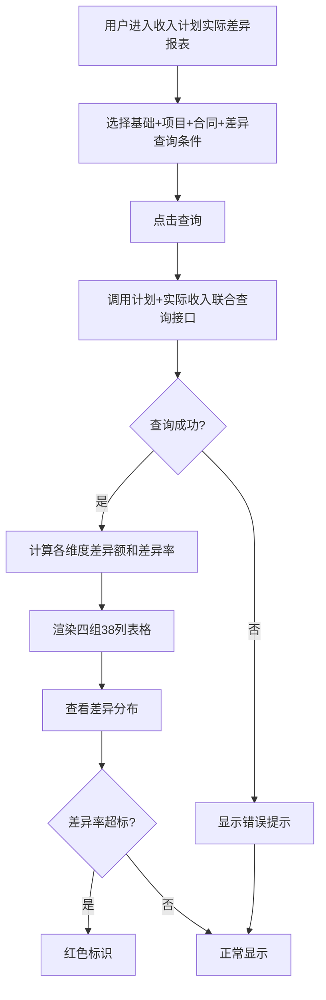

# RevenuePlanActualDiff（收入计划与实际确收差异）PRD

## 需求背景

### 痛点
- **问题现象**：项目管理中，项目收入计划与实际确收金额经常出现偏差（实际低于计划），缺少按项目维度分析计划与实际差异的工具，难以量化偏差程度和偏差结构。
- **发生频率**：高
- **当前 workaround**：通过财务系统导出 Excel，线下手动计算差异额和差异率。

### 业务目标
- **量化指标**：支持 38 列宽表；差异率计算误差 0；差异率超过阈值自动标色。
- **目标期限**：2026 Q2

### 涉及系统/模块
- **模块名称**：收入计划与实际确收差异（RevenuePlanActualDiff）
- **变更类型**：新增
- **对接接口**：项目计划收入接口、项目实际确收接口

---

## 用户故事

### 故事1
- **角色**：项目经理 / 财务人员 / 管理层
- **功能**：通过多维度查询条件筛选项目，查看每个项目的计划收入与实际确收金额对比，分析差异额和差异率的结构性分布。
- **收益**：快速识别收入执行偏差超限的项目，为后续调整提供数据支撑。
- **验收条件**：查询条件支持多维度组合；差异额/差异率按基本面、服务、标品、设备、代收代付细分。

---

## 需求清单

| 序号 | 需求描述 | 优先级 | 状态 | 负责人 | 截止日期 |
|------|----------|--------|------|--------|----------|
| 1 | 基于 ReportTemplate 构建报表（38列双级表头） | P0 | TODO | | |
| 2 | 基础查询区（地市、区县、帐套、商机编码、客户管控部门） | P0 | TODO | | |
| 3 | 项目信息查询区（项目7字段） | P1 | TODO | | |
| 4 | 合同信息查询区（合同7字段） | P1 | TODO | | |
| 5 | 差异情况查询区（差异8字段，含百分号支持） | P1 | TODO | | |
| 6 | 四组表头大型表格（38列：基本信息15+差异情况12+收入计划5+实际收入6） | P0 | TODO | | |
| 7 | Mock 数据展示（3条记录） | P0 | TODO | | |
| 8 | 后端接口对接 | P1 | TODO | | |

- **优先级**：P0（核心流程阻塞）/ P1（重要功能）/ P2（体验优化）/ P3（未来规划）
- **状态**：TODO / IN PROGRESS / DONE / BLOCKED

---

## 业务流程图

---

## 页面结构

### 路由信息
- **路由路径**：`/revenue-plan-actual-diff`
- **页面标题**：收入计划与实际确收差异
- **访问权限**：登录（项目经理/财务人员/管理层角色）

### 布局结构
- **布局类型**：单栏
- **区域-主内容**：4个分组查询区（基础/项目/合同/差异）+ 四组38列表格

### Tab 结构
- 无 Tab

---

## 功能描述

### 功能点1：4分组查询表单

#### 页面级
- **基础数据**（默认展示）：
  | 字段名 | 类型 | 必填 | 默认值 | 来源 | 校验规则 | 展示形式 | 交互约束 |
  |--------|------|------|--------|------|----------|----------|----------|
  | 地市 | 下拉单选 | 否 | 全部 | 字典 | | | |
  | 区县 | 下拉单选 | 否 | 全部 | 字典 | | | |
  | 帐套 | 下拉单选 | 否 | 全部 | 字典 | | | |
  | 商机编码 | 文本 | 否 | | 用户输入 | | | |
  | 客户管控部门名称 | 下拉 | 否 | 全部 | 字典 | | | |

- **项目信息**（需展开）：项目编码、项目名称、项目类型、立项时间、项目总金额、项目状态、项目经理

- **合同信息**（需展开）：合同编码、合同名称、合同类型、合同签约日期、合同签约金额、合同履行开始日期、合同履行结束日期

- **差异情况**（需展开）：
  | 字段名 | 类型 | 必填 | 默认值 | 来源 | 校验规则 | 展示形式 | 交互约束 |
  |--------|------|------|--------|------|----------|----------|----------|
  | 项目差异额 | 数值范围 | 否 | | 用户输入 | | | |
  | 项目差异率 | 文本（百分号） | 否 | | 用户输入 | | | |
  | 服务差异额 | 数值范围 | 否 | | 用户输入 | | | |
  | 服务差异率 | 文本（百分号） | 否 | | 用户输入 | | | |
  | 设备销售/租赁差异额 | 数值范围 | 否 | | 用户输入 | | | |
  | 设备销售/租赁差异率 | 文本（百分号） | 否 | | 用户输入 | | | |
  | 代收代付差异额 | 数值范围 | 否 | | 用户输入 | | | |
  | 代收代付差异率 | 文本（百分号） | 否 | | 用户输入 | | | |
  | 累计到期收入计划 | 数值范围 | 否 | | 用户输入 | | | |
  | 项目实际入收总金额（不含税） | 数值范围 | 否 | | 用户输入 | | | |

---

### 功能点2：38列四组数据表格

#### 页面级
- 页面标题：收入计划与实际确收差异
- 描述：项目收入计划与实际确收情况差异分析

#### 表头分组（4组，38列）
- **项目基本信息**（15列）：当前账期、地市、区县、项目编号、项目名称、项目类型、项目经理、立项时间、项目状态、合同编码、合同名称、合同类型、合同状态、合同履行开始时间、合同履行结束时间
- **项目差异情况**（12列）：项目差异额、项目差异率、基本面差异额、基本面差异率、服务差异额、服务差异率、标品差异额、标品差异率、设备销售/租赁差异额、设备销售/租赁差异率、代收代付差异额、代收代付差异率
- **累计到期收入计划**（5列）：基本面收入、产数服务、产数标品、设备销售/租赁、代收代付
- **项目实际收入**（6列）：项目实际收入总金额、项目实际基本面收入、项目实际产数服务、项目实际产数标品、项目实际设备销售/租赁、项目实际代收代付

#### 字段列表
- **差异率字段**：橙色背景标注（bg-orange-50）
- **计划收入字段**：蓝色背景标注（bg-blue-50）
- **实际收入字段**：绿色背景标注（bg-green-50）
- 所有金额字段：右对齐

---

## 数据流图

### 接口1：收入计划与实际差异联合查询
- **请求路径**：`GET /api/revenue-plan-actual-diff`
- **请求方法**：GET
- **请求头**：Authorization
- **请求参数**：
  - `city` - 类型：字符串；必填：否
  - `district` - 类型：字符串；必填：否
  - `accountBook` - 类型：字符串；必填：否
  - `projectCode` - 类型：字符串；必填：否
  - `projectName` - 类型：字符串；必填：否
  - `projectDiffRateMin` - 类型：数字；必填：否
  - `projectDiffRateMax` - 类型：数字；必填：否
- **响应字段**：
  - `data[]` - 类型：数组；描述：差异分析数据
  - `total` - 类型：数字；描述：总记录数
- **存储位置**：数据库表（项目计划收入表 + 项目实际确收表 JOIN）
- **错误码**：
  - `401` - 未授权
  - `500` - 服务器异常

### 数据刷新点
- **刷新时机**：点击查询按钮
- **影响字段**：全部表格字段

---

## 验收标准

### 正常流程
- [ ] **操作**：选择地市"宁波"，点击查询 → **预期**：仅显示宁波项目的差异数据
- [ ] **操作**：查看差异率字段 → **预期**：显示负数百分比（如-7.5%）
- [ ] **操作**：差异额字段右对齐 → **预期**：对齐正确

### 异常流程
- [ ] **操作**：输入项目差异率范围超出实际值 → **预期**：返回空数据
- [ ] **操作**：网络断开 → **预期**：显示错误提示

---

## 更新记录

### v2 - 2026-05-20
- 差异情况组新增累计到期收入计划、项目实际入收总金额（不含税）字段，与CSV保持一致

### v1 - 2026-05-09
- 初始版本
