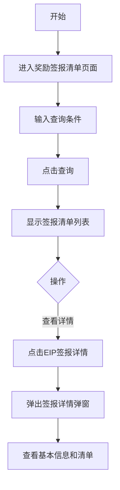

## 需求背景

### 痛点
- **问题现象**：奖励签报清单需要审核和查看EIP签报详情，当前无统一入口
- **发生频率**：高 - 每月都有大量奖励签报需要处理
- **当前 workaround**：通过EIP系统单独处理

### 业务目标
- **量化指标**：提供统一的奖励签报清单查询和审核入口
- **目标期限**：2026年6月

### 涉及系统/模块
- **模块名称**：宁波产数钱包-奖励签报清单
- **变更类型**：新增
- **对接接口**：奖励签报清单查询接口、EIP签报详情接口

---

## 用户故事

### 故事1：奖励签报审核人员
- **角色**：区县分公司奖励签报审核人员
- **功能**：查询奖励签报清单、查看EIP签报详情
- **收益**：快速完成奖励签报审核和查看
- **验收条件**：可按多种条件筛选，可查看EIP签报详情

---

## 需求清单

| 序号 | 需求描述 | 优先级 | 状态 | 负责人 | 截止日期 |
|------|----------|--------|------|--------|----------|
| 1 | 奖励签报清单查询条件 | P0 | TODO | | |
| 2 | 奖励签报清单数据表格 | P0 | TODO | | |
| 3 | EIP签报详情弹窗 | P0 | TODO | | |

---

## 业务流程图

---

## 页面结构

### 路由信息
- **路由路径** - `/宁波产数钱包/奖励签报清单`
- **页面标题** - 奖励签报清单
- **访问权限** - 登录用户

### 布局结构
- **布局类型** - 单栏
- **区域-标题区** - 页面标题"奖励签报清单"，副标题"奖励签报清单查询"
- **区域-查询区** - 查询条件卡片
- **区域-主内容** - 数据表格

---

## 功能描述

### 功能点1：奖励签报清单查询

#### 查询条件字段：
| 字段名 | 类型 | 必填 | 默认值 | 来源 | 校验规则 | 展示形式 | 交互约束 |
|--------|------|------|--------|------|----------|----------|----------|
| 申请时间 | 日期 | 否 | 空 | 用户选择 | - | 日期范围选择器 | 可编辑 |
| 审核状态 | 枚举 | 否 | 空 | 用户选择 | - | 下拉选择 | 可编辑 |
| 送审人 | 文本 | 否 | 空 | 用户输入 | - | 输入框 | 可编辑 |
| 分局 | 枚举 | 否 | 空 | 用户选择 | - | 下拉选择 | 可编辑 |

#### 操作按钮字段：
| 字段名 | 类型 | 必填 | 默认值 | 来源 | 校验规则 | 展示形式 | 交互约束 |
|--------|------|------|--------|------|----------|----------|----------|
| 查询 | 按钮 | 是 | - | - | - | primary按钮 | 可编辑 |
| 重置 | 按钮 | 是 | - | - | - | outline按钮 | 可编辑 |

#### 字段列表（14列）：
| 字段名 | 类型 | 必填 | 默认值 | 来源 | 校验规则 | 展示形式 | 交互约束 |
|--------|------|------|--------|------|----------|----------|----------|
| 地市 | 文本 | 是 | - | 接口 | - | 文字 | 只读 |
| 区县分局 | 文本 | 是 | - | 接口 | - | 文字 | 只读 |
| 账期 | 文本 | 是 | - | 接口 | - | 文字 | 只读 |
| 项目数 | 数字 | 是 | - | 接口 | - | 数字 | 只读 |
| 合同金额(万元) | 数字 | 是 | - | 接口 | - | 数字 | 只读 |
| 合同ICT金额(万元) | 数字 | 是 | - | 接口 | - | 数字 | 只读 |
| 收款金额(万元) | 数字 | 是 | - | 接口 | - | 蓝色数字 | 只读 |
| 总奖励金额(元) | 数字 | 是 | - | 接口 | - | 蓝色数字 | 只读 |
| 商机奖(元) | 数字 | 是 | - | 接口 | - | 数字 | 只读 |
| 项目提成奖(元) | 数字 | 是 | - | 接口 | - | 数字 | 只读 |
| 状态 | 文本 | 是 | - | 接口 | - | 标签(已审核-绿色/待审核-黄色/已驳回-红色) | 只读 |
| 送审人 | 文本 | 是 | - | 接口 | - | 文字 | 只读 |
| 送审时间 | 文本 | 是 | - | 接口 | - | 文字 | 只读 |
| 操作 | 操作 | 是 | - | - | - | EIP签报详情链接（仅非待审核状态显示） | 可编辑 |

### 功能点2：EIP签报详情弹窗

#### 弹窗级
- **弹窗：EIP签报详情**
  - **触发入口**：点击"EIP签报详情"链接
  - **关闭方式**：关闭按钮
  - **弹窗尺寸**：大尺寸弹窗（90vw × 90vh，可滚动）
  - **内容区域**：
    - 基本信息卡片：显示区县、账期、项目数、合同金额、ICT金额、收款金额、总奖励金额、商机奖、项目提成奖
    - 签报详情表格（复用EIPSignOffDetail组件）
  - **关闭按钮**：点击后关闭弹窗

---

## 数据流图

### 接口1：查询奖励签报清单
- **请求路径** - `/api/taskWallet/getSjtDwsRewardReport74PageList`
- **请求方法** - POST
- **请求参数** - pageNum, pageSize, startDate, endDate, auditState, createUserName, qxId
- **响应字段** - records, total

### 接口2：获取EIP签报详情
- **请求路径** - `/api/eip/signOff/getDetail`
- **请求方法** - GET
- **请求参数** - qxName, cycleMonth
- **响应字段** - 基本信息、签报清单数据

---

## 验收标准

### 正常流程
- [ ] **操作**：进入奖励签报清单页面 → **预期**：显示查询条件和空列表
- [ ] **操作**：输入查询条件，点击查询 → **预期**：显示奖励签报清单列表
- [ ] **操作**：点击"EIP签报详情"链接 → **预期**：弹出签报详情弹窗
- [ ] **操作**：点击弹窗关闭按钮 → **预期**：弹窗关闭

### 异常流程
- [ ] **操作**：点击"EIP签报详情"（审核状态为待审核时） → **预期**：按钮不显示

---

## 更新记录

### v1 - 2026-05-20
- 初始版本：奖励签报清单页面PRD