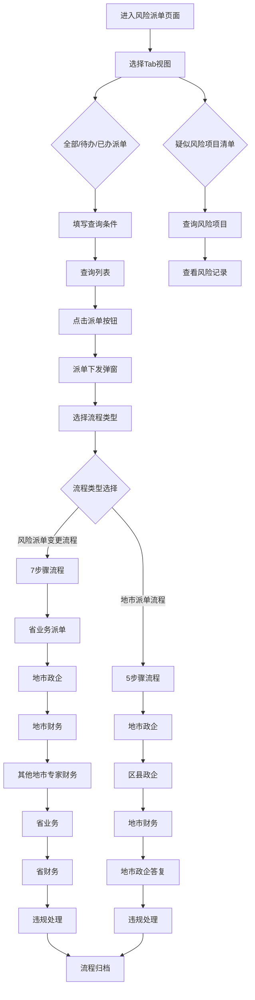

# 风险管理（风险派单）PRD

## 需求背景

### 痛点
- **问题现象**：业务决策层需要实时掌握风险项目派单处理进度、风险核实状态、违规处理情况，当前缺乏统一的集中管理平台，各模块数据分散，处理流程不透明。
- **发生频率**：高
- **当前 workaround**：通过多个后台管理页面分别查看，流程状态无法联动更新。

### 业务目标
- **量化指标**：覆盖风险派单全流程4个Tab；支持派单/待办/已办/疑似风险项目清单4种视图；派单弹窗5步流程完整。
- **目标期限**：2026 Q2

### 涉及系统/模块
- **模块名称**：风险管理（风险派单）
- **变更类型**：新增
- **对接接口**：风险派单列表、派单详情、流程跟踪等接口

---

## 用户故事

### 故事1
- **角色**：省级风控管理人员
- **功能**：登录系统后进入风险派单页面，查看全部/待办/已办派单列表，支持按地市、风险类型、时间等条件筛选。
- **收益**：快速了解全省风险派单整体情况，聚焦待办任务。
- **验收条件**：4个Tab正常切换；查询条件完整；分页功能正常。

### 故事2
- **角色**：地市风控处理人员
- **功能**：对待派单风险项目进行派单操作，填写派单信息（派单说明、附件、地市政企处理人），进入派单流程处理。
- **收益**：规范风险派单流程，确保信息完整传递。
- **验收条件**：派单弹窗5个步骤切换正常；必填字段校验有效；提交后状态更新。

### 故事3
- **角色**：省业务复核人员
- **功能**：查看风险详情、流程跟踪记录，对地市反馈进行复核，填写违规处理信息。
- **收益**：全面掌握风险处理进度，进行合规性审查。
- **验收条件**：风险详情展示完整；流程跟踪展示各环节处理状态。

---

## 需求清单

| 序号 | 需求描述 | 优先级 | 状态 | 负责人 | 截止日期 |
|------|----------|--------|------|--------|----------|
| 1 | 风险派单主页面框架（4个Tab切换） | P0 | DONE | | |
| 2 | 风险派单查询条件区域 | P0 | DONE | | |
| 3 | 风险派单表格展示（列定义+分页） | P0 | DONE | | |
| 4 | 疑似风险项目清单查询条件和表格 | P0 | DONE | | |
| 5 | 派单下发弹窗（5步骤展示） | P0 | DONE | | |
| 6 | 风险详情弹窗 | P1 | DONE | | |
| 7 | 风险记录弹窗 | P1 | DONE | | |
| 8 | 流程跟踪弹窗 | P1 | DONE | | |
| 9 | 批量派单功能 | P2 | DONE | | |
| 10 | 导出功能 | P2 | DONE | | |
| 11 | 新增表格字段（风险累积处理时长、是否确认为风险等7个字段） | P0 | DONE | | 2026-05-11 |
| 12 | 操作列固定在最右侧 | P0 | DONE | | 2026-05-11 |
| 13 | 派单弹窗改为步骤条展示 | P0 | DONE | | 2026-05-11 |
| 14 | 派单弹窗支持两种流程类型（风险派单变更流程/地市派单流程） | P0 | DONE | | 2026-05-11 |
| 15 | 地市派单流程（5步骤：地市政企→区县政企→地市财务→地市政企答复→违规处理） | P0 | DONE | | 2026-05-11 |

- **优先级**：P0（核心流程阻塞）/ P1（重要功能）/ P2（体验优化）
- **状态**：TODO / IN PROGRESS / DONE / BLOCKED

---

## 业务流程图

### 业务流程概览

### 风险派单变更流程（7步骤）

- **步骤1 - 省业务派单**：省业务人员填写派单说明、上传附件、选择地市政企处理人
- **步骤2 - 地市政企**：地市政企填写虚假贸易确认、项目信息核实、"六必有"证明材料等
- **步骤3 - 地市财务**：地市财务审核，填写是否同意及风险说明，上传材料
- **步骤4 - 其他地市专家财务**：其他地市专家财务复核，填写是否同意及风险说明
- **步骤5 - 省业务**：省业务进行风险反馈确认
- **步骤6 - 省财务**：省财务最终审核，填写是否同意
- **步骤7 - 违规处理**：填写违规信息，完成流程归档

### 地市派单流程（5步骤）

- **步骤1 - 地市政企**：地市政企填写虚假贸易确认、项目信息核实、"六必有"证明材料等
- **步骤2 - 区县政企**：选择区县政企处理人（新增步骤）
- **步骤3 - 地市财务**：地市财务审核，填写是否同意及风险说明，上传材料
- **步骤4 - 地市政企答复**：填写是否同意及答复说明（新增字段）
- **步骤5 - 违规处理**：填写违规信息，完成流程归档

---

## 页面结构

### 路由信息
- **路由路径**：`risk-dispatch`
- **页面标题**：风险派单
- **访问权限**：登录（省级/地市风控管理人员）

### 布局结构
- **布局类型**：单栏
- **区域-Tab栏**：4个Tab（全部风险派单/待办风险派单/已办风险派单/疑似风险项目清单）
- **区域-查询条件**：两行表单（风险派单3行/疑似风险项目清单2行）
- **区域-数据表格**：横向滚动表格，操作列固定在最右侧
- **区域-分页**：底部固定

### 样式规范
- **页面标题**：text-lg font-medium text-gray-900
- **Tab切换**：灰色背景圆角药丸样式，选中项为白色背景+阴影
- **查询条件卡片**：白色背景圆角带边框，grid-cols-4布局
- **展开更多**：蓝色链接按钮
- **表格**：白色背景圆角带边框，横向滚动
- **操作列**：固定在最右侧，z-20层级

---

## 功能描述

### 功能点1：风险派单主页面

#### 页面级
- **字段：功能入口** - 类型：文本；描述：左侧菜单"风险管理 > 风险派单"
- **字段：前置条件** - 类型：文本；描述：用户已登录，有风控管理权限
- **字段：后置影响** - 类型：字段列表；描述：Tab切换联动更新表格数据

#### Tab级
- **Tab名称** - 类型：文本；示例：`全部风险派单`
- **查询条件字段**（风险派单Tab）：
  | 字段名 | 类型 | 必填 | 默认值 | 来源 | 校验规则 | 展示形式 | 交互约束 |
  |--------|------|------|--------|------|----------|----------|----------|
  | 地市 | 枚举 | 否 | 空 | 下拉选择 | | 下拉选择框 | |
  | 风险类型 | 枚举 | 否 | 空 | 下拉选择 | | 下拉选择框 | |
  | 风险发现时间 | 日期范围 | 否 | 空 | 日期选择 | | 开始日期-结束日期 | |
  | 商机编码/商情编码 | 文本 | 否 | 空 | 用户输入 | | 文本输入框 | |
  | 项目编码 | 文本 | 否 | 空 | 用户输入 | | 文本输入框 | |
  | 是否派单 | 枚举 | 否 | 空 | 下拉选择 | 是/否 | 下拉选择框 | |
  | 风险分值 | 数字 | 否 | 空 | 用户输入 | | 文本输入框 | |
  | 派单时间 | 日期范围 | 否 | 空 | 日期选择 | | 开始日期-结束日期 | |
  | 当前处理人 | 枚举 | 否 | 空 | 下拉选择 | | 下拉选择框 | |
  | 是否确认为风险 | 枚举 | 否 | 空 | 下拉选择 | 是/否 | 下拉选择框 | |
  | 风险是否已整改 | 枚举 | 否 | 空 | 下拉选择 | 是/否 | 下拉选择框 | |
  | 当前环节 | 枚举 | 否 | 空 | 下拉选择 | 省业务派单/地市政企处理/地市财务处理/省业务复核/已归档 | 下拉选择框 | |

- **查询条件字段**（疑似风险项目清单Tab）：
  | 字段名 | 类型 | 必填 | 默认值 | 来源 | 校验规则 | 展示形式 | 交互约束 |
  |--------|------|------|--------|------|----------|----------|----------|
  | 地市 | 枚举 | 否 | 空 | 下拉选择 | | 下拉选择框 | |
  | 风险类型 | 枚举 | 否 | 空 | 下拉选择 | | 下拉选择框 | |
  | 风险发现时间 | 日期范围 | 否 | 空 | 日期选择 | | 开始日期-结束日期 | |
  | 商机编码/商情编码 | 文本 | 否 | 空 | 用户输入 | | 文本输入框 | |
  | 项目编码 | 文本 | 否 | 空 | 用户输入 | | 文本输入框 | |
  | 风险分值 | 数字范围 | 否 | 空 | 用户输入 | 1-10000 | 最小值-最大值 | |
  | 是否生成派单 | 枚举 | 否 | 空 | 下拉选择 | 是/否 | 下拉选择框 | |
  | 项目名称 | 文本 | 否 | 空 | 用户输入 | | 文本输入框 | |

- **操作按钮字段**：
  | 字段名 | 类型 | 必填 | 默认值 | 来源 | 校验规则 | 展示形式 | 交互约束 |
  |--------|------|------|--------|------|----------|----------|----------|
  | 查询 | 按钮 | | | | | 蓝色主按钮 | 点击执行查询 |
  | 重置 | 按钮 | | | | | 白色边框按钮 | 点击清空查询条件 |
  | 批量派单 | 按钮 | | | | | 黄色按钮 | 选中行后才能点击 |
  | 导出 | 按钮 | | | | | 蓝色边框按钮 | |
  | 任务下载列表 | 按钮 | | | | | 蓝色边框按钮 | |
  | 批量生成 | 按钮 | | | | | 黄色按钮 | 疑似风险项目清单Tab |

#### 表格字段（风险派单Tab）- 2026-05-11 新增字段
  | 字段名 | 类型 | 必填 | 默认值 | 来源 | 校验规则 | 展示形式 | 交互约束 |
  |--------|------|------|--------|------|----------|----------|----------|
  | 复选框 | 布尔 | | | 系统 | | 复选框 | 全选/单选，固定在最左侧 |
  | 序号 | 数字 | | 自增 | 系统 | | 数字 | 固定在最左侧 |
  | 地市 | 文本 | | | 接口 | | 文本 | |
  | 风险类型 | 文本 | | | 接口 | | 文本 | 多值逗号分隔 |
  | 风险发现时间 | 日期时间 | | | 接口 | | 文本 | YYYY-MM-DD HH:mm:ss |
  | 风险模型 | 文本 | | | 接口 | | 文本 | 含分值 |
  | 商机编码/商情编码 | 文本 | | | 接口 | | 文本 | |
  | 商机名称/商情名称 | 文本 | | | 接口 | | 文本 | 超长截断 |
  | 项目编码 | 文本 | | | 接口 | | 文本 | |
  | 项目名称 | 文本 | | | 接口 | | 文本 | 超长截断 |
  | 项目金额 | 金额 | | | 接口 | | 数字 | 保留千分位 |
  | 是否已派单 | 枚举 | | | 接口 | 是/否 | 标签 | 绿色是/灰色否 |
  | 派单时间 | 日期时间 | | | 接口 | | 文本 | |
  | 当前环节 | 文本 | | | 接口 | | 文本 | |
  | 当前处理人 | 文本 | | | 接口 | | 文本 | |
  | **风险累积处理时长** | 文本 | | | 接口 | | 文本 | 格式：X天X小时 |
  | **是否确认为风险** | 枚举 | | | 接口 | 是/否/待确认 | 标签 | 绿色是/灰色否/橙色待确认 |
  | **风险是否已整改** | 枚举 | | | 接口 | 是/否/待确认 | 标签 | 绿色是/灰色否/橙色待确认 |
  | **风险说明** | 文本 | | | 接口 | | 文本 | 超长截断 |
  | **处理意见** | 文本 | | | 接口 | | 文本 | 超长截断 |
  | **是否终止或取消项目** | 枚举 | | | 接口 | 是/否/待确认 | 标签 | |
  | **是否净额列收** | 枚举 | | | 接口 | 是/否/待确认 | 标签 | |
  | 操作 | 操作组 | | | | | 操作链接 | 派单/风险详情/过程详情/风险撤回，**固定在最右侧** |

#### 表格字段（疑似风险项目清单Tab）
  | 字段名 | 类型 | 必填 | 默认值 | 来源 | 校验规则 | 展示形式 | 交互约束 |
  |--------|------|------|--------|------|----------|----------|----------|
  | 复选框 | 布尔 | | | 系统 | | 复选框 | |
  | 序号 | 数字 | | 自增 | 系统 | | 数字 | |
  | 地市 | 文本 | | | 接口 | | 文本 | |
  | 区县 | 文本 | | | 接口 | | 文本 | |
  | 商机名称/商情名称 | 文本 | | | 接口 | | 文本 | 超长截断 |
  | 商机编码/商情编码 | 文本 | | | 接口 | | 文本 | |
  | 项目名称 | 文本 | | | 接口 | | 文本 | 超长截断 |
  | 项目编码 | 文本 | | | 接口 | | 文本 | |
  | 项目类型 | 枚举 | | | 接口 | 网络资源型/成本类 | 文本 | |
  | 项目经理 | 文本 | | | 接口 | | 文本 | |
  | 立项时间 | 日期 | | | 接口 | | 文本 | |
  | 收入合同名称 | 文本 | | | 接口 | | 文本 | 超长截断 |
  | 签约金额(万元) | 金额 | | | 接口 | | 数字 | 右对齐 |
  | 风险总分值 | 数字 | | | 接口 | | 数字 | |
  | 风险最初发现时间 | 日期时间 | | | 接口 | | 文本 | |
  | 风险最后发现时间 | 日期时间 | | | 接口 | | 文本 | |
  | 风险类型 | 文本 | | | 接口 | | 文本 | 多值逗号分隔 |
  | 是否生成派单 | 枚举 | | | 接口 | 是/否 | 标签/可点击链接 | 是时点击跳转到待办风险派单Tab；否时显示派单按钮 |
  | 操作 | 操作组 | | | | | 操作链接 | 是时显示"查看"按钮；否时显示"派单"按钮 |

---

### 功能点2：派单下发弹窗

#### 弹窗级
- **弹窗：派单下发**
- **触发入口**：点击表格操作列"派单"按钮
- **关闭方式**：遮罩层点击 / 关闭图标 / 取消按钮
- **布局**：95vw宽度，90vh高度，步骤条在顶部，内容区可滚动
- **流程类型选择**：弹窗顶部标题栏右侧有流程类型下拉选择器，可切换两种派单流程
- **步骤展示**：
  - 顶部横向步骤条，已完成步骤显示绿色勾号，当前步骤蓝色高亮
  - 可点击任意步骤切换查看（无顺序限制，方便演示）
- **确定按钮**：点击后调用派单接口，成功关闭弹窗刷新列表，失败显示错误信息，弹窗保持
- **取消按钮**：点击后关闭弹窗，不调用接口，不修改数据

#### 风险派单变更流程（7步骤）

##### 1. 省业务派单字段
  | 字段名 | 类型 | 必填 | 默认值 | 来源 | 校验规则 | 展示形式 | 交互约束 |
  |--------|------|------|--------|------|----------|----------|----------|
  | 风险类型 | 文本 | | | 接口 | | 表格（横向滚动） | |
  | 风险分值 | 数字 | | | 接口 | | 表格 | |
  | 风险模型 | 文本 | | | 接口 | | 表格 | |
  | 分值 | 数字 | | | 接口 | | 表格 | |
  | 发现时间 | 日期时间 | | | 接口 | | 表格 | |
  | 风险主体类型 | 枚举 | | | 接口 | 客户/供应商 | 表格 | |
  | 风险主体 | 文本 | | | 接口 | | 表格 | |
  | 风险描述 | 文本 | | | 接口 | | 表格 | |
  | 风险状态 | 枚举 | | | 接口 | 有效/无效 | 表格 | |
  | 派单说明 | 多行文本 | 否 | 空 | 用户输入 | | 多行文本框 | placeholder:请输入派单说明 |
  | 附件 | 文件 | 否 | 空 | 用户上传 | pdf/doc/docx/xls/xlsx ≤20MB | 上传按钮 | |
  | 地市政企处理人 | 枚举 | 是 | 空 | 下拉选择 | | 下拉搜索框 | |

##### 2. 地市政企字段
  | 字段名 | 类型 | 必填 | 默认值 | 来源 | 校验规则 | 展示形式 | 交互约束 |
  |--------|------|------|--------|------|----------|----------|----------|
  | 是否确认该项目是虚假贸易业务 | 枚举 | 是 | 空 | 下拉选择 | 是/否 | 下拉选择框 | |
  | 是否项目信息有误 | 枚举 | 是 | 空 | 下拉选择 | 是/否 | 下拉选择框 | |
  | 是否终止或取消项目 | 枚举 | 是 | 空 | 下拉选择 | 是/否 | 下拉选择框 | |
  | 是否净额列收 | 枚举 | 是 | 空 | 下拉选择 | 是/否 | 下拉选择框 | |
  | 净额整改冲减收入金额（万元） | 金额 | 否 | 0 | 用户输入 | | 数字输入框 | |
  | 净额整改冲减收入时间 | 日期 | 否 | 空 | 日期选择 | | 日期选择器 | |
  | 前向客户性质 | 枚举 | 是 | 空 | 下拉选择 | 央国企/民营企业/政府机关/其他 | 下拉选择框 | |
  | 后向供应商数量 | 数字 | 是 | 空 | 用户输入 | | 数字输入框 | |
  | 项目是否公开招标 | 枚举 | 是 | 空 | 下拉选择 | 是/否 | 下拉选择框 | |
  | 项目硬件收入占比 | 数字 | 是 | 空 | 用户输入 | | 数字输入框 | |
  | 项目硬件收入列收科目 | 文本 | 否 | 空 | 用户输入 | | 文本输入框 | |
  | 前向客户是否最终客户 | 枚举 | 是 | 空 | 下拉选择 | 是/否 | 下拉选择框 | |
  | 最终客户是否公开招标 | 枚举 | 是 | 空 | 下拉选择 | 是/否 | 下拉选择框 | |
  | 项目实施交付的具体地点（详细地址） | 文本 | 是 | 空 | 用户输入 | | 文本输入框 | |
  | 项目实施交付是否省内 | 枚举 | 是 | 空 | 下拉选择 | 是/否 | 下拉选择框 | |
  | 项目是否含电信自有能力/产品（非转包后向内容） | 枚举 | 是 | 空 | 下拉选择 | 是/否 | 下拉选择框 | |
  | 项目不含自有能力/产品内容 | 多行文本 | 否 | 空 | 用户输入 | | 多行文本框 | |
  | 后向供应商是否单一来源采购 | 枚举 | 是 | 空 | 下拉选择 | 是/否 | 下拉选择框 | |
  | 项目供应商是否最终供应商（自主实施未再次转包或分包） | 枚举 | 是 | 空 | 下拉选择 | 是/否 | 下拉选择框 | |
  | 前向验收日期 | 日期 | 否 | 空 | 日期选择 | | 日期选择器 | |
  | 后向验收日期 | 日期 | 否 | 空 | 日期选择 | | 日期选择器 | |
  | 客户经理姓名 | 文本 | 否 | 空 | 用户输入 | | 文本输入框 | |
  | 客户经理电话 | 文本 | 否 | 空 | 用户输入 | 手机号格式 | 文本输入框 | |
  | 项目经理姓名 | 文本 | 否 | 空 | 用户输入 | | 文本输入框 | |
  | 项目经理电话 | 文本 | 否 | 空 | 用户输入 | 手机号格式 | 文本输入框 | |
  | 解决方案经理姓名 | 文本 | 否 | 空 | 用户输入 | | 文本输入框 | |
  | 解决方案经理电话 | 文本 | 否 | 空 | 用户输入 | 手机号格式 | 文本输入框 | |
  | "六必有"等证明材料 | 文件 | 是 | 空 | 用户上传 | pdf/doc/docx/xls/xlsx ≤20MB | 上传按钮 | |

##### 3. 地市财务字段
  | 字段名 | 类型 | 必填 | 默认值 | 来源 | 校验规则 | 展示形式 | 交互约束 |
  |--------|------|------|--------|------|----------|----------|----------|
  | 是否同意 | 枚举 | 是 | 空 | 下拉选择 | 是/否 | 下拉选择框 | |
  | 地市财务风险说明 | 多行文本 | 是 | 空 | 用户输入 | | 多行文本框 | |
  | 附件 | 文件 | 是 | 空 | 用户上传 | pdf/doc/docx/xls/xlsx ≤20MB，请上传六到位要求材料 | 上传按钮 | |

##### 4. 其他地市专家财务字段
  | 字段名 | 类型 | 必填 | 默认值 | 来源 | 校验规则 | 展示形式 | 交互约束 |
  |--------|------|------|--------|------|----------|----------|----------|
  | 是否同意 | 枚举 | 是 | 空 | 下拉选择 | 是/否 | 下拉选择框 | |
  | 其他地市专家财务风险说明 | 多行文本 | 是 | 空 | 用户输入 | | 多行文本框 | |
  | 附件 | 文件 | 是 | 空 | 用户上传 | pdf/doc/docx/xls/xlsx ≤20MB | 上传按钮 | |

##### 5. 省业务字段
  | 字段名 | 类型 | 必填 | 默认值 | 来源 | 校验规则 | 展示形式 | 交互约束 |
  |--------|------|------|--------|------|----------|----------|----------|
  | 风险反馈确认说明 | 多行文本 | 是 | 空 | 用户输入 | | 多行文本框 | |
  | 风险反馈内容是否完整 | 枚举 | 是 | 空 | 下拉选择 | 是/否 | 下拉选择框 | |
  | 反馈内容是否已整改 | 枚举 | 是 | 空 | 下拉选择 | 是/否 | 下拉选择框 | |

##### 6. 省财务字段
  | 字段名 | 类型 | 必填 | 默认值 | 来源 | 校验规则 | 展示形式 | 交互约束 |
  |--------|------|------|--------|------|----------|----------|----------|
  | 是否同意 | 枚举 | 是 | 空 | 下拉选择 | 是/否 | 下拉选择框 | |
  | 省财务风险说明 | 多行文本 | 是 | 空 | 用户输入 | | 多行文本框 | |
  | 附件 | 文件 | 是 | 空 | 用户上传 | pdf/doc/docx/xls/xlsx ≤20MB | 上传按钮 | |

##### 7. 违规处理字段
  | 字段名 | 类型 | 必填 | 默认值 | 来源 | 校验规则 | 展示形式 | 交互约束 |
  |--------|------|------|--------|------|----------|----------|----------|
  | 是否违规 | 枚举 | 否 | 空 | 下拉选择 | 是/否 | 下拉选择框 | |
  | 违规主体类型 | 枚举 | 是 | 空 | 下拉选择 | 个人/单位 | 下拉选择框 | |
  | 违规人员/单位 | 文本 | 是 | 空 | 用户输入 | | 文本输入框 | |
  | 违规人员/单位编码 | 文本 | 是 | 空 | 用户输入 | | 文本输入框 | |
  | 违规人员手机号码 | 文本 | 是 | 空 | 用户输入 | 手机号格式 | 文本输入框 | |
  | 侵害客户/企业/员工利益涉及金额（元） | 金额 | 是 | 空 | 用户输入 | | 数字输入框 | |
  | 业务部门是否追责问责 | 枚举 | 是 | 空 | 下拉选择 | 是/否 | 下拉选择框 | |
  | 追责问责方式 | 枚举 | 是 | 空 | 下拉选择 | 警告/扣绩效/开除/其他 | 下拉选择框 | |
  | 经济处罚金额（元） | 金额 | 是 | 空 | 用户输入 | | 数字输入框 | |
  | 挽回经济损失金额（元） | 金额 | 是 | 空 | 用户输入 | | 数字输入框 | |
  | 风险明细处置意见 | 多行文本 | 是 | 空 | 用户输入 | | 多行文本框 | |

#### 地市派单流程（5步骤）

##### 1. 地市政企字段
  | 字段名 | 类型 | 必填 | 默认值 | 来源 | 校验规则 | 展示形式 | 交互约束 |
  |--------|------|------|--------|------|----------|----------|----------|
  | 是否确认该项目是虚假贸易业务 | 枚举 | 是 | 空 | 下拉选择 | 是/否 | 下拉选择框 | |
  | 是否项目信息有误 | 枚举 | 是 | 空 | 下拉选择 | 是/否 | 下拉选择框 | |
  | 是否终止或取消项目 | 枚举 | 是 | 空 | 下拉选择 | 是/否 | 下拉选择框 | |
  | 是否净额列收 | 枚举 | 是 | 空 | 下拉选择 | 是/否 | 下拉选择框 | |
  | 净额整改冲减收入金额（万元） | 金额 | 否 | 0 | 用户输入 | | 数字输入框 | |
  | 净额整改冲减收入时间 | 日期 | 否 | 空 | 日期选择 | | 日期选择器 | |
  | 前向客户性质 | 枚举 | 是 | 空 | 下拉选择 | 央国企/民营企业/政府机关/其他 | 下拉选择框 | |
  | 后向供应商数量 | 数字 | 是 | 空 | 用户输入 | | 数字输入框 | |
  | 项目是否公开招标 | 枚举 | 是 | 空 | 下拉选择 | 是/否 | 下拉选择框 | |
  | 项目硬件收入占比 | 数字 | 是 | 空 | 用户输入 | | 数字输入框 | |
  | 项目硬件收入列收科目 | 文本 | 否 | 空 | 用户输入 | | 文本输入框 | |
  | 前向客户是否最终客户 | 枚举 | 是 | 空 | 下拉选择 | 是/否 | 下拉选择框 | |
  | 最终客户是否公开招标 | 枚举 | 是 | 空 | 下拉选择 | 是/否 | 下拉选择框 | |
  | 项目实施交付的具体地点（详细地址） | 文本 | 是 | 空 | 用户输入 | | 文本输入框 | |
  | 项目实施交付是否省内 | 枚举 | 是 | 空 | 下拉选择 | 是/否 | 下拉选择框 | |
  | 项目是否含电信自有能力/产品（非转包后向内容） | 枚举 | 是 | 空 | 下拉选择 | 是/否 | 下拉选择框 | |
  | 项目不含自有能力/产品内容 | 多行文本 | 否 | 空 | 用户输入 | | 多行文本框 | |
  | 后向供应商是否单一来源采购 | 枚举 | 是 | 空 | 下拉选择 | 是/否 | 下拉选择框 | |
  | 项目供应商是否最终供应商（自主实施未再次转包或分包） | 枚举 | 是 | 空 | 下拉选择 | 是/否 | 下拉选择框 | |
  | 前向验收日期 | 日期 | 否 | 空 | 日期选择 | | 日期选择器 | |
  | 后向验收日期 | 日期 | 否 | 空 | 日期选择 | | 日期选择器 | |
  | 客户经理姓名 | 文本 | 否 | 空 | 用户输入 | | 文本输入框 | |
  | 客户经理电话 | 文本 | 否 | 空 | 用户输入 | 手机号格式 | 文本输入框 | |
  | 项目经理姓名 | 文本 | 否 | 空 | 用户输入 | | 文本输入框 | |
  | 项目经理电话 | 文本 | 否 | 空 | 用户输入 | 手机号格式 | 文本输入框 | |
  | 解决方案经理姓名 | 文本 | 否 | 空 | 用户输入 | | 文本输入框 | |
  | 解决方案经理电话 | 文本 | 否 | 空 | 用户输入 | 手机号格式 | 文本输入框 | |
  | "六必有"等证明材料 | 文件 | 是 | 空 | 用户上传 | pdf/doc/docx/xls/xlsx ≤20MB | 上传按钮 | |

##### 2. 区县政企字段
  | 字段名 | 类型 | 必填 | 默认值 | 来源 | 校验规则 | 展示形式 | 交互约束 |
  |--------|------|------|--------|------|----------|----------|----------|
  | 区县政企处理人 | 枚举 | 是 | 空 | 下拉选择 | | 下拉搜索框 | |

##### 3. 地市财务字段
  | 字段名 | 类型 | 必填 | 默认值 | 来源 | 校验规则 | 展示形式 | 交互约束 |
  |--------|------|------|--------|------|----------|----------|----------|
  | 是否同意 | 枚举 | 是 | 空 | 下拉选择 | 是/否 | 下拉选择框 | |
  | 地市财务风险说明 | 多行文本 | 是 | 空 | 用户输入 | | 多行文本框 | |
  | 附件 | 文件 | 是 | 空 | 用户上传 | pdf/doc/docx/xls/xlsx ≤20MB，请上传六到位要求材料 | 上传按钮 | |

##### 4. 地市政企答复字段
  | 字段名 | 类型 | 必填 | 默认值 | 来源 | 校验规则 | 展示形式 | 交互约束 |
  |--------|------|------|--------|------|----------|----------|----------|
  | 是否同意 | 枚举 | 是 | 空 | 下拉选择 | 是/否 | 下拉选择框 | |
  | 地市政企答复说明 | 多行文本 | 是 | 空 | 用户输入 | | 多行文本框 | |

##### 5. 违规处理字段
  | 字段名 | 类型 | 必填 | 默认值 | 来源 | 校验规则 | 展示形式 | 交互约束 |
  |--------|------|------|--------|------|----------|----------|----------|
  | 是否违规 | 枚举 | 否 | 空 | 下拉选择 | 是/否 | 下拉选择框 | |
  | 违规主体类型 | 枚举 | 是 | 空 | 下拉选择 | 个人/单位 | 下拉选择框 | |
  | 违规人员/单位 | 文本 | 是 | 空 | 用户输入 | | 文本输入框 | |
  | 违规人员/单位编码 | 文本 | 是 | 空 | 用户输入 | | 文本输入框 | |
  | 违规人员手机号码 | 文本 | 是 | 空 | 用户输入 | 手机号格式 | 文本输入框 | |
  | 侵害客户/企业/员工利益涉及金额（元） | 金额 | 是 | 空 | 用户输入 | | 数字输入框 | |
  | 业务部门是否追责问责 | 枚举 | 是 | 空 | 下拉选择 | 是/否 | 下拉选择框 | |
  | 追责问责方式 | 枚举 | 是 | 空 | 下拉选择 | 警告/扣绩效/开除/其他 | 下拉选择框 | |
  | 经济处罚金额（元） | 金额 | 是 | 空 | 用户输入 | | 数字输入框 | |
  | 挽回经济损失金额（元） | 金额 | 是 | 空 | 用户输入 | | 数字输入框 | |
  | 风险明细处置意见 | 多行文本 | 是 | 空 | 用户输入 | | 多行文本框 | |

---

### 功能点3：风险详情弹窗

#### 弹窗级
- **弹窗：风险详情**
- **触发入口**：点击表格操作列"风险详情"按钮
- **关闭方式**：遮罩层点击 / 关闭图标 / 取消按钮
- **按钮区**：右上角有"流转详情"按钮，点击打开流程跟踪弹窗
- **字段列表**：
  | 字段名 | 类型 | 必填 | 默认值 | 来源 | 校验规则 | 展示形式 | 交互约束 |
  |--------|------|------|--------|------|----------|----------|----------|
  | 风险类型 | 文本 | | | 接口 | | 表格列 | |
  | 风险分值 | 数字 | | | 接口 | | 表格列 | |
  | 风险模型 | 文本 | | | 接口 | | 表格列 | |
  | 分值 | 数字 | | | 接口 | | 表格列 | |
  | 发现时间 | 日期时间 | | | 接口 | | 表格列 | |
  | 风险主体类型 | 枚举 | | | 接口 | 客户/供应商 | 表格列 | |

---

### 功能点4：风险记录弹窗

#### 弹窗级
- **弹窗：风险记录**
- **触发入口**：点击疑似风险项目清单表格操作列"查看"按钮
- **关闭方式**：遮罩层点击 / 关闭图标 / 取消按钮
- **字段列表**：
  | 字段名 | 类型 | 必填 | 默认值 | 来源 | 校验规则 | 展示形式 | 交互约束 |
  |--------|------|------|--------|------|----------|----------|----------|
  | 分值 | 数字 | | | 接口 | | 表格列 | |
  | 发现时间 | 日期时间 | | | 接口 | | 表格列 | |
  | 风险主体类型 | 枚举 | | | 接口 | 客户/供应商 | 表格列 | |
  | 风险主体 | 文本 | | | 接口 | | 表格列 | |
  | 风险描述 | 文本 | | | 接口 | | 表格列 | |
  | 风险状态 | 枚举 | | | 接口 | 有效/无效 | 表格列 | |
  | 项目详情 | 操作 | | | | | 查看详情链接 | |

---

### 功能点5：流程跟踪弹窗

#### 弹窗级
- **弹窗：流程跟踪列表**
- **触发入口**：点击风险详情弹窗内"流转详情"按钮，或表格操作列"过程详情"
- **关闭方式**：遮罩层点击 / 关闭图标 / 取消按钮
- **字段列表**：
  | 字段名 | 类型 | 必填 | 默认值 | 来源 | 校验规则 | 展示形式 | 交互约束 |
  |--------|------|------|--------|------|----------|----------|----------|
  | 序号 | 数字 | | 自增 | 系统 | | 数字 | |
  | 处理环节 | 文本 | | | 接口 | | 表格列 | |
  | 环节处理人 | 文本 | | | 接口 | | 表格列 | |
  | 到达时间 | 日期时间 | | | 接口 | | 表格列 | |
  | 提交时间 | 日期时间 | | | 接口 | | 表格列 | 处理中显示"-" |
  | 处理状态 | 枚举 | | | 接口 | 已完成/处理中/未开始 | 标签 | 绿色已完成/黄色处理中/灰色未开始 |

---

## 数据流图

### 接口1：风险派单列表
- **请求路径**：`GET /api/risk/dispatch/list`
- **请求方法**：GET
- **请求参数**：
  | 参数名 | 类型 | 必填 | 来源 | 校验 |
  |--------|------|------|------|------|
  | tabType | 枚举 | 是 | 当前Tab | all/todo/done/riskProject |
  | city | 字符串 | 否 | 查询条件 | |
  | riskType | 字符串 | 否 | 查询条件 | |
  | riskFindTimeStart | 日期 | 否 | 查询条件 | |
  | riskFindTimeEnd | 日期 | 否 | 查询条件 | |
  | bizCode | 字符串 | 否 | 查询条件 | |
  | projectCode | 字符串 | 否 | 查询条件 | |
  | isDispatched | 枚举 | 否 | 查询条件 | yes/no |
  | riskScore | 数字 | 否 | 查询条件 | |
  | dispatchTimeStart | 日期 | 否 | 查询条件 | |
  | dispatchTimeEnd | 日期 | 否 | 查询条件 | |
  | currentHandler | 字符串 | 否 | 查询条件 | |
  | isConfirmedRisk | 枚举 | 否 | 查询条件 | yes/no |
  | isRectified | 枚举 | 否 | 查询条件 | yes/no |
  | currentLink | 枚举 | 否 | 查询条件 | |
  | page | 数字 | 否 | 分页 | 默认1 |
  | pageSize | 数字 | 否 | 分页 | 默认10 |

- **响应字段**：
  - `data[]` - 列表数据
    - `id` - 数字；描述：主键ID
    - `city` - 字符串；描述：地市
    - `riskType` - 字符串；描述：风险类型（多值逗号分隔）
    - `riskFindTime` - 字符串；描述：风险发现时间
    - `riskModel` - 字符串；描述：风险模型（含分值）
    - `bizCode` - 字符串；描述：商机编码/商情编码
    - `bizName` - 字符串；描述：商机名称/商情名称
    - `projectCode` - 字符串；描述：项目编码
    - `projectName` - 字符串；描述：项目名称
    - `projectAmount` - 数字；描述：项目金额
    - `isDispatched` - 枚举；描述：是否已派单
    - `dispatchTime` - 字符串；描述：派单时间
    - `currentLink` - 字符串；描述：当前环节
    - `currentHandler` - 字符串；描述：当前处理人
    - `riskAccumulateDuration` - 字符串；描述：风险累积处理时长，格式：X天X小时
    - `isConfirmedRisk` - 枚举；描述：是否确认为风险
    - `isRectified` - 枚举；描述：风险是否已整改
    - `riskDescription` - 字符串；描述：风险说明
    - `handlingOpinion` - 字符串；描述：处理意见
    - `isTerminateProject` - 枚举；描述：是否终止或取消项目
    - `isNetIncome` - 枚举；描述：是否净额列收
  - `total` - 数字；描述：总条数
  - `page` - 数字；描述：当前页
  - `pageSize` - 数字；描述：每页条数

### 接口2：派单下发
- **请求路径**：`POST /api/risk/dispatch`
- **请求方法**：POST
- **请求头**：Authorization
- **请求体**：
  | 字段名 | 类型 | 必填 | 说明 |
  |--------|------|------|------|
  | riskId | 数字 | 是 | 风险记录ID |
  | dispatchNote | 字符串 | 否 | 派单说明 |
  | attachments | 文件[] | 否 | 附件列表 |
  | cityBizHandler | 字符串 | 是 | 地市政企处理人 |
  | bizReply | 对象 | 否 | 地市政企答复信息 |
  | financeReply | 对象 | 否 | 地市财务答复信息 |
  | provinceReview | 对象 | 否 | 省业务复核信息 |
  | violationHandle | 对象 | 否 | 违规处理信息 |
- **响应字段**：
  - `code` - 数字；描述：状态码（200成功）
  - `message` - 字符串；描述：提示信息
  - `data` - 对象；描述：返回数据

### 接口3：流程跟踪
- **请求路径**：`GET /api/risk/dispatch/flow/{id}`
- **请求方法**：GET
- **响应字段**：
  - `data[]` - 流程数据
    - `step` - 字符串；描述：处理环节
    - `handler` - 字符串；描述：环节处理人
    - `arriveTime` - 字符串；描述：到达时间
    - `submitTime` - 字符串；描述：提交时间
    - `status` - 枚举；描述：处理状态

---

## 验收标准

### 正常流程
- [x] **操作**：点击左侧菜单"风险管理 > 风险派单" → **预期**：进入风险派单页面，默认显示"全部风险派单"Tab
- [x] **操作**：点击Tab切换 → **预期**：切换到对应Tab，表格数据更新
- [x] **操作**：填写查询条件后点击"查询" → **预期**：表格按条件筛选显示
- [x] **操作**：点击"重置" → **预期**：查询条件清空，表格恢复默认状态
- [x] **操作**：点击"派单"按钮 → **预期**：打开派单下发弹窗，显示步骤条和"派单"Tab
- [x] **操作**：点击步骤条中任意步骤 → **预期**：切换到对应步骤，表单内容更新
- [x] **操作**：填写派单信息后点击"下一步" → **预期**：进入下一个步骤
- [x] **操作**：填写完所有步骤后点击"提交派单" → **预期**：提交数据，弹窗关闭，列表刷新
- [x] **操作**：点击"风险详情" → **预期**：打开风险详情弹窗，显示风险信息
- [x] **操作**：点击"过程详情" → **预期**：打开流程跟踪弹窗，显示处理流程
- [x] **操作**：点击分页 → **预期**：切换到对应页码，表格数据更新
- [x] **操作**：表格横向滚动 → **预期**：操作列始终固定在最右侧

### 异常流程
- [x] **操作**：必填字段为空提交 → **预期**：字段高亮显示红色错误提示
- [x] **操作**：接口返回错误 → **预期**：弹窗显示错误信息，数据未保存

---

## 更新记录

### v4 - 2026-05-12
- **业务流程图更新**：更新为完整的业务流程概览图，包含两种派单流程类型的详细流程图
  - 新增业务流程概览图，展示两种流程类型的分支选择
  - 新增风险派单变更流程（7步骤）独立流程图及步骤说明
  - 新增地市派单流程（5步骤）独立流程图及步骤说明
  - 明确标注地市派单流程中新增的步骤和字段

### v4 - 2026-05-11
- **新增两种派单流程类型**：派单下发弹窗顶部增加流程类型下拉选择器
  - **风险派单变更流程**（7步骤）：省业务派单 ➡️ 地市政企 ➡️ 地市财务 ➡️ 其他地市专家财务 ➡️ 省业务 ➡️ 省财务 ➡️ 违规处理
  - **地市派单流程**（5步骤）：地市政企 ➡️ 区县政企 ➡️ 地市财务 ➡️ 地市政企答复 ➡️ 违规处理
- **地市派单流程新增步骤**：区县政企（选择处理人）、地市政企答复（是否同意 + 答复说明）
- **需求清单更新**：新增序号14-15

### v3 - 2026-05-11
- **流程步骤调整**：派单流程改为7个步骤：省业务派单 → 地市政企 → 地市财务 → 其他地市专家财务 → 省业务 → 省财务 → 违规处理
- **新增步骤节点**：新增"其他地市专家财务"和"省财务"两个步骤，内容与地市财务一致（是否同意 + 财务风险说明 + 附件）
- **财务步骤新增是否同意字段**：地市财务、其他地市专家财务、省财务三个步骤均增加"是否同意"下拉选择字段（是/否），必填
- **步骤可自由跳转**：步骤条支持点击任意步骤切换查看，无顺序限制，方便演示
- **弹窗标题栏样式**：所有弹窗（派单下发、风险详情、风险记录、流程跟踪）标题栏改为白色底灰色文字，不再使用蓝色背景
- **表头换行约束**：风险派单Tab和疑似风险项目清单Tab的表头字段设置固定宽度，防止自动换行超过3行
- **操作按钮字号**：操作列按钮字号与列表内容字号保持一致

### v2 - 2026-05-11
- **新增表格字段**：在风险派单表格中增加7个新字段
  - 风险累积处理时长（风险派单Tab）
  - 是否确认为风险（风险派单Tab）
  - 风险是否已整改（风险派单Tab）
  - 风险说明（风险派单Tab）
  - 处理意见（风险派单Tab）
  - 是否终止或取消项目（风险派单Tab）
  - 是否净额列收（风险派单Tab）
- **操作列固定**：操作列固定在表格最右侧，支持横向滚动时始终可见
- **表头换行**：表头文字支持换行显示，不超过3行
- **列宽调整**：列宽适当增加，提升内容可读性
- **派单弹窗优化**：
  - 5个Tab改为步骤条展示
  - 步骤条显示已完成/当前/未完成状态
  - 可点击任意已完成或当前步骤切换查看
  - 内容区保留边距，表格支持横向滚动
  - 新增"上一步"和"下一步"按钮
- **需求清单更新**：新增序号11-13

### v1 - 2026-05-11
- 初始版本，包含风险派单主页面、4个Tab、派单下发弹窗（5步骤）、风险详情弹窗、风险记录弹窗、流程跟踪弹窗的完整字段级描述
