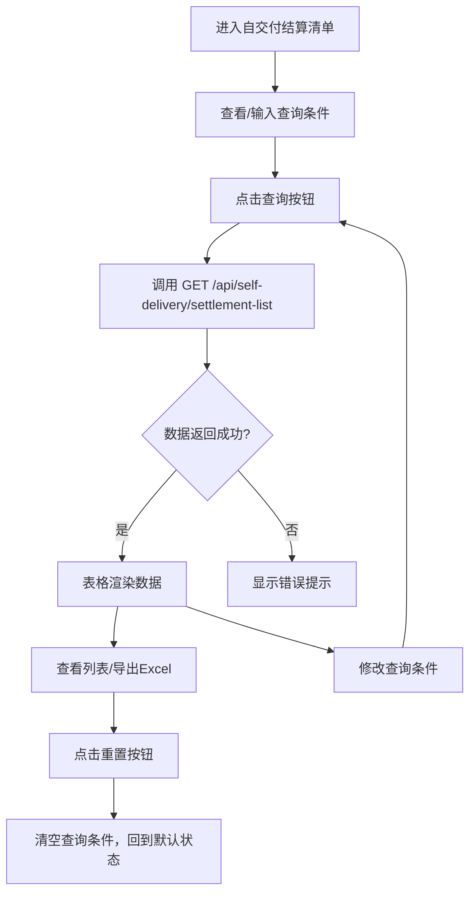

# 自交付结算清单 PRD

## 需求背景

### 痛点
- **问题现象**：自交付结算单分散在多个业务类型（项目型/小微标品/三联单），缺乏统一的清单查询入口，业务人员需要逐个系统查看结算单状态
- **发生频率**：高
- **当前 workaround**：业务人员通过线下表格或在不同模块中分别查询，效率低下

### 业务目标
- **量化指标**：单页查询响应时间 < 2s；支持按业务类型/状态/编码/申请人等6+维度查询
- **目标期限**：2026-Q2 上线

### 涉及系统/模块
- **模块名称**：自交付结算清单（SelfDeliverySettlementList）
- **变更类型**：新增
- **对接接口**：`GET /api/self-delivery/settlement-list`

---

## 用户故事

### 故事1
- **角色**：业务人员
- **功能**：按业务类型/结算状态/合同编码等条件查询自交付结算单明细
- **收益**：在一个页面快速定位需要跟踪的结算单，减少跨系统查询时间 50%
- **验收条件**：选择"业务类型=项目型"、"结算状态=审核中"，点击查询后，列表仅显示项目型且审核中的结算单

### 故事2
- **角色**：业务人员
- **功能**：通过合同/小微工单/三联单编码快速定位具体结算单
- **收益**：从合同系统中获取编码后，可直接跳转到对应结算单
- **验收条件**：在编码查询框输入"HT202604001"，点击查询后，列表仅显示该合同下的所有结算单

### 故事3
- **角色**：业务人员
- **功能**：按申请时间范围筛选结算单
- **收益**：快速查看某月/某季度的结算单处理情况
- **验收条件**：设置"申请时间起=2026-04-01"和"申请时间止=2026-04-30"，查询后仅显示4月结算单

### 故事4
- **角色**：业务人员
- **功能**：导出当前列表为Excel
- **收益**：便于离线分析与汇报
- **验收条件**：点击"导出"按钮后，下载包含所有可见列的Excel文件

---

## 需求清单

| 序号 | 需求描述 | 优先级 | 状态 | 负责人 | 截止日期 |
|------|----------|--------|------|--------|----------|
| 1 | 实现自交付结算清单页面，支持6+维度查询条件 | P0 | DONE | | |
| 2 | 列表展示序号/结算单名称/编码/经营单元/支局/业务类型/合同编码/前向自交付金额/已申请自交付金额/本次申请自交付金额/发放人员/申请日期/申请人/结算状态共14个字段 | P0 | DONE | | |
| 3 | 业务类型/结算状态字段以彩色标签展示（项目型=蓝、小微标品=绿、三联单=紫） | P1 | DONE | | |
| 4 | 发放人员以人员标签组展示，支持多人员 | P1 | DONE | | |
| 5 | 支持导出功能（Excel文件下载） | P1 | DONE | | |
| 6 | 支持重置按钮清空所有查询条件 | P0 | DONE | | |

- **优先级**：P0（核心流程阻塞）/ P1（重要功能）/ P2（体验优化）/ P3（未来规划）
- **状态**：TODO / IN PROGRESS / DONE / BLOCKED

---

## 业务流程图

---

## 页面结构

### 路由信息
- **路由路径**：`/self-delivery-settlement-list`
- **页面标题**：自交付结算清单
- **访问权限**：登录

### 布局结构
- **布局类型**：单栏
- **区域-页面标题**：页面标题 + 副标题
- **区域-查询条件卡片**：经营单元/支局/业务类型/结算状态/合同编码/申请人/时间范围
- **区域-操作栏**：记录数 + 导出按钮
- **区域-数据表格**：结算单列表（14列）

---

## 功能描述

### 功能点1：自交付结算清单查询

#### 页面级
- **字段：功能入口** - 类型：文本；描述：左侧菜单"自交付结算管理 → 自交付结算清单"进入
- **字段：前置条件** - 类型：文本；描述：用户已登录
- **字段：后置影响** - 类型：字段列表；描述：查询后表格区域显示对应结算单

#### Tab 级
无 Tab 结构

**查询条件字段**（8个）：
| 字段名 | 类型 | 必填 | 默认值 | 来源 | 校验规则 | 展示形式 | 交互约束 |
|--------|------|------|--------|------|----------|----------|----------|
| businessUnit（经营单元） | 文本 | 否 | - | 用户输入 | 模糊匹配 | 输入框 | 可编辑 |
| branch（支局） | 文本 | 否 | - | 用户输入 | 模糊匹配 | 输入框 | 可编辑 |
| businessType（业务类型） | 枚举 | 否 | 全部 | 用户选择 | 非空 | 下拉选择（项目型/小微标品/三联单/全部） | 可编辑 |
| settlementStatus（结算状态） | 枚举 | 否 | 全部 | 用户选择 | 非空 | 下拉选择（审核中/审核通过/审核驳回/发放中/可发放/已发放/全部） | 可编辑 |
| businessCode（合同/小微工单/三联单编码） | 文本 | 否 | - | 用户输入 | 模糊匹配 | 输入框 | 可编辑 |
| applicant（申请人） | 文本 | 否 | - | 用户输入 | 模糊匹配 | 输入框 | 可编辑 |
| applyTimeStart（申请时间起） | 日期 | 否 | - | 用户选择 | <= 申请时间止 | 日期控件 | 可编辑 |
| applyTimeEnd（申请时间止） | 日期 | 否 | - | 用户选择 | >= 申请时间起 | 日期控件 | 可编辑 |

**操作按钮字段**：
| 字段名 | 类型 | 必填 | 默认值 | 来源 | 校验规则 | 展示形式 | 交互约束 |
|--------|------|------|--------|------|----------|----------|----------|
| 查询按钮 | 按钮 | 是 | - | 系统 | 非空 | 主按钮 | 可点击，触发表格刷新 |
| 重置按钮 | 按钮 | 是 | - | 系统 | 非空 | 次按钮 | 可点击，清空查询条件 |
| 导出按钮 | 按钮 | 否 | - | 系统 | 非空 | 次按钮 | 可点击，下载Excel |

**字段列表**（14列）：
| 字段名 | 类型 | 必填 | 默认值 | 来源 | 校验规则 | 展示形式 | 交互约束 |
|--------|------|------|--------|------|----------|----------|----------|
| index（序号） | 数字 | 是 | - | 系统 | 自动编号 | 居中 | 只读 |
| settlementName（结算单名称） | 文本 | 是 | - | 接口返回 | 非空 | 文本 | 只读 |
| settlementCode（结算单编码） | 文本 | 是 | - | 接口返回 | 非空 | 文本 | 只读 |
| businessUnit（经营单元） | 文本 | 是 | - | 接口返回 | 非空 | 文本 | 只读 |
| branch（支局） | 文本 | 是 | - | 接口返回 | 非空 | 文本 | 只读 |
| businessType（业务类型） | 枚举 | 是 | - | 接口返回 | 项目型/小微标品/三联单 | 彩色标签 | 只读 |
| businessCode（合同/小微工单/三联单编码） | 文本 | 是 | - | 接口返回 | 非空 | 文本 | 只读 |
| forwardAmount（前向自交付金额） | 金额 | 是 | - | 接口返回 | >=0 | 右对齐 | 只读 |
| appliedAmount（已申请自交付金额） | 金额 | 是 | - | 接口返回 | >=0 | 右对齐蓝色 | 只读 |
| currentApplyAmount（本次申请自交付金额） | 金额 | 是 | - | 接口返回 | >=0 | 右对齐绿色加粗 | 只读 |
| payPersonnel（发放人员） | 数组 | 是 | - | 接口返回 | 非空 | 人员标签组 | 只读 |
| applyDate（申请日期） | 日期 | 是 | - | 接口返回 | 非空 | 居中 | 只读 |
| applicant（申请人） | 文本 | 是 | - | 接口返回 | 非空 | 文本 | 只读 |
| status（结算状态） | 枚举 | 是 | - | 接口返回 | 枚举值 | 状态徽章 | 只读 |

---

## 数据流图

### 接口1：自交付结算清单查询
- **请求路径**：`GET /api/self-delivery/settlement-list`
- **请求方法**：GET
- **请求头**：Authorization
- **请求参数**：
  - `businessUnit` - 类型：字符串；必填：否；来源：查询条件字段；校验：模糊匹配
  - `branch` - 类型：字符串；必填：否；来源：查询条件字段；校验：模糊匹配
  - `businessType` - 类型：字符串；必填：否；来源：查询条件字段；校验：枚举值
  - `status` - 类型：字符串；必填：否；来源：查询条件字段；校验：枚举值
  - `businessCode` - 类型：字符串；必填：否；来源：查询条件字段；校验：模糊匹配
  - `applicant` - 类型：字符串；必填：否；来源：查询条件字段；校验：模糊匹配
  - `applyTimeStart` - 类型：字符串；必填：否；来源：查询条件字段；校验：YYYY-MM-DD
  - `applyTimeEnd` - 类型：字符串；必填：否；来源：查询条件字段；校验：YYYY-MM-DD
- **响应字段**：
  - `id` - 类型：数字；描述：结算单ID
  - `settlementName` - 类型：字符串；描述：结算单名称
  - `settlementCode` - 类型：字符串；描述：结算单编码
  - `businessUnit` - 类型：字符串；描述：经营单元
  - `branch` - 类型：字符串；描述：支局
  - `businessType` - 类型：字符串；描述：业务类型
  - `businessCode` - 类型：字符串；描述：合同/小微工单/三联单编码
  - `forwardAmount` - 类型：字符串；描述：前向自交付金额
  - `appliedAmount` - 类型：字符串；描述：已申请自交付金额
  - `currentApplyAmount` - 类型：字符串；描述：本次申请自交付金额
  - `payPersonnel` - 类型：数组；描述：发放人员列表
  - `applyDate` - 类型：字符串；描述：申请日期
  - `applicant` - 类型：字符串；描述：申请人
  - `status` - 类型：字符串；描述：结算状态
- **存储位置**：数据库表 `self_delivery_settlement`
- **错误码**：
  - `401` - `未授权，请重新登录`
  - `500` - `服务器异常，请稍后重试`

### 数据刷新点
- **刷新时机**：查询按钮点击后 / 重置按钮点击后
- **影响字段**：表格数据、记录数

---

## 验收标准

### 正常流程
- [ ] **操作**：进入页面，所有查询条件为空，表格显示全部数据 → **预期**：表格渲染14列数据
- [ ] **操作**：选择"业务类型=项目型"，点击查询 → **预期**：表格仅显示项目型结算单
- [ ] **操作**：在"合同编码"输入"HT202604001"，点击查询 → **预期**：表格仅显示该合同下的结算单
- [ ] **操作**：设置"申请时间起=2026-04-01"和"申请时间止=2026-04-30"，点击查询 → **预期**：表格仅显示4月结算单
- [ ] **操作**：点击重置按钮 → **预期**：所有查询条件恢复默认，表格刷新
- [ ] **操作**：点击导出按钮 → **预期**：下载Excel文件，包含当前可见所有列

### 异常流程
- [ ] **操作**：查询接口返回 401 → **预期**：页面顶部显示"未授权，请重新登录"
- [ ] **操作**：查询接口返回 500 → **预期**：表格区域显示"服务器异常，请稍后重试"
- [ ] **操作**：网络断开时点击查询 → **预期**：显示"网络异常"提示
- [ ] **操作**：申请时间起 > 止 → **预期**：字段下方显示"开始日期不能大于结束日期"

---

## 更新记录

### v1 - 2026-06-08
- 初始版本：基于 SelfDeliverySettlementList.tsx 源码生成，14列结算单清单，支持6+维度查询
