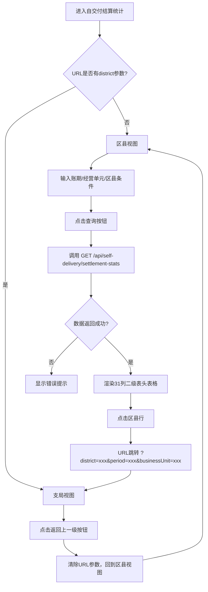

# 自交付结算统计 PRD

## 需求背景

### 痛点
- **问题现象**：自交付结算按业务类型分散在不同维度，缺乏统一的统计视图，决策层无法快速获取全量数据
- **发生频率**：中
- **当前 workaround**：管理员手动汇总多个模块的数据制作报表，周期长、易出错

### 业务目标
- **量化指标**：报表加载时间 < 3s；支持按账期/经营单元/区县维度统计；支持区县→支局下钻
- **目标期限**：2026-Q2 上线

### 涉及系统/模块
- **模块名称**：自交付结算统计（SelfDeliverySettlementStats）
- **变更类型**：新增
- **对接接口**：`GET /api/self-delivery/settlement-stats`

---

## 用户故事

### 故事1
- **角色**：业务管理员
- **功能**：按账期（年/月）查看全量自交付结算统计
- **收益**：快速了解每月/每季度的结算量、申请金额、审核金额、发放金额等关键指标
- **验收条件**：选择账期=2026-04，表格显示所有区县在4月的统计数据

### 故事2
- **角色**：业务管理员
- **功能**：按经营单元过滤统计
- **收益**：对比不同经营单元的结算绩效
- **验收条件**：在经营单元输入框输入"杭州分公司"，表格仅显示杭州分公司的统计数据

### 故事3
- **角色**：业务管理员
- **功能**：点击区县行下钻查看支局明细
- **收益**：从区县总览深入到支局级别，掌握更细粒度的数据
- **验收条件**：点击"西湖区"行，页面跳转到支局视图，显示西湖区下所有支局的明细

### 故事4
- **角色**：业务管理员
- **功能**：从支局视图返回区县视图
- **收益**：便捷地切换不同区县
- **验收条件**：在支局视图点击"返回上一级"按钮，URL参数清除，回到区县视图

---

## 需求清单

| 序号 | 需求描述 | 优先级 | 状态 | 负责人 | 截止日期 |
|------|----------|--------|------|--------|----------|
| 1 | 实现自交付结算统计页面，支持账期/经营单元/区县查询 | P0 | DONE | | |
| 2 | 二级表头：项目型/小微标品/三联单各占9列（数量+4字段×2数量/金额） | P0 | DONE | | |
| 3 | 区县视图展示账期/经营单元/区县+3组业务统计 | P0 | DONE | | |
| 4 | 区县行可点击 → URL跳转 ?district=xxx 切支局视图 | P0 | DONE | | |
| 5 | 支局视图展示账期/经营单元/支局+3组业务统计 | P0 | DONE | | |
| 6 | 支局视图显示"返回上一级"按钮 | P0 | DONE | | |
| 7 | 31列表格对齐 | P0 | DONE | | |
| 8 | 支持导出 | P1 | TODO | | |

- **优先级**：P0（核心流程阻塞）/ P1（重要功能）/ P2（体验优化）/ P3（未来规划）
- **状态**：TODO / IN PROGRESS / DONE / BLOCKED

---

## 业务流程图

---

## 页面结构

### 路由信息
- **路由路径**：`/self-delivery-settlement-stats`
- **页面标题**：自交付结算统计 / 自交付结算统计 - {区县}（支局明细）
- **访问权限**：登录

### 布局结构
- **布局类型**：单栏
- **区域-页面标题**：页面标题 + 副标题 + 返回按钮（支局视图）
- **区域-查询条件卡片**：账期/经营单元/区县
- **区域-操作栏**：账期/区县提示 + 导出按钮
- **区域-数据表格**：31列二级表头统计表格

---

## 功能描述

### 功能点1：自交付结算统计

#### 页面级
- **字段：功能入口** - 类型：文本；描述：左侧菜单"自交付结算管理 → 自交付结算统计"进入
- **字段：前置条件** - 类型：文本；描述：用户已登录
- **字段：后置影响** - 类型：字段列表；描述：查询/下钻后表格内容变化

**查询条件字段**（区县视图3个，支局视图2个）：
| 字段名 | 类型 | 必填 | 默认值 | 来源 | 校验规则 | 展示形式 | 交互约束 |
|--------|------|------|--------|------|----------|----------|----------|
| accountingPeriod（账期） | 月份 | 是 | 2026-04 | 用户选择 | YYYY-MM | 月份控件 | 可编辑 |
| businessUnit（经营单元） | 文本 | 否 | - | 用户输入 | 模糊匹配 | 输入框 | 可编辑 |
| district（区县） | 文本 | 否 | - | 用户输入 | 模糊匹配 | 输入框 | 可编辑（仅区县视图） |

**操作按钮字段**：
| 字段名 | 类型 | 必填 | 默认值 | 来源 | 校验规则 | 展示形式 | 交互约束 |
|--------|------|------|--------|------|----------|----------|----------|
| 查询按钮 | 按钮 | 是 | - | 系统 | 非空 | 主按钮 | 可点击，触发表格刷新 |
| 重置按钮 | 按钮 | 是 | - | 系统 | 非空 | 次按钮 | 可点击，清空查询条件 |
| 导出按钮 | 按钮 | 是 | - | 系统 | 非空 | 次按钮 | 可点击，下载Excel |
| 返回上一级按钮 | 按钮 | 是 | - | 系统 | 非空 | 次按钮 | 可点击，清除URL参数回到区县视图（仅支局视图） |

**字段列表**（31列，二级表头）：
- 一级表头：项目型 / 小微标品 / 三联单（各占9列）
- 二级表头：项目型数量 / 可申请（数量/金额）/ 已申请（数量/金额）/ 审核通过（数量/金额）/ 实际发放（数量/金额）

公共列（4列）：
| 字段名 | 类型 | 必填 | 默认值 | 来源 | 校验规则 | 展示形式 | 交互约束 |
|--------|------|------|--------|------|----------|----------|----------|
| index（序号） | 数字 | 是 | - | 系统 | 自动编号 | 居中 | 只读 |
| accountingPeriod（账期） | 月份 | 是 | 2026-04 | 接口返回 | YYYY-MM | 文本 | 只读 |
| businessUnit（经营单元） | 文本 | 是 | - | 接口返回 | 非空 | 文本 | 只读 |
| district（区县/支局） | 文本 | 是 | - | 接口返回 | 非空 | 文本/蓝色下划线可点击 | 只读 |

业务列（每组9列：1数量+4字段×2数量/金额）：

每行的"项目型"组（9列）：项目型数量 / 可申请数量 / 可申请金额 / 已申请数量 / 已申请金额 / 审核通过数量 / 审核通过金额 / 实际发放数量 / 实际发放金额

每行的"小微标品"组（9列）：小微标品订单数量 / 可申请数量 / 可申请金额 / 已申请数量 / 已申请金额 / 审核通过数量 / 审核通过金额 / 实际发放数量 / 实际发放金额

每行的"三联单"组（9列）：三联单数量 / 可申请数量 / 可申请金额 / 已申请数量 / 已申请金额 / 审核通过数量 / 审核通过金额 / 实际发放数量 / 实际发放金额

---

## 数据流图

### 接口1：自交付结算统计查询
- **请求路径**：`GET /api/self-delivery/settlement-stats`
- **请求方法**：GET
- **请求头**：Authorization
- **请求参数**：
  - `accountingPeriod` - 类型：字符串；必填：是；来源：查询条件字段；校验：YYYY-MM
  - `businessUnit` - 类型：字符串；必填：否；来源：查询条件字段；校验：模糊匹配
  - `district` - 类型：字符串；必填：否；来源：URL参数；校验：精确匹配
  - `view` - 类型：字符串；必填：否；来源：URL参数；校验：district/branch
- **响应字段**（区县视图）：
  - `id` - 类型：字符串；描述：记录ID
  - `accountingPeriod` - 类型：字符串；描述：账期
  - `businessUnit` - 类型：字符串；描述：经营单元
  - `district` - 类型：字符串；描述：区县
  - `project` - 类型：对象；描述：项目型5字段统计
  - `smallProduct` - 类型：对象；描述：小微标品5字段统计
  - `triple` - 类型：对象；描述：三联单5字段统计
- **响应字段**（支局视图）：将`district`字段替换为`branch`字段
- **存储位置**：数据库表 `self_delivery_settlement_stats`
- **错误码**：
  - `401` - `未授权，请重新登录`
  - `500` - `服务器异常，请稍后重试`

### 数据刷新点
- **刷新时机**：查询按钮点击后 / 重置按钮点击后 / URL参数变化
- **影响字段**：表格数据、当前视图状态（区县/支局）

---

## 验收标准

### 正常流程
- [ ] **操作**：进入页面（URL无district参数），默认显示区县视图 → **预期**：表格渲染31列二级表头，每个区县一行
- [ ] **操作**：点击"西湖区"行 → **预期**：URL变为`?district=西湖区&...`，页面跳转到支局视图
- [ ] **操作**：在支局视图点击"返回上一级"按钮 → **预期**：URL参数清除，回到区县视图
- [ ] **操作**：选择账期=2026-05，点击查询 → **预期**：表格数据刷新为5月数据
- [ ] **操作**：在经营单元输入框输入"杭州分公司"，点击查询 → **预期**：表格仅显示杭州分公司的数据

### 异常流程
- [ ] **操作**：查询接口返回 401 → **预期**：页面顶部显示"未授权，请重新登录"
- [ ] **操作**：查询接口返回 500 → **预期**：表格区域显示"服务器异常，请稍后重试"
- [ ] **操作**：网络断开时点击查询 → **预期**：显示"网络异常"提示
- [ ] **操作**：URL中district参数对应区县无数据 → **预期**：支局视图显示"暂无数据"提示

---

## 更新记录

### v1 - 2026-06-08
- 初始版本：基于 SelfDeliverySettlementStats.tsx 源码生成
- 二级表头31列（4公共+3×9业务列）
- 区县→支局下钻：URL参数+页面刷新
- 修复mock数据展示错位问题
