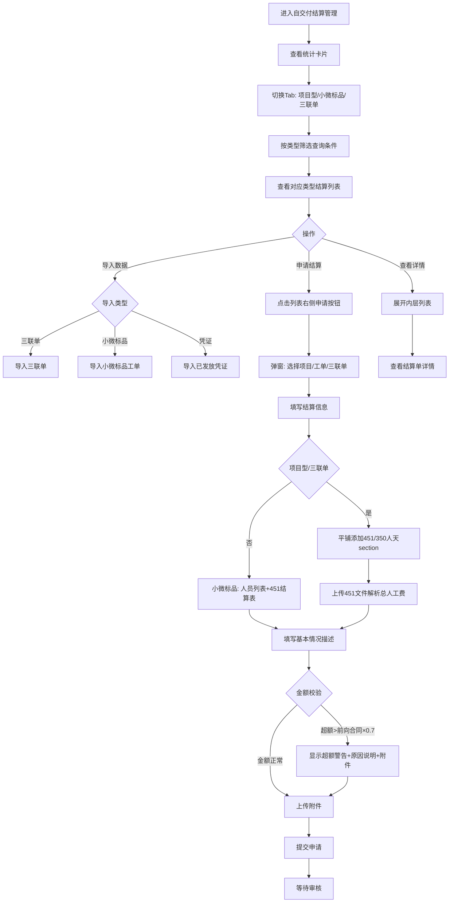

# 自交付结算管理

## 需求背景

### 痛点
- **问题现象**：当前业务中缺乏对自交付结算的集中管理，结算流程分散，难以追踪和统计各类型（项目型、小微标品、三联单）的结算状态。
- **发生频率**：高
- **当前 workaround**：通过线下表格或分散的系统进行管理

### 业务目标
- **量化指标**：提供统一的自交付结算管理入口，实现结算状态的实时追踪，支持导入、申请、审核、发放全流程线上化
- **目标期限**：尽快上线

### 涉及系统/模块
- **模块名称**：自交付结算管理
- **变更类型**：新增
- **对接接口**：纯前端静态页面

---

## 用户故事

### 故事1
- **角色**：财务人员/业务人员
- **功能**：查看各类型（项目型、小微标品、三联单）的结算统计情况
- **收益**：快速了解可发放、未发放、审核通过、实际发放的汇总数据
- **验收条件**：能够查看三类项目的统计数据卡片

### 故事2
- **角色**：业务人员
- **功能**：查询和筛选各商机/合同/项目的结算状态
- **收益**：快速定位需要处理的结算单，提高工作效率
- **验收条件**：能够按类型、商机、合同、项目、订单号、三联单号、结算状态等条件筛选

### 故事3
- **角色**：业务人员
- **功能**：导入三联单、导入小微标品订单、导入已发放凭证
- **收益**：批量导入结算数据，减少手工录入
- **验收条件**：支持Excel文件导入

### 故事4
- **角色**：业务人员
- **功能**：申请自交付结算
- **收益**：在线完成结算申请流程，减少线下沟通
- **验收条件**：能够选择结算项目、填写申请金额和人员信息

---

## 需求清单

| 序号 | 需求描述 | 优先级 | 状态 | 负责人 | 截止日期 |
|------|----------|--------|------|--------|----------|
| 1 | 左侧菜单增加自交付结算管理入口 | P0 | DONE | | |
| 2 | 统计卡片区域（项目型/小微标品/三联单各5项统计，全部基于全量数据） | P0 | DONE | | |
| 3 | 顶部Tab"项目型/小微标品/三联单"切换 | P0 | DONE | | |
| 4 | 查询条件区域（按Tab拆分：基础查询+特有查询） | P0 | DONE | | |
| 5 | 操作按钮（导入三联单/小微标品/凭证、导出） | P0 | DONE | | |
| 6 | 外层结算列表（不同Tab不同表头，含类型字段） | P0 | DONE | | |
| 7 | 内层结算单列表（可展开） | P0 | DONE | | |
| 8 | 申请自交付结算弹窗（无顶部Tab，直接展示当前类型） | P0 | DONE | | |
| 9 | 弹窗：项目型/三联单支持平铺添加多个451定额/350人天section | P0 | DONE | | |
| 10 | 弹窗：451定额支持上传文件解析总人工费 | P0 | DONE | | |
| 11 | 弹窗：小微标品统一人员列表+451结算表 | P0 | DONE | | |
| 12 | 弹窗：金额校验和超额提示（>前向合同自交付金额×0.7） | P0 | DONE | | |
| 13 | 弹窗：项目型低毛利提示（<15%） | P0 | DONE | | |
| 14 | 弹窗：维保项目自动拆分发放清单（按月份） | P1 | DONE | | |

---

## 业务流程图

---

## 页面结构

### 路由信息
- **路由路径** - self-delivery-settlement
- **页面标题** - 自交付结算管理
- **访问权限** - 登录

### 布局结构
- **布局类型** - 单栏
- **区域-页面标题** - 页面标题 + 副标题
- **区域-统计卡片** - 三类项目各5个统计指标（全部/可申请/审核通过/审核通过可发放/审核通过实际发放）
- **区域-类型Tab** - 项目型/小微标品/三联单三个Tab
- **区域-查询条件** - 按Tab拆分：基础查询（区域、经营单元、结算状态）+ 特有查询
- **区域-操作栏** - 结果统计 + 导入按钮 + 导出按钮
- **区域-外层表格** - 按Tab显示不同表头（含类型字段）
- **申请弹窗** - 申请自交付结算表单（无顶部Tab）

---

## 功能描述

### 功能点1：统计卡片展示

#### 页面级
- **字段：统计卡片组** - 类型：文本；描述：页面顶部显示三类项目统计卡片
- **字段：项目型自交付统计** - 类型：文本；描述：5项指标：全部/可申请/审核通过/审核通过可发放/审核通过实际发放
- **字段：小微标品统计** - 类型：文本；描述：5项指标：全部/可申请/审核通过/审核通过可发放/审核通过实际发放
- **字段：三联单统计** - 类型：文本；描述：5项指标：全部/可申请/审核通过/审核通过可发放/审核通过实际发放
- **重要**：统计卡片基于全量mock数据计算，不受顶部Tab切换影响

### 功能点2：类型Tab切换

- **位置**：统计卡片下方、查询条件上方
- **Tab列表**：项目型 / 小微标品 / 三联单
- **交互**：点击Tab切换列表和查询条件
- **联动**：切换Tab时自动按类型过滤列表数据

### 功能点3：查询条件（按Tab拆分）

#### 公共基础查询（项目型/小微标品）
| 字段名 | 类型 | 默认值 | 展示形式 | 交互约束 |
|--------|------|--------|----------|----------|
| 区域 | 文本 | - | 输入框 | 可编辑 |
| 经营单元 | 文本 | - | 输入框 | 可编辑 |
| 结算状态 | 枚举 | 全部 | 下拉选择 | 可编辑 |

#### 项目型特有查询
| 字段名 | 类型 | 默认展示 | 展开后展示 |
|--------|------|----------|------------|
| 商机名称 | 文本 | ✓ | - |
| 商机编码 | 文本 | - | ✓ |
| 合同名称 | 文本 | - | ✓ |
| 合同编码 | 文本 | - | ✓ |
| 项目名称 | 文本 | - | ✓ |
| 项目编码 | 文本 | - | ✓ |

#### 小微标品特有查询
| 字段名 | 类型 | 默认展示 | 展开后展示 |
|--------|------|----------|------------|
| 工单编号 | 文本 | ✓ | - |
| 主定单编码 | 文本 | - | ✓ |
| 订单编码 | 文本 | - | ✓ |
| 业务类型 | 枚举 | - | ✓ |
| 创建时间 | 日期范围 | - | ✓ |

#### 三联单查询
| 字段名 | 类型 | 默认展示 | 展开后展示 |
|--------|------|----------|------------|
| 经营单元 | 文本 | ✓ | - |
| 结算状态 | 枚举 | 全部 | - |
| 订单编码 | 文本 | ✓ | - |
| 受理的业务号码 | 文本 | ✓ | - |
| 资产唯一编码 | 文本 | - | ✓ |
| 优惠编码 | 文本 | - | ✓ |
| 优惠名称 | 文本 | - | ✓ |
| 创建时间 | 日期范围 | - | ✓ |

#### 操作按钮
| 字段名 | 类型 | 展示形式 |
|--------|------|----------|
| 展开/收起更多条件 | 链接 | 蓝色链接 |
| 重置 | 按钮 | 次按钮 |
| 查询 | 按钮 | 主按钮 |

### 功能点4：外层结算列表（按Tab不同表头）

#### 项目型表头
| 字段名 | 类型 | 来源 |
|--------|------|------|
| 展开 | 图标 | 系统 |
| 序号 | 数字 | 系统 |
| 经营单元 | 文本 | 接口 |
| 支局 | 文本 | 接口 |
| 类型 | 标签（项目型） | 接口 |
| 商机名称/编码、合同名称/编码、项目名称/编码 | 文本 | 接口 |
| 客户名称/编码 | 文本 | 接口 |
| 前向金额 | 金额 | 接口 |
| 模式会前向金额（自交付部分） | 金额 | 接口 |
| 模式会自交付金额 | 金额 | 接口 |
| 前向合同金额（自交付部分） | 金额 | 接口 |
| 最多可申请金额 | 金额 | 接口 |
| 已申请/可发放/实际发放 | 金额 | 接口 |
| 项目状态 | 枚举 | 接口 |
| 操作 | 链接按钮 | - |

#### 小微标品表头
| 字段名 | 类型 |
|--------|------|
| 展开、序号、类型（小微标品Badge）、区域、经营单元 | - |
| 工单编号、主订单编码、订单编码 | 文本 |
| 业务类型、客户名称、工单状态、收单人、环节名称 | - |
| 可申请/已申请/可发放/实际发放 | 金额 |
| 项目状态、操作 | - |

#### 三联单表头
| 字段名 | 类型 |
|--------|------|
| 展开、序号、类型（三联单Badge）、经营单元 | - |
| VIP客户名称/VIP卡号/统计合同额/竣工时间 | - |
| 受理归属分局/支局、受理人名称/工号、受理金额、受理时间 | - |
| 订单编码/状态、资产唯一编码、业务号码 | - |
| 优惠编码/名称、翼装大师、营销归属分局/支局、营销人姓名/工号 | - |
| 可申请/已申请/可发放/实际发放 | 金额 |
| 项目状态、操作 | - |

### 功能点4：内层结算单列表

#### 内层列表字段
| 字段名 | 类型 | 必填 | 默认值 | 来源 | 校验规则 | 展示形式 | 交互约束 |
|--------|------|------|--------|------|----------|----------|----------|
| 序号 | 数字 | - | 自动编号 | 系统 | - | 数字 | 只读 |
| 结算单名称 | 文本 | - | - | 接口 | - | 文本超长省略 | 只读 |
| 结算单号 | 文本 | - | - | 接口 | - | 文本 | 只读 |
| 申请金额 | 金额 | - | - | 接口 | - | 金额右对齐绿色 | 只读 |
| 结算类型 | 枚举 | - | - | 接口 | - | 标签 | 只读 |
| 人数（姓名） | 数组 | - | - | 接口 | - | 人员标签组 | 只读 |
| 人天 | 数字 | - | - | 接口 | - | 数字居中 | 只读 |
| 是否维保 | 布尔 | - | - | 接口 | - | 是/否 居中 | 只读 |
| 周期 | 文本 | - | - | 接口 | - | 文本居中 | 只读 |
| 开始时间 | 日期 | - | - | 接口 | - | 日期居中 | 只读 |
| 结束时间 | 日期 | - | - | 接口 | - | 日期居中 | 只读 |
| 申请日期 | 日期 | - | - | 接口 | - | 日期 | 只读 |
| 申请人 | 文本 | - | - | 接口 | - | 文本 | 只读 |
| 结算单状态 | 枚举 | - | - | 接口 | - | 状态标签（审核中/审核通过/审核驳回） | 只读 |
| 发放状态 | 枚举 | - | - | 接口 | - | 状态标签（待发放/可发放/已发放） | 只读 |
| 发放凭证 | 文件 | - | - | 接口 | - | 文件名超长省略 | 只读 |
| 类型 | 枚举 | - | - | 接口 | - | 标签 | 只读 |
| 操作 | 按钮组 | - | - | - | - | 链接按钮 | 可点击 |

### 功能点5：申请自交付结算弹窗

#### 弹窗级
- **弹窗：申请自交付结算**
  - **触发入口**：点击列表行右侧"申请自交付结算"按钮（**移除**顶部主按钮）
  - **关闭方式**：遮罩层点击 / 关闭图标 / 取消按钮
  - **布局形式**：单页面滚动表单（不分步骤）
  - **重要**：**无顶部申请类型Tab**，弹窗打开时根据行数据直接展示对应类型内容

##### 第一部分：选择申请项目
- 默认根据所选行展示对应类型（项目型/小微标品/三联单）的基本信息
- 选择项目/工单/三联单的子弹窗逻辑保持不变

**项目型选择弹窗字段：**
| 字段名 | 类型 | 必填 | 默认值 | 来源 | 校验规则 | 展示形式 | 交互约束 |
|--------|------|------|--------|------|----------|----------|----------|
| 客户名称 | 文本 | 否 | - | 用户输入 | 模糊匹配 | 输入框 | 可编辑 |
| 客户编码 | 文本 | 否 | - | 用户输入 | 精确匹配 | 输入框 | 可编辑 |
| 商机名称 | 文本 | 否 | - | 用户输入 | 模糊匹配 | 输入框 | 可编辑 |
| 商机编码 | 文本 | 否 | - | 用户输入 | 精确匹配 | 输入框 | 可编辑 |
| 合同名称 | 文本 | 否 | - | 用户输入 | 模糊匹配 | 输入框 | 可编辑 |
| 合同编码 | 文本 | 否 | - | 用户输入 | 精确匹配 | 输入框 | 可编辑 |
| 项目名称 | 文本 | 否 | - | 用户输入 | 模糊匹配 | 输入框 | 可编辑 |
| 项目编码 | 文本 | 否 | - | 用户输入 | 精确匹配 | 输入框 | 可编辑 |

**项目型选中展示字段：**
| 字段名 | 类型 | 必填 | 默认值 | 来源 | 校验规则 | 展示形式 | 交互约束 |
|--------|------|------|--------|------|----------|----------|----------|
| 客户名称 | 文本 | - | - | 接口返回 | - | 文本 | 只读 |
| 客户编码 | 文本 | - | - | 接口返回 | - | 文本 | 只读 |
| 合同名称 | 文本 | - | - | 接口返回 | - | 文本 | 只读 |
| 合同编码 | 文本 | - | - | 接口返回 | - | 文本 | 只读 |
| 合同金额 | 金额 | - | - | 接口返回 | - | 文本绿色 | 只读 |
| 项目名称 | 文本 | - | - | 接口返回 | - | 文本 | 只读 |
| 项目编码 | 文本 | - | - | 接口返回 | - | 文本 | 只读 |
| 项目类型 | 标签 | - | - | 接口返回 | - | 蓝色标签 | 只读 |
| 项目类别 | 标签 | - | - | 接口返回/默认WIFI组网 | - | 紫色标签 | 只读（申请/修改/查看统一） |
| 前向金额 | 金额 | - | - | 接口返回 | - | 文本 | 只读 |
| 成本金额 | 金额 | - | - | 接口返回 | - | 文本 | 只读 |
| 毛利 | 百分比 | - | - | 接口返回 | - | 文本绿色 | 只读 |
| 自交付金额 | 金额 | - | - | 接口返回 | - | 文本 | 只读 |
| 最多可申请金额 | 金额 | - | - | 接口返回 | - | 蓝色加粗 | 只读 |
| 已申请金额 | 金额 | - | - | 接口返回 | - | 文本 | 只读 |
| 已申请金额毛利 | 百分比 | - | - | 接口返回 | - | 红色警告 | 只读 |

**小微标品选择弹窗字段：**
| 字段名 | 类型 | 必填 | 默认值 | 来源 | 校验规则 | 展示形式 | 交互约束 |
|--------|------|------|--------|------|----------|----------|----------|
| 工单编号 | 文本 | 否 | - | 用户输入 | 模糊匹配 | 输入框 | 可编辑 |
| 订单编码 | 文本 | 否 | - | 用户输入 | 精确匹配 | 输入框 | 可编辑 |
| 客户名称 | 文本 | 否 | - | 用户输入 | 模糊匹配 | 输入框 | 可编辑 |
| 业务类型 | 文本 | 否 | - | 用户输入 | 模糊匹配 | 输入框 | 可编辑 |

**小微标品选中展示字段（全部16个字段）：**
| 字段名 | 类型 | 必填 | 默认值 | 来源 | 校验规则 | 展示形式 | 交互约束 |
|--------|------|------|--------|------|----------|----------|----------|
| 工单编号 | 文本 | - | - | 接口返回 | - | 文本加粗 | 只读 |
| 经营单元 | 文本 | - | - | 接口返回 | - | 文本 | 只读 |
| 区域 | 文本 | - | - | 接口返回 | - | 文本 | 只读 |
| 主定单编码 | 文本 | - | - | 接口返回 | - | 文本 | 只读 |
| 备件库标签 | 文本 | - | - | 接口返回 | - | 文本 | 只读 |
| 标准小微标签 | 文本 | - | - | 接口返回 | - | 文本 | 只读 |
| 业务类型 | 文本 | - | - | 接口返回 | - | 文本 | 只读 |
| 收单人/岗 | 文本 | - | - | 接口返回 | - | 文本 | 只读 |
| 环节名称 | 文本 | - | - | 接口返回 | - | 文本 | 只读 |
| 订单编码 | 文本 | - | - | 接口返回 | - | 文本 | 只读 |
| 结束日期 | 日期 | - | - | 接口返回 | - | 日期 | 只读 |
| 工单状态 | 枚举 | - | - | 接口返回 | - | 状态标签 | 只读 |
| 客户名称 | 文本 | - | - | 接口返回 | - | 文本加粗 | 只读 |
| 创建时间 | 日期时间 | - | - | 接口返回 | - | 日期时间 | 只读 |
| 历时 | 文本 | - | - | 接口返回 | - | 文本 | 只读 |

**三联单选择弹窗字段：**
| 字段名 | 类型 | 必填 | 默认值 | 来源 | 校验规则 | 展示形式 | 交互约束 |
|--------|------|------|--------|------|----------|----------|----------|
| 订单编码 | 文本 | 否 | - | 用户输入 | 模糊匹配 | 输入框 | 可编辑 |
| VIP客户名称 | 文本 | 否 | - | 用户输入 | 模糊匹配 | 输入框 | 可编辑 |
| 受理归属分局 | 文本 | 否 | - | 用户输入 | 模糊匹配 | 输入框 | 可编辑 |
| 经营单元 | 文本 | 否 | - | 用户输入 | 模糊匹配 | 输入框 | 可编辑 |

**三联单选中展示字段（分组展示）：**

*基本信息（5个字段）：*
| 字段名 | 类型 | 必填 | 默认值 | 来源 | 校验规则 | 展示形式 | 交互约束 |
|--------|------|------|--------|------|----------|----------|----------|
| 经营单元 | 文本 | - | - | 接口返回 | - | 蓝色背景文本 | 只读 |
| VIP客户名称 | 文本 | - | - | 接口返回 | - | 文本 | 只读 |
| VIP卡号 | 文本 | - | - | 接口返回 | - | 文本 | 只读 |
| 统计合同额 | 金额 | - | - | 接口返回 | - | 绿色大字体加粗 | 只读 |
| 竣工时间 | 日期时间 | - | - | 接口返回 | - | 日期时间 | 只读 |

*受理信息（14个字段）：*
| 字段名 | 类型 | 必填 | 默认值 | 来源 | 校验规则 | 展示形式 | 交互约束 |
|--------|------|------|--------|------|----------|----------|----------|
| 受理归属分局 | 文本 | - | - | 接口返回 | - | 文本 | 只读 |
| 受理归属支局 | 文本 | - | - | 接口返回 | - | 文本 | 只读 |
| 受理时间 | 日期时间 | - | - | 接口返回 | - | 日期时间 | 只读 |
| 受理人工号 | 文本 | - | - | 接口返回 | - | 文本 | 只读 |
| 受理人名称 | 文本 | - | - | 接口返回 | - | 文本 | 只读 |
| 资产唯一编码 | 文本 | - | - | 接口返回 | - | 文本 | 只读 |
| 订单编码 | 文本 | - | - | 接口返回 | - | 文本 | 只读 |
| 受理的业务号码 | 文本 | - | - | 接口返回 | - | 文本 | 只读 |
| 优惠编码 | 文本 | - | - | 接口返回 | - | 文本 | 只读 |
| 优惠名称 | 文本 | - | - | 接口返回 | - | 文本 | 只读 |
| 受理金额 | 金额 | - | - | 接口返回 | - | 绿色加粗 | 只读 |
| 受理日期 | 日期 | - | - | 接口返回 | - | 日期 | 只读 |
| 订单来源是否翼装大师 | 枚举 | - | - | 接口返回 | - | 是/否标签 | 只读 |
| 订单状态 | 枚举 | - | - | 接口返回 | - | 状态标签 | 只读 |

*营销信息（4个字段）：*
| 字段名 | 类型 | 必填 | 默认值 | 来源 | 校验规则 | 展示形式 | 交互约束 |
|--------|------|------|--------|------|----------|----------|----------|
| 营销人工号 | 文本 | - | - | 接口返回 | - | 文本 | 只读 |
| 营销人姓名 | 文本 | - | - | 接口返回 | - | 文本 | 只读 |
| 营销人员归属分局 | 文本 | - | - | 接口返回 | - | 文本 | 只读 |
| 营销人员归属支局 | 文本 | - | - | 接口返回 | - | 文本 | 只读 |

##### 第二部分：结算信息

**小微标品结算信息：**
- **人员列表**：动态表格，至少1人
- 字段：姓名、人力编码、金额（每行独立）
- 系统自动汇总：交付总人工费 = 所有人员金额之和
- **结算金额**：输入框，默认值=交付总人工费
- **小微标品无451/350人天类型切换**（已移除视联网/机房整治子类型）
- 附件中增加"451结算表"上传

**项目型/三联单结算信息（平铺添加section）：**
- 默认空数组，显示两个添加按钮：
  - "添加451定额"按钮
  - "添加350人天"按钮
- 用户点击添加后，section平铺展示，每个section可独立删除
- 多个section支持混合（项目型可同时存在多个451+多个350人天）
- 每个section维护独立的总人工费、结算金额、人员列表

**451定额section字段：**
| 字段名 | 类型 | 必填 | 展示形式 | 交互约束 |
|--------|------|------|----------|----------|
| 上传451文件 | 文件 | 否 | 上传按钮 | 可点击，模拟解析后自动填充总人工费 |
| 已上传文件 | 文件名 | - | 蓝色文本 | 只读 |
| 总人工费 | 金额 | 是 | 输入框 | 可编辑，模拟解析后自动填充20000-100000 |
| 结算金额 | 金额 | 是 | 输入框 | 可编辑，自动=总人工费×0.4 |
| 人员列表 | 数组 | 是 | 动态表格 | 可编辑 |

**350人天section字段：**
| 字段名 | 类型 | 必填 | 展示形式 | 交互约束 |
|--------|------|------|----------|----------|
| 结算金额 | 金额 | 是 | 输入框 | 可编辑，自动=人员人天×350之和 |
| 人员列表 | 数组 | 是 | 动态表格 | 可编辑，每行有人天字段 |

**人员表格公共字段：**
| 字段名 | 类型 | 必填 | 展示形式 | 交互约束 |
|--------|------|------|----------|----------|
| 姓名 | 文本 | 是 | 输入框 | 可编辑 |
| 人力编码 | 文本 | 是 | 输入框 | 可编辑 |
| 金额 | 金额 | 是 | 输入框 | 可编辑 |
| 人天（仅350） | 数字 | 是 | 输入框 | 可编辑，金额=人天×350 |
| 删除 | 按钮 | - | 红色垃圾桶 | 可点击，section至少保留1人 |

**结算金额合计：**
- 显示所有section结算金额之和
- 蓝色加粗大字号
- 紧随其下：维保发放清单（条件满足时）

**维保发放清单（仅项目型）：**
- **触发条件**：是否周期型维保项目=是 + 周期+开始/结束时间都已填写
- 根据周期数字自动拆分成N条记录
- 每期金额 = 结算金额合计 / 周期月份数
- 按月份日期自动生成（第1期=开始时间，第2期=开始时间+1月...）
- 状态自动判断：
  - 期数 ≤ 当前月份（2026年6月）→ "可发放"（绿色背景）
  - 期数 > 当前月份 → "待发放"（灰色背景）
- 3列网格展示，每期显示：第N期 + 日期 + 金额 + 状态

##### 第三部分：基本情况描述
| 字段名 | 类型 | 必填 | 校验规则 | 展示形式 |
|--------|------|------|----------|----------|
| 描述类型 | 树形枚举 | 是 | 非空 | 单下拉框（SelectGroup分组），一级+二级合并展示 |
| 自交付基本情况描述 | 文本 | 是 | 非空 | 多行文本框，宽度w-72 |

**描述类型二级级联选项（一级10个分组+二级42项）：**
- 视联网收编：AI 能力叠加、NVR/CVR 调试
- 服务器：私有云电脑部署、网管平台部署、超融合部署、底层系统安装、AI 私有化部署
- 网络传输（路由/交换/无线/FTTR-B）：组网方案撰写、优化方案撰写、设备调试、设备版本升级、业务割接、网络排障、网络维保
- 网络安全：边界防护与访问控制（防火墙-安全大脑）、上网行为管理、定期扫描与风险评估（漏洞扫描）、互联网 VPN 组网（非电信VPN）、认证服务器接入、国际网络接入（需审批）
- 会议保障：重保方案撰写、会场无线调优、5G 信号保障车租赁、应急电源车租赁
- 综合布线：光缆布放熔接、固话线路布放、有线点位布放、AP 点位勘测与无线覆盖、门禁系统部署、监控系统部署、道闸安装、智能家居安装
- 机房搬迁：服务器搬迁、网络设备搬迁、安全设备搬迁、UPS 搬迁、线路整理、拓扑绘制、线路信息表
- 硬件巡检：设备告警状态巡检、设备维保周期核查、评估报告输出

**详细描述自动填充机制：**
- 用户选择二级选项后，对应二级项的 description 字段自动填充到"自交付基本情况描述"多行文本框
- 用户可继续手动编辑多行文本框内容
- 切换一级分类时，textarea 内容清空，二级下拉重置

**项目型低毛利提示（自动触发）：**
- **触发条件**：项目型 + 申请实际毛利 < 15%
- **申请实际毛利计算公式**：已申请金额 / 前向合同自交付金额 × 100%
- 红色背景警告框：
  - 图标 + 提示语："模式会毛利15%，申请金额毛利为X%，严重低于模式会阶段毛利"
  - 原因说明 textarea
  - 附件上传区

**结算金额超额提示（自动触发）：**
- **触发条件**：所有section结算金额之和 > 前向合同自交付金额 × 0.7
- 红色背景警告框：
  - 图标 + 提示语："自交付结算金额大于前向合同自交付金额×0.7，请提交说明"
  - 显示：结算金额合计、限额、前向合同自交付金额
  - 原因说明 textarea
  - 附件上传区

**单section金额超限提示：**
- **触发条件**：单个section结算金额 > 前向合同自交付金额 × 0.7
- 输入框后显示橙色文字"已超过规范要求金额"
- 强制校验：结算金额 ≤ 前向合同自交付金额（超出时自动截断）

##### 第三部分：基本情况描述
| 字段名 | 类型 | 必填 | 默认值 | 来源 | 校验规则 | 展示形式 | 交互约束 |
|--------|------|------|--------|------|----------|----------|----------|
| 自交付基本情况描述 | 文本 | 是 | - | 用户输入 | 非空、长度限制 | 多行文本框 | 可编辑 |

##### 第四部分：附件

**自动带出附件（仅项目型显示）：**
| 字段名 | 类型 | 必填 | 来源 |
|--------|------|------|------|
| 模式会纪要 | 文件 | 是(项目型) | 自动带出 |
| 前向合同 | 文件 | 是(项目型) | 自动带出 |
| 前向录收订单 | 文件 | 否 | 自动带出 |
| 前向验收报告 | 文件 | 是(项目型) | 自动带出 |
| 收款记录 | 文件 | 否 | 自动带出 |

**手工上传附件（按类型不同）：**
- 全部类型共有：交付清单（是）、设计图（否）、实施过程照片（是）
- 小微标品/三联单额外：录收订单（是）、验收报告（是）、收款记录（否）
- 小微标品额外：451结算表（是）

| 字段名 | 类型 | 项目型 | 小微标品 | 三联单 |
|--------|------|--------|----------|--------|
| 交付清单 | 文件 | ✓ | ✓ | ✓ |
| 设计图 | 文件 | ✓ | ✓ | ✓ |
| 实施过程照片 | 文件 | ✓ | ✓ | ✓ |
| 录收订单 | 文件 | - | ✓ | ✓ |
| 验收报告 | 文件 | - | ✓ | ✓ |
| 收款记录 | 文件 | - | ✓ | ✓ |
| 451结算表 | 文件 | - | ✓（小微标品特有） | - |

  - **提交按钮**：点击后调用 `POST /api/self-delivery/apply`，成功关闭弹窗刷新列表，失败显示错误信息
  - **取消按钮**：点击后关闭弹窗，不调用接口

---

## 数据流图

### 接口1：获取结算列表
- **请求路径** - 类型：文本；示例：`GET /api/self-delivery/settlement/list`
- **请求方法** - 类型：GET；必填：是
- **请求头** - `Authorization: Bearer {token}`
- **请求参数** - 字段列表：
  - `type` - 类型：字符串；必填：否；来源：页面字段 `类型`；校验：枚举
  - `oppName` - 类型：字符串；必填：否；来源：页面字段 `商机名称`；校验：模糊匹配
  - `oppCode` - 类型：字符串；必填：否；来源：页面字段 `商机编码`；校验：精确匹配
  - `contractName` - 类型：字符串；必填：否；来源：页面字段 `合同名称`；校验：模糊匹配
  - `contractCode` - 类型：字符串；必填：否；来源：页面字段 `合同编码`；校验：精确匹配
  - `projectName` - 类型：字符串；必填：否；来源：页面字段 `项目名称`；校验：模糊匹配
  - `projectCode` - 类型：字符串；必填：否；来源：页面字段 `项目编码`；校验：精确匹配
  - `orderNo` - 类型：字符串；必填：否；来源：页面字段 `订单号`；校验：精确匹配
  - `tripleNo` - 类型：字符串；必填：否；来源：页面字段 `三联单号`；校验：精确匹配
  - `status` - 类型：字符串；必填：否；来源：页面字段 `结算状态`；校验：枚举
  - `page` - 类型：数字；必填：否；默认值：1
  - `pageSize` - 类型：数字；必填：否；默认值：20
- **响应字段** - 字段列表：
  - `code` - 类型：数字；描述：响应状态码
  - `message` - 类型：字符串；描述：响应消息
  - `data` - 类型：数组；描述：结算列表数据
    - `id` - 类型：字符串；描述：结算记录ID
    - `businessUnit` - 类型：字符串；描述：经营单元
    - `branch` - 类型：字符串；描述：支局
    - `type` - 类型：字符串；描述：类型（项目型/小微标品/三联单）
    - `oppName` - 类型：字符串；描述：商机名称
    - ...（其他字段同上表）
    - `innerList` - 类型：数组；描述：内层结算单列表
- **存储位置** - 数据库表 `self_delivery_settlement`
- **错误码** - 字段列表：
  - `401` - 未授权，请重新登录
  - `500` - 服务器异常，请稍后重试

### 接口2：申请自交付结算
- **请求路径** - 类型：文本；示例：`POST /api/self-delivery/settlement/apply`
- **请求方法** - 类型：POST；必填：是
- **请求头** - `Authorization: Bearer {token}`、`Content-Type: application/json`
- **请求参数** - 字段列表：
  - `settlementId` - 类型：字符串；必填：是；来源：弹窗选择的项目ID
  - `applyAmount` - 类型：数字；必填：是；来源：弹窗输入的申请金额
  - `settlementMethod` - 类型：字符串；必填：是；来源：弹窗选择的结算类型
  - `members` - 类型：数组；必填：是；来源：弹窗选择的参与人员
  - `personDays` - 类型：数字；必填：是；来源：弹窗输入的人天
  - `reason` - 类型：字符串；必填：是；来源：弹窗输入的申请事由
- **响应字段** - 字段列表：
  - `code` - 类型：数字；描述：响应状态码
  - `message` - 类型：字符串；描述：响应消息
  - `data` - 类型：对象；描述：创建的结算单信息
- **存储位置** - 数据库表 `self_delivery_record`
- **错误码** - 字段列表：
  - `400` - 参数错误，请检查输入
  - `401` - 未授权，请重新登录
  - `500` - 服务器异常，请稍后重试

### 数据刷新点
- **刷新时机** - 页面加载时 / 点击查询按钮时 / 操作成功后
- **影响字段** - 统计卡片数据、外层列表数据

---

## 验收标准

### 正常流程
- [ ] **操作**：进入自交付结算管理页面 → **预期**：显示统计卡片区域（项目型/小微标品/三联单各4个统计指标）
- [ ] **操作**：点击"更多"按钮 → **预期**：展开订单号、三联单号查询条件
- [ ] **操作**：选择"类型"为"项目型"，点击"查询" → **预期**：列表仅显示项目型数据，统计卡片仅统计项目型
- [ ] **操作**：点击列表展开按钮 → **预期**：显示内层结算单列表
- [ ] **操作**：点击"申请自交付结算"按钮 → **预期**：弹出申请表单弹窗
- [ ] **操作**：点击"导入三联单"按钮 → **预期**：打开文件选择对话框

### 异常流程
- [ ] **操作**：不填写必填字段直接提交申请 → **预期**：显示红色错误提示，提交按钮置灰
- [ ] **操作**：申请金额超过可申请金额 → **预期**：字段下方显示"不能超过可申请金额"提示
- [ ] **操作**：网络断开时点击查询 → **预期**：显示网络异常提示

---

## 更新记录

### v10 - 2026-06-08
- 自交付基本情况描述的描述类型改为单下拉框（SelectGroup分组），一级+二级合并展示
- 8个一级分类+42个二级选项（视联网收编/服务器/网络传输/网络安全/会议保障/综合布线/机房搬迁/硬件巡检）
- 选择二级选项自动填充"自交付基本情况描述"多行文本框
- 切换一级分类时textarea内容清空，二级下拉重置
- 描述类型下拉框宽度调整为w-72

### v9 - 2026-06-08
- **自交付结算统计表头重构**：
  - 一级表头：项目型/小微标品/三联单（各占5列）
  - 二级表头：5个独立列 = 数量 / 可申请(数量/金额) / 已申请(数量/金额) / 审核通过(数量/金额) / 实际发放(数量/金额)
  - 总列数：4（公共列：序号、账期、经营单元、区县/支局）+ 3×5（业务列）= 19列
  - 单元格展示每个二级字段独立显示数量+金额
- **下钻改URL参数+页面刷新**：
  - 删除原 expandedRows: Set<string> 状态
  - 点击区县行 → window.location.search = ?district=xxx&period=xxx&businessUnit=xxx 触发页面刷新
  - 页面 mount 时 useEffect 读取 URL 参数，自动切换到支局视图
  - 支局视图"区县"列名改为"支局"列
  - 支局视图显示"返回上一级"按钮，点击清除URL参数回到区县视图
  - 区县行的"区县"字段文字加下划线表示可点击

### v8 - 2026-06-08
- **菜单结构升级（二级菜单）**：
  - 原"自交付结算管理"由一级菜单升级为父菜单（id: self-delivery-settlement-group）
  - 下设5个子菜单：自交付结算管理/自交付结算清单/自交付结算统计/人员自交付结算清单/人员自交付结算统计
- **新增4个报表页面**：
  - **自交付结算清单**（SelfDeliverySettlementList）：
    - 查询条件：经营单元、支局、业务类型、结算状态、合同/小微工单/三联单编码、申请人、时间范围
    - 列表字段：序号、结算单名称、结算单编码、经营单元、支局、业务类型、合同/小微工单/三联单编码、前向自交付金额、已申请自交付金额、本次申请自交付金额、发放人员、申请日期、申请人、结算状态
  - **自交付结算统计**（SelfDeliverySettlementStats）：
    - 查询条件：账期、经营单元、区县
    - 支持区县→支局下钻（点击经营单元行展开支局级明细）
    - 三类业务（项目型/小微标品/三联单）各5个统计维度：数量/可申请总金额/已申请总金额/审核通过总金额/实际发放总金额
  - **人员自交付结算清单**（PersonSettlementList）：
    - 查询条件：经营单元、支局、结算人员、业务类型、结算状态、合同/小微工单/三联单编码、申请人、时间范围
    - 列表字段：序号、经营单元、支局、人员姓名、电话、工号、部门、结算单名称、结算单号、结算状态、结算金额、业务类型、合同/小微工单/三联单编码、申请人、申请时间
  - **人员自交付结算统计**（PersonSettlementStats）：
    - 查询条件：经营单元、支局、结算人员
    - 列表字段：序号、经营单元、支局、人员姓名、电话、工号、部门、5状态矩阵（审核中/审核通过/待发放/可发放/已发放）的单数+金额
- **内层列表优化**：
  - InnerRecord 数据结构重构：settlementMethod（单值）改为 settlementMethods（数组）
  - 支持一条记录同时拥有多个结算类型（451定额 + 350人天）
  - 表格去掉"人天"和"类型"字段
  - 每条记录按结算类型分组显示申请金额和人员明细
  - 统一 renderInnerList 函数支持三种类型Tab
- **Excel导出功能**（基于 xlsx 库）：
  - 安装 xlsx 依赖
  - 新增 utils/excelExport.ts 通用导出工具
  - 导出3个Sheet到单个Excel文件：
    - Sheet1: 外层列表（按业务类型分别输出3张表，每个类型表头不同）
    - Sheet2: 内层结算单（增加"合同/小微工单/三联单编码"列）
    - Sheet3: 人员结算清单（基于内层人员明细展开）
  - 文件名格式：自交付结算数据_YYYYMMDD.xlsx
- **技术实现**：
  - App.tsx 路由扩展5个新组件（懒加载）
  - Sidebar.tsx 父菜单 + 5子菜单结构
  - 区县→支局下钻使用 expandedRows: Set<string> + React.Fragment
  - xlsx 库通过 XLSX.utils.book_new + XLSX.utils.aoa_to_sheet 实现多Sheet合并

### v7 - 2026-06-05
- 列表页重构：
  - 删除顶部"全部/待我审核/历史审核"Tab
  - 新增顶部"项目型/小微标品/三联单"类型Tab（位于统计卡片下方）
  - 顶部统计基于全量数据，不受Tab筛选影响
  - 列表表头按类型显示不同列
  - 小微标品/三联单列表增加"类型"Badge字段
- 列表页操作栏：
  - 删除顶部"申请自交付结算"主按钮
  - 申请入口仅通过列表行右侧链接
- 查询条件重构：
  - 按Tab拆分：基础查询+特有查询
  - 项目型：默认显示区域、经营单元、结算状态、商机名称（4个），展开更多显示商机/合同/项目字段
  - 小微标品：默认显示区域、经营单元、结算状态、工单编号（4个），展开显示主定单/订单/业务类型/创建时间
  - 三联单：默认显示经营单元、结算状态、订单编码、业务号码（4个），展开显示资产编码/优惠/创建时间
  - 小微标品/三联单删除区域字段
- 申请自交付结算弹窗重构：
  - 删除顶部"申请类型"Tab
  - 默认展示当前申请类型的基本信息
  - 弹窗打开时根据行数据自动切换类型
- 结算信息模块重构（项目型/三联单）：
  - 删除Tab式结算类型选择
  - 支持平铺添加多个451定额/350人天section
  - 每个section可独立删除
  - 总人工费和结算金额都是输入框（结算金额自动=人工费×0.4）
  - 人员列表独立管理每个section
  - 451定额section支持上传文件，模拟解析后自动填充总人工费
- 结算信息模块重构（小微标品）：
  - 移除视联网/机房整治子类型
  - 统一为人员列表+交付总人工费（人员金额之和）=结算金额
  - 附件增加"451结算表"上传
- 金额校验和超额提示：
  - 强制：单section结算金额 ≤ 前向合同自交付金额
  - 提示：单section结算金额 > 前向合同自交付金额×0.7时，输入框后显示"已超过规范要求金额"（橙色）
  - 警告：所有section结算金额合计 > 前向合同自交付金额×0.7时，基本情况描述模块显示红色警告+原因说明+附件上传
- 申请实际毛利计算公式修复：
  - 公式：已申请金额 / 前向合同自交付金额 × 100%
  - 数据修正：项目1的appliedAmount从8000改为2000，使毛利13.3%能演示低毛利警告
- 维保发放清单自动拆分（仅项目型）：
  - 触发条件：是否周期型维保项目=是 + 周期+开始/结束时间都已填写
  - 按周期月份数自动拆分成N条记录
  - 每期金额=结算金额合计÷周期月份数
  - 按当前月份（2026-06）自动判断状态：1-6月可发放、7-12月待发放
- 附件模块：
  - 小微/三联单申请和查看弹窗中移除"自动带出附件"模块
  - 手工上传附件按类型区分：
    - 项目型：交付清单、设计图、实施过程照片
    - 小微标品：上述3个 + 录收订单、验收报告、收款记录、451结算表
    - 三联单：上述3个 + 录收订单、验收报告、收款记录
  - 切换申请类型时同步更新附件配置
  - 手工上传附件区块移除"手工上传附件"标题
- 低毛利提示位置调整：
  - 从项目基本信息模块移至"自交付基本情况描述"模块
  - 触发条件：项目型 + 申请实际毛利 < 15%
  - 提示内容：低毛利警告、原因说明textarea、附件上传区
- 状态管理优化：
  - 所有setter改为函数式更新 `prev => ...`
  - 删除setTimeout延迟
  - 解决React闭包stale state问题
- 输入框全改为受控组件（value + onChange），支持正确输入

### v6 - 2026-05-28
- 小微标品和三联单选择弹窗改大，和申请自交付结算弹窗一样大
  - 小微标品选择弹窗：宽度1400px，高度80vh
  - 三联单选择弹窗：宽度1600px，高度85vh
- 小微标品订单选择弹窗改名为"选择小微标品工单"
- 小微标品选择列表展示所有字段（16个）：工单编号、经营单元、区域、主定单编码、备件库标签、标准小微标签、业务类型、收单人/岗、环节名称、订单编码、结束日期、工单状态、客户名称、创建时间、历时、收单人/岗
- 三联单选择列表展示所有字段（30个）
- 小微标品选中展示所有16个字段
- 三联单选中展示分组展示：
  - 基本信息（5个）：经营单元、VIP客户名称、VIP卡号、统计合同额、竣工时间
  - 受理信息（14个）：受理归属分局、受理归属支局、受理时间、受理人工号、受理人名称、资产唯一编码、订单编码、受理的业务号码、优惠编码、优惠名称、受理金额、受理日期、订单来源是否翼装大师、订单状态
  - 营销信息（4个）：营销人工号、营销人姓名、营销人员归属分局、营销人员归属支局

### v5 - 2026-05-18
- 项目基本信息布局调整（一行3个字段，分两行）：
  - 第一行：模式会自交付前向金额、模式会自交付成本金额、模式会毛利（15%）
  - 第二行：前向合同自交付金额、最多可申请金额/已申请金额、申请实际毛利
- 项目类型和项目类别单独字段展示（不是Badge标签）
- 视联网计算说明区域：只显示交付总人工费、后期维护费/月，去掉结算金额
- 机房整治计算说明区域：只显示交付总人工费，去掉结算金额
- 451定额表单：总人工费和结算金额都默认展示金额（非输入框），小微标品自动计算，其他类型显示手动输入值

### v4 - 2026-05-18
- 顶部统计卡片重构：三个类型（项目型/小微标品/三联单）各5个统计项，共15个小卡片
  - 统计项：全部、可申请、审核通过、审核通过可发放、审核通过实际发放
- 查询条件"订单号"改为"小微标品工单编号"
- 弹窗项目型基本信息字段名称调整：
  - 前向金额 → 模式会自交付前向金额
  - 成本金额 → 模式会自交付成本金额
  - 毛利 → 模式会毛利（固定显示15%）
  - 自交付金额 → 前向合同自交付金额
  - 最多可申请金额（不变）
  - 已申请金额（不变）
  - 已申请金额毛利 → 申请实际毛利
  - 警告提示：模式会毛利15%，申请金额毛利为5%，严重低于模式会阶段毛利
- 当毛利率低于模式会时：
  - 红色背景警告框显示提示信息（提示：模式会毛利15%，申请金额毛利为5%，严重低于模式会阶段毛利）
  - 原因描述输入框（textarea）
  - 附件上传按钮
  - 以上内容放到"自交付基本情况描述"模块中显示
- 申请实际毛利字段改为百分比显示（如5%），不再显示金额

### v6 - 2026-06-23
- 查询条件拆分 3 个状态筛选（项目状态 / 结算单状态 / 发放状态），三大类型 Tab 都展示
- filter 逻辑：结算单/发放状态按"项目下任一 InnerRecord 命中"判定
- 外层表格新增 2 列：结算单状态 / 发放状态（汇总展示，取 innerList 最后一条状态）
- 表格 colSpan 22 → 24；min-w-[2400px] → 2500px
- Excel 导出同步加 2 列

### v5 - 2026-06-23
- 状态字段三态拆分：
  - 项目状态（外层维度）：待申请 / 已申请
  - 结算单状态（内层维度）：审核中 / 审核通过 / 审核驳回
  - 发放状态（内层维度）：待发放 / 可发放 / 已发放
- 外层三类型表头："状态" 列改为 "项目状态"，枚举值精简为 待申请/已申请
- 内层结算单表头：旧"状态"列拆为 2 列 —— 结算单状态 + 发放状态
- 内层结算单操作列新增 "查看发放清单" 按钮，点击弹窗展示人员发放清单
  - 弹窗结构同 PersonSettlementList 人员自交付结算清单
  - 数据来源：该 InnerRecord 下所有 settlementMethods.personList 展开
- 类型调整：SettlementRecord.status → projectStatus；InnerRecord.status → billStatus + payStatus
- 统计卡片逻辑改为按金额字段判断（approvedAmount > 0 / actualPaidAmount > 0）

### v4 - 2026-06-18
- 项目型外层列表字段调整：
  - 删除 4 列：是否维保 / 周期 / 开始时间 / 结束时间（移至内层结算单列表）
  - 改名 4 列 + 合并 1 列：前向金额（自交付重复列）→「模式会前向金额（自交付部分）」、成本金额→「模式会自交付金额」、自交付金额→「前向合同金额（自交付部分）」、可申请→「最多可申请金额」；原"前向合同自交付金额"列废弃合并
- 内层结算单列表新增 4 列：是否维保 / 周期 / 开始时间 / 结束时间
  - 位置：人员（金额/人天）之后、申请日期之前
  - 与申请日期/申请人/状态一致按 InnerRecord 维度 rowSpan 合并

### v3 - 2026-05-18
- 申请自交付结算弹窗-项目型基本信息增加"项目类别"字段，默认展示
- 视联网和机房整治表单增加计算公式说明
  - 视联网：交付总人工费 = NVR数量×100元 + 摄像头数量×100元；后期维护费 = 摄像头数量×3元/月
  - 机房整治：交付总人工费 = 9U机柜×200元 + 22U机柜×400元 + 42U机柜×800元 + 1U整治×80元 + 信息点×25元；22U、42U轻量版按50%执行
- 451定额中总人工费自动计算（小微标品-视联网/机房整治）

### v2 - 2026-05-14
- 新增申请自交付结算弹窗（单页面滚动表单）
  - 第一部分：选择申请项目（项目型/小微标品/三联单分类选择）
  - 第二部分：结算信息（视联网/机房整治/451定额/350人天多种结算类型）
  - 第三部分：基本情况描述
  - 第四部分：附件（自动带出+手工上传）
- 统计卡片样式优化：一行12个统计模块，每类项目4个指标（可发放/未发放/审核通过可发放/实际发放）

### v1 - 2026-05-14
- 初始版本，实现自交付结算管理页面