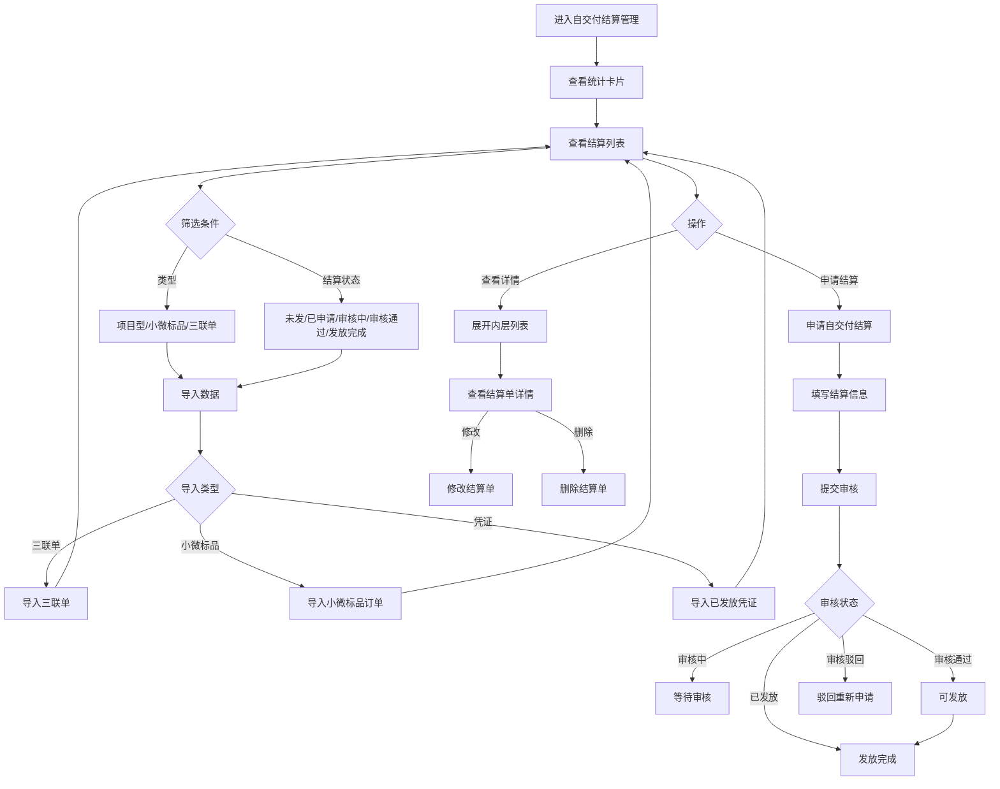

# 自交付结算管理

## 需求背景

### 痛点
- **问题现象**：当前业务中缺乏对自交付结算的集中管理，结算流程分散，难以追踪和统计各类型（项目型、小微标品、三联单）的结算状态。
- **发生频率**：高
- **当前 workaround**：通过线下表格或分散的系统进行管理

### 业务目标
- **量化指标**：提供统一的自交付结算管理入口，实现结算状态的实时追踪，支持导入、申请、审核、发放全流程线上化
- **目标期限**：尽快上线

### 涉及系统/模块
- **模块名称**：自交付结算管理
- **变更类型**：新增
- **对接接口**：纯前端静态页面

---

## 用户故事

### 故事1
- **角色**：财务人员/业务人员
- **功能**：查看各类型（项目型、小微标品、三联单）的结算统计情况
- **收益**：快速了解可发放、未发放、审核通过、实际发放的汇总数据
- **验收条件**：能够查看三类项目的统计数据卡片

### 故事2
- **角色**：业务人员
- **功能**：查询和筛选各商机/合同/项目的结算状态
- **收益**：快速定位需要处理的结算单，提高工作效率
- **验收条件**：能够按类型、商机、合同、项目、订单号、三联单号、结算状态等条件筛选

### 故事3
- **角色**：业务人员
- **功能**：导入三联单、导入小微标品订单、导入已发放凭证
- **收益**：批量导入结算数据，减少手工录入
- **验收条件**：支持Excel文件导入

### 故事4
- **角色**：业务人员
- **功能**：申请自交付结算
- **收益**：在线完成结算申请流程，减少线下沟通
- **验收条件**：能够选择结算项目、填写申请金额和人员信息

---

## 需求清单

| 序号 | 需求描述 | 优先级 | 状态 | 负责人 | 截止日期 |
|------|----------|--------|------|--------|----------|
| 1 | 左侧菜单增加自交付结算管理入口 | P0 | DONE | | |
| 2 | 统计卡片区域（项目型/小微标品/三联单各4项统计） | P0 | DONE | | |
| 3 | 查询条件区域（类型、商机/合同/项目信息、订单号、三联单号、结算状态） | P0 | DONE | | |
| 4 | 操作按钮（导入三联单、导入小微标品订单、导入已发放凭证、申请自交付结算、导出） | P0 | DONE | | |
| 5 | 外层结算列表（25个字段） | P0 | DONE | | |
| 6 | 内层结算单列表（可展开） | P0 | DONE | | |

---

## 业务流程图

---

## 页面结构

### 路由信息
- **路由路径** - self-delivery-settlement
- **页面标题** - 自交付结算管理
- **访问权限** - 登录

### 布局结构
- **布局类型** - 单栏
- **区域-页面标题** - 页面标题 + 副标题
- **区域-统计卡片** - 三类项目各4个统计指标（可发放/未发放/审核通过可发放/实际发放）
- **区域-查询条件** - 查询条件（类型、商机/合同/项目信息、订单号、三联单号、结算状态筛选）
- **区域-操作栏** - 结果统计 + 导入按钮 + 申请按钮 + 导出按钮
- **区域-外层表格** - 结算列表（含内层展开行）
- **申请弹窗** - 申请自交付结算表单

---

## 功能描述

### 功能点1：统计卡片展示

#### 页面级
- **字段：统计卡片组** - 类型：文本；描述：页面顶部显示三类项目统计卡片
- **字段：项目型自交付统计** - 类型：文本；描述：可发放项目数量/金额、未发放项目数量/金额、审核通过可发放项目数量/金额、实际发放项目数量/金额
- **字段：小微标品统计** - 类型：文本；描述：可发放项目数量/金额、未发放项目数量/金额、审核通过可发放项目数量/金额、实际发放项目数量/金额
- **字段：三联单统计** - 类型：文本；描述：可发放项目数量/金额、未发放项目数量/金额、审核通过可发放项目数量/金额、实际发放项目数量/金额

### 功能点2：查询条件

#### 查询条件字段
| 字段名 | 类型 | 必填 | 默认值 | 来源 | 校验规则 | 展示形式 | 交互约束 |
|--------|------|------|--------|------|----------|----------|----------|
| 类型 | 枚举 | 否 | 全部 | 接口 | - | 下拉选择 | 可编辑 |
| 商机名称 | 文本 | 否 | - | 用户输入 | 模糊匹配 | 输入框 | 可编辑 |
| 商机编码 | 文本 | 否 | - | 用户输入 | 精确匹配 | 输入框 | 可编辑 |
| 合同名称 | 文本 | 否 | - | 用户输入 | 模糊匹配 | 输入框 | 可编辑 |
| 合同编码 | 文本 | 否 | - | 用户输入 | 精确匹配 | 输入框 | 可编辑 |
| 项目名称 | 文本 | 否 | - | 用户输入 | 模糊匹配 | 输入框 | 可编辑 |
| 项目编码 | 文本 | 否 | - | 用户输入 | 精确匹配 | 输入框 | 可编辑 |
| 小微标品工单编号 | 文本 | 否 | - | 用户输入 | 精确匹配 | 输入框 | 可编辑 |
| 三联单号 | 文本 | 否 | - | 用户输入 | 精确匹配 | 输入框 | 可编辑 |
| 结算状态 | 枚举 | 否 | 全部 | 接口 | - | 下拉选择 | 可编辑 |

#### 操作按钮字段
| 字段名 | 类型 | 必填 | 默认值 | 来源 | 校验规则 | 展示形式 | 交互约束 |
|--------|------|------|--------|------|----------|----------|----------|
| 查询 | 按钮 | - | - | - | - | 主按钮 | 可点击 |
| 重置 | 按钮 | - | - | - | - | 次按钮 | 可点击 |
| 更多 | 按钮 | - | - | - | - | 链接按钮 | 可点击展开/收起 |

### 功能点3：外层结算列表

#### 外层列表字段
| 字段名 | 类型 | 必填 | 默认值 | 来源 | 校验规则 | 展示形式 | 交互约束 |
|--------|------|------|--------|------|----------|----------|----------|
| 展开 | 图标 | - | 收起 | 系统 | - | 展开/收起图标 | 可点击 |
| 序号 | 数字 | - | 自动编号 | 系统 | - | 数字 | 只读 |
| 经营单元 | 文本 | - | - | 接口 | - | 文本 | 只读 |
| 支局 | 文本 | - | - | 接口 | - | 文本 | 只读 |
| 类型 | 枚举 | - | - | 接口 | - | 标签 | 只读 |
| 商机名称 | 文本 | - | - | 接口 | - | 文本超长省略 | 只读 |
| 商机编码 | 文本 | - | - | 接口 | - | 文本 | 只读 |
| 合同名称 | 文本 | - | - | 接口 | - | 文本超长省略 | 只读 |
| 合同编码 | 文本 | - | - | 接口 | - | 文本 | 只读 |
| 项目名称 | 文本 | - | - | 接口 | - | 文本超长省略 | 只读 |
| 项目编码 | 文本 | - | - | 接口 | - | 文本 | 只读 |
| 客户名称 | 文本 | - | - | 接口 | - | 文本超长省略 | 只读 |
| 客户编码 | 文本 | - | - | 接口 | - | 文本 | 只读 |
| 前向金额 | 金额 | - | - | 接口 | - | 金额右对齐 | 只读 |
| 是否维保项目 | 布尔 | - | - | 接口 | - | 是/否 | 只读 |
| 周期 | 文本 | - | - | 接口 | - | 文本 | 只读 |
| 开始时间 | 日期 | - | - | 接口 | - | 日期 | 只读 |
| 结束时间 | 日期 | - | - | 接口 | - | 日期 | 只读 |
| 模式会自交付前向金额 | 金额 | - | - | 接口 | - | 金额右对齐 | 只读 |
| 模式会自交付成本金额 | 金额 | - | - | 接口 | - | 金额右对齐 | 只读 |
| 前向合同自交付金额 | 金额 | - | - | 接口 | - | 金额右对齐 | 只读 |
| 可申请金额 | 金额 | - | - | 接口 | - | 金额右对齐加粗 | 只读 |
| 已申请金额 | 金额 | - | - | 接口 | - | 金额右对齐蓝色 | 只读 |
| 审核通过可发放金额 | 金额 | - | - | 接口 | - | 金额右对齐绿色 | 只读 |
| 实际发放金额 | 金额 | - | - | 接口 | - | 金额右对齐加粗翠绿 | 只读 |
| 结算状态 | 枚举 | - | - | 接口 | - | 状态标签 | 只读 |
| 操作 | 按钮组 | - | - | - | - | 链接按钮 | 可点击 |

### 功能点4：内层结算单列表

#### 内层列表字段
| 字段名 | 类型 | 必填 | 默认值 | 来源 | 校验规则 | 展示形式 | 交互约束 |
|--------|------|------|--------|------|----------|----------|----------|
| 序号 | 数字 | - | 自动编号 | 系统 | - | 数字 | 只读 |
| 结算单名称 | 文本 | - | - | 接口 | - | 文本超长省略 | 只读 |
| 结算单号 | 文本 | - | - | 接口 | - | 文本 | 只读 |
| 申请金额 | 金额 | - | - | 接口 | - | 金额右对齐绿色 | 只读 |
| 结算类型 | 枚举 | - | - | 接口 | - | 标签 | 只读 |
| 人数（姓名） | 数组 | - | - | 接口 | - | 人员标签组 | 只读 |
| 人天 | 数字 | - | - | 接口 | - | 数字居中 | 只读 |
| 申请日期 | 日期 | - | - | 接口 | - | 日期 | 只读 |
| 申请人 | 文本 | - | - | 接口 | - | 文本 | 只读 |
| 状态 | 枚举 | - | - | 接口 | - | 状态标签 | 只读 |
| 发放凭证 | 文件 | - | - | 接口 | - | 文件名超长省略 | 只读 |
| 类型 | 枚举 | - | - | 接口 | - | 标签 | 只读 |
| 操作 | 按钮组 | - | - | - | - | 链接按钮 | 可点击 |

### 功能点5：申请自交付结算弹窗

#### 弹窗级
- **弹窗：申请自交付结算**
  - **触发入口**：点击操作列"申请自交付结算"按钮或顶部"申请自交付结算"按钮
  - **关闭方式**：遮罩层点击 / 关闭图标 / 取消按钮
  - **布局形式**：单页面滚动表单（不分步骤）

##### 第一部分：选择申请项目
| 字段名 | 类型 | 必填 | 默认值 | 来源 | 校验规则 | 展示形式 | 交互约束 |
|--------|------|------|--------|------|----------|----------|----------|
| 申请类型 | 枚举 | 是 | 项目型 | 用户选择 | 非空 | 单选按钮组 | 可编辑 |
| 选择项目 | 按钮 | 是 | - | 用户点击 | 打开子弹窗 | 选择弹窗 | 可点击 |

**项目型选择弹窗字段：**
| 字段名 | 类型 | 必填 | 默认值 | 来源 | 校验规则 | 展示形式 | 交互约束 |
|--------|------|------|--------|------|----------|----------|----------|
| 客户名称 | 文本 | 否 | - | 用户输入 | 模糊匹配 | 输入框 | 可编辑 |
| 客户编码 | 文本 | 否 | - | 用户输入 | 精确匹配 | 输入框 | 可编辑 |
| 商机名称 | 文本 | 否 | - | 用户输入 | 模糊匹配 | 输入框 | 可编辑 |
| 商机编码 | 文本 | 否 | - | 用户输入 | 精确匹配 | 输入框 | 可编辑 |
| 合同名称 | 文本 | 否 | - | 用户输入 | 模糊匹配 | 输入框 | 可编辑 |
| 合同编码 | 文本 | 否 | - | 用户输入 | 精确匹配 | 输入框 | 可编辑 |
| 项目名称 | 文本 | 否 | - | 用户输入 | 模糊匹配 | 输入框 | 可编辑 |
| 项目编码 | 文本 | 否 | - | 用户输入 | 精确匹配 | 输入框 | 可编辑 |

**项目型选中展示字段：**
| 字段名 | 类型 | 必填 | 默认值 | 来源 | 校验规则 | 展示形式 | 交互约束 |
|--------|------|------|--------|------|----------|----------|----------|
| 客户名称 | 文本 | - | - | 接口返回 | - | 文本 | 只读 |
| 客户编码 | 文本 | - | - | 接口返回 | - | 文本 | 只读 |
| 合同名称 | 文本 | - | - | 接口返回 | - | 文本 | 只读 |
| 合同编码 | 文本 | - | - | 接口返回 | - | 文本 | 只读 |
| 合同金额 | 金额 | - | - | 接口返回 | - | 文本绿色 | 只读 |
| 项目名称 | 文本 | - | - | 接口返回 | - | 文本 | 只读 |
| 项目编码 | 文本 | - | - | 接口返回 | - | 文本 | 只读 |
| 项目类型 | 标签 | - | - | 接口返回 | - | 蓝色标签 | 只读 |
| 项目类别 | 标签 | - | - | 接口返回/默认WIFI组网 | - | 紫色标签 | 只读（申请/修改/查看统一） |
| 前向金额 | 金额 | - | - | 接口返回 | - | 文本 | 只读 |
| 成本金额 | 金额 | - | - | 接口返回 | - | 文本 | 只读 |
| 毛利 | 百分比 | - | - | 接口返回 | - | 文本绿色 | 只读 |
| 自交付金额 | 金额 | - | - | 接口返回 | - | 文本 | 只读 |
| 最多可申请金额 | 金额 | - | - | 接口返回 | - | 蓝色加粗 | 只读 |
| 已申请金额 | 金额 | - | - | 接口返回 | - | 文本 | 只读 |
| 已申请金额毛利 | 百分比 | - | - | 接口返回 | - | 红色警告 | 只读 |

**小微标品选择弹窗字段：**
| 字段名 | 类型 | 必填 | 默认值 | 来源 | 校验规则 | 展示形式 | 交互约束 |
|--------|------|------|--------|------|----------|----------|----------|
| 订单名称 | 文本 | 否 | - | 用户输入 | 模糊匹配 | 输入框 | 可编辑 |
| 订单编码 | 文本 | 否 | - | 用户输入 | 精确匹配 | 输入框 | 可编辑 |

**三联单选择弹窗字段：**
| 字段名 | 类型 | 必填 | 默认值 | 来源 | 校验规则 | 展示形式 | 交互约束 |
|--------|------|------|--------|------|----------|----------|----------|
| 三联单名称 | 文本 | 否 | - | 用户输入 | 模糊匹配 | 输入框 | 可编辑 |
| 三联单编码 | 文本 | 否 | - | 用户输入 | 精确匹配 | 输入框 | 可编辑 |

##### 第二部分：结算信息

**小微标品子类型选择：**
| 字段名 | 类型 | 必填 | 默认值 | 来源 | 校验规则 | 展示形式 | 交互约束 |
|--------|------|------|--------|------|----------|----------|----------|
| 小微标品类型 | 枚举 | 是 | 视联网 | 用户选择 | 非空 | 单选按钮组 | 可编辑 |

**视联网表单字段：**
| 字段名 | 类型 | 必填 | 默认值 | 来源 | 校验规则 | 展示形式 | 交互约束 |
|--------|------|------|--------|------|----------|----------|----------|
| NVR数量 | 数字 | 是 | - | 用户输入 | 正整数 | 数字输入框 | 可编辑 |
| 摄像头点位数量 | 数字 | 是 | - | 用户输入 | 正整数 | 数字输入框 | 可编辑 |
| 维护开始时间 | 日期 | 是 | - | 用户选择 | - | 日期选择器 | 可编辑 |
| 维护结束时间 | 日期 | 是 | - | 用户选择 | - | 日期选择器 | 可编辑 |
| 计算说明 | 文本 | - | - | 系统计算 | 交付总人工费=NVR数量×100+摄像头数量×100；后期维护费=摄像头数量×3元/月 | 显示 | 只读 |
| 交付总人工费 | 金额 | - | 自动计算 | 系统计算 | NVR×100+摄像头×100 | 显示（蓝色加粗） | 只读 |
| 后期维护费/月 | 金额 | - | 自动计算 | 系统计算 | 摄像头数量×3 | 显示（绿色加粗） | 只读 |

**机房整治表单字段：**
| 字段名 | 类型 | 必填 | 默认值 | 来源 | 校验规则 | 展示形式 | 交互约束 |
|--------|------|------|--------|------|----------|----------|----------|
| 9U机柜 | 数字 | 是 | - | 用户输入 | 正整数 | 数字输入框 | 可编辑 |
| 22U机柜 | 数字 | 是 | - | 用户输入 | 正整数 | 数字输入框 | 可编辑 |
| 42U机柜 | 数字 | 是 | - | 用户输入 | 正整数 | 数字输入框 | 可编辑 |
| 1U机柜整治 | 数字 | 是 | - | 用户输入 | 正整数 | 数字输入框 | 可编辑 |
| 信息点集成 | 数字 | 是 | - | 用户输入 | 正整数 | 数字输入框 | 可编辑 |
| 计算说明 | 文本 | - | - | 系统计算 | 交付总人工费=9U×200+22U×200+42U×400+1U×80+信息点×25；22U、42U轻量版按50%执行 | 显示 | 只读 |
| 交付总人工费 | 金额 | - | 自动计算 | 系统计算 | 9U×200+22U×200+42U×400+1U×80+信息点×25 | 显示（蓝色加粗） | 只读 |

**结算类型选择：**
| 字段名 | 类型 | 必填 | 默认值 | 来源 | 校验规则 | 展示形式 | 交互约束 |
|--------|------|------|--------|------|----------|----------|----------|
| 结算类型 | 枚举 | 是 | 451定额 | 用户选择 | 非空 | 单选按钮组 | 可编辑 |

**451定额表单字段：**
| 字段名 | 类型 | 必填 | 默认值 | 来源 | 校验规则 | 展示形式 | 交互约束 |
|--------|------|------|--------|------|----------|----------|----------|
| 上传451预算表 | 文件 | 否 | - | 用户上传 | - | 上传按钮 | 可编辑 |
| 总人工费 | 金额 | - | 自动计算/默认展示 | 系统计算/用户输入 | 小微标品自动计算，其他类型手动输入 | 显示（蓝色加粗） | 只读/可编辑 |
| 结算金额 | 金额 | - | 自动计算 | 系统计算 | 总人工费×0.4 | 显示（绿色加粗+公式） | 只读 |
| 人员列表 | 数组 | 是 | 至少1人 | 用户添加 | 非空 | 动态表格 | 可编辑 |

**451定额人员表格字段：**
| 字段名 | 类型 | 必填 | 默认值 | 来源 | 校验规则 | 展示形式 | 交互约束 |
|--------|------|------|--------|------|----------|----------|----------|
| 姓名 | 文本 | 是 | - | 用户输入 | 非空 | 输入框 | 可编辑 |
| 人力编码 | 文本 | 是 | - | 用户输入 | 非空 | 输入框 | 可编辑 |
| 金额 | 金额 | 是 | - | 用户输入 | 正数 | 数字输入框 | 可编辑 |

**350人天表单字段：**
| 字段名 | 类型 | 必填 | 默认值 | 来源 | 校验规则 | 展示形式 | 交互约束 |
|--------|------|------|--------|------|----------|----------|----------|
| 人员列表 | 数组 | 是 | 至少1人 | 用户添加 | 非空 | 动态表格 | 可编辑 |

**350人天人员表格字段：**
| 字段名 | 类型 | 必填 | 默认值 | 来源 | 校验规则 | 展示形式 | 交互约束 |
|--------|------|------|--------|------|----------|----------|----------|
| 姓名 | 文本 | 是 | - | 用户输入 | 非空 | 输入框 | 可编辑 |
| 人力编码 | 文本 | 是 | - | 用户输入 | 非空 | 输入框 | 可编辑 |
| 人天 | 数字 | 是 | - | 用户输入 | 正整数 | 数字输入框 | 可编辑 |
| 金额 | 金额 | - | 自动计算 | 系统计算 | 人天×350 | 显示 | 只读 |

##### 第三部分：基本情况描述
| 字段名 | 类型 | 必填 | 默认值 | 来源 | 校验规则 | 展示形式 | 交互约束 |
|--------|------|------|--------|------|----------|----------|----------|
| 自交付基本情况描述 | 文本 | 是 | - | 用户输入 | 非空、长度限制 | 多行文本框 | 可编辑 |

##### 第四部分：附件

**自动带出附件：**
| 字段名 | 类型 | 必填 | 默认值 | 来源 | 校验规则 | 展示形式 | 交互约束 |
|--------|------|------|--------|------|----------|----------|----------|
| 模式会纪要 | 文件 | 是(项目型) | - | 自动带出 | - | 文件名显示 | 只读 |
| 前向合同 | 文件 | 是(项目型) | - | 自动带出 | - | 文件名显示 | 只读 |
| 前向录收订单 | 文件 | 否 | - | 自动带出 | - | 文件名显示 | 只读 |
| 前向验收报告 | 文件 | 是(项目型) | - | 自动带出 | - | 文件名显示 | 只读 |
| 收款记录 | 文件 | 否 | - | 自动带出 | - | 文件名显示 | 只读 |
| 标品订单 | 文件 | 是(小微标品) | - | 自动带出 | - | 文件名显示 | 只读 |
| 三联单 | 文件 | 是(三联单) | - | 自动带出 | - | 文件名显示 | 只读 |

**手工上传附件：**
| 字段名 | 类型 | 必填 | 默认值 | 来源 | 校验规则 | 展示形式 | 交互约束 |
|--------|------|------|--------|------|----------|----------|----------|
| 交付清单 | 文件 | 是 | - | 用户上传 | 支持jpg/png/pdf | 上传按钮 | 可编辑 |
| 设计图 | 文件 | 否 | - | 用户上传 | 支持jpg/png/pdf | 上传按钮 | 可编辑 |
| 实施过程照片 | 文件 | 是 | - | 用户上传 | 支持jpg/png/pdf | 上传按钮 | 可编辑 |

  - **提交按钮**：点击后调用 `POST /api/self-delivery/apply`，成功关闭弹窗刷新列表，失败显示错误信息
  - **取消按钮**：点击后关闭弹窗，不调用接口

---

## 数据流图

### 接口1：获取结算列表
- **请求路径** - 类型：文本；示例：`GET /api/self-delivery/settlement/list`
- **请求方法** - 类型：GET；必填：是
- **请求头** - `Authorization: Bearer {token}`
- **请求参数** - 字段列表：
  - `type` - 类型：字符串；必填：否；来源：页面字段 `类型`；校验：枚举
  - `oppName` - 类型：字符串；必填：否；来源：页面字段 `商机名称`；校验：模糊匹配
  - `oppCode` - 类型：字符串；必填：否；来源：页面字段 `商机编码`；校验：精确匹配
  - `contractName` - 类型：字符串；必填：否；来源：页面字段 `合同名称`；校验：模糊匹配
  - `contractCode` - 类型：字符串；必填：否；来源：页面字段 `合同编码`；校验：精确匹配
  - `projectName` - 类型：字符串；必填：否；来源：页面字段 `项目名称`；校验：模糊匹配
  - `projectCode` - 类型：字符串；必填：否；来源：页面字段 `项目编码`；校验：精确匹配
  - `orderNo` - 类型：字符串；必填：否；来源：页面字段 `订单号`；校验：精确匹配
  - `tripleNo` - 类型：字符串；必填：否；来源：页面字段 `三联单号`；校验：精确匹配
  - `status` - 类型：字符串；必填：否；来源：页面字段 `结算状态`；校验：枚举
  - `page` - 类型：数字；必填：否；默认值：1
  - `pageSize` - 类型：数字；必填：否；默认值：20
- **响应字段** - 字段列表：
  - `code` - 类型：数字；描述：响应状态码
  - `message` - 类型：字符串；描述：响应消息
  - `data` - 类型：数组；描述：结算列表数据
    - `id` - 类型：字符串；描述：结算记录ID
    - `businessUnit` - 类型：字符串；描述：经营单元
    - `branch` - 类型：字符串；描述：支局
    - `type` - 类型：字符串；描述：类型（项目型/小微标品/三联单）
    - `oppName` - 类型：字符串；描述：商机名称
    - ...（其他字段同上表）
    - `innerList` - 类型：数组；描述：内层结算单列表
- **存储位置** - 数据库表 `self_delivery_settlement`
- **错误码** - 字段列表：
  - `401` - 未授权，请重新登录
  - `500` - 服务器异常，请稍后重试

### 接口2：申请自交付结算
- **请求路径** - 类型：文本；示例：`POST /api/self-delivery/settlement/apply`
- **请求方法** - 类型：POST；必填：是
- **请求头** - `Authorization: Bearer {token}`、`Content-Type: application/json`
- **请求参数** - 字段列表：
  - `settlementId` - 类型：字符串；必填：是；来源：弹窗选择的项目ID
  - `applyAmount` - 类型：数字；必填：是；来源：弹窗输入的申请金额
  - `settlementMethod` - 类型：字符串；必填：是；来源：弹窗选择的结算类型
  - `members` - 类型：数组；必填：是；来源：弹窗选择的参与人员
  - `personDays` - 类型：数字；必填：是；来源：弹窗输入的人天
  - `reason` - 类型：字符串；必填：是；来源：弹窗输入的申请事由
- **响应字段** - 字段列表：
  - `code` - 类型：数字；描述：响应状态码
  - `message` - 类型：字符串；描述：响应消息
  - `data` - 类型：对象；描述：创建的结算单信息
- **存储位置** - 数据库表 `self_delivery_record`
- **错误码** - 字段列表：
  - `400` - 参数错误，请检查输入
  - `401` - 未授权，请重新登录
  - `500` - 服务器异常，请稍后重试

### 数据刷新点
- **刷新时机** - 页面加载时 / 点击查询按钮时 / 操作成功后
- **影响字段** - 统计卡片数据、外层列表数据

---

## 验收标准

### 正常流程
- [ ] **操作**：进入自交付结算管理页面 → **预期**：显示统计卡片区域（项目型/小微标品/三联单各4个统计指标）
- [ ] **操作**：点击"更多"按钮 → **预期**：展开订单号、三联单号查询条件
- [ ] **操作**：选择"类型"为"项目型"，点击"查询" → **预期**：列表仅显示项目型数据，统计卡片仅统计项目型
- [ ] **操作**：点击列表展开按钮 → **预期**：显示内层结算单列表
- [ ] **操作**：点击"申请自交付结算"按钮 → **预期**：弹出申请表单弹窗
- [ ] **操作**：点击"导入三联单"按钮 → **预期**：打开文件选择对话框

### 异常流程
- [ ] **操作**：不填写必填字段直接提交申请 → **预期**：显示红色错误提示，提交按钮置灰
- [ ] **操作**：申请金额超过可申请金额 → **预期**：字段下方显示"不能超过可申请金额"提示
- [ ] **操作**：网络断开时点击查询 → **预期**：显示网络异常提示

---

## 更新记录

### v5 - 2026-05-18
- 项目基本信息布局调整（一行3个字段，分两行）：
  - 第一行：模式会自交付前向金额、模式会自交付成本金额、模式会毛利（15%）
  - 第二行：前向合同自交付金额、最多可申请金额/已申请金额、申请实际毛利
- 项目类型和项目类别单独字段展示（不是Badge标签）
- 视联网计算说明区域：只显示交付总人工费、后期维护费/月，去掉结算金额
- 机房整治计算说明区域：只显示交付总人工费，去掉结算金额
- 451定额表单：总人工费和结算金额都默认展示金额（非输入框），小微标品自动计算，其他类型显示手动输入值

### v4 - 2026-05-18
- 顶部统计卡片重构：三个类型（项目型/小微标品/三联单）各5个统计项，共15个小卡片
  - 统计项：全部、可申请、审核通过、审核通过可发放、审核通过实际发放
- 查询条件"订单号"改为"小微标品工单编号"
- 弹窗项目型基本信息字段名称调整：
  - 前向金额 → 模式会自交付前向金额
  - 成本金额 → 模式会自交付成本金额
  - 毛利 → 模式会毛利（固定显示15%）
  - 自交付金额 → 前向合同自交付金额
  - 最多可申请金额（不变）
  - 已申请金额（不变）
  - 已申请金额毛利 → 申请实际毛利
  - 警告提示：模式会毛利15%，申请金额毛利为5%，严重低于模式会阶段毛利
- 当毛利率低于模式会时：
  - 红色背景警告框显示提示信息（提示：模式会毛利15%，申请金额毛利为5%，严重低于模式会阶段毛利）
  - 原因描述输入框（textarea）
  - 附件上传按钮
  - 以上内容放到"自交付基本情况描述"模块中显示
- 申请实际毛利字段改为百分比显示（如5%），不再显示金额

### v3 - 2026-05-18
- 申请自交付结算弹窗-项目型基本信息增加"项目类别"字段，默认展示
- 视联网和机房整治表单增加计算公式说明
  - 视联网：交付总人工费 = NVR数量×100元 + 摄像头数量×100元；后期维护费 = 摄像头数量×3元/月
  - 机房整治：交付总人工费 = 9U机柜×200元 + 22U机柜×400元 + 42U机柜×800元 + 1U整治×80元 + 信息点×25元；22U、42U轻量版按50%执行
- 451定额中总人工费自动计算（小微标品-视联网/机房整治）

### v2 - 2026-05-14
- 新增申请自交付结算弹窗（单页面滚动表单）
  - 第一部分：选择申请项目（项目型/小微标品/三联单分类选择）
  - 第二部分：结算信息（视联网/机房整治/451定额/350人天多种结算类型）
  - 第三部分：基本情况描述
  - 第四部分：附件（自动带出+手工上传）
- 统计卡片样式优化：一行12个统计模块，每类项目4个指标（可发放/未发放/审核通过可发放/实际发放）

### v1 - 2026-05-14
- 初始版本，实现自交付结算管理页面