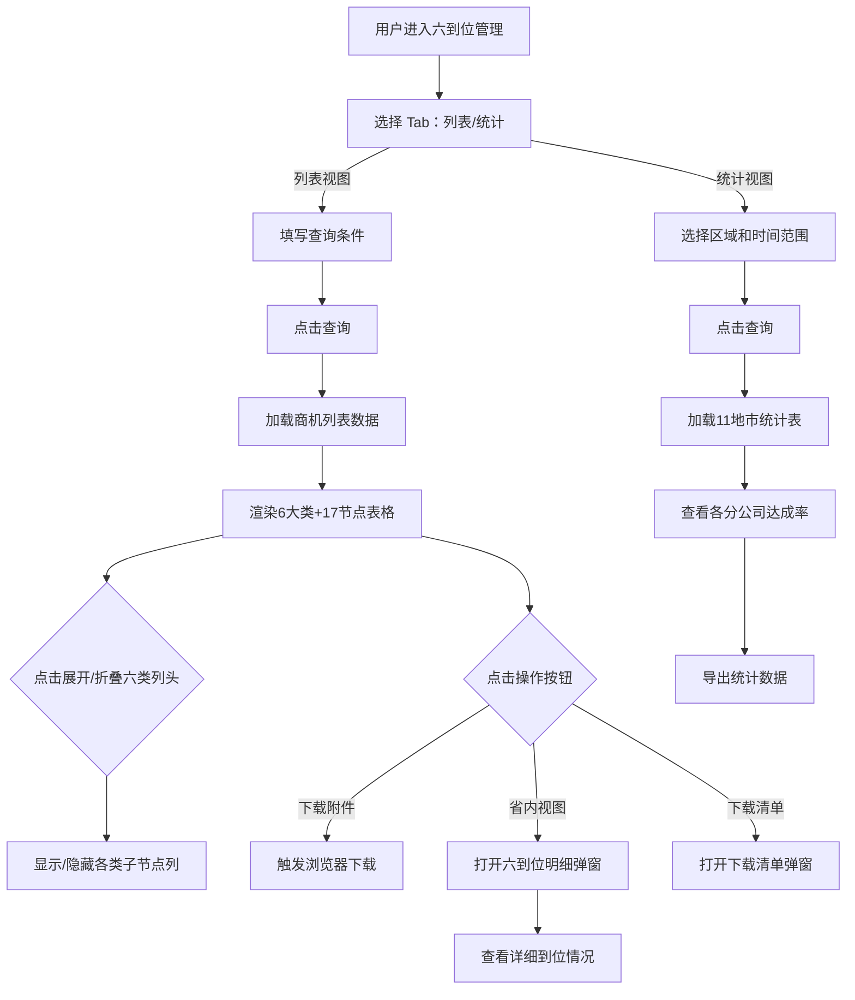

# SixPositioning（六定管理）PRD

## 需求背景

### 痛点
- **问题现象**：商机六到位（定岗、定编、定责、定薪、定目标、定考核）管理缺乏系统化支撑，17个到位节点分布在不同业务模块，难以统一跟踪和量化评估到位情况。
- **发生频率**：高
- **当前 workaround**：通过线下 Excel 手动统计各到位节点完成情况。

### 业务目标
- **量化指标**：覆盖 100% 已签约商机的六到位评估；到位完成度自动计算；统计视图覆盖浙江全部 11 个地市分公司。
- **目标期限**：2026 Q2

### 涉及系统/模块
- **模块名称**：六到位管理（SixPositioning）
- **变更类型**：新增
- **对接接口**：商机六到位数据接口

---

## 用户故事

### 故事1
- **角色**：地市管理员 / 省公司管理人员
- **功能**：在列表视图中通过多维度查询条件筛选商机，查看每个商机的 6 大类 17 个到位节点具备情况，支持展开查看详情。
- **收益**：快速了解各商机的六到位完成情况。
- **验收条件**：查询条件组合生效；6 大类列头可折叠/展开；到位节点以红绿点标识。

### 故事2
- **角色**：省公司管理人员
- **功能**：在统计视图中按区域查看各分公司六到位达成率统计，支持导出。
- **收益**：从全局视角了解各分公司的六到位管理水平。
- **验收条件**：统计表显示浙江 11 个地市分公司数据；各到位达成率正确计算。

### 故事3
- **角色**：地市管理员
- **功能**：下载商机的六到位清单附件，或下载任务下载列表中的历史导出文件。
- **收益**：支持线下归档和汇报。
- **验收条件**：附件下载触发浏览器下载；历史文件可选择下载或显示"不可下载"。

### 故事4
- **角色**：地市管理员
- **功能**：在列表视图点击"省内视图"查看商机的详细六到位明细。
- **收益**：查看完整的到位情况说明和节点详情。
- **验收条件**：明细弹窗展示商机名称、六大类详情、17个节点完成情况

---

## 需求清单

| 序号 | 需求描述 | 优先级 | 状态 | 负责人 | 截止日期 |
|------|----------|--------|------|--------|----------|
| 1 | Tab 切换（列表视图 / 统计视图） | P0 | TODO | | |
| 2 | 列表视图 — 查询表单（基础4字段 + 六到位6字段 + 更多4字段） | P0 | TODO | | |
| 3 | 列表视图 — 商机表格（10固定列 + 6大类动态列 + 操作列） | P0 | TODO | | |
| 4 | 六到位17节点展示（6大类，每类含2-5个子节点） | P0 | TODO | | |
| 5 | 列头折叠/展开功能（按六类分组展开） | P0 | TODO | | |
| 6 | 列宽拖拽功能 | P1 | TODO | | |
| 7 | 六到位明细弹窗（SixPositioningDetail） | P1 | TODO | | |
| 8 | 下载清单弹窗（Checkbox + 文件上传） | P1 | TODO | | |
| 9 | 任务下载列表弹窗（历史导出记录表格） | P1 | TODO | | |
| 10 | 统计视图 — 查询 + 统计表格（12地市×16列） | P0 | TODO | | |
| 11 | 后端接口对接 | P1 | TODO | | |

- **优先级**：P0（核心流程阻塞）/ P1（重要功能）/ P2（体验优化）/ P3（未来规划）
- **状态**：TODO / IN PROGRESS / DONE / BLOCKED

---

## 业务流程图

---

## 页面结构

### 路由信息
- **路由路径**：`/six-positioning`
- **页面标题**：六到位管理
- **访问权限**：登录（地市管理员/省公司管理人员角色）

### 布局结构
- **布局类型**：单栏
- **区域-主内容**：Tab切换 + 查询表单 + 数据表格（列表或统计）

### Tab 结构
- **Tab名称**：列表视图 / 统计视图
- **Tab路由**：无子路由，前端 Tab 切换
- **加载方式**：懒加载
- **默认激活**：列表视图

---

## 功能描述

### 功能点1：列表视图 — 查询表单

#### 页面级
- **基础查询**（默认展示，4列×1行）：
  | 字段名 | 类型 | 必填 | 默认值 | 来源 | 校验规则 | 展示形式 | 交互约束 |
  |--------|------|------|--------|------|----------|----------|----------|
  | 地市 | 下拉单选 | 否 | 空 | 字典 | | | |
  | 商机创建时间 | 日期范围 | 否 | 空 | 用户输入 | | | |
  | 商机名称 | 文本 | 否 | 空 | 用户输入 | | | |
  | 商机编码 | 文本 | 否 | 空 | 用户输入 | | | |

- **更多查询条件**（需展开）：
  - 商机类型（下拉）：政务/企业/教育/医疗
  - 合同签约时间（日期范围）
  - 合同名称（文本）
  - 合同编码（文本）
  - 具备客情掌握（下拉）：是/否
  - 具备方案总控（下拉）：是/否
  - 具备谈判/应标自主（下拉）：是/否
  - 具备采购自主（下拉）：是/否
  - 具备项目强管理（下拉）：是/否
  - 具备运维自主（下拉）：是/否

- **操作按钮**：查询、重置、下载清单、任务下载列表

---

### 功能点2：列表视图 — 商机六到位表格

#### 页面级
- 表头分组：
  - **固定列**（10列）：序号、地市、区县、商机名称、商机编码、商机创建日期、合同名称、合同签约金额(万元)、合同签约日期、六到位17节点具备数量
  - **6大类动态列**（每类可展开2-5个子节点列）：具备客情掌握 / 具备方案总控 / 具备谈判/应标自主 / 具备采购自主 / 具备项目强管理 / 具备运维自主
  - **操作列**（固定右侧）：下载附件 / 省内视图 / 集团视图

#### 六大类及其子节点
| 大类名称 | 子节点 |
|----------|--------|
| 具备客情掌握 | 客户档案、拜访记录、商机提前录入、近三年信息化项目 |
| 具备方案总控 | 组建团队、方案设计与审核、方案结构与中台把关 |
| 具备谈判/应标自主 | 参标记录、应标结果记录、商务谈判、前向合同信息 |
| 具备采购自主 | 标前决策、后向资料、业务解构、业务风险防控 |
| 具备项目强管理 | 项目实施总体设计、变更记录、验收报告、项目实施文件、审计清单 |
| 具备运维自主 | 数字平台、第一服务界面、售后其他资料 |

#### 字段列表
  | 字段名 | 类型 | 必填 | 默认值 | 来源 | 校验规则 | 展示形式 | 交互约束 |
  |--------|------|------|--------|------|----------|----------|----------|
  | 商机名称 | 文本 | | | 系统 | | 截断展示 | 超过宽度截断，hover显示完整 |
  | 商机编码 | 文本 | | | 系统 | | 蓝色 | |
  | 六到位17节点具备数量 | Badge | | | 计算 | | Badge | >=15时用默认样式，否则用次级样式 |
  | 各类到位数量 | 数字 | | | 系统 | | 计数/n | |
  | 到位状态 | 图标 | | | 系统 | | 绿色(有)/红色(无)圆点 | |
  | 操作-下载附件 | 按钮 | | | | | 链接按钮 | |
  | 操作-省内视图 | 按钮 | | | | | 链接按钮 | 打开明细弹窗 |

---

### 功能点3：统计视图

#### 页面级
- 查询字段：区域（下拉12选1）、商机创建时间（日期范围）、合同签约时间（日期范围）
- 操作按钮：查询、重置、导出、任务下载列表

#### 统计表格（12行×16列）
- 列：序号、区域、商机数、已转化商机数、客情掌握数量+占比（蓝）、方案总控数量+占比（绿）、谈判/应标自主数量+占比（紫）、采购自主数量+占比（橙）、项目强管理数量+占比（红）、运维自主数量+占比（青）
- 数据：浙江分公司 + 11个地市分公司（杭州、宁波、温州、嘉兴、湖州、绍兴、金华、衢州、舟山、台州、丽水）
- 分页：10条/页

---

### 功能点4：弹窗组件

#### 弹窗：六到位明细（SixPositioningDetail）
- **触发入口**：点击"省内视图"按钮
- **关闭方式**：关闭图标
- **字段列表**：商机名称、六大类详情、17个节点完成情况
- **操作**：跳转至前向竞标页面

#### 弹窗：下载清单（Dialog）
- **触发入口**：点击"下载清单"按钮
- **关闭方式**：遮罩层 / 关闭图标
- **字段列表**：
  | 字段名 | 类型 | 必填 | 默认值 | 来源 | 校验规则 | 展示形式 | 交互约束 |
  |--------|------|------|--------|------|----------|----------|----------|
  | 下载类型 | Checkbox | 否 | 全选 | 用户选择 | | Checkbox | 商机/合同 |
  | 文件上传 | 文件 | 否 | | 用户上传 | | 拖拽上传区 | |
- **确定按钮**：触发下载，生成清单文件
- **取消按钮**：关闭弹窗

#### 弹窗：任务下载列表（Dialog）
- **触发入口**：点击"任务下载列表"按钮
- **关闭方式**：关闭图标
- **字段列表**：
  | 字段名 | 类型 | 必填 | 默认值 | 来源 | 校验规则 | 展示形式 | 交互约束 |
  |--------|------|------|--------|------|----------|----------|----------|
  | 创建时间 | 日期时间 | | | 系统 | | | |
  | 文件名 | 文本 | | | 系统 | | | |
  | 创建人 | 文本 | | | 系统 | | | |
  | 是否可下载 | 标签 | | | 系统 | | 是(绿)/否(红) | |
  | 操作 | 按钮 | | | | | 下载按钮/占位符 | |

---

## 数据流图

### 接口1：六到位列表查询
- **请求路径**：`GET /api/six-positioning/list`
- **请求方法**：GET
- **请求头**：Authorization
- **请求参数**：
  - `city` - 类型：字符串；必填：否
  - `createTimeStart` - 类型：日期；必填：否
  - `createTimeEnd` - 类型：日期；必填：否
  - `opportunityName` - 类型：字符串；必填：否
  - `opportunityCode` - 类型：字符串；必填：否
  - `hasCustomerControl` - 类型：字符串；必填：否
  - `page` - 类型：数字；必填：是
  - `pageSize` - 类型：数字；必填：是
- **响应字段**：
  - `data[]` - 类型：数组；描述：商机六到位数据
  - `total` - 类型：数字；描述：总记录数

### 接口2：六到位统计查询
- **请求路径**：`GET /api/six-positioning/statistics`
- **请求方法**：GET
- **请求参数**：
  - `region` - 类型：字符串；必填：否（为空时查全部）
  - `createTimeStart` - 类型：日期；必填：否
  - `createTimeEnd` - 类型：日期；必填：否
- **响应字段**：
  - `data[]` - 类型：数组；描述：各区域统计行（12条：浙江分公司+11地市）

### 数据刷新点
- **刷新时机**：Tab 切换 / 查询后
- **影响字段**：表格全部字段

---

## 验收标准

### 正常流程
- [ ] **操作**：点击"列表视图" Tab → **预期**：显示商机六到位列表
- [ ] **操作**：点击六类列头旁的箭头 → **预期**：展开/折叠该类子节点列
- [ ] **操作**：点击"省内视图" → **预期**：打开六到位明细弹窗
- [ ] **操作**：点击"统计视图" Tab → **预期**：显示11地市统计表
- [ ] **操作**：点击"下载清单" → **预期**：打开下载清单弹窗，支持勾选和上传

### 异常流程
- [ ] **操作**：网络断开时查询 → **预期**：显示"网络异常"
- [ ] **操作**：无权限访问 → **预期**：显示 403

---

## 更新记录

### v1 - 2026-05-09
- 初始版本
