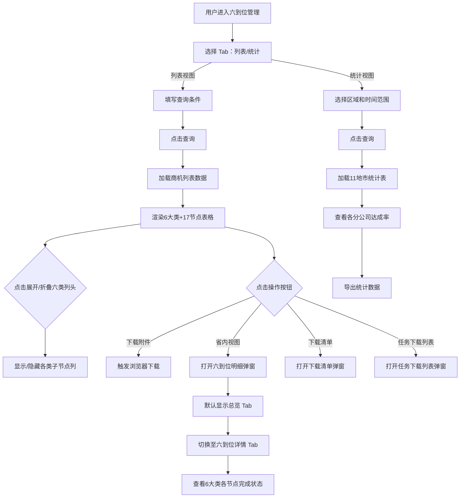

# SixPositioning（六到位管理）PRD

## 需求背景

### 痛点
- **问题现象**：商机六到位（定岗、定编、定责、定薪、定目标、定考核）管理缺乏系统化支撑，17个到位节点分布在不同业务模块，难以统一跟踪和量化评估到位情况。
- **发生频率**：高
- **当前 workaround**：通过线下 Excel 手动统计各到位节点完成情况。

### 业务目标
- **量化指标**：覆盖 100% 已签约商机的六到位评估；到位完成度自动计算；统计视图覆盖浙江全部 11 个地市分公司。
- **目标期限**：2026 Q2

### 涉及系统/模块
- **模块名称**：六到位管理（SixPositioning）
- **变更类型**：新增
- **对接接口**：商机六到位数据接口

---

## 用户故事

### 故事1
- **角色**：地市管理员 / 省公司管理人员
- **功能**：在列表视图中通过多维度查询条件筛选商机，查看每个商机的 6 大类 17 个到位节点具备情况，支持展开查看详情。
- **收益**：快速了解各商机的六到位完成情况。
- **验收条件**：查询条件组合生效；6 大类列头可折叠/展开；到位节点以红绿点标识。

### 故事2
- **角色**：省公司管理人员
- **功能**：在统计视图中按区域查看各分公司六到位达成率统计，支持导出。
- **收益**：从全局视角了解各分公司的六到位管理水平。
- **验收条件**：统计表显示浙江 11 个地市分公司数据；各到位达成率正确计算。

### 故事3
- **角色**：地市管理员
- **功能**：在列表视图点击"省内视图"查看商机的详细六到位明细弹窗，弹窗内切换"总览"和"六到位详情"两个 Tab。
- **收益**：查看完整的到位情况说明、各节点完成状态和到位时间。
- **验收条件**：明细弹窗展示商机基础信息、六到位综合/前向/后向完成率、6 大类各节点完成状态、到位时间。

### 故事4
- **角色**：地市管理员
- **功能**：下载商机的六到位清单附件，或下载任务下载列表中的历史导出文件。
- **收益**：支持线下归档和汇报。
- **验收条件**：附件下载触发浏览器下载；历史文件可选择下载或显示"不可下载"。

---

## 需求清单

| 序号 | 需求描述 | 优先级 | 状态 | 负责人 | 截止日期 |
|------|----------|--------|------|--------|----------|
| 1 | Tab 切换（列表视图 / 统计视图） | P0 | TODO | | |
| 2 | 列表视图 — 查询表单（基础4字段 + 六到位6字段 + 更多4字段） | P0 | TODO | | |
| 3 | 列表视图 — 商机表格（10固定列 + 6大类动态列 + 操作列） | P0 | TODO | | |
| 4 | 六到位17节点展示（6大类，每类含2-5个子节点） | P0 | TODO | | |
| 5 | 列头折叠/展开功能（按六类分组展开） | P0 | TODO | | |
| 6 | 列宽拖拽功能 | P1 | TODO | | |
| 7 | 六到位明细弹窗（SixPositioningDetail）— 含总览 + 六到位详情 Tab | P0 | TODO | | |
| 8 | 下载清单弹窗（Checkbox + 文件上传 + 确定/取消） | P1 | TODO | | |
| 9 | 任务下载列表弹窗（历史导出记录表格） | P1 | TODO | | |
| 10 | 统计视图 — 查询 + 统计表格（12地市×16列） | P0 | TODO | | |
| 11 | 后端接口对接 | P1 | TODO | | |

- **优先级**：P0（核心流程阻塞）/ P1（重要功能）/ P2（体验优化）/ P3（未来规划）
- **状态**：TODO / IN PROGRESS / DONE / BLOCKED

---

## 业务流程图

---

## 页面结构

### 路由信息
- **路由路径**：`/six-positioning`
- **页面标题**：六到位管理
- **访问权限**：登录（地市管理员/省公司管理人员角色）

### 布局结构
- **布局类型**：单栏
- **区域-主内容**：Tab切换 + 查询表单 + 数据表格（列表或统计）

### Tab 结构
- **Tab名称**：列表视图 / 统计视图
- **Tab路由**：无子路由，前端 Tab 切换
- **加载方式**：懒加载
- **默认激活**：列表视图

---

## 功能描述

### 功能点1：列表视图 — 查询表单

#### 页面级
- **基础查询**（默认展示，4列×1行）：
  | 字段名 | 类型 | 必填 | 默认值 | 来源 | 校验规则 | 展示形式 | 交互约束 |
  |--------|------|------|--------|------|----------|----------|----------|
  | 地市 | 下拉单选 | 否 | 空 | 字典 | | Select | 可搜索 |
  | 商机创建时间 | 日期范围 | 否 | 空 | 用户输入 | 起止不能颠倒 | DateRangePicker | |
  | 商机名称 | 文本 | 否 | 空 | 用户输入 | | Input | 支持模糊搜索 |
  | 商机编码 | 文本 | 否 | 空 | 用户输入 | | Input | |

- **更多查询条件**（需展开，显示于基础条件下方一行）：
  | 字段名 | 类型 | 必填 | 默认值 | 来源 | 校验规则 | 展示形式 | 交互约束 |
  |--------|------|------|--------|------|----------|----------|----------|
  | 商机类型 | 下拉单选 | 否 | 空 | 字典：政务/企业/教育/医疗 | | Select | |
  | 合同签约时间 | 日期范围 | 否 | 空 | 用户输入 | 起止不能颠倒 | DateRangePicker | |
  | 合同名称 | 文本 | 否 | 空 | 用户输入 | | Input | |
  | 合同编码 | 文本 | 否 | 空 | 用户输入 | | Input | |
  | 具备客情掌握 | 下拉单选 | 否 | 空 | 字典：是/否 | | Select | |
  | 具备方案总控 | 下拉单选 | 否 | 空 | 字典：是/否 | | Select | |
  | 具备谈判/应标自主 | 下拉单选 | 否 | 空 | 字典：是/否 | | Select | |
  | 具备采购自主 | 下拉单选 | 否 | 空 | 字典：是/否 | | Select | |
  | 具备项目强管理 | 下拉单选 | 否 | 空 | 字典：是/否 | | Select | |
  | 具备运维自主 | 下拉单选 | 否 | 空 | 字典：是/否 | | Select | |

- **操作按钮字段**：
  | 字段名 | 类型 | 必填 | 默认值 | 来源 | 校验规则 | 展示形式 | 交互约束 |
  |--------|------|------|--------|------|----------|----------|----------|
  | 查询 | Button | 否 | | | | Primary Button | 点击触发列表刷新 |
  | 重置 | Button | 否 | | | | Default Button | 清空所有查询条件 |
  | 下载清单 | Button | 否 | | | | Default Button | 打开下载清单弹窗 |
  | 任务下载列表 | Button | 否 | | | | Default Button | 打开任务下载列表弹窗 |

---

### 功能点2：列表视图 — 商机六到位表格

#### 页面级
- **表头分组结构**：
  - **固定列**（10列，不可拖拽）：序号、地市、区县、商机名称、商机编码、商机创建日期、合同名称、合同签约金额(万元)、合同签约日期、六到位17节点具备数量
  - **6大类动态列**（每类可折叠/展开2-5个子节点列）：具备客情掌握 / 具备方案总控 / 具备谈判/应标自主 / 具备采购自主 / 具备项目强管理 / 具备运维自主
  - **操作列**（固定右侧，不可拖拽）：下载附件 / 省内视图 / 集团视图

#### 六大类及其子节点
| 大类名称 | 子节点数 | 子节点 |
|----------|----------|--------|
| 具备客情掌握 | 4 | 客户档案、拜访记录、商机提前录入、近三年信息化项目 |
| 具备方案总控 | 3 | 组建团队、方案设计与审核、方案结构与中台把关 |
| 具备谈判/应标自主 | 4 | 参标记录、应标结果记录、商务谈判、前向合同信息 |
| 具备采购自主 | 4 | 标前决策、后向资料、业务解构、业务风险防控 |
| 具备项目强管理 | 5 | 项目实施总体设计、变更记录、验收报告、项目实施文件、审计清单 |
| 具备运维自主 | 3 | 数字平台、第一服务界面、售后其他资料 |

#### 字段列表
  | 字段名 | 类型 | 必填 | 默认值 | 来源 | 校验规则 | 展示形式 | 交互约束 |
  |--------|------|------|--------|------|----------|----------|----------|
  | 序号 | 数字 | | 自动编号 | 系统 | | 居中数字 | |
  | 地市 | 文本 | | | 系统 | | | |
  | 区县 | 文本 | | | 系统 | | | |
  | 商机名称 | 文本 | | | 系统 | | 截断+tooltip | 超过宽度截断，hover显示完整 |
  | 商机编码 | 文本 | | | 系统 | | 蓝色文字 | |
  | 商机创建日期 | 日期 | | | 系统 | | YYYY-MM-DD | |
  | 合同名称 | 文本 | | | 系统 | | 截断+tooltip | |
  | 合同签约金额(万元) | 数字 | | | 系统 | | 保留2位小数 | |
  | 合同签约日期 | 日期 | | | 系统 | | YYYY-MM-DD | |
  | 六到位17节点具备数量 | Badge | | | 计算 | | Badge | ≥15时默认绿色样式，否则灰色样式 |
  | 客情掌握到位数 | 数字 | | | 系统 | | 绿色计数 4/n | |
  | 方案总控到位数 | 数字 | | | 系统 | | 绿色计数 3/n | |
  | 谈判/应标自主到位数 | 数字 | | | 系统 | | 绿色计数 4/n | |
  | 采购自主到位数 | 数字 | | | 系统 | | 绿色计数 4/n | |
  | 项目强管理到位数 | 数字 | | | 系统 | | 绿色计数 5/n | |
  | 运维自主到位数 | 数字 | | | 系统 | | 绿色计数 3/n | |
  | 到位状态节点 | 布尔 | | | 系统 | | 绿色●(有)/红色●(无) | |
  | 操作-下载附件 | 按钮 | | | | | 链接按钮 | 触发浏览器下载 |
  | 操作-省内视图 | 按钮 | | | | | 链接按钮 | 打开六到位明细弹窗 |
  | 操作-集团视图 | 按钮 | | | | | 链接按钮 | |

#### 列头折叠/展开交互
- **折叠态**：只显示6个大类列头（不带子节点列）
- **展开态**：6个大类列头下各展开对应子节点列
- **切换方式**：点击列头右侧箭头图标，或点击大类单元格上的折叠按钮

---

### 功能点3：统计视图

#### 页面级
- **查询条件字段**：
  | 字段名 | 类型 | 必填 | 默认值 | 来源 | 校验规则 | 展示形式 | 交互约束 |
  |--------|------|------|--------|------|----------|----------|----------|
  | 区域 | 下拉单选 | 否 | 空 | 字典：浙江/11地市 | | Select | 为空时查全部12个区域 |
  | 商机创建时间 | 日期范围 | 否 | 空 | 用户输入 | 起止不能颠倒 | DateRangePicker | |
  | 合同签约时间 | 日期范围 | 否 | 空 | 用户输入 | 起止不能颠倒 | DateRangePicker | |

- **操作按钮字段**：
  | 字段名 | 类型 | 必填 | 默认值 | 来源 | 校验规则 | 展示形式 | 交互约束 |
  |--------|------|------|--------|------|----------|----------|----------|
  | 查询 | Button | 否 | | | | Primary Button | |
  | 重置 | Button | 否 | | | | Default Button | |
  | 导出 | Button | 否 | | | | Default Button | 导出 Excel |
  | 任务下载列表 | Button | 否 | | | | Default Button | 打开任务下载列表弹窗 |

#### 统计表格（12行×16列）
- **列定义**：
  | 字段名 | 类型 | 必填 | 默认值 | 来源 | 校验规则 | 展示形式 | 交互约束 |
  |--------|------|------|--------|------|----------|----------|----------|
  | 序号 | 数字 | | | 系统 | | 居中 | |
  | 区域 | 文本 | | | 系统 | | | |
  | 商机数 | 数字 | | | 系统 | | | |
  | 已转化商机数 | 数字 | | | 系统 | | | |
  | 客情掌握数量 | 数字 | | | 系统 | | 蓝色数字 | |
  | 客情掌握占比 | 百分比 | | | 计算 | | 蓝色百分比 | |
  | 方案总控数量 | 数字 | | | 系统 | | 绿色数字 | |
  | 方案总控占比 | 百分比 | | | 计算 | | 绿色百分比 | |
  | 谈判/应标自主数量 | 数字 | | | 系统 | | 紫色数字 | |
  | 谈判/应标自主占比 | 百分比 | | | 计算 | | 紫色百分比 | |
  | 采购自主数量 | 数字 | | | 系统 | | 橙色数字 | |
  | 采购自主占比 | 百分比 | | | 计算 | | 橙色百分比 | |
  | 项目强管理数量 | 数字 | | | 系统 | | 红色数字 | |
  | 项目强管理占比 | 百分比 | | | 计算 | | 红色百分比 | |
  | 运维自主数量 | 数字 | | | 系统 | | 青色数字 | |
  | 运维自主占比 | 百分比 | | | 计算 | | 青色百分比 | |

- **数据行**：浙江分公司 + 杭州 + 宁波 + 温州 + 嘉兴 + 湖州 + 绍兴 + 金华 + 衢州 + 舟山 + 台州 + 丽水（共12行）
- **分页**：10条/页

---

### 功能点4：六到位明细弹窗（SixPositioningDetail）

#### 弹窗基础信息
- **弹窗：六到位明细**
- **触发入口**：点击"省内视图"按钮
- **关闭方式**：关闭图标 / 遮罩层点击
- **弹窗宽度**：1000px
- **弹窗高度**：80vh，标题固定，内容区可滚动

#### 弹窗头部字段
  | 字段名 | 类型 | 必填 | 默认值 | 来源 | 校验规则 | 展示形式 | 交互约束 |
  |--------|------|------|--------|------|----------|----------|----------|
  | 商机名称 | 文本 | | | 系统 | | 加粗大字号 | 只读 |
  | 合同编码 | 文本 | | | 系统 | | 蓝色 | 只读 |
  | 合同签约金额 | 数字 | | | 系统 | | 万元单位 | 只读 |
  | 合同签约日期 | 日期 | | | 系统 | | YYYY-MM-DD | 只读 |

#### Tab 级
- **Tab名称**：总览 / 六到位详情
- **Tab路由**：无 URL 参数，前端 state 切换
- **加载方式**：预加载，进入弹窗时一次性加载
- **默认激活**：总览

##### 总览 Tab
- **三大完成率指标**：
  | 字段名 | 类型 | 必填 | 默认值 | 来源 | 校验规则 | 展示形式 | 交互约束 |
  |--------|------|------|--------|------|----------|----------|----------|
  | 六到位综合完成率 | 百分比 | | | 计算 | | 圆形进度环+数字 | 环形进度条，数字居中 |
  | 前向到位完成率 | 百分比 | | | 计算 | | 圆形进度环+数字 | |
  | 后向到位完成率 | 百分比 | | | 计算 | | 圆形进度环+数字 | |

##### 六到位详情 Tab
- **左侧面板 — 六大到位分类列表**（可滚动）：
  | 字段名 | 类型 | 必填 | 默认值 | 来源 | 校验规则 | 展示形式 | 交互约束 |
  |--------|------|------|--------|------|----------|----------|----------|
  | 分类图标 | 图标 | | | 系统 | | 彩色圆形背景+图标 | |
  | 分类名称 | 文本 | | | 系统 | | 加粗 | |
  | 到位进度 | 进度条 | | | 计算 | | 进度条+n/m | |
  | 展开/收起箭头 | 图标 | | | 用户 | | ArrowIcon | 点击展开子节点 |

- **六大到位分类详情**（点击分类展开后显示子节点列表）：
  | 分类 | 子节点字段 | 类型 | 必填 | 默认值 | 来源 | 校验规则 | 展示形式 | 交互约束 |
  |------|-----------|------|------|--------|------|----------|----------|----------|
  | 客情掌握 | 客户档案 | 布尔 | | | 系统 | | 绿色✓(到位)/红色✗ | |
  | | 客户档案到位时间 | 日期 | | | 系统 | | YYYY-MM-DD | |
  | | 拜访记录 | 布尔 | | | 系统 | | 绿色✓/红色✗ | |
  | | 拜访记录到位时间 | 日期 | | | 系统 | | YYYY-MM-DD | |
  | | 商机提前录入 | 布尔 | | | 系统 | | 绿色✓/红色✗ | |
  | | 商机提前录入到位时间 | 日期 | | | 系统 | | YYYY-MM-DD | |
  | | 近三年信息化项目 | 布尔 | | | 系统 | | 绿色✓/红色✗ | |
  | | 近三年信息化项目到位时间 | 日期 | | | 系统 | | YYYY-MM-DD | |
  | 方案总控 | 组建团队 | 布尔 | | | 系统 | | 绿色✓/红色✗ | |
  | | 组建团队到位时间 | 日期 | | | 系统 | | YYYY-MM-DD | |
  | | 方案设计与审核 | 布尔 | | | 系统 | | 绿色✓/红色✗ | |
  | | 方案设计与审核到位时间 | 日期 | | | 系统 | | YYYY-MM-DD | |
  | | 方案结构与中台把关 | 布尔 | | | 系统 | | 绿色✓/红色✗ | |
  | | 方案结构与中台把关到位时间 | 日期 | | | 系统 | | YYYY-MM-DD | |
  | 谈判/应标自主 | 参标记录 | 布尔 | | | 系统 | | 绿色✓/红色✗ | |
  | | 参标记录到位时间 | 日期 | | | 系统 | | YYYY-MM-DD | |
  | | 应标结果记录 | 布尔 | | | 系统 | | 绿色✓/红色✗ | |
  | | 应标结果记录到位时间 | 日期 | | | 系统 | | YYYY-MM-DD | |
  | | 商务谈判 | 布尔 | | | 系统 | | 绿色✓/红色✗ | |
  | | 商务谈判到位时间 | 日期 | | | 系统 | | YYYY-MM-DD | |
  | | 前向合同信息 | 布尔 | | | 系统 | | 绿色✓/红色✗ | |
  | | 前向合同信息到位时间 | 日期 | | | 系统 | | YYYY-MM-DD | |
  | 采购自主 | 标前决策 | 布尔 | | | 系统 | | 绿色✓/红色✗ | |
  | | 标前决策到位时间 | 日期 | | | 系统 | | YYYY-MM-DD | |
  | | 后向资料 | 布尔 | | | 系统 | | 绿色✓/红色✗ | |
  | | 后向资料到位时间 | 日期 | | | 系统 | | YYYY-MM-DD | |
  | | 业务解构 | 布尔 | | | 系统 | | 绿色✓/红色✗ | |
  | | 业务解构到位时间 | 日期 | | | 系统 | | YYYY-MM-DD | |
  | | 业务风险防控 | 布尔 | | | 系统 | | 绿色✓/红色✗ | |
  | | 业务风险防控到位时间 | 日期 | | | 系统 | | YYYY-MM-DD | |
  | 项目强管理 | 项目实施总体设计 | 布尔 | | | 系统 | | 绿色✓/红色✗ | |
  | | 项目实施总体设计到位时间 | 日期 | | | 系统 | | YYYY-MM-DD | |
  | | 变更记录 | 布尔 | | | 系统 | | 绿色✓/红色✗ | |
  | | 变更记录到位时间 | 日期 | | | 系统 | | YYYY-MM-DD | |
  | | 验收报告 | 布尔 | | | 系统 | | 绿色✓/红色✗ | |
  | | 验收报告到位时间 | 日期 | | | 系统 | | YYYY-MM-DD | |
  | | 项目实施文件 | 布尔 | | | 系统 | | 绿色✓/红色✗ | |
  | | 项目实施文件到位时间 | 日期 | | | 系统 | | YYYY-MM-DD | |
  | | 审计清单 | 布尔 | | | 系统 | | 绿色✓/红色✗ | |
  | | 审计清单到位时间 | 日期 | | | 系统 | | YYYY-MM-DD | |
  | 运维自主 | 数字平台 | 布尔 | | | 系统 | | 绿色✓/红色✗ | |
  | | 数字平台到位时间 | 日期 | | | 系统 | | YYYY-MM-DD | |
  | | 第一服务界面 | 布尔 | | | 系统 | | 绿色✓/红色✗ | |
  | | 第一服务界面到位时间 | 日期 | | | 系统 | | YYYY-MM-DD | |
  | | 售后其他资料 | 布尔 | | | 系统 | | 绿色✓/红色✗ | |
  | | 售后其他资料到位时间 | 日期 | | | 系统 | | YYYY-MM-DD | |

#### 弹窗底部操作
  | 字段名 | 类型 | 必填 | 默认值 | 来源 | 校验规则 | 展示形式 | 交互约束 |
  |--------|------|------|--------|------|----------|----------|----------|
  | 跳转至前向竞标页面 | Button | 否 | | | | Primary Button | 关闭弹窗，跳转至前向竞标路由 |
  | 关闭 | Button | 否 | | | | Default Button | 关闭弹窗 |

---

### 功能点5：下载清单弹窗（DownloadModal）

#### 弹窗基础信息
- **弹窗：下载清单**
- **触发入口**：点击"下载清单"按钮
- **关闭方式**：遮罩层点击 / 关闭图标 / 取消按钮 / Esc 键
- **弹窗宽度**：480px

#### 字段列表
  | 字段名 | 类型 | 必填 | 默认值 | 来源 | 校验规则 | 展示形式 | 交互约束 |
  |--------|------|------|--------|------|----------|----------|----------|
  | 下载类型 | Checkbox Group | 否 | 商机/合同全选 | 用户选择 | 至少选一个 | Checkbox 多选 | 选项：商机、合同 |
  | 文件上传 | 文件 | 否 | 空 | 用户上传 | 非必填 | DragUpload 拖拽上传区 | 支持拖拽和点击上传，可上传多个文件 |

#### 操作按钮字段
  | 字段名 | 类型 | 必填 | 默认值 | 来源 | 校验规则 | 展示形式 | 交互约束 |
  |--------|------|------|--------|------|----------|----------|----------|
  | 确定 | Button | 是 | | | 至少选一个下载类型 | Primary Button | 提交后生成清单文件并下载 |
  | 取消 | Button | 否 | | | | Default Button | 关闭弹窗，不触发任何操作 |

---

### 功能点6：任务下载列表弹窗（TaskDownloadModal）

#### 弹窗基础信息
- **弹窗：任务下载列表**
- **触发入口**：点击"任务下载列表"按钮
- **关闭方式**：关闭图标 / 遮罩层点击
- **弹窗宽度**：640px

#### 字段列表
  | 字段名 | 类型 | 必填 | 默认值 | 来源 | 校验规则 | 展示形式 | 交互约束 |
  |--------|------|------|--------|------|----------|----------|----------|
  | 创建时间 | 日期时间 | | | 系统 | | YYYY-MM-DD HH:mm | 只读 |
  | 文件名 | 文本 | | | 系统 | | 超长截断+tooltip | hover显示完整文件名 |
  | 创建人 | 文本 | | | 系统 | | | 只读 |
  | 是否可下载 | 标签 | | | 系统 | | 可下载：绿色标签；不可下载：红色标签 | 只读 |
  | 操作 | 按钮 | | | | | 可下载：下载按钮；不可下载：空占位符 | |

#### 表格字段
- 列：创建时间 / 文件名 / 创建人 / 是否可下载 / 操作
- 分页：10条/页

---

## 数据流图

### 接口1：六到位列表查询
- **请求路径**：`GET /api/six-positioning/list`
- **请求方法**：GET
- **请求头**：Authorization
- **请求参数**：
  | 参数名 | 类型 | 必填 | 来源 | 校验 |
  |--------|------|------|------|------|
  | city | 字符串 | 否 | 查询表单"地市"字段 | |
  | createTimeStart | 日期 | 否 | 查询表单"商机创建时间-开始" | |
  | createTimeEnd | 日期 | 否 | 查询表单"商机创建时间-结束" | |
  | opportunityName | 字符串 | 否 | 查询表单"商机名称" | |
  | opportunityCode | 字符串 | 否 | 查询表单"商机编码" | |
  | opportunityType | 字符串 | 否 | 查询表单"商机类型" | |
  | signTimeStart | 日期 | 否 | 查询表单"合同签约时间-开始" | |
  | signTimeEnd | 日期 | 否 | 查询表单"合同签约时间-结束" | |
  | contractName | 字符串 | 否 | 查询表单"合同名称" | |
  | contractCode | 字符串 | 否 | 查询表单"合同编码" | |
  | hasCustomerControl | 字符串 | 否 | 查询表单"具备客情掌握" | |
  | hasPlanControl | 字符串 | 否 | 查询表单"具备方案总控" | |
  | hasBiddingControl | 字符串 | 否 | 查询表单"具备谈判/应标自主" | |
  | hasProcurementControl | 字符串 | 否 | 查询表单"具备采购自主" | |
  | hasProjectControl | 字符串 | 否 | 查询表单"具备项目强管理" | |
  | hasOpsControl | 字符串 | 否 | 查询表单"具备运维自主" | |
  | page | 数字 | 是 | 分页 | 默认1 |
  | pageSize | 数字 | 是 | 分页 | 默认20 |
- **响应字段**：
  | 字段名 | 类型 | 描述 |
  |--------|------|------|
  | data[] | 数组 | 商机六到位数据 |
  | data[].city | 字符串 | 地市 |
  | data[].district | 字符串 | 区县 |
  | data[].opportunityName | 字符串 | 商机名称 |
  | data[].opportunityCode | 字符串 | 商机编码 |
  | data[].opportunityCreateDate | 日期 | 商机创建日期 |
  | data[].contractName | 字符串 | 合同名称 |
  | data[].contractAmount | 数字 | 合同签约金额（万元） |
  | data[].contractSignDate | 日期 | 合同签约日期 |
  | data[].totalNodes | 数字 | 六到位17节点具备数量 |
  | data[].customerControl | 数字 | 客情掌握到位数 |
  | data[].planControl | 数字 | 方案总控到位数 |
  | data[].biddingControl | 数字 | 谈判/应标自主到位数 |
  | data[].procurementControl | 数字 | 采购自主到位数 |
  | data[].projectControl | 数字 | 项目强管理到位数 |
  | data[].opsControl | 数字 | 运维自主到位数 |
  | data[].customerNodes[] | 数组 | 客情掌握子节点状态（布尔+到位时间） |
  | data[].planNodes[] | 数组 | 方案总控子节点状态 |
  | data[].biddingNodes[] | 数组 | 谈判/应标自主子节点状态 |
  | data[].procurementNodes[] | 数组 | 采购自主子节点状态 |
  | data[].projectNodes[] | 数组 | 项目强管理子节点状态 |
  | data[].opsNodes[] | 数组 | 运维自主子节点状态 |
  | data[].attachmentUrl | 字符串 | 附件下载地址 |
  | total | 数字 | 总记录数 |
- **存储位置**：数据库表 `opportunity_six_positioning`
- **错误码**：401（未授权）/ 500（服务器错误）

### 接口2：六到位统计查询
- **请求路径**：`GET /api/six-positioning/statistics`
- **请求方法**：GET
- **请求参数**：
  | 参数名 | 类型 | 必填 | 来源 | 校验 |
  |--------|------|------|------|------|
  | region | 字符串 | 否 | 查询表单"区域"，为空查全部12区域 | |
  | createTimeStart | 日期 | 否 | 查询表单"商机创建时间-开始" | |
  | createTimeEnd | 日期 | 否 | 查询表单"商机创建时间-结束" | |
  | signTimeStart | 日期 | 否 | 查询表单"合同签约时间-开始" | |
  | signTimeEnd | 日期 | 否 | 查询表单"合同签约时间-结束" | |
- **响应字段**：
  | 字段名 | 类型 | 描述 |
  |--------|------|------|
  | data[] | 数组 | 各区域统计行（12条） |
  | data[].region | 字符串 | 区域名称 |
  | data[].opportunityCount | 数字 | 商机总数 |
  | data[].convertedCount | 数字 | 已转化商机数 |
  | data[].customerCount | 数字 | 客情掌握到位数量 |
  | data[].customerRate | 数字 | 客情掌握占比（0-100） |
  | data[].planCount | 数字 | 方案总控到位数量 |
  | data[].planRate | 数字 | 方案总控占比 |
  | data[].biddingCount | 数字 | 谈判/应标自主到位数量 |
  | data[].biddingRate | 数字 | 谈判/应标自主占比 |
  | data[].procurementCount | 数字 | 采购自主到位数量 |
  | data[].procurementRate | 数字 | 采购自主占比 |
  | data[].projectCount | 数字 | 项目强管理到位数量 |
  | data[].projectRate | 数字 | 项目强管理占比 |
  | data[].opsCount | 数字 | 运维自主到位数量 |
  | data[].opsRate | 数字 | 运维自主占比 |
- **存储位置**：数据库表 `opportunity_six_positioning_statistics`（汇总表）或实时计算

### 接口3：六到位明细查询
- **请求路径**：`GET /api/six-positioning/detail`
- **请求方法**：GET
- **请求参数**：
  | 参数名 | 类型 | 必填 | 来源 | 校验 |
  |--------|------|------|------|------|
  | opportunityCode | 字符串 | 是 | 商机编码 | 非空 |
- **响应字段**：
  | 字段名 | 类型 | 描述 |
  |--------|------|------|
  | opportunityName | 字符串 | 商机名称 |
  | contractCode | 字符串 | 合同编码 |
  | contractAmount | 数字 | 合同签约金额（万元） |
  | contractSignDate | 日期 | 合同签约日期 |
  | overallRate | 数字 | 六到位综合完成率（0-100） |
  | forwardRate | 数字 | 前向到位完成率（0-100） |
  | backwardRate | 数字 | 后向到位完成率（0-100） |
  | categories[] | 数组 | 六大到位分类 |
  | categories[].name | 字符串 | 分类名称 |
  | categories[].icon | 字符串 | 分类图标名 |
  | categories[].color | 字符串 | 分类颜色 |
  | categories[].count | 数字 | 到位节点数 |
  | categories[].total | 数字 | 总节点数 |
  | categories[].nodes[] | 数组 | 子节点列表 |
  | categories[].nodes[].name | 字符串 | 节点名称 |
  | categories[].nodes[].completed | 布尔 | 是否到位 |
  | categories[].nodes[].completeTime | 日期 | 到位时间 |

### 接口4：下载清单生成
- **请求路径**：`POST /api/six-positioning/download`
- **请求方法**：POST
- **请求头**：Authorization / Content-Type: application/json
- **请求参数**：
  | 参数名 | 类型 | 必填 | 来源 | 校验 |
  |--------|------|------|------|------|
  | downloadTypes | 数组 | 是 | 用户选择类型 | 至少包含一项：opportunity/contract |
  | files | 文件数组 | 否 | 用户上传文件 | 支持多文件 |
- **响应字段**：
  | 字段名 | 类型 | 描述 |
  |--------|------|------|
  | fileUrl | 字符串 | 生成的清单文件下载地址 |
  | fileName | 字符串 | 文件名 |
- **存储位置**：文件存储服务（S3/OSS）
- **错误码**：400（参数错误）/ 401 / 500

### 接口5：任务下载列表查询
- **请求路径**：`GET /api/six-positioning/tasks`
- **请求方法**：GET
- **请求参数**：
  | 参数名 | 类型 | 必填 | 来源 | 校验 |
  |--------|------|------|------|------|
  | page | 数字 | 否 | 分页 | 默认1 |
  | pageSize | 数字 | 否 | 分页 | 默认10 |
- **响应字段**：
  | 字段名 | 类型 | 描述 |
  |--------|------|------|
  | data[] | 数组 | 任务列表 |
  | data[].createTime | 日期时间 | 创建时间 |
  | data[].fileName | 字符串 | 文件名 |
  | data[].creator | 字符串 | 创建人 |
  | data[].downloadable | 布尔 | 是否可下载 |
  | data[].fileUrl | 字符串 | 文件下载地址（仅 downloadable=true 时有值） |
  | total | 数字 | 总记录数 |

### 数据刷新点
- **刷新时机**：Tab 切换 / 查询后 / 弹窗打开时
- **影响字段**：表格全部字段 / 弹窗内全部字段

---

## 验收标准

### 正常流程
- [ ] **操作**：点击"列表视图" Tab → **预期**：显示商机六到位列表，10固定列+6大类列可见
- [ ] **操作**：点击六类列头旁的箭头 → **预期**：展开/折叠该类子节点列，每次切换折叠状态保留
- [ ] **操作**：点击"省内视图"按钮 → **预期**：打开六到位明细弹窗，默认显示总览 Tab，展示三个完成率圆形进度环
- [ ] **操作**：在明细弹窗中切换至"六到位详情" Tab → **预期**：左侧显示六大分类列表，点击分类展开后显示该分类下所有子节点，各节点显示到位状态图标（绿色✓/红色✗）和到位时间
- [ ] **操作**：点击明细弹窗底部的"跳转至前向竞标页面" → **预期**：关闭弹窗，页面跳转至前向竞标路由
- [ ] **操作**：点击"统计视图" Tab → **预期**：显示11地市+浙江分公司统计表，12行数据，每行显示各到位数量和占比
- [ ] **操作**：点击"下载清单" → **预期**：打开下载清单弹窗，默认勾选商机和合同两个 Checkbox，可拖拽上传文件，点击确定生成并下载清单文件
- [ ] **操作**：点击"任务下载列表" → **预期**：打开任务列表弹窗，显示历史导出记录表格，可下载的显示绿色标签和下载按钮，不可下载的显示红色标签和无操作按钮

### 异常流程
- [ ] **操作**：网络断开时查询 → **预期**：显示"网络异常"提示，表格清空
- [ ] **操作**：无权限访问 → **预期**：显示 403
- [ ] **操作**：点击确定下载清单但未勾选任何下载类型 → **预期**：接口返回 400 错误，提示"请至少选择一种下载类型"
- [ ] **操作**：明细弹窗中某商机无到位数据 → **预期**：相应节点显示红色✗图标，到位时间显示"—"

---

## 更新记录

### v1 - 2026-05-09
- 初始版本，包含列表视图、统计视图、六到位明细弹窗（含总览+六到位详情Tab）、下载清单弹窗、任务下载列表弹窗的完整字段级描述
