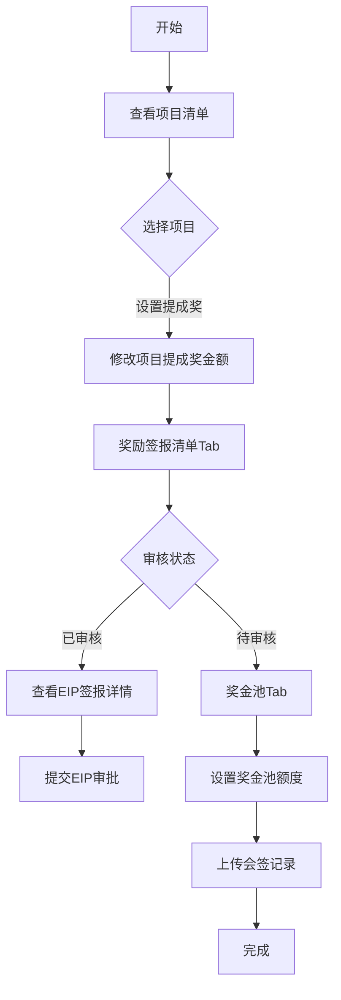

## 需求背景

### 痛点
- **问题现象**：当前无法统一查看和管理宁波地区产数项目的奖励发放情况，各奖励数据分散在不同系统中
- **发生频率**：高 - 每月都需要进行奖励签报和发放
- **当前 workaround**：运营人员需要登录多个系统手动汇总数据

### 业务目标
- **量化指标**：实现宁波产数钱包的一站式管理，提升奖励发放效率
- **目标期限**：2026年6月

### 涉及系统/模块
- **模块名称**：宁波产数钱包
- **变更类型**：新增
- **对接接口**：奖励签报EIP同步接口、奖金池管理接口

---

## 用户故事

### 故事1：项目提成奖管理员
- **角色**：区县分公司项目提成奖管理员
- **功能**：查看项目清单、设置项目提成奖金额、查看奖励签报详情
- **收益**：快速完成奖励发放前的准备工作，确保奖励及时到账
- **验收条件**：可查看56个字段的完整项目信息，可修改项目提成奖金额

### 故事2：财务审核人员
- **角色**：区县分公司财务审核人员
- **功能**：审核奖金池额度设置、上传会签记录
- **收益**：快速完成奖金池额度审批，提升审批效率
- **验收条件**：可修改奖金池金额，可上传会签记录文件

---

## 需求清单

| 序号 | 需求描述 | 优先级 | 状态 | 负责人 | 截止日期 |
|------|----------|--------|------|--------|----------|
| 1 | 项目清单Tab：56个字段的可拖动表头表格 | P0 | DONE | | |
| 2 | 项目提成奖金额可点击修改弹窗 | P0 | DONE | | |
| 3 | 奖励签报清单Tab：显示签报记录，可点击"EIP签报详情" | P0 | DONE | | |
| 4 | EIP签报详情弹窗：大额商机奖清单+项目提成奖清单 | P0 | DONE | | |
| 5 | 奖金池Tab：显示额度信息，可修改额度，可上传会签记录 | P0 | DONE | | |
| 6 | 上传会签记录弹窗 | P0 | DONE | | |

---

## 业务流程图

---

## 页面结构

### 路由信息
- **路由路径** - `/宁波产数钱包/宁波钱包`
- **页面标题** - 钱包列表
- **访问权限** - 登录用户

### 布局结构
- **布局类型** - 单栏
- **区域-标题区** - 页面标题"钱包列表"，副标题"项目清单、奖励签报清单与奖金池查询"
- **区域-Tab区** - 3个Tab切换：项目清单、奖励签报清单、奖金池
- **区域-主内容** - 查询条件卡片+数据表格

### Tab 结构
| Tab名称 | 说明 | 默认激活 |
|---------|------|----------|
| 项目清单 | 项目基本信息、奖励信息、收入支出等56个字段 | 是 |
| 奖励签报清单 | 已审核的奖励签报记录列表 | 否 |
| 奖金池 | 奖金池额度设置和会签记录 | 否 |

---

## 功能描述

### 功能点1：项目清单

#### Tab 级
- **Tab名称** - 项目清单
- **查询条件字段**：
  | 字段名 | 类型 | 必填 | 默认值 | 来源 | 校验规则 | 展示形式 | 交互约束 |
  |--------|------|------|--------|------|----------|----------|----------|
  | 账期 | 文本 | 否 | 空 | 用户选择 | type=month | 月份选择器 | 可编辑 |
  | 商机编码 | 文本 | 否 | 空 | 用户输入 | - | 输入框 | 可编辑 |
  | 项目名称 | 文本 | 否 | 空 | 用户输入 | - | 输入框 | 可编辑 |
  | 项目编码 | 文本 | 否 | 空 | 用户输入 | - | 输入框 | 可编辑 |
  | 合同编码 | 文本 | 否 | 空 | 用户输入 | - | 输入框 | 可编辑 |
  | 项目提成奖状态 | 枚举 | 否 | 空 | 用户选择 | - | 下拉选择 | 可编辑 |
  | 是否列收完成 | 枚举 | 否 | 空 | 用户选择 | - | 下拉选择 | 可编辑 |
  | 是否收款完成 | 枚举 | 否 | 空 | 用户选择 | - | 下拉选择 | 可编辑 |

- **操作按钮字段**：
  | 字段名 | 类型 | 必填 | 默认值 | 来源 | 校验规则 | 展示形式 | 交互约束 |
  |--------|------|------|--------|------|----------|----------|----------|
  | 查询 | 按钮 | 是 | - | - | - | primary按钮 | 可编辑 |
  | 重置 | 按钮 | 是 | - | - | - | outline按钮 | 可编辑 |
  | 展开更多条件 | 按钮 | 否 | - | - | - | link按钮 | 可编辑 |

- **字段列表**（8个分组，56个字段）：
  | 字段名 | 类型 | 必填 | 默认值 | 来源 | 校验规则 | 展示形式 | 交互约束 |
  |--------|------|------|--------|------|----------|----------|----------|
  | 账期 | 文本 | 是 | - | 接口 | - | 文字 | 只读 |
  | 地市 | 文本 | 是 | - | 接口 | - | 文字 | 只读 |
  | 区县分局 | 文本 | 是 | - | 接口 | - | 文字 | 只读 |
  | 支局 | 文本 | 是 | - | 接口 | - | 文字 | 只读 |
  | 商机编码 | 文本 | 是 | - | 接口 | - | 蓝色文字 | 只读 |
  | 合同编码 | 文本 | 是 | - | 接口 | - | 文字 | 只读 |
  | 项目名称 | 文本 | 是 | - | 接口 | - | 文字 | 只读 |
  | 项目编码 | 文本 | 是 | - | 接口 | - | 蓝色文字 | 只读 |
  | 立项开始时间 | 文本 | 是 | - | 接口 | - | 日期 | 只读 |
  | 项目状态 | 文本 | 是 | - | 接口 | - | 文字 | 只读 |
  | 客户名称 | 文本 | 是 | - | 接口 | - | 文字 | 只读 |
  | 客户p码 | 文本 | 是 | - | 接口 | - | 文字 | 只读 |
  | 项目金额 | 数字 | 是 | - | 接口 | - | 蓝色数字 | 只读 |
  | 项目类型 | 文本 | 是 | - | 接口 | - | 文字 | 只读 |
  | 大额商机奖金额 | 数字 | 是 | - | 接口 | - | 数字 | 只读 |
  | 奖励状态 | 文本 | 是 | - | 接口 | - | 标签 | 只读 |
  | 项目提成奖金额 | 数字 | 是 | - | 接口 | - | 蓝色可点击 | 可编辑 |
  | 设置项目提成奖金额 | 数字 | 是 | - | 接口 | - | 蓝色可点击 | 可编辑 |
  | 已发放金额 | 数字 | 是 | - | 接口 | - | 数字 | 只读 |
  | 项目提成奖状态 | 文本 | 是 | - | 接口 | - | 标签 | 只读 |
  | 成员状态 | 文本 | 是 | - | 接口 | - | 文字 | 只读 |
  | 是否列收完成 | 文本 | 是 | - | 接口 | - | 文字 | 只读 |
  | 是否收款完成 | 文本 | 是 | - | 接口 | - | 文字 | 只读 |
  | 收款≥已列收 | 文本 | 是 | - | 接口 | - | 文字 | 只读 |
  | 收款≥已付款 | 文本 | 是 | - | 接口 | - | 文字 | 只读 |
  | 计划总收入(含税) | 数字 | 是 | - | 接口 | - | 数字 | 只读 |
  | 计划总收入(不含税) | 数字 | 是 | - | 接口 | - | 数字 | 只读 |
  | ICT计划总金额(含税) | 数字 | 是 | - | 接口 | - | 数字 | 只读 |
  | ICT计划总金额(不含税) | 数字 | 是 | - | 接口 | - | 数字 | 只读 |
  | 实际总收入(含税) | 数字 | 是 | - | 接口 | - | 数字 | 只读 |
  | 实际总收入(不含税) | 数字 | 是 | - | 接口 | - | 数字 | 只读 |
  | ICT实际总金额(含税) | 数字 | 是 | - | 接口 | - | 数字 | 只读 |
  | ICT实际总金额(不含税) | 数字 | 是 | - | 接口 | - | 数字 | 只读 |
  | 后向合同名称 | 文本 | 是 | - | 接口 | - | 文字 | 只读 |
  | 后向合同编码 | 文本 | 是 | - | 接口 | - | 文字 | 只读 |
  | 计划支出总金额(含税) | 数字 | 是 | - | 接口 | - | 数字 | 只读 |
  | 计划支出总金额(不含税) | 数字 | 是 | - | 接口 | - | 数字 | 只读 |
  | 其中成本列账 | 数字 | 是 | - | 接口 | - | 数字 | 只读 |
  | 其中采购订单 | 数字 | 是 | - | 接口 | - | 数字 | 只读 |
  | 其中原子能力 | 数字 | 是 | - | 接口 | - | 数字 | 只读 |
  | 其中分成 | 数字 | 是 | - | 接口 | - | 数字 | 只读 |
  | 其中投资 | 数字 | 是 | - | 接口 | - | 数字 | 只读 |
  | 计划毛利率(含税) | 文本 | 是 | - | 接口 | - | 文字 | 只读 |
  | 计划毛利率(不含税) | 文本 | 是 | - | 接口 | - | 文字 | 只读 |
  | 实际支出(含税) | 数字 | 是 | - | 接口 | - | 数字 | 只读 |
  | 实际支出(不含税) | 数字 | 是 | - | 接口 | - | 数字 | 只读 |
  | 实际毛利率(含税) | 文本 | 是 | - | 接口 | - | 文字 | 只读 |
  | 实际毛利率(不含税) | 文本 | 是 | - | 接口 | - | 文字 | 只读 |
  | 累计实收金额 | 数字 | 是 | - | 接口 | - | 蓝色数字 | 只读 |
  | 累计应收账款 | 数字 | 是 | - | 接口 | - | 数字 | 只读 |
  | 累计付款金额 | 数字 | 是 | - | 接口 | - | 橙色数字 | 只读 |
  | 累计未付款金额 | 数字 | 是 | - | 接口 | - | 数字 | 只读 |

#### 弹窗级
- **弹窗：设置项目提成奖金额**
  - **触发入口**：点击"设置项目提成奖金额"字段
  - **关闭方式**：遮罩层点击 / 关闭图标 / 取消按钮 / Esc键
  - **字段列表**：
    | 字段名 | 类型 | 必填 | 默认值 | 来源 | 校验规则 | 展示形式 | 交互约束 |
    |--------|------|------|--------|------|----------|----------|----------|
    | 奖励金额 | 数字 | 是 | 当前值 | 接口 | 数字格式，最大不超过最大奖励金额 | 输入框 | 可编辑 |
  - **确定按钮**：验证输入，调用接口保存，成功关闭弹窗
  - **取消按钮**：点击后关闭弹窗，不调用接口

### 功能点2：奖励签报清单

#### Tab 级
- **Tab名称** - 奖励签报清单
- **查询条件字段**：
  | 字段名 | 类型 | 必填 | 默认值 | 来源 | 校验规则 | 展示形式 | 交互约束 |
  |--------|------|------|--------|------|----------|----------|----------|
  | 申请时间 | 日期 | 否 | 空 | 用户选择 | - | 日期范围选择器 | 可编辑 |
  | 审核状态 | 枚举 | 否 | 空 | 用户选择 | - | 下拉选择 | 可编辑 |
  | 送审人 | 文本 | 否 | 空 | 用户输入 | - | 输入框 | 可编辑 |
  | 分局 | 枚举 | 否 | 空 | 用户选择 | - | 下拉选择 | 可编辑 |

- **字段列表**：
  | 字段名 | 类型 | 必填 | 默认值 | 来源 | 校验规则 | 展示形式 | 交互约束 |
  |--------|------|------|--------|------|----------|----------|----------|
  | 地市 | 文本 | 是 | - | 接口 | - | 文字 | 只读 |
  | 区县分局 | 文本 | 是 | - | 接口 | - | 文字 | 只读 |
  | 账期 | 文本 | 是 | - | 接口 | - | 文字 | 只读 |
  | 项目数 | 数字 | 是 | - | 接口 | - | 数字 | 只读 |
  | 合同金额(万元) | 数字 | 是 | - | 接口 | - | 数字 | 只读 |
  | 合同ICT金额(万元) | 数字 | 是 | - | 接口 | - | 数字 | 只读 |
  | 收款金额(万元) | 数字 | 是 | - | 接口 | - | 蓝色数字 | 只读 |
  | 总奖励金额(元) | 数字 | 是 | - | 接口 | - | 蓝色数字 | 只读 |
  | 商机奖(元) | 数字 | 是 | - | 接口 | - | 数字 | 只读 |
  | 项目提成奖(元) | 数字 | 是 | - | 接口 | - | 数字 | 只读 |
  | 状态 | 文本 | 是 | - | 接口 | - | 彩色标签 | 只读 |
  | 送审人 | 文本 | 是 | - | 接口 | - | 文字 | 只读 |
  | 送审时间 | 文本 | 是 | - | 接口 | - | 文字 | 只读 |
  | 操作 | 文本 | 是 | - | - | - | 链接按钮 | 可编辑 |

#### 弹窗级
- **弹窗：EIP签报详情**
  - **触发入口**：点击"EIP签报详情"按钮（仅审核状态非"待审核"时显示）
  - **关闭方式**：关闭图标 / 取消按钮 / Esc键
  - **弹窗尺寸**：95vw × 90vh，可全屏到98vw × 98vh
  - **内容区域**：
    - 基本信息卡片：7个指标（项目数量、合同金额、ICT合同金额、收款金额、总奖励金额、商机奖、项目提成奖）
    - 大额商机奖清单表格：9列，含一级二级表头，团队成员展开显示
    - 项目提成奖清单表格：12列，含一级二级表头，团队成员展开显示
    - 文件管理区域：上传签批文件
  - **确定按钮**：点击后提交确认
  - **取消按钮**：点击后关闭弹窗

### 功能点3：奖金池

#### Tab 级
- **Tab名称** - 奖金池
- **查询条件字段**：
  | 字段名 | 类型 | 必填 | 默认值 | 来源 | 校验规则 | 展示形式 | 交互约束 |
  |--------|------|------|--------|------|----------|----------|----------|
  | 账期 | 文本 | 否 | 空 | 用户选择 | type=month | 月份选择器 | 可编辑 |
  | 申请时间 | 日期 | 否 | 空 | 用户选择 | - | 日期范围选择器 | 可编辑 |
  | 审核状态 | 枚举 | 否 | 空 | 用户选择 | - | 下拉选择 | 可编辑 |
  | 送审人 | 文本 | 否 | 空 | 用户输入 | - | 输入框 | 可编辑 |
  | 分局 | 枚举 | 否 | 空 | 用户选择 | - | 下拉选择 | 可编辑 |

- **字段列表**：
  | 字段名 | 类型 | 必填 | 默认值 | 来源 | 校验规则 | 展示形式 | 交互约束 |
  |--------|------|------|--------|------|----------|----------|----------|
  | 账期 | 文本 | 是 | - | 接口 | - | 文字 | 只读 |
  | 区县分局 | 文本 | 是 | - | 接口 | - | 文字 | 只读 |
  | 奖金池额度(万元) | 数字 | 是 | - | 接口 | - | 蓝色可点击 | 可编辑 |
  | 设置时间 | 文本 | 是 | - | 接口 | - | 日期 | 只读 |
  | 设置人 | 文本 | 是 | - | 接口 | - | 文字 | 只读 |
  | 变更时间 | 文本 | 是 | - | 接口 | - | 日期 | 只读 |
  | 变更人 | 文本 | 是 | - | 接口 | - | 文字 | 只读 |
  | 审核状态 | 文本 | 是 | - | 接口 | - | 彩色标签 | 只读 |
  | 会签记录 | 文本 | 是 | - | 接口 | - | 文件名/上传按钮 | 可编辑 |

#### 弹窗级
- **弹窗：设置奖金池金额**
  - **触发入口**：点击"奖金池额度"字段
  - **关闭方式**：遮罩层点击 / 取消按钮
  - **字段列表**：
    | 字段名 | 类型 | 必填 | 默认值 | 来源 | 校验规则 | 展示形式 | 交互约束 |
    |--------|------|------|--------|------|----------|----------|----------|
    | 奖金池额度 | 数字 | 是 | 当前值 | 接口 | 数字格式 | 输入框 | 可编辑 |
  - **确定按钮**：调用接口保存
  - **取消按钮**：关闭弹窗

- **弹窗：上传会签记录**
  - **触发入口**：点击"上传会签记录"按钮
  - **关闭方式**：关闭图标 / 取消按钮
  - **字段列表**：
    | 字段名 | 类型 | 必填 | 默认值 | 来源 | 校验规则 | 展示形式 | 交互约束 |
    |--------|------|------|--------|------|----------|----------|----------|
    | 上传文件 | 文件 | 是 | - | 用户选择 | pdf/doc/docx格式，≤50MB | 文件选择器 | 可编辑 |
  - **确定按钮**：上传文件到服务器
  - **取消按钮**：关闭弹窗

---

## 数据流图

### 接口1：查询项目清单
- **请求路径** - `/dict/report/getReportListPage`
- **请求方法** - POST
- **请求头** - Content-Type: application/json
- **请求参数** - 账期、商机编码、项目名称、项目编码、合同编码、状态筛选等
- **响应字段** - 项目列表数据，56个字段
- **存储位置** - 前端状态管理

### 接口2：修改项目提成奖金额
- **请求路径** - `/api/taskWallet/updateItemDrawAmtSet`
- **请求方法** - POST
- **请求参数** - id, itemDrawAmtSet
- **响应字段** - success/fail

### 接口3：查询奖励签报清单
- **请求路径** - `/api/taskWallet/getSjtDwsRewardReport74PageList`
- **请求方法** - POST
- **请求参数** - pageNum, pageSize, startDate, endDate, auditState, qxId, createUserName
- **响应字段** - records, total

### 接口4：查询奖金池
- **请求路径** - `/api/taskWallet/getCfgBonusPool74PageList`
- **请求方法** - POST
- **请求参数** - pageNum, pageSize, cycleMonth, startDate, endDate, statusCd, receiveUser, qxId
- **响应字段** - records, total

### 接口5：保存奖金池设置
- **请求路径** - `/api/taskWallet/saveCfgBonusPool74`
- **请求方法** - POST
- **请求参数** - id, cycleMonth, qxId, bonusAmount, signFiles
- **响应字段** - code, msg

---

## 验收标准

### 正常流程
- [ ] **操作**：进入宁波钱包页面，默认显示"项目清单"Tab → **预期**：页面加载项目清单表格，56个字段正确显示
- [ ] **操作**：点击"设置项目提成奖金额"字段 → **预期**：弹出修改弹窗，显示当前值
- [ ] **操作**：切换到"奖励签报清单"Tab → **预期**：显示奖励签报记录列表
- [ ] **操作**：点击"签报详情"按钮 → **预期**：弹出大尺寸详情弹窗，包含两个表格和文件管理区域
- [ ] **操作**：切换到"奖金池"Tab → **预期**：显示奖金池记录，可点击修改额度
- [ ] **操作**：点击"上传会签记录"按钮 → **预期**：弹出上传弹窗，可选择文件上传

### 异常流程
- [ ] **操作**：修改项目提成奖时输入超过最大金额 → **预期**：显示红色错误提示，提交按钮置灰
- [ ] **操作**：上传会签记录文件格式不正确 → **预期**：提示"文件格式不支持"

---

## 更新记录

### v1 - 2026-05-18
- 初始版本：宁波钱包页面PRD，包含项目清单、奖励签报清单、奖金池三个Tab