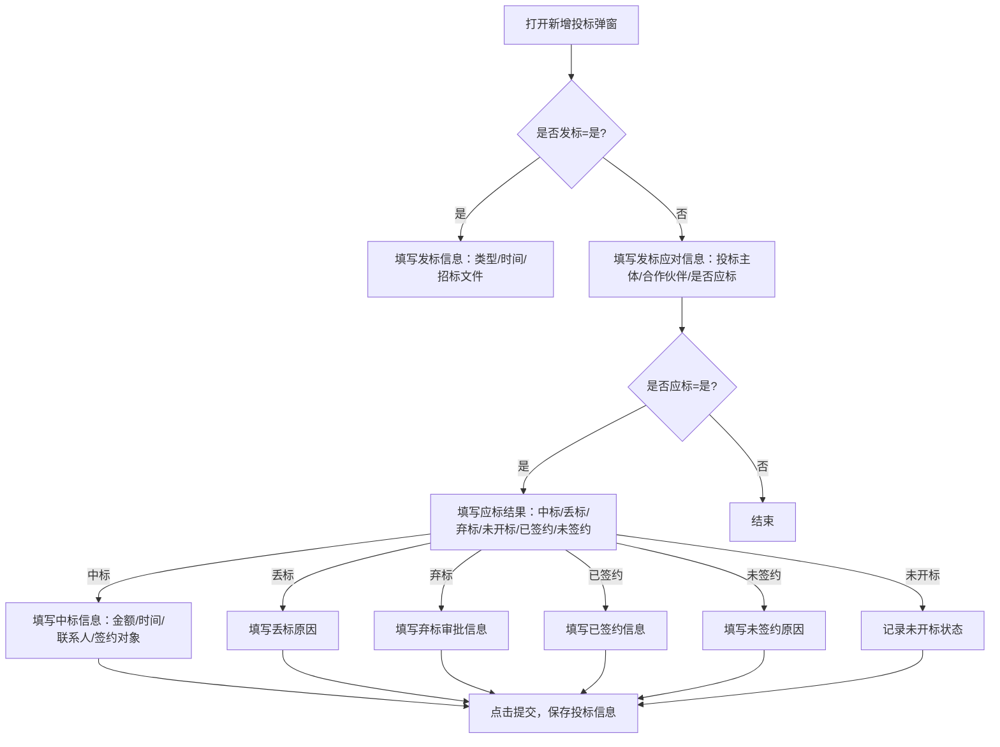

# 新增投标-项目发标 PRD

## 需求背景

### 痛点
- **问题现象**：投标流程涉及多个阶段（发标、应标、中标/丢标/弃标），各阶段字段不同，现有系统无法动态展示和完整记录
- **发生频率**：高
- **当前 workaround**：多份独立表格或纸质记录，信息分散难以追溯

### 业务目标
- **量化指标**：减少投标信息录入遗漏率，目标从 15% 降至 5%
- **目标期限**：2026-Q2

### 涉及系统/模块
- **模块名称**：新增投标-项目发标
- **变更类型**：新增
- **对接接口**：投标信息提交接口（待定义）

---

## 用户故事

### 故事1
- **角色**：销售/投标负责人
- **功能**：在单一弹窗中完成从发标到投标结果的全流程信息录入，根据投标结果动态显示对应字段
- **收益**：信息录入集中化，减少跨页面操作，字段遗漏率降低
- **验收条件**：发标类型选"公开招标"、应标结果选"中标"时，对应字段完整展示；选"弃标"时显示弃标审批相关字段

---

## 需求清单

| 序号 | 需求描述 | 优先级 | 状态 | 负责人 | 截止日期 |
|------|----------|--------|------|--------|----------|
| 1 | 发标信息区域：是否发标、发标类型、发标时间、招标文件上传 | P0 | TODO | | |
| 2 | 发标应对信息区域：投标主体、预计合作伙伴、是否应标、标前会议决策记录上传 | P0 | TODO | | |
| 3 | 应标信息区域（应标=是时显示）：应标结果下拉、投标依据/标书上传 | P0 | TODO | | |
| 4 | 中标信息（应标结果=中标时显示）：投标时间、中标金额、中标时间、签约对象、联系人及电话、项目期望完成时间、中标通知书上传 | P0 | TODO | | |
| 5 | 已签约信息（应标结果=已签约时显示）：商务谈判时间、联系人及电话、项目期望完成时间 | P1 | TODO | | |
| 6 | 丢标信息（应标结果=丢标时显示）：投标时间、丢标原因（可填其他） | P0 | TODO | | |
| 7 | 弃标信息（应标结果=弃标时显示）：弃标审批状态、审批人信息、审批结果、弃标原因、发起/通过时间 | P0 | TODO | | |
| 8 | 未签约信息（应标结果=未签约时显示）：签约失败原因、其他原因 | P1 | TODO | | |
| 9 | 全屏/还原切换功能 | P2 | TODO | | |
| 10 | 暂存与提交功能 | P1 | TODO | | |

- **优先级**：P0（核心流程阻塞）/ P1（重要功能）/ P2（体验优化）/ P3（未来规划）
- **状态**：TODO / IN PROGRESS / DONE / BLOCKED

---

## 业务流程图

---

## 页面结构

### 路由信息
- **路由路径**：弹窗组件（无独立路由）
- **页面标题**：新增投标-项目发标
- **访问权限**：登录

### 布局结构
- **布局类型**：弹窗（900px 宽，最大高度 90vh，支持全屏切换）
- **区域-主内容**：标题栏（蓝底白字）→ 表单内容（可滚动）→ 底部按钮（取消/暂存/提交）

### 弹窗级
- **触发入口**：列表页点击"新增投标"按钮
- **关闭方式**：点击 X 图标 / 点击遮罩层 / 点击取消按钮
- **字段列表**：

#### 发标信息区
| 字段名 | 类型 | 必填 | 默认值 | 来源 | 校验规则 | 展示形式 | 交互约束 |
|--------|------|------|--------|------|----------|----------|----------|
| 是否发标 | Select（是/否） | 是 | 空 | 用户选择 | 不能为空 | 下拉选择 | 切换影响发标类型是否必填 |
| 发标类型 | Select（公开招标/邀请招标/竞争性谈判/单一来源采购/询价/直接签约） | 发标=是时必填 | 空 | 用户选择 | 不能为空 | 下拉选择 | 受是否发标控制 |
| 发标时间 | date | 发标=是时必填 | 空 | 用户选择 | 日期格式校验 | 日期选择器 | - |
| 招标文件/招标公告 | 文件上传 | 发标=是时必填 | 空 | 本地文件 | 支持pdf/word/excel | 文件标签列表+点击上传 | 可上传多个，可删除已上传文件 |

#### 发标应对信息区
| 字段名 | 类型 | 必填 | 默认值 | 来源 | 校验规则 | 展示形式 | 交互约束 |
|--------|------|------|--------|------|----------|----------|----------|
| 投标主体 | Input | 是 | 空 | 用户输入 | 不能为空 | 文本输入 | - |
| 预计合作伙伴 | Input | 是 | 空 | 用户输入 | 不能为空 | 文本输入 | - |
| 是否应标 | Radio（是/否） | 是 | 空 | 用户选择 | 不能为空 | 单选按钮 | 切换显示/隐藏应标信息区 |
| 标前会议决策记录 | 文件上传 | 是 | 空 | 本地文件 | 支持pdf/word/excel | 文件标签列表+点击上传 | 可上传多个，可删除 |

#### 应标信息区（是否应标=是时显示）
| 字段名 | 类型 | 必填 | 默认值 | 来源 | 校验规则 | 展示形式 | 交互约束 |
|--------|------|------|--------|------|----------|----------|----------|
| 应标结果 | Select（中标/丢标/未开标/已签约/未签约/弃标） | 是 | 空 | 用户选择 | 不能为空 | 下拉选择 | 动态显示对应结果字段区 |
| 投标依据/标书 | 文件上传 | 是 | 空 | 本地文件 | 支持pdf/word/excel | 文件标签列表+点击上传 | - |

#### 中标信息区（应标结果=中标时显示）
| 字段名 | 类型 | 必填 | 默认值 | 来源 | 校验规则 | 展示形式 | 交互约束 |
|--------|------|------|--------|------|----------|----------|----------|
| 投标时间 | date | 是 | 空 | 用户选择 | 日期格式校验 | 日期选择器 | - |
| 中标金额（万元） | Input | 是 | 空 | 用户输入 | 正数金额 | 文本输入 | - |
| 中标时间 | date | 是 | 空 | 用户选择 | 日期格式校验 | 日期选择器 | - |
| 签约对象 | Input | 是 | 空 | 用户输入 | 不能为空 | 文本输入 | - |
| 客户项目联系人 | Input | 是 | 空 | 用户输入 | 不能为空 | 文本输入 | - |
| 客户项目联系方式 | Input | 是 | 空 | 用户输入 | 手机号格式 | 文本输入 | - |
| 项目期望完成时间 | date | 否 | 空 | 用户选择 | 日期格式校验 | 日期选择器 | - |
| 中标通知书 | 文件上传 | 否 | 空 | 本地文件 | 支持pdf/word/excel | 文件标签列表+点击上传 | - |

#### 已签约信息区（应标结果=已签约时显示）
| 字段名 | 类型 | 必填 | 默认值 | 来源 | 校验规则 | 展示形式 | 交互约束 |
|--------|------|------|--------|------|----------|----------|----------|
| 商务谈判时间 | date | 否 | 空 | 用户选择 | 日期格式校验 | 日期选择器 | - |
| 客户项目联系人 | Input | 是 | 空 | 用户输入 | 不能为空 | 文本输入 | - |
| 客户项目联系方式 | Input | 是 | 空 | 用户输入 | 手机号格式 | 文本输入 | - |
| 项目期望完成时间 | date | 否 | 空 | 用户选择 | 日期格式校验 | 日期选择器 | - |

#### 丢标信息区（应标结果=丢标时显示）
| 字段名 | 类型 | 必填 | 默认值 | 来源 | 校验规则 | 展示形式 | 交互约束 |
|--------|------|------|--------|------|----------|----------|----------|
| 投标时间 | date | 是 | 空 | 用户选择 | 日期格式校验 | 日期选择器 | - |
| 丢标原因 | Select（8种选项+其他） | 是 | 空 | 用户选择 | 不能为空 | 下拉选择 | 选"其他"时显示其他原因输入框 |
| 其他丢标原因 | Input | 丢标原因=其他时必填 | 空 | 用户输入 | 不能为空 | 文本输入 | 仅在丢标原因=其他时显示 |

#### 弃标信息区（应标结果=弃标时显示）
| 字段名 | 类型 | 必填 | 默认值 | 来源 | 校验规则 | 展示形式 | 交互约束 |
|--------|------|------|--------|------|----------|----------|----------|
| 是否完成弃标审批 | Select（是/否） | 是 | 空 | 用户选择 | 不能为空 | 下拉选择 | - |
| 弃标审批人 | Input | 是 | 空 | 用户输入 | 不能为空 | 文本输入 | - |
| 审批人人力编码 | Input | 是 | 空 | 用户输入 | 不能为空 | 文本输入 | - |
| 审批人手机号 | Input | 否 | 空 | 用户输入 | 手机号格式 | 文本输入 | - |
| 审批人角色 | Select（部门经理/行业总裁/领导/其他） | 是 | 空 | 用户选择 | 不能为空 | 下拉选择 | - |
| 弃标审批结果 | Select（未审批/审核通过/已退回/未通过） | 是 | 空 | 用户选择 | 不能为空 | 下拉选择 | - |
| 弃标原因 | Select（9种选项） | 是 | 空 | 用户选择 | 不能为空 | 下拉选择 | - |
| 弃标审批发起时间 | date | 是 | 空 | 用户选择 | 日期格式校验 | 日期选择器 | - |
| 弃标审批通过时间 | date | 是 | 空 | 用户选择 | 日期格式校验 | 日期选择器 | - |

#### 未签约信息区（应标结果=未签约时显示）
| 字段名 | 类型 | 必填 | 默认值 | 来源 | 校验规则 | 展示形式 | 交互约束 |
|--------|------|------|--------|------|----------|----------|----------|
| 签约失败原因 | Select（客户需求变更或取消/丢单/其他） | 是 | 空 | 用户选择 | 不能为空 | 下拉选择 | - |
| 其他签约失败原因 | Input | 是 | 空 | 用户输入 | 不能为空 | 文本输入 | - |

- **确定按钮**：调用提交接口，传入完整表单数据，成功关闭弹窗并刷新列表，失败显示错误提示
- **取消按钮**：关闭弹窗，不修改任何数据
- **暂存按钮**：保存当前填写内容至草稿（不关闭弹窗）

---

## 数据流图

### 接口1：提交投标信息
- **请求路径**：`POST /api/bid/submit`
- **请求方法**：POST
- **请求头**：Authorization / Content-Type: application/json
- **请求参数**：
  - `isStart` - 类型：字符串（"1"/"0"）；必填：是；来源：发标信息-是否发标；校验：
  - `bidType` - 类型：字符串；必填：否；来源：发标类型；校验：
  - `startTime` - 类型：字符串（日期）；必填：否；来源：发标时间；校验：
  - `biddingDocumentsFiles` - 类型：文件数组；必填：否；来源：招标文件上传；校验：
  - `bidBody` - 类型：字符串；必填：是；来源：投标主体；校验：
  - `expectedPartners` - 类型：字符串；必填：是；来源：预计合作伙伴；校验：
  - `isBid` - 类型：字符串（"1"/"0"）；必填：是；来源：是否应标；校验：
  - `tagMeetingDecisionFiles` - 类型：文件数组；必填：是；来源：标前会议决策记录；校验：
  - `bidResult` - 类型：字符串；必填：否；来源：应标结果；校验：
  - `winBidAmount/winBidTime/customerContact/customerContactPhone/contractObject` - 类型：字符串；必填：应标结果=中标时是；来源：中标信息各字段；校验：
  - `loseReason/abandBidResult/qbFqTime/qbTgTime/approver/approverHrCode/approverRole` - 类型：字符串；必填：对应结果选中时是；来源：对应信息区；校验：
- **响应字段**：
  - `success` - 类型：布尔；描述：提交是否成功
  - `bidId` - 类型：字符串；描述：投标记录ID
  - `message` - 类型：字符串；描述：返回信息
- **存储位置**：数据库表 bid_records / 附件存储
- **错误码**：
  - `400` - `参数校验失败，请检查必填字段`
  - `401` - `无权限，请先登录`
  - `500` - `服务器异常，提交失败`

### 数据刷新点
- **刷新时机**：点击提交按钮成功响应后
- **影响字段**：投标列表数据

---

## 验收标准

### 正常流程
- [ ] **操作**：点击"新增投标"按钮 → **预期**：弹窗打开，标题显示"新增投标-项目发标"，表单为空
- [ ] **操作**：选择"是否发标=是" → **预期**：发标类型、发标时间变为必填，招标文件上传变为必填
- [ ] **操作**：选择"是否应标=是" → **预期**：应标信息区域显示，包含应标结果下拉和投标依据上传
- [ ] **操作**：应标结果选择"中标" → **预期**：中标信息区域动态显示，投标时间/中标金额等字段出现
- [ ] **操作**：应标结果选择"弃标" → **预期**：弃标信息区域动态显示，审批人信息、弃标原因等字段出现
- [ ] **操作**：填写完整表单后点击提交 → **预期**：接口被调用，弹窗关闭，列表刷新

### 异常流程
- [ ] **操作**：应标结果=中标时，不填写中标金额直接提交 → **预期**：字段下方显示红色提示"不能为空"，提交按钮置灰
- [ ] **操作**：选择发标类型后删除选择 → **预期**：字段显示红色边框提示
- [ ] **操作**：上传非pdf/word/excel格式文件 → **预期**：文件被拒绝（已有accept限制）
- [ ] **操作**：点击X图标关闭弹窗 → **预期**：弹窗关闭，已填写内容未保存
- [ ] **操作**：点击暂存按钮 → **预期**：数据保存，弹窗不关闭，显示保存成功提示

---

## 更新记录

### v1 - 2026-05-09
- 初始版本