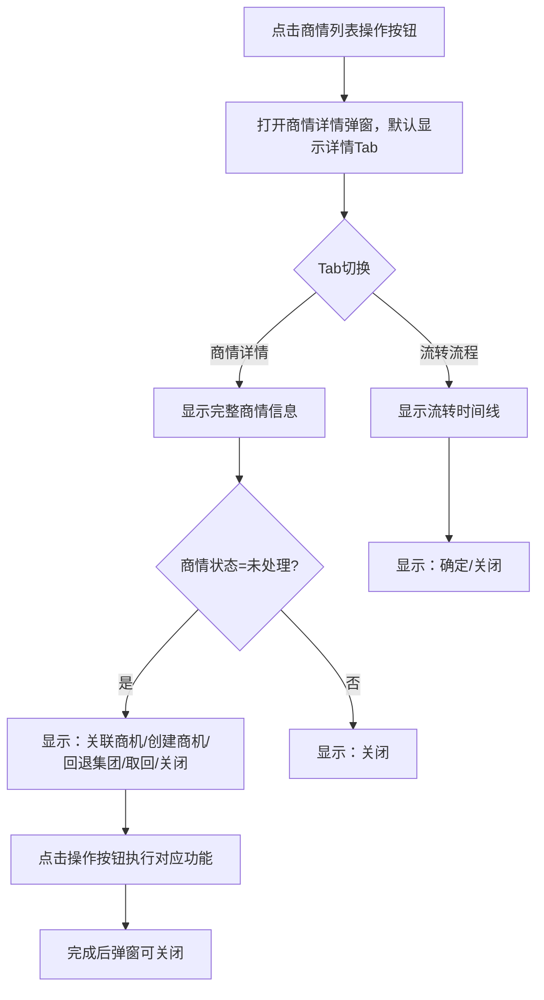

# 商情详情（双Tab模式）PRD

## 需求背景

### 痛点
- **问题现象**：商情详情需要同时支持"商情详情"查看和"流转流程"查看，当前无Tab切换功能；未处理状态下需要支持关联商机、创建商机、回退集团、取回等操作
- **发生频率**：高（每日多次）
- **当前 workaround**：通过多个页面或弹窗分别查看

### 业务目标
- **量化指标**：商情处理效率提升，操作集中化
- **目标期限**：2026-Q2

### 涉及系统/模块
- **模块名称**：商情详情（双Tab模式）
- **变更类型**：新增
- **对接接口**：商情详情查询接口 / 商机关联接口

---

## 用户故事

### 故事1
- **角色**：客户经理/销售人员
- **功能**：在弹窗中查看商情完整信息（详情Tab）和流转记录（流程Tab），并可进行关联商机、创建商机、回退集团、取回等操作
- **收益**：信息集中查看，操作一站完成，减少页面跳转
- **验收条件**：Tab切换正常显示对应内容；未处理状态下显示所有操作按钮；已处理状态下仅显示关闭按钮

---

## 需求清单

| 序号 | 需求描述 | 优先级 | 状态 | 负责人 | 截止日期 |
|------|----------|--------|------|--------|----------|
| 1 | Tab切换：商情详情/流转流程，可切换 | P0 | TODO | | |
| 2 | 商情详情Tab：基本信息/处理信息/招投标信息/行业信息/其他信息/附件 | P0 | TODO | | |
| 3 | 流转流程Tab：展示时间线式流转记录 | P0 | TODO | | |
| 4 | 底部操作按钮（未处理状态）：关联商机/创建商机/回退集团/取回/关闭 | P0 | TODO | | |
| 5 | 底部操作按钮（流转流程Tab）：确定/关闭 | P1 | TODO | | |
| 6 | 关闭按钮（详情Tab）：关闭弹窗 | P0 | TODO | | |

- **优先级**：P0（核心流程阻塞）/ P1（重要功能）/ P2（体验优化）/ P3（未来规划）
- **状态**：TODO / IN PROGRESS / DONE / BLOCKED

---

## 业务流程图

---

## 页面结构

### 弹窗级
- **触发入口**：商情列表点击操作按钮
- **关闭方式**：点击X图标；点击关闭按钮；点击遮罩层
- **弹窗尺寸**：900px宽，最大高度90vh

### Tab 结构
- **Tab名称**：商情详情 / 流转流程
- **Tab路由**：无（弹窗内切换）
- **加载方式**：预加载（两个Tab内容同时加载，按需显示）
- **默认激活**：商情详情

### 字段列表

#### 商情详情Tab字段
与 BusinessInfoDetailModal 相同，额外包含：

#### 行业信息区
| 字段名 | 类型 | 必填 | 默认值 | 来源 | 校验规则 | 展示形式 | 交互约束 |
|--------|------|------|--------|------|----------|----------|----------|
| 一级行业 | 文本 | - | - | 来源于商情数据 | - | 普通文本，为空显示"-" | 只读 |
| 二级行业 | 文本 | - | - | 来源于商情数据 | - | 普通文本，为空显示"-" | 只读 |

#### 其他信息区
| 字段名 | 类型 | 必填 | 默认值 | 来源 | 校验规则 | 展示形式 | 交互约束 |
|--------|------|------|--------|------|----------|----------|----------|
| 原文链接 | 超链接 | - | - | 来源于商情数据 | - | 可点击跳转，为空显示"-" | 只读 |
| 回退原因 | 文本 | - | - | 来源于商情数据 | - | 普通文本，为空显示"-" | 只读 |

#### 流转流程Tab字段（时间线展示）
| 字段名 | 类型 | 必填 | 默认值 | 来源 | 校验规则 | 展示形式 | 交互约束 |
|--------|------|------|--------|------|----------|----------|----------|
| 时间 | 日期时间文本 | - | - | 来源于流转记录 | - | 普通文本 | 只读 |
| 操作人 | 文本 | - | - | 来源于流转记录 | - | 普通文本 | 只读 |
| 执行操作 | 文本 | - | - | 来源于流转记录 | - | 普通文本 | 只读 |
| 操作内容 | 文本 | - | - | 来源于流转记录 | - | 普通文本 | 只读 |
| 接收人 | 文本 | - | - | 来源于流转记录 | - | 普通文本，为空则不显示 | 只读 |

#### 底部操作按钮（商情状态=未处理时）
| 字段名 | 类型 | 必填 | 默认值 | 来源 | 校验规则 | 展示形式 | 交互约束 |
|--------|------|------|--------|------|----------|----------|----------|
| 关联商机按钮 | Button | - | - | - | - | 默认样式 | 点击触发关联商机弹窗 |
| 创建商机按钮 | Button | - | - | - | - | 默认样式 | 点击跳转创建商机页面 |
| 回退集团按钮 | Button | - | - | - | - | 边框样式 | 点击执行回退操作 |
| 取回按钮 | Button | - | - | - | - | 边框样式 | 点击执行取回操作 |
| 关闭按钮 | Button | - | - | - | - | 边框样式 | 关闭弹窗 |

#### 底部操作按钮（流转流程Tab）
| 字段名 | 类型 | 必填 | 默认值 | 来源 | 校验规则 | 展示形式 | 交互约束 |
|--------|------|------|--------|------|----------|----------|----------|
| 确定按钮 | Button | - | - | - | - | 默认样式 | 关闭弹窗 |
| 关闭按钮 | Button | - | - | - | - | 边框样式 | 关闭弹窗 |

---

## 数据流图

### 接口1：获取商情详情（含流转）
- **请求路径**：`GET /api/business-info/detail`
- **请求方法**：GET
- **请求头**：Authorization
- **请求参数**：
  - `businessInfoId` - 类型：字符串；必填：是；来源：当前商情ID；校验：
- **响应字段**：
  - 包含商情所有字段及 flowHistory 流转记录数组
- **存储位置**：数据库表 business_info / flow_history
- **错误码**：
  - `401` - `无权限`
  - `404` - `商情不存在`
  - `500` - `服务器异常`

### 接口2：关联商机
- **请求路径**：`POST /api/business-info/link-opportunity`
- **请求方法**：POST
- **请求头**：Authorization / Content-Type: application/json
- **请求参数**：
  - `businessInfoId` - 类型：字符串；必填：是；来源：当前商情ID；校验：
  - `opportunityId` - 类型：字符串；必填：是；来源：用户选择的商机；校验：
- **响应字段**：
  - `success` - 类型：布尔；描述：是否成功
- **存储位置**：数据库表 business_info
- **错误码**：
  - `400` - `参数错误`
  - `401` - `无权限`
  - `500` - `服务器异常`

### 数据刷新点
- **刷新时机**：页面加载时
- **影响字段**：各Tab内容显示

---

## 验收标准

### 正常流程
- [ ] **操作**：点击商情列表操作按钮 → **预期**：弹窗打开，默认显示商情详情Tab，内容完整
- [ ] **操作**：点击"流转流程"Tab → **预期**：Tab高亮，切换到流转时间线视图
- [ ] **操作**：点击"商情详情"Tab → **预期**：Tab高亮，切换回详情视图
- [ ] **操作**：查看未处理商情 → **预期**：底部显示关联商机/创建商机/回退集团/取回/关闭按钮
- [ ] **操作**：点击关联商机 → **预期**：触发关联商机弹窗（见 LinkOpportunityDialog）

### 异常流程
- [ ] **操作**：点击遮罩层 → **预期**：弹窗关闭
- [ ] **操作**：商情编号不存在 → **预期**：弹窗不打开或显示错误提示

---

## 更新记录

### v1 - 2026-05-09
- 初始版本
