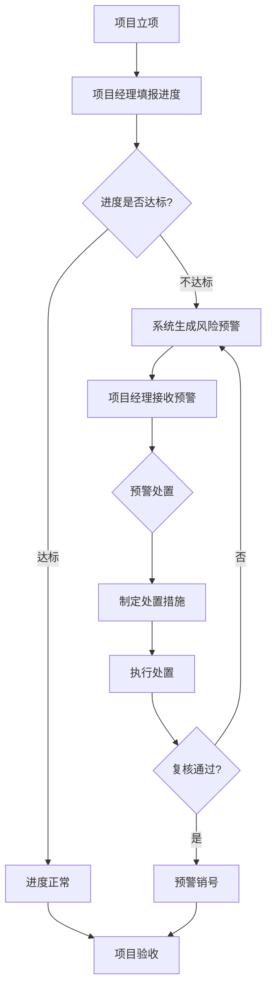

# 实施进度监控 PRD

## 需求背景

### 痛点
- **问题现象**：项目数量多，进度信息分散，项目经理无法快速掌握整体进度和风险情况；滞后项目发现滞后，往往已错过最佳干预时机。
- **发生频率**：高
- **当前 workaround**：通过线下 Excel 或周报形式汇报进度，信息滞后且不统一。

### 业务目标
- **量化指标**：监控覆盖项目数 100%；滞后预警发出及时率 >= 95%；里程碑达成率提升至 80%。
- **目标期限**：2026年Q2

### 涉及系统/模块
- **模块名称**：实施进度监控（ImplementationMonitoring）
- **变更类型**：新增
- **对接接口**：项目进度数据接口、里程碑数据接口、预警接口

---

## 用户故事

### 故事1
- **角色**：项目经理
- **功能**：在进度总览页查看所有项目的整体进度、偏差和风险等级
- **收益**：一目了然地识别滞后项目，提前介入干预
- **验收条件**：总览页展示所有项目数量、正常/滞后项目数、里程碑达成率；甘特图、趋势图等图表正常渲染

### 故事2
- **角色**：项目经理
- **功能**：在进度明细页搜索、筛选项目，查看单个项目的详细进度
- **收益**：快速定位目标项目，查看偏差详情和滞后里程碑
- **验收条件**：支持按项目名称、项目经理搜索；支持按风险等级筛选；明细表格展示完整进度字段

### 故事3
- **角色**：项目经理、质量管理员
- **功能**：在风险预警页查看、处理项目预警
- **收益**：及时发现和处理项目风险，避免风险扩大
- **验收条件**：预警列表展示各级别预警；支持新增、处置、销号操作

---

## 需求清单

| 序号 | 需求描述 | 优先级 | 状态 | 负责人 | 截止日期 |
|------|----------|--------|------|--------|----------|
| 1 | 进度总览 Tab：核心指标卡片 + 4类图表 + 滞后预警清单 | P0 | TODO | | |
| 2 | 进度明细 Tab：查询筛选 + 数据列表（含进度条展示） | P0 | TODO | | |
| 3 | 风险预警 Tab：预警统计 + 预警列表 + 处理流程说明 | P0 | TODO | | |
| 4 | 甘特图、趋势图、饼图等可视化组件集成 | P1 | TODO | | |
| 5 | 导出功能：批量导出、甘特图导出 | P2 | TODO | | |

- **优先级**：P0（核心流程阻塞）/ P1（重要功能）/ P2（体验优化）/ P3（未来规划）
- **状态**：TODO / IN PROGRESS / DONE / BLOCKED

---

## 业务流程图

---

## 页面结构

### 路由信息
- **路由路径**：`/implementation-monitoring`
- **页面标题**：实施进度监控
- **访问权限**：登录 / 项目经理及以上角色

### 布局结构
- **布局类型**：单栏
- **区域-主内容**：顶部标题区 + Tabs 切换区 + 内容区

### Tab 结构
- **Tab名称**：进度总览、进度明细、风险预警
- **Tab路由**：通过 activeTab 状态切换
- **加载方式**：预加载（Tabs 默认渲染所有内容）
- **默认激活**：进度总览

---

## 功能描述

### 功能点1：进度总览

#### 页面级
- **字段：功能入口** - 类型：文本；描述：页面加载时默认展示总览 Tab
- **字段：前置条件** - 类型：文本；描述：用户已登录且有对应项目数据权限
- **字段：后置影响** - 类型：字段列表；描述：页面底部展示滞后预警清单

#### Tab 级
- **Tab名称**：进度总览
- **字段列表**：
  | 字段名 | 类型 | 必填 | 默认值 | 来源 | 校验规则 | 展示形式 | 交互约束 |
  |--------|------|------|--------|------|----------|----------|----------|
  | 项目总数 | 数字 | - | - | 接口返回 | - | 卡片数字 | 只读 |
  | 正常推进数 | 数字 | - | - | 接口返回 | - | 卡片数字（绿色） | 只读 |
  | 滞后项目数 | 数字 | - | - | 接口返回 | - | 卡片数字（红色） | 只读 |
  | 里程碑总数 | 数字 | - | - | 接口返回 | - | 卡片数字 | 只读 |
  | 已达成数 | 数字 | - | - | 接口返回 | - | 卡片数字 | 只读 |
  | 达成率 | 百分比 | - | - | 接口计算 | - | 卡片数字（青色） | 只读 |
- **图表列表**：
  | 图表名称 | 类型 | 描述 |
  |----------|------|------|
  | 项目进度甘特图 | BarChart | 各项目进度横向柱状图 |
  | 部门进度排名 | BarChart | 各部门平均进度排名 |
  | 工期偏差分布 | PieChart | 正常/轻微延误/严重延误/超前占比 |
  | 月度里程碑达成趋势 | LineChart | 计划值与实际值双线趋势 |

#### 列表字段
- **字段列表**：
  | 字段名 | 类型 | 必填 | 默认值 | 来源 | 校验规则 | 展示形式 | 交互约束 |
  |--------|------|------|--------|------|----------|----------|----------|
  | 项目名称 | 字符串 | - | - | 接口 | - | 文本 | - |
  | 项目经理 | 字符串 | - | - | 接口 | - | 文本 | - |
  | 整体进度偏差率 | 数字 | - | - | 接口计算 | - | 数字（红/绿/黑） | - |
  | 滞后里程碑节点 | 字符串 | - | - | 接口 | - | 文本 | - |
  | 滞后时长(天) | 数字 | - | - | 接口 | - | 数字（红色加粗） | - |
  | 风险等级 | 枚举 | - | - | 接口 | - | Badge | - |
  | 操作 | 操作 | - | - | - | - | 按钮（查看） | - |

---

### 功能点2：进度明细

#### Tab 级
- **Tab名称**：进度明细
- **查询条件字段**：
  | 字段名 | 类型 | 必填 | 默认值 | 来源 | 校验规则 | 展示形式 | 交互约束 |
  |--------|------|------|--------|------|----------|----------|----------|
  | 搜索 | 字符串 | 否 | 空 | 页面输入 | - | Input | 支持项目名称、项目经理模糊搜索 |
  | 风险等级 | 枚举 | 否 | 全部等级 | 下拉选择 | - | Select | 全部/正常/一般/较大/重大 |
- **操作按钮字段**：
  | 字段名 | 类型 | 必填 | 默认值 | 来源 | 校验规则 | 展示形式 | 交互约束 |
  |--------|------|------|--------|------|----------|----------|----------|
  | 批量导出 | 操作按钮 | - | - | - | - | Button | 导出当前列表数据为 Excel |
  | 导出甘特图 | 操作按钮 | - | - | - | - | Button | 导出甘特图图片 |
  | 刷新 | 操作按钮 | - | - | - | - | Button | 刷新列表数据 |

- **字段列表**：
  | 字段名 | 类型 | 必填 | 默认值 | 来源 | 校验规则 | 展示形式 | 交互约束 |
  |--------|------|------|--------|------|----------|----------|----------|
  | 项目名称 | 字符串 | - | - | 接口 | - | 文本（超长截断） | - |
  | 项目经理 | 字符串 | - | - | 接口 | - | 文本 | - |
  | 实际进度 | 百分比 | - | - | 接口 | - | 进度条+数字 | 只读 |
  | 计划进度 | 百分比 | - | - | 接口 | - | 数字 | 只读 |
  | 进度偏差 | 数字 | - | - | 接口计算 | - | 带正负号数字（红绿着色） | - |
  | 滞后里程碑 | 字符串 | - | - | 接口 | - | 文本 | - |
  | 滞后时长 | 数字 | - | - | 接口 | - | 数字+天单位 | - |
  | 风险等级 | 枚举 | - | - | 接口 | - | Badge | - |
  | 操作 | 操作 | - | - | - | - | 详情/填报按钮 | - |

---

### 功能点3：风险预警

#### Tab 级
- **Tab名称**：风险预警
- **字段列表**（预警统计卡片）：
  | 字段名 | 类型 | 必填 | 默认值 | 来源 | 校验规则 | 展示形式 | 交互约束 |
  |--------|------|------|--------|------|----------|----------|----------|
  | 严重预警数 | 数字 | - | - | 接口 | - | 卡片数字（红色） | - |
  | 重要预警数 | 数字 | - | - | 接口 | - | 卡片数字（橙色） | - |
  | 一般预警数 | 数字 | - | - | 接口 | - | 卡片数字（黄色） | - |
  | 已处理数 | 数字 | - | - | 接口 | - | 卡片数字（绿色） | - |

- **查询条件字段**：
  | 字段名 | 类型 | 必填 | 默认值 | 来源 | 校验规则 | 展示形式 | 交互约束 |
  |--------|------|------|--------|------|----------|----------|----------|
  | 预警级别 | 枚举 | 否 | 全部预警 | 下拉选择 | - | Select | 全部/严重/重要/一般 |
  | 处理状态 | 枚举 | 否 | 待处理 | 下拉选择 | - | Select | 待处理/处理中/已完成/已销号 |
  | 预警内容搜索 | 字符串 | 否 | 空 | 页面输入 | - | Input | 模糊搜索 |

- **操作按钮字段**：
  | 字段名 | 类型 | 必填 | 默认值 | 来源 | 校验规则 | 展示形式 | 交互约束 |
  |--------|------|------|--------|------|----------|----------|----------|
  | 新增预警 | 操作按钮 | - | - | - | - | Button | 打开新增预警弹窗 |

- **预警列表字段**：
  | 字段名 | 类型 | 必填 | 默认值 | 来源 | 校验规则 | 展示形式 | 交互约束 |
  |--------|------|------|--------|------|----------|----------|----------|
  | 预警级别 | 枚举 | - | - | 接口 | - | 图标+文字 | - |
  | 预警时间 | 日期时间 | - | - | 接口 | - | 文本 | - |
  | 预警类型 | 枚举 | - | - | 接口 | - | Badge | - |
  | 预警内容 | 字符串 | - | - | 接口 | - | 文本（限制宽度） | - |
  | 责任人 | 字符串 | - | - | 接口 | - | 文本 | - |
  | 状态 | 枚举 | - | - | 接口 | - | Badge | - |
  | 处理期限 | 日期 | - | - | 接口 | - | 文本（红色加急） | - |
  | 操作 | 操作 | - | - | - | - | 处置/详情按钮 | - |

---

## 数据流图

### 接口1：获取项目进度列表
- **请求路径**：`GET /api/project/progress`
- **请求方法**：GET
- **请求头**：Authorization
- **请求参数**：
  - `searchText` - 类型：字符串；必填：否；来源：搜索框；校验：最大长度100
  - `riskLevel` - 类型：字符串；必填：否；来源：下拉选择；校验：枚举值
- **响应字段**：
  - `id` - 类型：字符串；描述：项目唯一标识
  - `projectName` - 类型：字符串；描述：项目名称
  - `projectManager` - 类型：字符串；描述：项目经理
  - `overallProgress` - 类型：数字；描述：实际进度百分比
  - `plannedProgress` - 类型：数字；描述：计划进度百分比
  - `deviation` - 类型：数字；描述：进度偏差百分比
  - `delayedMilestone` - 类型：字符串；描述：滞后里程碑
  - `delayDays` - 类型：数字；描述：滞后天数
  - `riskLevel` - 类型：字符串；描述：风险等级
- **存储位置**：数据库表 project_progress
- **错误码**：
  - `401` - `用户未登录，请先登录`
  - `403` - `无权限访问该项目数据`
  - `500` - `服务器异常，请稍后重试`

### 接口2：获取预警列表
- **请求路径**：`GET /api/project/warnings`
- **请求方法**：GET
- **请求头**：Authorization
- **请求参数**：
  - `level` - 类型：字符串；必填：否；来源：页面选择；校验：枚举值
  - `status` - 类型：字符串；必填：否；来源：页面选择；校验：枚举值
  - `keyword` - 类型：字符串；必填：否；来源：搜索框；校验：最大长度100
- **响应字段**：
  - `id` - 类型：字符串；描述：预警记录ID
  - `level` - 类型：字符串；描述：预警级别
  - `type` - 类型：字符串；描述：预警类型
  - `content` - 类型：字符串；描述：预警内容
  - `responsiblePerson` - 类型：字符串；描述：责任人
  - `status` - 类型：字符串；描述：处理状态
  - `deadline` - 类型：日期；描述：处理期限
- **存储位置**：数据库表 project_warnings
- **错误码**：
  - `401` - `用户未登录`
  - `500` - `服务器异常`

### 数据刷新点
- **刷新时机**：页面加载时自动请求；点击刷新按钮手动刷新
- **影响字段**：所有列表数据、统计卡片数字、图表数据

---

## 验收标准

### 正常流程
- [ ] **操作**：页面加载 → **预期**：默认展示"进度总览" Tab，核心指标卡片和图表正常渲染
- [ ] **操作**：点击"进度明细" Tab → **预期**：Tab 内容切换，明细表格展示项目进度数据
- [ ] **操作**：在搜索框输入项目名称 → **预期**：列表实时过滤，显示匹配结果
- [ ] **操作**：点击"风险预警" Tab → **预期**：预警统计卡片和预警列表正常展示
- [ ] **操作**：点击"新增预警"按钮 → **预期**：打开新增预警弹窗

### 异常流程
- [ ] **操作**：接口返回 401 → **预期**：跳转登录页
- [ ] **操作**：接口返回 500 → **预期**：显示"服务器异常"提示，数据区域显示重试按钮
- [ ] **操作**：搜索不存在的项目 → **预期**：列表为空，显示"暂无数据"提示

---

## 更新记录

### v1 - 2026-05-09
- 初始版本