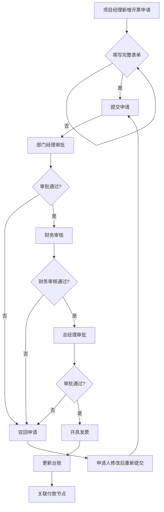

# 项目开票申请 PRD

## 需求背景

### 痛点
- **问题现象**：项目开票申请流程线下传递，审批进度不透明；开票信息与合同、付款节点关联困难，容易出现错开、漏开。
- **发生频率**：高
- **当前 workaround**：通过线下表格记录开票申请状态，人工跟进审批进度。

### 业务目标
- **量化指标**：开票申请线上化率 100%；审批时效缩短 50%；开票台账完整率 100%。
- **目标期限**：2026年Q2

### 涉及系统/模块
- **模块名称**：项目开票申请（InvoiceApplication）
- **变更类型**：新增
- **对接接口**：项目信息接口、合同信息接口、审批流接口、开票台账接口

---

## 用户故事

### 故事1
- **角色**：项目经理/财务人员
- **功能**：在开票申请页提交新的开票申请，填写项目信息、购买方信息等
- **收益**：减少线下沟通成本，申请进度可实时查看
- **验收条件**：支持新增开票申请表单；必填字段校验；提交后进入审批流程

### 故事2
- **角色**：项目经理
- **功能**：查看开票申请列表，了解申请状态和审批进度
- **收益**：随时掌握申请进度，及时跟进审批节点
- **验收条件**：列表展示所有申请记录；状态 Badge 清晰区分；支持按状态筛选

### 故事3
- **角色**：财务/审批人
- **功能**：查看申请详情，进行审批操作（通过/驳回）
- **收益**：审批有据可查，审批意见可追溯
- **验收条件**：详情页展示完整申请信息、审批流程节点；支持通过/驳回操作

### 故事4
- **角色**：财务人员
- **功能**：在开票台账页查看所有发票的开票和回款情况
- **收益**：全面掌握开票和回款进度，识别未回款风险
- **验收条件**：台账列表展示发票号码、金额、回款状态；统计卡片展示关键指标

---

## 需求清单

| 序号 | 需求描述 | 优先级 | 状态 | 负责人 | 截止日期 |
|------|----------|--------|------|--------|----------|
| 1 | 开票申请 Tab：申请列表 + 统计卡片 + 新增表单 | P0 | TODO | | |
| 2 | 开票台账 Tab：台账列表 + 统计卡片 + 导出功能 | P0 | TODO | | |
| 3 | 审批详情页：申请信息 + 审批流程节点 + 附件列表 | P0 | TODO | | |
| 4 | 新增/编辑表单：项目信息、购买方信息完整字段 | P0 | TODO | | |
| 5 | 状态 Badge：根据申请状态展示不同颜色 | P1 | TODO | | |
| 6 | 搜索筛选：支持多条件组合筛选 | P1 | TODO | | |

- **优先级**：P0（核心流程阻塞）/ P1（重要功能）/ P2（体验优化）/ P3（未来规划）
- **状态**：TODO / IN PROGRESS / DONE / BLOCKED

---

## 业务流程图

---

## 页面结构

### 路由信息
- **路由路径**：`/invoice-application`
- **页面标题**：项目开票申请
- **访问权限**：登录 / 财务、项目经理角色

### 布局结构
- **布局类型**：单栏
- **区域-主内容**：标题区 + Tabs 切换区 + 内容区

### Tab 结构
- **Tab名称**：开票申请、开票台账
- **Tab路由**：通过 viewMode 状态切换（list/new/edit/detail）
- **加载方式**：预加载
- **默认激活**：开票申请 Tab

---

## 功能描述

### 功能点1：开票申请列表

#### 页面级
- **字段：功能入口** - 类型：文本；描述：默认展示开票申请 Tab
- **字段：前置条件** - 类型：文本；描述：用户已登录
- **字段：后置影响** - 类型：字段列表；描述：统计卡片展示累计申请金额和已开票金额

#### Tab 级
- **Tab名称**：开票申请
- **查询条件字段**：
  | 字段名 | 类型 | 必填 | 默认值 | 来源 | 校验规则 | 展示形式 | 交互约束 |
  |--------|------|------|--------|------|----------|----------|----------|
  | 搜索 | 字符串 | 否 | 空 | 页面输入 | - | Input | 支持项目名称/编号、合同编号、申请单编号搜索 |
  | 申请状态 | 枚举 | 否 | 全部状态 | 下拉选择 | - | Select | 全部/待提交/审批中/已驳回/已审批/开票中/已开票/已作废 |

- **操作按钮字段**：
  | 字段名 | 类型 | 必填 | 默认值 | 来源 | 校验规则 | 展示形式 | 交互约束 |
  |--------|------|------|--------|------|----------|----------|----------|
  | 新增开票申请 | 操作按钮 | - | - | - | - | Button | 跳转新增表单 |
  | 批量导出 | 操作按钮 | - | - | - | - | Button | 导出列表数据 |
  | 刷新 | 操作按钮 | - | - | - | - | Button | 刷新列表数据 |

- **统计卡片字段**：
  | 字段名 | 类型 | 必填 | 默认值 | 来源 | 校验规则 | 展示形式 | 交互约束 |
  |--------|------|------|--------|------|----------|----------|----------|
  | 累计申请金额 | 数字 | - | - | 接口计算 | - | 卡片（万元） | 只读 |
  | 已开票金额 | 数字 | - | - | 接口计算 | - | 卡片（万元，绿色） | 只读 |

- **字段列表**：
  | 字段名 | 类型 | 必填 | 默认值 | 来源 | 校验规则 | 展示形式 | 交互约束 |
  |--------|------|------|--------|------|----------|----------|----------|
  | 序号 | 数字 | - | - | 序号 | - | 数字 | - |
  | 申请单编号 | 字符串 | - | - | 接口 | - | 文本 | - |
  | 项目编号 | 字符串 | - | - | 接口 | - | 文本 | - |
  | 项目名称 | 字符串 | - | - | 接口 | - | 文本（截断） | - |
  | 合同编号 | 字符串 | - | - | 接口 | - | 文本 | - |
  | 申请开票金额 | 数字 | - | - | 接口 | - | 万元格式 | - |
  | 对应付款节点 | 字符串 | - | - | 接口 | - | 文本 | - |
  | 申请人 | 字符串 | - | - | 接口 | - | 文本（姓名/部门） | - |
  | 申请时间 | 日期时间 | - | - | 接口 | - | 文本 | - |
  | 申请状态 | 枚举 | - | - | 接口 | - | Badge | - |
  | 审批进度 | 字符串 | - | - | 接口 | - | 文本（X/Y格式） | - |
  | 发票号码 | 字符串 | - | - | 接口 | - | 文本（绿色） | - |
  | 操作 | 操作 | - | - | - | - | 按钮（查看/编辑/催审） | - |

---

### 功能点2：新增/编辑开票申请表单

#### 弹窗级
- **弹窗：新增开票申请 / 编辑开票申请**
  - **触发入口**：点击"新增开票申请"按钮或列表中编辑按钮
  - **关闭方式**：点击"返回列表"按钮
  - **字段列表**：
    | 字段名 | 类型 | 必填 | 默认值 | 来源 | 校验规则 | 展示形式 | 交互约束 |
    |--------|------|------|--------|------|----------|----------|----------|
    | 项目编号 | 字符串 | 是 | 空 | 页面输入 | 必填，最大长度50 | Input | - |
    | 项目名称 | 字符串 | 是 | 空 | 页面输入 | 必填，最大长度200 | Input | - |
    | 合同编号 | 字符串 | 是 | 空 | 页面输入 | 必填，最大长度50 | Input | - |
    | 合同金额（万元） | 数字 | 是 | 空 | 页面输入 | 必填，正数 | Input | - |
    | 申请开票金额（万元） | 数字 | 是 | 空 | 页面输入 | 必填，正数 | Input | - |
    | 对应付款节点 | 字符串 | 是 | 空 | 页面输入 | 必填 | Input | - |
    | 发票类型 | 枚举 | 是 | 增值税专用发票 | 下拉选择 | 必填 | Select | 增值税专用发票/增值税普通发票 |
    | 税率 | 枚举 | 是 | 6% | 下拉选择 | 必填 | Select | 6%/9% 等 |
    | 购买方名称 | 字符串 | 是 | 空 | 页面输入 | 必填，最大长度200 | Input | - |
    | 购买方税号 | 字符串 | 是 | 空 | 页面输入 | 必填，税号格式 | Input | - |
    | 购买方地址 | 字符串 | 否 | 空 | 页面输入 | 最大长度300 | Input | - |
    | 购买方电话 | 字符串 | 否 | 空 | 页面输入 | 电话格式 | Input | - |
    | 购买方开户银行 | 字符串 | 否 | 空 | 页面输入 | 最大长度100 | Input | - |
    | 购买方银行账号 | 字符串 | 否 | 空 | 页面输入 | 账号格式 | Input | - |
    | 备注 | 字符串 | 否 | 空 | 页面输入 | 最大长度500 | Input | - |

  - **确定按钮**：调用 `POST /api/invoice/application`（新增）或 `PUT /api/invoice/application/{id}`（编辑），成功返回列表并提示，失败显示错误
  - **取消按钮**：不提交表单，返回列表

---

### 功能点3：开票申请详情

#### 页面级
- **字段：功能入口** - 类型：文本；描述：点击列表"查看"按钮进入
- **字段：前置条件** - 类型：文本；描述：存在有效的申请记录
- **字段：后置影响** - 类型：字段列表；描述：审批流程节点展示

#### 详情区域字段
- **申请单基本信息**：
  | 字段名 | 类型 | 必填 | 默认值 | 来源 | 校验规则 | 展示形式 | 交互约束 |
  |--------|------|------|--------|------|----------|----------|----------|
  | 申请单编号 | 字符串 | - | - | 接口 | - | 文本 | - |
  | 申请时间 | 日期时间 | - | - | 接口 | - | 文本 | - |
  | 申请人 | 字符串 | - | - | 接口 | - | 文本（姓名/部门） | - |
  | 项目编号 | 字符串 | - | - | 接口 | - | 文本 | - |
  | 项目名称 | 字符串 | - | - | 接口 | - | 文本 | - |
  | 合同编号 | 字符串 | - | - | 接口 | - | 文本 | - |
  | 对应付款节点 | 字符串 | - | - | 接口 | - | 文本 | - |
  | 申请开票金额 | 数字 | - | - | 接口 | - | 万元格式（蓝色） | - |

- **开票详细信息**：
  | 字段名 | 类型 | 必填 | 默认值 | 来源 | 校验规则 | 展示形式 | 交互约束 |
  |--------|------|------|--------|------|----------|----------|----------|
  | 发票类型 | 字符串 | - | - | 接口 | - | 文本 | - |
  | 税率 | 字符串 | - | - | 接口 | - | 文本 | - |
  | 税额 | 数字 | - | - | 接口计算 | - | 万元格式 | - |
  | 价税合计 | 数字 | - | - | 接口计算 | - | 万元格式（绿色加粗） | - |
  | 发票号码 | 字符串 | - | - | 接口 | - | 文本（已开票时显示） | - |
  | 开票日期 | 日期 | - | - | 接口 | - | 文本（已开票时显示） | - |

- **购买方信息**：
  | 字段名 | 类型 | 必填 | 默认值 | 来源 | 校验规则 | 展示形式 | 交互约束 |
  |--------|------|------|--------|------|----------|----------|----------|
  | 购买方名称 | 字符串 | - | - | 接口 | - | 文本 | - |
  | 纳税人识别号 | 字符串 | - | - | 接口 | - | 文本 | - |
  | 地址 | 字符串 | - | - | 接口 | - | 文本 | - |
  | 电话 | 字符串 | - | - | 接口 | - | 文本 | - |
  | 开户银行 | 字符串 | - | - | 接口 | - | 文本 | - |
  | 银行账号 | 字符串 | - | - | 接口 | - | 文本 | - |

- **审批流程节点**：按顺序展示申请提交→部门经理审批→财务审核→总经理审批，每节点包含：状态图标（已完成/审批中/待审批）、节点名称、审批人信息、审批时间、审批意见

- **附件列表**：展示合同扫描件、付款节点证明等附件，支持下载

- **操作按钮**：审批中时显示"驳回"和"通过审批"按钮；待提交/已驳回时显示"编辑申请"和"提交审批"按钮

---

### 功能点4：开票台账

#### Tab 级
- **Tab名称**：开票台账
- **统计卡片字段**：
  | 字段名 | 类型 | 必填 | 默认值 | 来源 | 校验规则 | 展示形式 | 交互约束 |
  |--------|------|------|--------|------|----------|----------|----------|
  | 合同总金额 | 数字 | - | - | 接口 | - | 万元格式 | 只读 |
  | 累计开票金额 | 数字 | - | - | 接口 | - | 万元格式（绿色） | 只读 |
  | 开票完成率 | 百分比 | - | - | 接口计算 | - | 百分比（青色） | 只读 |
  | 累计回款金额 | 数字 | - | - | 接口 | - | 万元格式（紫色） | 只读 |
  | 回款率 | 百分比 | - | - | 接口计算 | - | 百分比（靛蓝） | 只读 |
  | 未回款金额 | 数字 | - | - | 接口计算 | - | 万元格式（红色） | 只读 |

- **操作按钮字段**：
  | 字段名 | 类型 | 必填 | 默认值 | 来源 | 校验规则 | 展示形式 | 交互约束 |
  |--------|------|------|--------|------|----------|----------|----------|
  | 导出台账 | 操作按钮 | - | - | - | - | Button | 导出完整台账数据 |
  | 刷新 | 操作按钮 | - | - | - | - | Button | 刷新台账数据 |

- **字段列表**：
  | 字段名 | 类型 | 必填 | 默认值 | 来源 | 校验规则 | 展示形式 | 交互约束 |
  |--------|------|------|--------|------|----------|----------|----------|
  | 序号 | 数字 | - | - | 序号 | - | 数字 | - |
  | 项目名称 | 字符串 | - | - | 接口 | - | 文本（截断） | - |
  | 合同编号 | 字符串 | - | - | 接口 | - | 文本 | - |
  | 申请单编号 | 字符串 | - | - | 接口 | - | 文本 | - |
  | 发票号码 | 字符串 | - | - | 接口 | - | 文本（绿色） | - |
  | 开票日期 | 日期 | - | - | 接口 | - | 文本 | - |
  | 开票金额 | 数字 | - | - | 接口 | - | 万元格式 | - |
  | 税率 | 字符串 | - | - | 接口 | - | 文本 | - |
  | 对应付款节点 | 字符串 | - | - | 接口 | - | 文本 | - |
  | 回款状态 | 枚举 | - | - | 接口 | - | Badge | - |
  | 已回款金额 | 数字 | - | - | 接口 | - | 万元格式（绿色） | - |
  | 未回款金额 | 数字 | - | - | 接口计算 | - | 万元格式（红色） | - |
  | 回款日期 | 日期 | - | - | 接口 | - | 文本（无则显示"-"） | - |
  | 操作 | 操作 | - | - | - | - | 详情按钮 | - |

---

## 数据流图

### 接口1：获取开票申请列表
- **请求路径**：`GET /api/invoice/applications`
- **请求方法**：GET
- **请求头**：Authorization
- **请求参数**：
  - `searchText` - 类型：字符串；必填：否；来源：搜索框；校验：最大长度100
  - `status` - 类型：字符串；必填：否；来源：状态筛选；校验：枚举值
  - `page` - 类型：数字；必填：否；来源：分页控件；校验：正整数
  - `pageSize` - 类型：数字；必填：否；来源：分页控件；校验：正整数
- **响应字段**：
  - `items` - 类型：数组；描述：申请记录列表
  - `total` - 类型：数字；描述：总记录数
- **存储位置**：数据库表 invoice_application
- **错误码**：
  - `401` - `用户未登录`
  - `500` - `服务器异常`

### 接口2：获取开票台账列表
- **请求路径**：`GET /api/invoice/ledger`
- **请求方法**：GET
- **请求头**：Authorization
- **请求参数**：
  - `page` - 类型：数字；必填：否；来源：分页控件；校验：正整数
  - `pageSize` - 类型：数字；必填：否；来源：分页控件；校验：正整数
- **响应字段**：
  - `items` - 类型：数组；描述：台账记录列表
  - `total` - 类型：数字；描述：总记录数
- **存储位置**：数据库表 invoice_ledger
- **错误码**：
  - `401` - `用户未登录`
  - `500` - `服务器异常`

### 接口3：创建开票申请
- **请求路径**：`POST /api/invoice/application`
- **请求方法**：POST
- **请求头**：Authorization / Content-Type: application/json
- **请求参数**：
  - `projectCode` - 类型：字符串；必填：是；来源：表单字段；校验：必填，最大长度50
  - `projectName` - 类型：字符串；必填：是；来源：表单字段；校验：必填，最大长度200
  - `contractCode` - 类型：字符串；必填：是；来源：表单字段；校验：必填，最大长度50
  - `invoiceAmount` - 类型：数字；必填：是；来源：表单字段；校验：必填，正数
  - `paymentNode` - 类型：字符串；必填：是；来源：表单字段；校验：必填
  - `invoiceType` - 类型：字符串；必填：是；来源：表单字段；校验：枚举值
  - `taxRate` - 类型：字符串；必填：是；来源：表单字段；校验：枚举值
  - `buyerName` - 类型：字符串；必填：是；来源：表单字段；校验：必填，最大长度200
  - `buyerTaxNo` - 类型：字符串；必填：是；来源：表单字段；校验：必填，税号格式
  - `buyerAddress` - 类型：字符串；必填：否；来源：表单字段；校验：最大长度300
  - `buyerPhone` - 类型：字符串；必填：否；来源：表单字段；校验：电话格式
  - `buyerBank` - 类型：字符串；必填：否；来源：表单字段；校验：最大长度100
  - `buyerAccount` - 类型：字符串；必填：否；来源：表单字段；校验：账号格式
  - `remark` - 类型：字符串；必填：否；来源：表单字段；校验：最大长度500
- **响应字段**：
  - `id` - 类型：字符串；描述：申请记录ID
  - `applicationCode` - 类型：字符串；描述：申请单编号
- **存储位置**：数据库表 invoice_application
- **错误码**：
  - `400` - `参数校验失败：{字段}不能为空`
  - `401` - `用户未登录`
  - `500` - `服务器异常`

### 数据刷新点
- **刷新时机**：页面加载时自动请求；点击刷新按钮手动刷新；新增/编辑成功返回列表后刷新
- **影响字段**：申请列表、台账列表、统计卡片

---

## 验收标准

### 正常流程
- [ ] **操作**：页面加载 → **预期**：默认展示"开票申请" Tab，列表展示申请记录，统计卡片显示金额
- [ ] **操作**：点击"新增开票申请"按钮 → **预期**：表单页面展示，各字段为空
- [ ] **操作**：填写完整表单后点击"提交申请" → **预期**：接口被调用，申请提交成功，提示出现，列表刷新
- [ ] **操作**：点击"开票台账" Tab → **预期**：台账列表和统计卡片正常展示
- [ ] **操作**：点击列表"查看"按钮 → **预期**：进入详情页，展示完整申请信息和审批流程

### 异常流程
- [ ] **操作**：必填字段留空提交 → **预期**：字段下方显示红色错误提示，提交按钮置灰
- [ ] **操作**：输入非法税号格式 → **预期**：字段下方显示格式错误提示
- [ ] **操作**：接口返回 500 → **预期**：显示"服务器异常"提示，数据未保存

---

## 更新记录

### v1 - 2026-05-09
- 初始版本