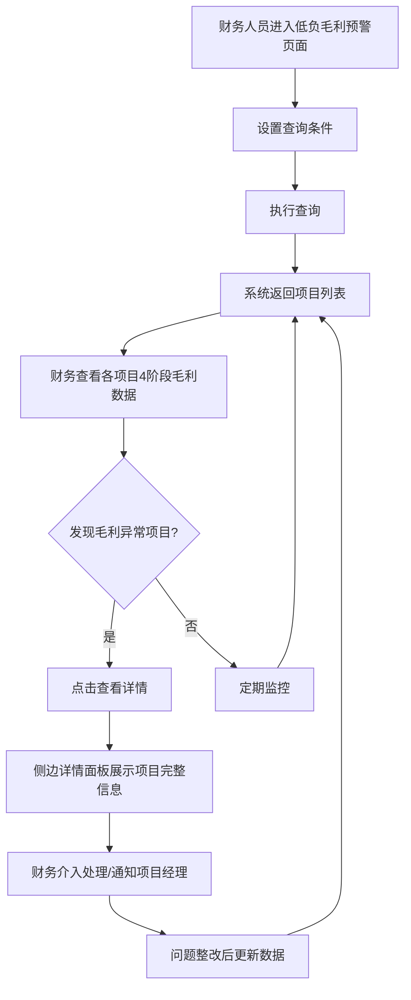

# 项目低负毛利预警 PRD

## 需求背景

### 痛点
- **问题现象**：项目毛利率随执行推进逐渐下降，但管理层往往在决算阶段才发现毛利已大幅下滑，错失提前干预的最佳时机。
- **发生频率**：高（尤其在长周期 ICT 项目中）
- **当前 workaround**：通过财务 Excel 报表定期导出，手工分析各阶段毛利数据，效率低且不及时。

### 业务目标
- **量化指标**：毛利预警覆盖率 100%；预警发出及时率 >= 90%；预警项目干预成功率 >= 70%。
- **目标期限**：2026年Q2

### 涉及系统/模块
- **模块名称**：项目低负毛利预警（LowMarginReport）
- **变更类型**：新增
- **对接接口**：项目基础信息接口、合同信息接口、财务收支数据接口

---

## 用户故事

### 故事1
- **角色**：财务人员、项目经理
- **功能**：在查询区设置条件，筛选出符合条件的项目列表
- **收益**：快速定位目标项目，查看各阶段毛利数据
- **验收条件**：支持按地市、区县、项目名称、项目经理等多维条件筛选；支持展开更多条件

### 故事2
- **角色**：财务人员
- **功能**：查看项目在不同阶段（概算/预算/结算/决算）的毛利数据对比
- **收益**：识别毛利恶化趋势，提前预警并介入
- **验收条件**：表格展示项目4个阶段的收入、支出、毛利、毛利差异数据

### 故事3
- **角色**：财务人员
- **功能**：点击"查看"按钮，在侧边详情面板查看项目完整信息
- **收益**：在不离当前页面的情况下，快速了解项目全貌
- **验收条件**：详情面板展示项目基本信息、收入、支出、毛利各维度数据；支持固定/收起

### 故事4
- **角色**：财务人员
- **功能**：自定义表格列展示，隐藏不需要的列
- **收益**：减少信息干扰，提升工作效率
- **验收条件**：支持自定义表头弹窗；按分组批量开关列；本地记住用户偏好

---

## 需求清单

| 序号 | 需求描述 | 优先级 | 状态 | 负责人 | 截止日期 |
|------|----------|--------|------|--------|----------|
| 1 | 查询条件区：基础信息 + 项目信息 + 模式会/合同签约/执行过程/决算（可展开） | P0 | TODO | | |
| 2 | 主数据表格：项目4阶段（概算/预算/结算/决算）多行展开 + 行列合并 | P0 | TODO | | |
| 3 | 详情侧边栏：项目完整信息分组展示 + 固定/收起功能 | P0 | TODO | | |
| 4 | 自定义表头弹窗：列可见性控制 + 分组开关 + 全选/取消 | P1 | TODO | | |
| 5 | 列宽拖动调整功能 | P1 | TODO | | |
| 6 | 查询结果导出功能 | P2 | TODO | | |

- **优先级**：P0（核心流程阻塞）/ P1（重要功能）/ P2（体验优化）/ P3（未来规划）
- **状态**：TODO / IN PROGRESS / DONE / BLOCKED

---

## 业务流程图

---

## 页面结构

### 路由信息
- **路由路径**：`/low-margin-report`
- **页面标题**：项目低负毛利预警
- **访问权限**：登录 / 财务、项目经理角色

### 布局结构
- **布局类型**：单栏 + 右侧浮层面板
- **区域-主内容**：标题区 + 查询条件区（可折叠）+ 数据表格区（主内容 + 详情侧边栏）

---

## 功能描述

### 功能点1：查询条件区

#### 页面级
- **字段：功能入口** - 类型：文本；描述：页面加载时默认展示查询区
- **字段：前置条件** - 类型：文本；描述：用户已登录
- **字段：后置影响** - 类型：字段列表；描述：查询结果影响主表格数据展示

#### 基础信息分组
- **字段列表**：
  | 字段名 | 类型 | 必填 | 默认值 | 来源 | 校验规则 | 展示形式 | 交互约束 |
  |--------|------|------|--------|------|----------|----------|----------|
  | 地市 | 枚举 | 否 | 全部 | 下拉选择 | - | Select | 全部/杭州/宁波/温州/金华 等 |
  | 区县 | 枚举 | 否 | 全部 | 下拉选择 | - | Select | 依赖地市选择 |
  | 帐套 | 枚举 | 否 | 全部 | 下拉选择 | - | Select | 全部/股份公司/信产公司 |
  | 商机编码 | 字符串 | 否 | 空 | 页面输入 | - | Input | - |
  | 客户管控部门名称 | 枚举 | 否 | 全部 | 下拉选择 | - | Select | 全部/政企客户部/教育行业部/医疗行业部 |

#### 项目信息分组
- **字段列表**：
  | 字段名 | 类型 | 必填 | 默认值 | 来源 | 校验规则 | 展示形式 | 交互约束 |
  |--------|------|------|--------|------|----------|----------|----------|
  | 项目编码 | 字符串 | 否 | 空 | 页面输入 | - | Input | - |
  | 项目名称 | 字符串 | 否 | 空 | 页面输入 | - | Input | - |
  | 项目类型 | 枚举 | 否 | 全部 | 下拉选择 | - | Select | 全部/政务信息化/教育信息化/医疗信息化 |
  | 立项时间 | 日期 | 否 | 空 | 日期选择 | - | DatePicker | - |
  | 项目总金额 | 数字 | 否 | 空 | 页面输入 | - | Input | - |
  | 项目状态 | 枚举 | 否 | 全部 | 下拉选择 | - | Select | 全部/实施中/已完成 |
  | 项目经理 | 字符串 | 否 | 空 | 页面输入 | - | Input | - |

#### 展开更多条件（模式会/合同签约/执行过程/决算）
- 每个分组包含对应阶段的收入、支出、毛利率相关字段，共5列（模式会收入、模式会支出等）

#### 操作按钮
- **字段列表**：
  | 字段名 | 类型 | 必填 | 默认值 | 来源 | 校验规则 | 展示形式 | 交互约束 |
  |--------|------|------|--------|------|----------|----------|----------|
  | 展开更多条件 | 操作按钮 | - | - | - | - | 文字按钮 | 切换显示/收起更多条件 |
  | 隐藏查询 | 操作按钮 | - | - | - | - | 文字按钮 | 隐藏/显示整个查询区 |
  | 重置 | 操作按钮 | - | - | - | - | Button | 清空所有查询条件 |
  | 查询 | 操作按钮 | - | - | - | - | Button（蓝色） | 触发查询，重新加载列表 |
  | 导出 | 操作按钮 | - | - | - | - | Button | 导出当前查询结果 |

---

### 功能点2：主数据表格

#### 表头分组（两级表头）
| 一级分组 | 二级字段 | 列数 | 背景色 |
|----------|----------|------|--------|
| 项目基本信息 | 当前账期/地市/区县/项目编号/项目名称/项目类型/立项时间/项目状态/项目经理/商机编码/合同编号/合同名称/合同履行开始日期/合同履行结束日期/合同类型/合同状态/客户编码/客户名称/合同签约日期/项目环节 | 20 | 灰 |
| 收入 | 收入总金额/其中：产数服务/设备销售/租赁 | 3 | 蓝 |
| 支出 | 支出总金额/其中：产数服务/设备销售/租赁 | 3 | 红 |
| 毛利 | 毛利率/服务毛利率/设备毛利率 | 3 | 紫 |
| 毛利差异 | 毛利率差异/服务毛利率差异/设备毛利率差异 | 3 | 橙 |

#### 表格行结构
- 每个项目展示为4行（概算/预算/结算/决算），基本信息列合并（rowSpan=4）
- 第20列（项目环节）按阶段展示对应值
- 操作列：查看按钮，固定在右侧

#### 字段列表
| 字段名 | 类型 | 必填 | 默认值 | 来源 | 校验规则 | 展示形式 | 交互约束 |
|--------|------|------|--------|------|----------|----------|----------|
| 各基本信息字段 | 按列定义 | - | - | 接口 | - | 文本 | - |
| 收入总金额 | 数字 | - | - | 接口 | - | 万元数值 | - |
| 产数服务 | 数字 | - | - | 接口 | - | 万元数值 | - |
| 设备销售/租赁 | 数字 | - | - | 接口 | - | 万元数值 | - |
| 支出总金额 | 数字 | - | - | 接口 | - | 万元数值（红色着色） | - |
| 毛利率 | 百分比 | - | - | 接口 | - | 百分比 | 红色预警（低于阈值） |
| 服务毛利率 | 百分比 | - | - | 接口 | - | 百分比 | - |
| 设备毛利率 | 百分比 | - | - | 接口 | - | 百分比 | - |
| 毛利率差异 | 字符串 | - | - | 接口计算 | - | 数字+pp/横杠 | 正值绿/负值红 |
| 操作 | 操作 | - | - | - | - | 查看按钮 | 触发详情面板 |

#### 工具栏
- 已选 X/Y 列：显示当前可见列数量
- 隐藏查询按钮
- 自定义表头按钮：打开列可见性配置弹窗

---

### 功能点3：详情侧边栏

#### 弹窗级
- **弹窗：项目详情面板**
  - **触发入口**：点击表格行"查看"按钮
  - **关闭方式**：点击关闭图标 / 点击表格其他行收起
  - **位置**：表格左侧，宽度 40%
  - **功能**：支持固定（pin）模式，防止误操作关闭

- **分组展示**：
  | 分组 | 图标 | 内容 |
  |------|------|------|
  | 基础信息 | FileText | 项目基本信息列的完整值 |
  | 收入 | TrendingUp | 收入相关列的完整值 |
  | 支出 | TrendingDown | 支出相关列的完整值 |
  | 毛利 | Percent | 毛利相关列的完整值 |
  | 毛利差异 | Percent | 毛利差异相关列的完整值 |

- **布局**：每组标题 + 3列网格布局展示各字段值

---

### 功能点4：自定义表头弹窗

#### 弹窗级
- **弹窗：列可见性配置**
  - **触发入口**：点击工具栏"自定义表头"按钮
  - **关闭方式**：点击关闭图标 / 点击遮罩层 / 点击取消
  - **内容**：
    - 按两级分组展示所有列的勾选框
    - 一级分组可一键全选/取消
    - 二级列可单独开关
    - 选中计数实时更新
  - **确定按钮**：应用配置，关闭弹窗，表格重新渲染
  - **取消按钮**：关闭弹窗，不保存变更

---

## 数据流图

### 接口1：获取项目毛利列表
- **请求路径**：`GET /api/project/low-margin/list`
- **请求方法**：GET
- **请求头**：Authorization
- **请求参数**：
  - `city` - 类型：字符串；必填：否；来源：地市选择；校验：枚举值
  - `projectName` - 类型：字符串；必填：否；来源：项目名称输入；校验：最大长度200
  - `projectManager` - 类型：字符串；必填：否；来源：项目经理输入；校验：最大长度50
  - `stage` - 类型：枚举；必填：否；来源：页面状态；校验：概算/预算/结算/决算
- **响应字段**：
  - `items` - 类型：数组；描述：项目列表，每个项目包含 basic 信息和 rows（4阶段数据）
  - `total` - 类型：数字；描述：总记录数
- **存储位置**：数据库表 project_profit_margin
- **错误码**：
  - `401` - `用户未登录`
  - `500` - `服务器异常`

### 数据刷新点
- **刷新时机**：点击"查询"按钮时触发；切换 Tab 时可能触发
- **影响字段**：表格数据、统计数字

---

## 验收标准

### 正常流程
- [ ] **操作**：页面加载 → **预期**：查询区默认展开，表格加载项目数据
- [ ] **操作**：选择地市后查询 → **预期**：列表筛选为该地市项目
- [ ] **操作**：点击项目行的"查看" → **预期**：详情面板在左侧展开，显示项目完整信息
- [ ] **操作**：点击详情面板固定 → **预期**：面板固定，再点击其他行不会收起
- [ ] **操作**：点击"自定义表头" → **预期**：弹窗打开，按分组展示所有列
- [ ] **操作**：关闭列可见性弹窗 → **预期**：表格列重新渲染，隐藏被取消的列

### 异常流程
- [ ] **操作**：不选择任何条件直接查询 → **预期**：返回全量数据
- [ ] **操作**：接口返回 500 → **预期**：显示"服务器异常"提示
- [ ] **操作**：拖动列宽过窄（<60px） → **预期**：限制最小宽度为 60px

---

## 更新记录

### v1 - 2026-05-09
- 初始版本