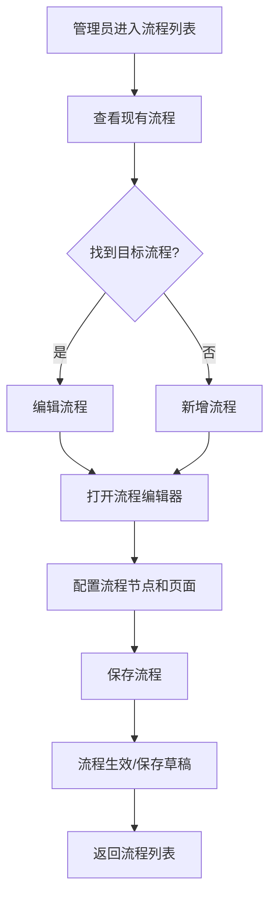

# 流程列表 PRD

## 需求背景

### 痛点
- **问题现象**：各业务线条（ICT、小微ICT、基础业务）的流程配置分散，维护不便；流程与区域、产品、业务的关联关系不清晰，无法快速找到适用的流程。
- **发生频率**：中
- **当前 workaround**：通过线下文档或本地文件管理流程配置，查找和修改困难。

### 业务目标
- **量化指标**：流程配置线上化率 100%；流程查找时间减少 80%；流程版本可追溯。
- **目标期限**：2026年Q2

### 涉及系统/模块
- **模块名称**：流程列表（ProcessList）
- **变更类型**：新增
- **对接接口**：流程配置接口

---

## 用户故事

### 故事1
- **角色**：系统管理员/流程配置人员
- **功能**：查看所有流程配置列表，了解流程基本信息
- **收益**：快速了解当前有哪些流程，各流程的适用范围和复杂度
- **验收条件**：列表展示流程名称、适用区域、业务类型、适用产品、节点数、页面数、创建时间、状态

### 故事2
- **角色**：系统管理员
- **功能**：新增流程配置，编辑现有流程
- **收益**：统一管理流程配置，确保各业务线条流程规范
- **验收条件**：支持新增/编辑流程表单；保存后列表更新

### 故事3
- **角色**：系统管理员
- **功能**：启用/禁用流程，删除流程
- **收益**：灵活控制流程可用性，支持流程灰度发布和下线
- **验收条件**：禁用后的流程在业务中不可选；删除需二次确认

---

## 需求清单

| 序号 | 需求描述 | 优先级 | 状态 | 负责人 | 截止日期 |
|------|----------|--------|------|--------|----------|
| 1 | 查询筛选区：流程名称/适用区域/业务类型/适用产品搜索 | P0 | TODO | | |
| 2 | 流程列表表格：展示所有流程配置 | P0 | TODO | | |
| 3 | 新增流程功能：打开流程编辑器 | P0 | TODO | | |
| 4 | 编辑流程功能：打开流程编辑器 | P0 | TODO | | |
| 5 | 删除流程功能：二次确认后删除 | P0 | TODO | | |
| 6 | 启用/禁用切换：点击切换状态 | P0 | TODO | | |
| 7 | 分页控件 | P1 | TODO | | |

- **优先级**：P0（核心流程阻塞）/ P1（重要功能）/ P2（体验优化）/ P3（未来规划）
- **状态**：TODO / IN PROGRESS / DONE / BLOCKED

---

## 业务流程图

---

## 页面结构

### 路由信息
- **路由路径**：`/process-list`
- **页面标题**：流程列表
- **访问权限**：登录 / 系统管理员角色

### 布局结构
- **布局类型**：单栏（切换到编辑器时变为全屏）
- **区域-主内容**：查询筛选区 + 数据表格区

---

## 功能描述

### 功能点1：查询筛选区

#### 页面级
- **字段：功能入口** - 类型：文本；描述：页面加载时默认展示
- **字段：前置条件** - 类型：文本；描述：用户已登录且有管理员权限
- **字段：后置影响** - 类型：字段列表；描述：筛选结果影响列表展示

#### 查询条件字段
| 字段名 | 类型 | 必填 | 默认值 | 来源 | 校验规则 | 展示形式 | 交互约束 |
|--------|------|------|--------|------|----------|----------|----------|
| 流程名称 | 字符串 | 否 | 空 | 页面输入 | - | Input | 支持模糊搜索 |
| 适用区域 | 字符串 | 否 | 空 | 页面输入 | - | Input | 支持模糊搜索 |
| 业务类型 | 字符串 | 否 | 空 | 页面输入 | - | Input | 支持模糊搜索 |
| 适用产品 | 字符串 | 否 | 空 | 页面输入 | - | Input | 支持模糊搜索 |

#### 操作按钮字段
| 字段名 | 类型 | 必填 | 默认值 | 来源 | 校验规则 | 展示形式 | 交互约束 |
|--------|------|------|--------|------|----------|----------|----------|
| 查询 | 操作按钮 | - | - | - | - | Button | 触发筛选，重新加载列表 |
| 重置 | 操作按钮 | - | - | - | - | Button | 清空筛选条件，重新加载列表 |
| 新增流程 | 操作按钮 | - | - | - | - | Button（蓝色） | 打开流程编辑器（新增模式） |

---

### 功能点2：流程列表表格

#### 表格字段列表
| 字段名 | 类型 | 必填 | 默认值 | 来源 | 校验规则 | 展示形式 | 交互约束 |
|--------|------|------|--------|------|----------|----------|----------|
| 流程名称 | 字符串 | - | - | 接口 | - | 文本（加粗，左侧固定列） | - |
| 适用区域 | 字符串数组 | - | - | 接口 | - | 标签列表（蓝色标签） | 多值展示 |
| 业务类型 | 字符串数组 | - | - | 接口 | - | 标签列表（紫色标签） | 多值展示 |
| 适用产品 | 字符串数组 | - | - | 接口 | - | 标签列表（橙色标签） | 多值展示 |
| 流程节点数 | 数字 | - | - | 接口 | - | 数字（青色，居中） | - |
| 页面数量 | 数字 | - | - | 接口 | - | 数字（靛蓝，居中） | - |
| 创建时间 | 日期 | - | - | 接口 | - | YYYY-MM-DD 格式 | - |
| 状态 | 布尔 | - | - | 接口 | - | 按钮（绿色已启用/灰色已禁用） | 点击切换 |
| 操作 | 操作 | - | - | - | - | 编辑图标/删除图标 | 触发编辑/删除 |

#### 操作列交互
- **编辑**：点击后打开流程编辑器，传入当前流程数据
- **删除**：点击后弹出确认框，确认后删除该流程并刷新列表

#### 状态切换交互
- 点击"已启用"/"已禁用"按钮，切换流程状态（enabled: true ↔ false）

---

### 功能点3：流程编辑器（跳转页面）

#### 页面级
- **字段：功能入口** - 类型：文本；描述：点击"新增流程"或"编辑"时跳转
- **字段：前置条件** - 类型：文本；描述：新增时无需数据，编辑时需要流程数据
- **字段：后置影响** - 类型：字段列表；描述：保存后返回流程列表

#### 接收参数
- `process`: Process | null - 新增时为 null，编辑时为当前流程数据

#### 保存逻辑
- **新增**：在列表追加新流程，初始化 nodeCount=0, pageCount=0, createTime=当前日期, enabled=true
- **编辑**：更新列表中对应 ID 的流程数据
- **取消**：返回流程列表，不保存任何变更

---

## 数据流图

### 接口1：获取流程列表
- **请求路径**：`GET /api/process/list`
- **请求方法**：GET
- **请求头**：Authorization
- **请求参数**：
  - `name` - 类型：字符串；必填：否；来源：流程名称输入；校验：最大长度100
  - `region` - 类型：字符串；必填：否；来源：适用区域输入；校验：最大长度50
  - `businessType` - 类型：字符串；必填：否；来源：业务类型输入；校验：最大长度50
  - `product` - 类型：字符串；必填：否；来源：适用产品输入；校验：最大长度50
- **响应字段**：
  - `id` - 类型：字符串；描述：流程唯一标识
  - `name` - 类型：字符串；描述：流程名称
  - `regions` - 类型：字符串数组；描述：适用区域列表
  - `businessTypes` - 类型：字符串数组；描述：业务类型列表
  - `products` - 类型：字符串数组；描述：适用产品列表
  - `nodeCount` - 类型：数字；描述：流程节点数
  - `pageCount` - 类型：数字；描述：页面数量
  - `createTime` - 类型：字符串；描述：创建时间（YYYY-MM-DD）
  - `enabled` - 类型：布尔；描述：是否启用
- **存储位置**：数据库表 process_config
- **错误码**：
  - `401` - `用户未登录`
  - `403` - `无权限访问`
  - `500` - `服务器异常`

### 接口2：保存流程（新增/编辑）
- **请求路径**：`POST /api/process`（新增）或 `PUT /api/process/{id}`（编辑）
- **请求方法**：POST / PUT
- **请求头**：Authorization / Content-Type: application/json
- **请求参数**：
  - `name` - 类型：字符串；必填：是；来源：编辑器表单；校验：必填，最大长度100
  - `regions` - 类型：字符串数组；必填：是；来源：编辑器表单；校验：至少一个值
  - `businessTypes` - 类型：字符串数组；必填：是；来源：编辑器表单；校验：至少一个值
  - `products` - 类型：字符串数组；必填：否；来源：编辑器表单；
- **响应字段**：
  - `id` - 类型：字符串；描述：流程ID
  - `name` - 类型：字符串；描述：流程名称
- **存储位置**：数据库表 process_config
- **错误码**：
  - `400` - `参数校验失败`
  - `401` - `用户未登录`
  - `403` - `无权限`
  - `500` - `服务器异常`

### 接口3：删除流程
- **请求路径**：`DELETE /api/process/{id}`
- **请求方法**：DELETE
- **请求头**：Authorization
- **响应字段**：
  - `success` - 类型：布尔；描述：是否成功
- **错误码**：
  - `401` - `用户未登录`
  - `403` - `无权限`
  - `404` - `流程不存在`
  - `500` - `服务器异常`

### 数据刷新点
- **刷新时机**：页面加载时自动请求；新增/编辑/删除成功后刷新列表
- **影响字段**：所有列表数据

---

## 验收标准

### 正常流程
- [ ] **操作**：页面加载 → **预期**：流程列表正常展示，默认显示全量数据
- [ ] **操作**：在"流程名称"输入框输入内容后点击"查询" → **预期**：列表筛选为名称匹配的结果
- [ ] **操作**：点击"新增流程" → **预期**：跳转到流程编辑器页面（新增模式）
- [ ] **操作**：点击列表中的编辑图标 → **预期**：跳转到流程编辑器页面（编辑模式），传入当前行数据
- [ ] **操作**：点击列表中的删除图标 → **预期**：弹出确认对话框，确认后删除成功并刷新列表
- [ ] **操作**：点击"已启用"按钮 → **预期**：流程状态切换为"已禁用"，按钮变为灰色
- [ ] **操作**：点击"已禁用"按钮 → **预期**：流程状态切换为"已启用"，按钮变为绿色

### 异常流程
- [ ] **操作**：接口返回 401 → **预期**：跳转登录页
- [ ] **操作**：接口返回 403 → **预期**：显示"无权限"提示
- [ ] **操作**：接口返回 500 → **预期**：显示"服务器异常"提示，列表不更新
- [ ] **操作**：点击删除后取消确认 → **预期**：流程不删除，对话框关闭

---

## 更新记录

### v1 - 2026-05-09
- 初始版本