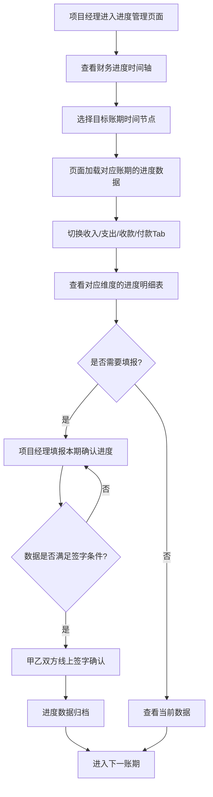

# 项目进度管理 PRD

## 需求背景

### 痛点
- **问题现象**：项目财务进度数据分散，项目经理无法直观了解收入、支出、收款、付款各维度的进度情况；进度确认依赖线下签字确认，效率低且难以追溯。
- **发生频率**：高
- **当前 workaround**：通过 Excel 表格手工计算财务进度，手工传递签字版本。

### 业务目标
- **量化指标**：进度上报及时率 >= 95%；进度数据准确性 100%；签字确认线上化率 100%。
- **目标期限**：2026年Q2

### 涉及系统/模块
- **模块名称**：项目进度管理（ProgressManagement）
- **变更类型**：新增
- **对接接口**：财务进度数据接口、合同信息接口、时间轴数据接口

---

## 用户故事

### 故事1
- **角色**：项目经理/财务人员
- **功能**：在进度时间轴区查看项目各月财务进度的总体趋势
- **收益**：快速了解项目整体进度情况，识别关键节点
- **验收条件**：时间轴组件正常渲染；点击时间节点可钻取到对应账期数据

### 故事2
- **角色**：项目经理
- **功能**：在收入进度 Tab 查看当前账期的收入进度明细表
- **收益**：了解收入确认进度、前期已确认金额、本期确认金额、累计金额
- **验收条件**：表格展示完整的收入进度字段；黄色高亮本期确认列；小计行计算正确

### 故事3
- **角色**：项目经理
- **功能**：切换到支出/收款/付款 Tab，查看对应维度的进度数据
- **收益**：全面掌握项目各维度的财务进度情况
- **验收条件**：Tab 切换流畅；各 Tab 数据独立；表格结构一致

### 故事4
- **角色**：项目经理/客户
- **功能**：在签字确认区填写甲乙双方签字和盖章信息
- **收益**：实现进度确认的线上化，保留完整的签字记录
- **验收条件**：签字区展示甲乙方签字人和盖章字段；数据与进度记录关联

---

## 需求清单

| 序号 | 需求描述 | 优先级 | 状态 | 负责人 | 截止日期 |
|------|----------|--------|------|--------|----------|
| 1 | 财务进度时间轴组件：展示项目各月进度节点 | P0 | TODO | | |
| 2 | 收入进度 Tab：收入进度明细表（含汇总信息） | P0 | TODO | | |
| 3 | 支出进度 Tab：支出进度明细表 | P0 | TODO | | |
| 4 | 收款进度 Tab：收款进度明细表 | P0 | TODO | | |
| 5 | 付款进度 Tab：付款进度明细表 | P0 | TODO | | |
| 6 | 签字确认区：甲乙方签字和盖章信息 | P1 | TODO | | |
| 7 | 表格小计行：自动计算各列合计 | P1 | TODO | | |
| 8 | 本期确认列高亮：黄色背景标识 | P1 | TODO | | |

- **优先级**：P0（核心流程阻塞）/ P1（重要功能）/ P2（体验优化）/ P3（未来规划）
- **状态**：TODO / IN PROGRESS / DONE / BLOCKED

---

## 业务流程图

---

## 页面结构

### 路由信息
- **路由路径**：`/progress-management`
- **页面标题**：项目进度管理
- **访问权限**：登录 / 项目经理、财务角色

### 布局结构
- **布局类型**：单栏
- **区域-主内容**：时间轴组件（顶部） + Tab 切换区 + 内容区 + 签字确认区（底部）

### Tab 结构
- **Tab名称**：收入进度、支出进度、收款进度、付款进度
- **Tab路由**：通过 activeTab 状态切换
- **加载方式**：预加载
- **默认激活**：收入进度

---

## 功能描述

### 功能点1：财务进度时间轴

#### 页面级
- **字段：功能入口** - 类型：文本；描述：页面加载时默认展示在 Tab 内容上方
- **字段：前置条件** - 类型：文本；描述：存在有效的项目财务数据
- **字段：后置影响** - 类型：字段列表；描述：点击时间节点后右侧 Tab 数据联动

#### 组件字段
- **字段列表**：
  | 字段名 | 类型 | 必填 | 默认值 | 来源 | 校验规则 | 展示形式 | 交互约束 |
  |--------|------|------|--------|------|----------|----------|----------|
  | 时间轴节点 | 日期 | - | - | 接口 | - | 节点标记 | 点击可切换账期 |
  | 节点连线 | 布尔 | - | - | 接口 | - | 连接线 | - |
  | 当前账期标记 | 布尔 | - | - | 接口 | - | 高亮标记 | - |

---

### 功能点2：进度明细表（含4个Tab）

#### Tab 级
- **Tab名称**：收入进度 / 支出进度 / 收款进度 / 付款进度
- **加载方式**：预加载
- **默认激活**：收入进度

#### 汇总信息区（表格上方）
- **字段列表**：
  | 字段名 | 类型 | 必填 | 默认值 | 来源 | 校验规则 | 展示形式 | 交互约束 |
  |--------|------|------|--------|------|----------|----------|----------|
  | 所属会计期 | 字符串 | - | - | 接口 | - | 文本（YYYY年M月） | 只读 |
  | ICT项目编号 | 字符串 | - | - | 接口 | - | 文本（XYJ开头） | 只读 |
  | 合同编号 | 字符串 | - | - | 接口 | - | 文本 | 只读 |
  | 合同甲方 | 字符串 | - | - | 接口 | - | 文本 | 只读 |
  | ICT项目名称 | 字符串 | - | - | 接口 | - | 文本 | 只读 |
  | 合同名称 | 字符串 | - | - | 接口 | - | 文本 | 只读 |
  | 合同乙方 | 字符串 | - | - | 接口 | - | 文本 | 只读 |
  | 合同总金额（含税、元） | 数字 | - | - | 接口 | - | ¥格式数值 | 只读 |

#### 主表格字段列表
| 字段名 | 类型 | 必填 | 默认值 | 来源 | 校验规则 | 展示形式 | 交互约束 |
|--------|------|------|--------|------|----------|----------|----------|
| 序号 | 数字 | - | - | 序号 | - | 数字（居中） | - |
| 类型 | 字符串 | - | - | 接口 | - | 收入/支出/收款/付款 | - |
| 合同编码 | 字符串 | - | - | 接口 | - | 文本 | - |
| 科目 | 字符串 | - | - | 接口 | - | 文本 | - |
| A.金额（含税） | 数字 | - | - | 接口 | - | ¥格式数值 | - |
| B.增值税税率（%） | 数字 | - | - | 接口 | - | 百分比 | - |
| C.金额（不含税）A/(1+B) | 数字 | - | - | 接口 | - | ¥格式数值 | - |
| D.前期已确认进度（%） | 数字 | - | - | 接口 | - | 百分比 | - |
| E.前期已确认金额（含税）A*D | 数字 | - | - | 接口 | - | ¥格式数值 | - |
| F.前期已确认金额（不含税）C*D | 数字 | - | - | 接口 | - | ¥格式数值 | - |
| G.本期确认进度（%）** | 数字 | - | - | 接口/可编辑 | - | 百分比（黄色背景） | 黄色高亮 |
| H.本期确认金额（含税）A*G ** | 数字 | - | - | 接口 | - | ¥格式数值（黄色背景） | 黄色高亮 |
| I.本期确认金额（不含税）C*G ** | 数字 | - | - | 接口 | - | ¥格式数值（黄色背景） | 黄色高亮 |
| J.累计确认进度（%）D+G | 数字 | - | - | 接口计算 | - | 百分比 | - |
| K.累计确认金额（含税）A*J=E+H | 数字 | - | - | 接口计算 | - | ¥格式数值 | - |
| L.累计确认金额（不含税）C*J=F+I | 数字 | - | - | 接口计算 | - | ¥格式数值 | - |

**注：G/H/I 列为本期确认列，黄色背景高亮**

#### 小计行
- 位于表格底部，汇总所有数据行的合计值
- 黄色高亮列（D/G/H/I 列）的小计行相应列留空或显示合计

---

### 功能点3：签字确认区

#### 页面级
- **字段：功能入口** - 类型：文本；描述：表格下方独立区域
- **字段：前置条件** - 类型：文本；描述：进度数据已填报完成
- **字段：后置影响** - 类型：字段列表；描述：签字完成后进度状态更新

#### 字段列表
| 字段名 | 类型 | 必填 | 默认值 | 来源 | 校验规则 | 展示形式 | 交互约束 |
|--------|------|------|--------|------|----------|----------|----------|
| 甲方单位签字人（签字） | 字符串 | 否 | 空 | 页面输入 | - | 文本 | - |
| 甲方单位（盖章） | 字符串 | 否 | 空 | 页面输入 | - | 文本 | - |
| 甲方日期 | 日期 | 否 | 空 | 日期选择 | - | YYYY-MM-DD | - |
| 乙方单位签字人（签字） | 字符串 | 否 | 空 | 页面输入 | - | 文本 | - |
| 乙方单位（盖章） | 字符串 | 否 | 空 | 页面输入 | - | 文本 | - |
| 乙方日期 | 日期 | 否 | 空 | 日期选择 | - | YYYY-MM-DD | - |

---

## 数据流图

### 接口1：获取项目进度数据
- **请求路径**：`GET /api/project/progress/detail`
- **请求方法**：GET
- **请求头**：Authorization
- **请求参数**：
  - `projectId` - 类型：字符串；必填：是；来源：URL 参数或上下文；校验：必填
  - `period` - 类型：字符串；必填：否；来源：时间轴节点选择；校验：YYYY-MM 格式
  - `type` - 类型：枚举；必填：否；来源：Tab 选择；校验：收入/支出/收款/付款
- **响应字段**：
  - `accountingPeriod` - 类型：字符串；描述：会计期
  - `projectCode` - 类型：字符串；描述：ICT项目编号
  - `projectName` - 类型：字符串；描述：ICT项目名称
  - `contractCode` - 类型：字符串；描述：合同编号
  - `contractName` - 类型：字符串；描述：合同名称
  - `partyA` - 类型：字符串；描述：合同甲方
  - `partyB` - 类型：字符串；描述：合同乙方
  - `totalAmount` - 类型：数字；描述：合同总金额（含税）
  - `rows` - 类型：数组；描述：进度明细行
- **存储位置**：数据库表 project_financial_progress
- **错误码**：
  - `401` - `用户未登录`
  - `403` - `无权限`
  - `404` - `项目不存在`
  - `500` - `服务器异常`

### 接口2：保存进度数据
- **请求路径**：`POST /api/project/progress`
- **请求方法**：POST
- **请求头**：Authorization / Content-Type: application/json
- **请求参数**：
  - `projectId` - 类型：字符串；必填：是；来源：上下文；校验：必填
  - `period` - 类型：字符串；必填：是；来源：当前账期；校验：必填
  - `type` - 类型：枚举；必填：是；来源：当前 Tab；校验：必填
  - `currentProgress` - 类型：数字；必填：是；来源：表格编辑；校验：0-100
  - `signatureInfo` - 类型：对象；必填：否；来源：签字区；校验：
- **响应字段**：
  - `success` - 类型：布尔；描述：是否成功
  - `id` - 类型：字符串；描述：进度记录ID
- **存储位置**：数据库表 project_financial_progress
- **错误码**：
  - `400` - `参数校验失败`
  - `401` - `用户未登录`
  - `500` - `服务器异常`

### 数据刷新点
- **刷新时机**：页面加载时自动请求；切换 Tab 时加载对应类型数据；切换账期时间轴时刷新
- **影响字段**：汇总信息、表格数据、小计行

---

## 验收标准

### 正常流程
- [ ] **操作**：页面加载 → **预期**：时间轴组件正常渲染，Tab 默认选中"收入进度"，表格数据完整
- [ ] **操作**：点击时间轴节点 → **预期**：对应账期的进度数据加载到各 Tab
- [ ] **操作**：点击"支出进度" Tab → **预期**：Tab 内容切换为支出进度表格，数据与收入进度独立
- [ ] **操作**：查看表格 → **预期**：G/H/I 列为黄色背景高亮；小计行计算正确
- [ ] **操作**：填写签字区信息 → **预期**：甲方乙方信息保存

### 异常流程
- [ ] **操作**：接口返回 404 → **预期**：显示"项目不存在"提示
- [ ] **操作**：接口返回 500 → **预期**：显示"服务器异常"提示
- [ ] **操作**：无数据时 → **预期**：表格显示"暂无数据"提示

---

## 更新记录

### v1 - 2026-05-09
- 初始版本