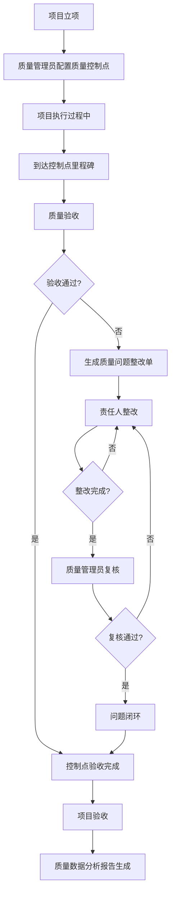

# 项目质量管控 PRD

## 需求背景

### 痛点
- **问题现象**：项目质量控制点分散，验收记录不完整；质量问题发现滞后，闭环率低；质量分析缺乏数据支撑，无法指导改进。
- **发生频率**：高
- **当前 workaround**：通过线下表格管理质量控制点和验收记录，查找和追溯困难。

### 业务目标
- **量化指标**：质量控制点覆盖率 100%；一次验收合格率 >= 90%；问题闭环整改率 >= 95%；质量分析报表自动化。
- **目标期限**：2026年Q2

### 涉及系统/模块
- **模块名称**：项目质量管控（QualityControl）
- **变更类型**：新增
- **对接接口**：项目信息接口、质量控制点接口、验收记录接口、质量问题接口

---

## 用户故事

### 故事1
- **角色**：质量管理员
- **功能**：在质量控制点 Tab 配置和管理项目质量控制点
- **收益**：统一管理项目各阶段的质量控制点，确保关键节点验收到位
- **验收条件**：支持新增、编辑、启用/禁用控制点；控制点列表完整展示

### 故事2
- **角色**：质量管理员/项目经理
- **功能**：在质量验收 Tab 查看和处理验收任务
- **收益**：及时处理验收任务，确保项目各阶段交付物质量
- **验收条件**：验收列表展示所有待验收项目；支持新建验收、查看报告；统计卡片展示关键指标

### 故事3
- **角色**：项目经理/质量问题责任人
- **功能**：在问题整改 Tab 查看和管理质量问题
- **收益**：跟踪质量问题整改进度，确保问题及时闭环
- **验收条件**：问题列表展示所有质量问题；支持详情查看、提交整改进度

### 故事4
- **角色**：质量管理员/管理层
- **功能**：在质量分析 Tab 查看质量数据和趋势分析图表
- **收益**：了解整体质量状况，识别改进方向
- **验收条件**：统计卡片展示核心指标；图表展示质量趋势和分布

---

## 需求清单

| 序号 | 需求描述 | 优先级 | 状态 | 负责人 | 截止日期 |
|------|----------|--------|------|--------|----------|
| 1 | 质量控制点 Tab：查询筛选 + 控制点列表 + 新增/编辑弹窗 | P0 | TODO | | |
| 2 | 质量验收 Tab：验收统计 + 验收列表 + 新建验收 | P0 | TODO | | |
| 3 | 问题整改 Tab：问题列表 + 整改状态跟踪 | P0 | TODO | | |
| 4 | 质量分析 Tab：核心指标 + 4类分析图表 | P0 | TODO | | |
| 5 | 控制点等级 Badge：根据等级展示不同颜色 | P1 | TODO | | |
| 6 | 验收类型 Badge：根据类型展示不同颜色 | P1 | TODO | | |
| 7 | 导出功能：批量导出、导出报表 | P2 | TODO | | |

- **优先级**：P0（核心流程阻塞）/ P1（重要功能）/ P2（体验优化）/ P3（未来规划）
- **状态**：TODO / IN PROGRESS / DONE / BLOCKED

---

## 业务流程图

---

## 页面结构

### 路由信息
- **路由路径**：`/quality-control`
- **页面标题**：项目质量管控
- **访问权限**：登录 / 质量管理员、项目经理角色

### 布局结构
- **布局类型**：单栏
- **区域-主内容**：标题区 + Tabs 切换区 + 内容区

### Tab 结构
- **Tab名称**：质量控制点、质量验收、问题整改、质量分析
- **Tab路由**：通过 activeTab 状态切换
- **加载方式**：预加载（Tabs 默认渲染所有内容）
- **默认激活**：质量控制点

---

## 功能描述

### 功能点1：质量控制点

#### Tab 级
- **Tab名称**：质量控制点
- **查询条件字段**：
  | 字段名 | 类型 | 必填 | 默认值 | 来源 | 校验规则 | 展示形式 | 交互约束 |
  |--------|------|------|--------|------|----------|----------|----------|
  | 搜索 | 字符串 | 否 | 空 | 页面输入 | - | Input | 支持项目名称、控制点名称模糊搜索 |
  | 控制点状态 | 枚举 | 否 | 全部状态 | 下拉选择 | - | Select | 全部/未启用/待验收/已验收/已作废 |

- **操作按钮字段**：
  | 字段名 | 类型 | 必填 | 默认值 | 来源 | 校验规则 | 展示形式 | 交互约束 |
  |--------|------|------|--------|------|----------|----------|----------|
  | 新增控制点 | 操作按钮 | - | - | - | - | Button（蓝色） | 打开新增弹窗 |
  | 导入模板 | 操作按钮 | - | - | - | - | Button | 下载导入模板 |
  | 批量导出 | 操作按钮 | - | - | - | - | Button | 导出当前列表 |
  | 刷新 | 操作按钮 | - | - | - | - | Button | 刷新列表数据 |

- **字段列表**：
  | 字段名 | 类型 | 必填 | 默认值 | 来源 | 校验规则 | 展示形式 | 交互约束 |
  |--------|------|------|--------|------|----------|----------|----------|
  | 序号 | 数字 | - | - | 序号 | - | 数字 | - |
  | 控制点编号 | 字符串 | - | - | 接口 | - | 文本 | - |
  | 控制点名称 | 字符串 | - | - | 接口 | - | 文本（加粗） | - |
  | 所属项目 | 字符串 | - | - | 接口 | - | 文本（超长截断） | - |
  | 对应里程碑 | 字符串 | - | - | 接口 | - | 文本 | - |
  | 控制点等级 | 枚举 | - | - | 接口 | - | Badge | 一级红/二级橙/三级蓝 |
  | 验收标准 | 字符串 | - | - | 接口 | - | 文本（超长截断） | - |
  | 验收主体 | 字符串 | - | - | 接口 | - | 文本 | - |
  | 状态 | 枚举 | - | - | 接口 | - | Badge | 未启用灰/待验收蓝/已验收绿/已作废灰 |
  | 操作 | 操作 | - | - | - | - | 详情/编辑/验收按钮 | 状态相关按钮可见性 |

---

### 功能点2：质量验收

#### Tab 级
- **Tab名称**：质量验收
- **统计卡片字段**：
  | 字段名 | 类型 | 必填 | 默认值 | 来源 | 校验规则 | 展示形式 | 交互约束 |
  |--------|------|------|--------|------|----------|----------|----------|
  | 待验收数 | 数字 | - | - | 接口 | - | 卡片（蓝色） | - |
  | 验收中数 | 数字 | - | - | 接口 | - | 卡片（橙色） | - |
  | 已通过数 | 数字 | - | - | 接口 | - | 卡片（绿色） | - |
  | 未通过数 | 数字 | - | - | 接口 | - | 卡片（红色） | - |
  | 通过率 | 百分比 | - | - | 接口计算 | - | 卡片（紫色） | - |

- **查询条件字段**：
  | 字段名 | 类型 | 必填 | 默认值 | 来源 | 校验规则 | 展示形式 | 交互约束 |
  |--------|------|------|--------|------|----------|----------|----------|
  | 验收类型 | 枚举 | 否 | 全部类型 | 下拉选择 | - | Select | 全部/里程碑验收/阶段验收/最终验收/专项验收 |
  | 状态 | 枚举 | 否 | 全部验收 | 下拉选择 | - | Select | 全部/待验收/验收中/已通过/未通过 |
  | 搜索 | 字符串 | 否 | 空 | 页面输入 | - | Input | 模糊搜索验收内容 |

- **操作按钮字段**：
  | 字段名 | 类型 | 必填 | 默认值 | 来源 | 校验规则 | 展示形式 | 交互约束 |
  |--------|------|------|--------|------|----------|----------|----------|
  | 新建验收 | 操作按钮 | - | - | - | - | Button（蓝色） | 打开新建验收弹窗 |
  | 导出 | 操作按钮 | - | - | - | - | Button | 导出列表数据 |

- **字段列表**：
  | 字段名 | 类型 | 必填 | 默认值 | 来源 | 校验规则 | 展示形式 | 交互约束 |
  |--------|------|------|--------|------|----------|----------|----------|
  | 序号 | 数字 | - | - | 序号 | - | 数字 | - |
  | 验收编号 | 字符串 | - | - | 接口 | - | 文本（加粗） | - |
  | 验收类型 | 枚举 | - | - | 接口 | - | Badge（按类型不同颜色） | - |
  | 验收内容 | 字符串 | - | - | 接口 | - | 文本 | - |
  | 验收人 | 字符串 | - | - | 接口 | - | 文本 | - |
  | 计划验收时间 | 日期 | - | - | 接口 | - | YYYY-MM-DD | - |
  | 实际验收时间 | 日期 | - | - | 接口 | - | YYYY-MM-DD（未验收显示"-"） | - |
  | 验收结果 | 枚举 | - | - | 接口 | - | Badge | 待验收蓝/验收中橙/已通过绿/未通过红 |
  | 操作 | 操作 | - | - | - | - | 开始验收/继续验收/查看报告/详情按钮 | 状态相关按钮可见性 |

---

### 功能点3：问题整改

#### Tab 级
- **Tab名称**：问题整改
- **操作按钮字段**：
  | 字段名 | 类型 | 必填 | 默认值 | 来源 | 校验规则 | 展示形式 | 交互约束 |
  |--------|------|------|--------|------|----------|----------|----------|
  | 批量导出 | 操作按钮 | - | - | - | - | Button | 导出问题列表 |
  | 刷新 | 操作按钮 | - | - | - | - | Button | 刷新列表数据 |

- **字段列表**：
  | 字段名 | 类型 | 必填 | 默认值 | 来源 | 校验规则 | 展示形式 | 交互约束 |
  |--------|------|------|--------|------|----------|----------|----------|
  | 序号 | 数字 | - | - | 序号 | - | 数字 | - |
  | 整改单编号 | 字符串 | - | - | 接口 | - | 文本（加粗） | - |
  | 所属项目 | 字符串 | - | - | 接口 | - | 文本（超长截断） | - |
  | 对应控制点 | 字符串 | - | - | 接口 | - | 文本 | - |
  | 问题描述 | 字符串 | - | - | 接口 | - | 文本（超长截断） | - |
  | 问题等级 | 枚举 | - | - | 接口 | - | Badge | 一般蓝/较大橙/重大红 |
  | 整改责任人 | 字符串 | - | - | 接口 | - | 文本 | - |
  | 要求完成时间 | 日期 | - | - | 接口 | - | YYYY-MM-DD | - |
  | 整改状态 | 枚举 | - | - | 接口 | - | Badge | 待整改灰/整改中蓝/待复核橙/已闭环绿/已超期红 |
  | 操作 | 操作 | - | - | - | - | 详情/提交按钮 | 状态相关按钮可见性 |

---

### 功能点4：质量分析

#### Tab 级
- **Tab名称**：质量分析
- **统计卡片字段**：
  | 字段名 | 类型 | 必填 | 默认值 | 来源 | 校验规则 | 展示形式 | 交互约束 |
  |--------|------|------|--------|------|----------|----------|----------|
  | 验收控制点总数 | 数字 | - | - | 接口 | - | 卡片（蓝色） | - |
  | 一次验收合格率 | 百分比 | - | - | 接口计算 | - | 卡片（绿色） | - |
  | 质量问题总数 | 数字 | - | - | 接口 | - | 卡片（橙色） | - |
  | 问题闭环整改率 | 百分比 | - | - | 接口计算 | - | 卡片（青色） | - |
  | 重大问题数量 | 数字 | - | - | 接口 | - | 卡片（红色） | - |

- **图表列表**：
  | 图表名称 | 类型 | 描述 |
  |----------|------|------|
  | 项目质量合格率对比 | BarChart | 各项目一次验收合格率柱状图 |
  | 问题类型分布 | PieChart | 一般/较大/重大问题占比分布 |
  | 月度验收趋势 | LineChart | 各月验收数量趋势线 |
  | 整改时效分析 | BarChart | 各项目平均整改时长 |

- **导出按钮**：
  | 字段名 | 类型 | 必填 | 默认值 | 来源 | 校验规则 | 展示形式 | 交互约束 |
  |--------|------|------|--------|------|----------|----------|----------|
  | 导出报表 | 操作按钮 | - | - | - | - | Button | 导出统计报表 |
  | 导出明细 | 操作按钮 | - | - | - | - | Button | 导出明细数据 |

---

## 数据流图

### 接口1：获取质量控制点列表
- **请求路径**：`GET /api/quality/control-points`
- **请求方法**：GET
- **请求头**：Authorization
- **请求参数**：
  - `searchText` - 类型：字符串；必填：否；来源：搜索框；校验：最大长度100
  - `status` - 类型：字符串；必填：否；来源：状态筛选；校验：枚举值
- **响应字段**：
  - `items` - 类型：数组；描述：控制点列表
  - `total` - 类型：数字；描述：总记录数
- **存储位置**：数据库表 quality_control_point
- **错误码**：
  - `401` - `用户未登录`
  - `500` - `服务器异常`

### 接口2：获取验收记录列表
- **请求路径**：`GET /api/quality/acceptance`
- **请求方法**：GET
- **请求头**：Authorization
- **请求参数**：
  - `type` - 类型：字符串；必填：否；来源：验收类型筛选；校验：枚举值
  - `status` - 类型：字符串；必填：否；来源：状态筛选；校验：枚举值
  - `page` - 类型：数字；必填：否；来源：分页控件；校验：正整数
  - `pageSize` - 类型：数字；必填：否；来源：分页控件；校验：正整数
- **响应字段**：
  - `items` - 类型：数组；描述：验收记录列表
  - `total` - 类型：数字；描述：总记录数
- **存储位置**：数据库表 quality_acceptance
- **错误码**：
  - `401` - `用户未登录`
  - `500` - `服务器异常`

### 接口3：获取质量问题列表
- **请求路径**：`GET /api/quality/issues`
- **请求方法**：GET
- **请求头**：Authorization
- **请求参数**：
  - `page` - 类型：数字；必填：否；来源：分页控件；校验：正整数
  - `pageSize` - 类型：数字；必填：否；来源：分页控件；校验：正整数
- **响应字段**：
  - `items` - 类型：数组；描述：问题列表
  - `total` - 类型：数字；描述：总记录数
- **存储位置**：数据库表 quality_issue
- **错误码**：
  - `401` - `用户未登录`
  - `500` - `服务器异常`

### 数据刷新点
- **刷新时机**：页面加载时自动请求；点击刷新按钮手动刷新；新增/处理完成后刷新
- **影响字段**：所有列表数据、统计卡片、图表数据

---

## 验收标准

### 正常流程
- [ ] **操作**：页面加载 → **预期**：默认展示"质量控制点" Tab，控制点列表正常展示
- [ ] **操作**：点击"新增控制点"按钮 → **预期**：打开新增弹窗/页面
- [ ] **操作**：点击"质量验收" Tab → **预期**：验收统计卡片和验收列表正常展示
- [ ] **操作**：点击"开始验收"按钮 → **预期**：进入验收流程页面
- [ ] **操作**：点击"问题整改" Tab → **预期**：问题列表正常展示，包含各状态的问题
- [ ] **操作**：点击"质量分析" Tab → **预期**：统计卡片和4个图表正常渲染

### 异常流程
- [ ] **操作**：接口返回 401 → **预期**：跳转登录页
- [ ] **操作**：接口返回 500 → **预期**：显示"服务器异常"提示
- [ ] **操作**：列表为空 → **预期**：显示"暂无数据"提示

---

## 更新记录

### v1 - 2026-05-09
- 初始版本