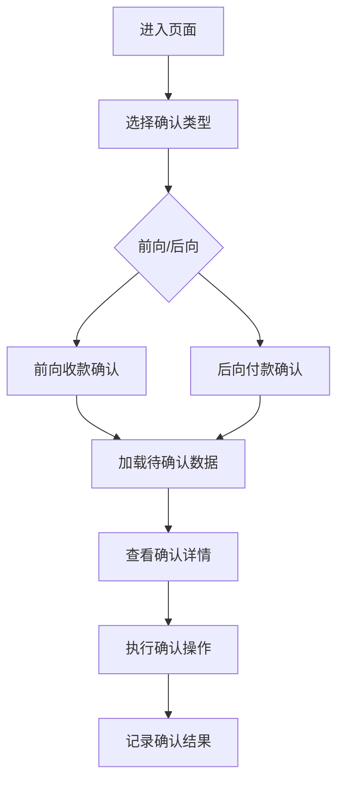

# 合同付款确认 PRD

## 需求背景
### 痛点
- **问题现象**：财务人员需要对前向收款和后向付款进行确认操作，目前缺乏统一的确认工具
- **发生频率**：高
- **当前 workaround**：通过纸质单据或邮件确认，流程繁琐且不易追溯

### 业务目标
- **量化指标**：实现付款确认流程线上化，提升确认效率70%
- **目标期限**：随LTO研发版本上线

### 涉及系统/模块
- **模块名称**：LTO研发版本-合同付款确认
- **变更类型**：新增
- **对接接口**：无后端接口，纯前端展示页面（mock数据）

## 用户故事
### 故事1
- **角色**：财务人员
- **功能**：对前向收款进行确认
- **收益**：快速确认客户付款，提升财务对账效率
- **验收条件**：可查看前向收款详情并进行确认操作

### 故事2
- **角色**：财务人员
- **功能**：对后向付款进行确认
- **收益**：确认供应商付款，确保资金流出准确
- **验收条件**：可查看后向付款详情并进行确认操作

## 需求清单
| 序号 | 需求描述 | 优先级 | 状态 | 负责人 | 截止日期 |
|------|----------|--------|------|--------|----------|
| 1 | 前向收款确认Tab | P0 | TODO | | |
| 2 | 后向付款确认Tab | P0 | TODO | | |
| 3 | 确认操作功能 | P0 | TODO | | |
| 4 | 确认记录查询 | P1 | TODO | | |

- **优先级**：P0（核心流程阻塞）/ P1（重要功能）/ P2（体验优化）
- **状态**：TODO / IN PROGRESS / DONE / BLOCKED

## 业务流程图

## 页面结构
### 路由信息
- **路由路径**：`/lto/contract-payment-confirmation`
- **页面标题**：合同付款确认
- **访问权限**：登录

### 布局结构
- **布局类型**：单栏
- **区域-主内容**：Tab切换区+确认内容区

## 功能描述
### 功能点1：Tab切换

#### 页面级
- **字段：功能入口** - 类型：文本；描述：通过Tab页签切换前向/后向确认视图
- **字段：前置条件** - 类型：文本；描述：用户已登录，页面加载完成
- **字段：后置影响** - 类型：字段列表；描述：切换Tab后刷新确认数据

#### Tab配置
  | 字段名 | 类型 | 必填 | 默认值 | 来源 | 校验规则 | 展示形式 | 交互约束 |
  |--------|------|------|--------|------|----------|----------|----------|
  | 前向收款确认 | Tab | 是 | 选中 | 系统 | 无 | Tab页签 | 可点击 |
  | 后向付款确认 | Tab | 是 | - | 系统 | 无 | Tab页签 | 可点击 |

### 功能点2：前向收款确认

#### 页面级
- **字段：功能入口** - 类型：文本；描述：展示需要确认的前向收款记录
- **字段：前置条件** - 类型：文本；描述：Mock数据加载完成
- **字段：后置影响** - 类型：字段列表；描述：确认后更新记录状态

#### ForwardReceiptConfirmation组件字段
  | 字段名 | 类型 | 必填 | 默认值 | 来源 | 校验规则 | 展示形式 | 交互约束 |
  |--------|------|------|--------|------|----------|----------|----------|
  | 收款确认记录 | 列表 | 是 | - | 接口/Mock | 无 | 表格展示 | 可点击 |
  | 确认状态 | Badge | 是 | - | 接口 | 无 | 彩色Badge | 只读 |

### 功能点3：后向付款确认

#### 页面级
- **字段：功能入口** - 类型：文本；描述：展示需要确认的后向付款记录
- **字段：前置条件** - 类型：文本；描述：Mock数据加载完成
- **字段：后置影响** - 类型：字段列表；描述：确认后更新记录状态

#### BackwardPaymentConfirmation组件字段
  | 字段名 | 类型 | 必填 | 默认值 | 来源 | 校验规则 | 展示形式 | 交互约束 |
  |--------|------|------|--------|------|----------|----------|----------|
  | 付款确认记录 | 列表 | 是 | - | 接口/Mock | 无 | 表格展示 | 可点击 |
  | 确认状态 | Badge | 是 | - | 接口 | 无 | 彩色Badge | 只读 |

## 数据流图
### 数据刷新点
- **刷新时机**：Tab切换
- **影响字段**：确认类型数据

## 验收标准
### 正常流程
- [ ] **操作**：进入页面 → **预期**：展示"前向收款确认"Tab页
- [ ] **操作**：点击Tab页签 → **预期**：切换到对应的确认视图
- [ ] **操作**：查看确认记录 → **预期**：展示确认详情列表

### 异常流程
- [ ] **操作**：数据加载失败 → **预期**：显示加载失败提示

## 更新记录
### v1 - 2026-05-08
- 初始版本（字段级别细化）