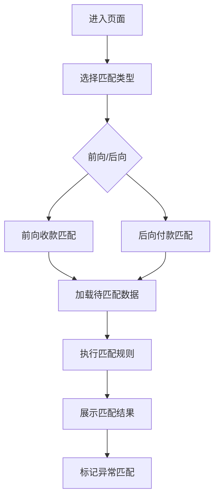

# 收支匹配 PRD

## 需求背景
### 痛点
- **问题现象**：当前业务中缺乏前后向收支匹配工具，用户无法便捷地核对应收/应付与实际收款/付款的对应关系
- **发生频率**：高
- **当前 workaround**：用户通过Excel手动比对，或依赖财务系统导出数据后离线分析

### 业务目标
- **量化指标**：实现前后向收支匹配自动化，减少人工核对工作量80%
- **目标期限**：随LTO研发版本上线

### 涉及系统/模块
- **模块名称**：LTO研发版本-收支匹配
- **变更类型**：新增
- **对接接口**：无后端接口，纯前端展示页面（mock数据）

## 用户故事
### 故事1
- **角色**：财务人员
- **功能**：查看前后向收支匹配情况
- **收益**：快速定位未匹配、异常匹配的收支记录
- **验收条件**：页面正常加载，显示匹配状态统计

### 故事2
- **角色**：项目经理
- **功能**：查看项目收支匹配明细
- **收益**：了解项目资金流向，便于成本控制
- **验收条件**：可按项目筛选并查看匹配结果

## 需求清单
| 序号 | 需求描述 | 优先级 | 状态 | 负责人 | 截止日期 |
|------|----------|--------|------|--------|----------|
| 1 | 页面框架搭建 | P0 | TODO | | |
| 2 | 前向收款匹配功能 | P0 | TODO | | |
| 3 | 后向付款匹配功能 | P0 | TODO | | |
| 4 | 匹配规则配置 | P1 | TODO | | |
| 5 | 匹配结果展示 | P0 | TODO | | |

- **优先级**：P0（核心流程阻塞）/ P1（重要功能）/ P2（体验优化）
- **状态**：TODO / IN PROGRESS / DONE / BLOCKED

## 业务流程图

## 页面结构
### 路由信息
- **路由路径**：`/lto/forward-backward-matching`
- **页面标题**：收支匹配
- **访问权限**：登录

### 布局结构
- **布局类型**：单栏
- **区域-主内容**：Tab切换区+匹配展示区

## 功能描述
### 功能点1：Tab切换

#### 页面级
- **字段：功能入口** - 类型：文本；描述：通过Tab页签切换前向/后向匹配视图
- **字段：前置条件** - 类型：文本；描述：用户已登录，页面加载完成
- **字段：后置影响** - 类型：字段列表；描述：切换Tab后刷新对应匹配数据

#### Tab配置
  | 字段名 | 类型 | 必填 | 默认值 | 来源 | 校验规则 | 展示形式 | 交互约束 |
  |--------|------|------|--------|------|----------|----------|----------|
  | 前向收款匹配 | Tab | 是 | 选中 | 系统 | 无 | Tab页签 | 可点击 |
  | 后向付款匹配 | Tab | 是 | - | 系统 | 无 | Tab页签 | 可点击 |

### 功能点2：收支匹配展示

#### 页面级
- **字段：功能入口** - 类型：文本；描述：展示收支匹配的统计概览和明细列表
- **字段：前置条件** - 类型：文本；描述：Mock数据加载完成
- **字段：后置影响** - 类型：字段列表；描述：支持查看匹配详情

#### 展示字段
  | 字段名 | 类型 | 必填 | 默认值 | 来源 | 校验规则 | 展示形式 | 交互约束 |
  |--------|------|------|--------|------|----------|----------|----------|
  | 开发中提示 | 文本 | 是 | - | 系统 | 无 | 居中提示 | 只读 |
  | 功能图标 | Icon | 是 | - | 系统 | 无 | 灰色图标 | 只读 |
  | 功能说明 | 文本 | 是 | - | 系统 | 无 | 灰色文字 | 只读 |

## 数据流图
### 数据刷新点
- **刷新时机**：Tab切换
- **影响字段**：匹配类型数据

## 验收标准
### 正常流程
- [ ] **操作**：进入页面 → **预期**：展示"前后向匹配"页面，提示"该模块正在开发中"
- [ ] **操作**：点击Tab页签 → **预期**：切换到对应的匹配视图

### 异常流程
- [ ] **操作**：Mock数据加载失败 → **预期**：显示加载失败提示，支持重试

## 更新记录
### v1 - 2026-05-08
- 初始版本（字段级别细化）