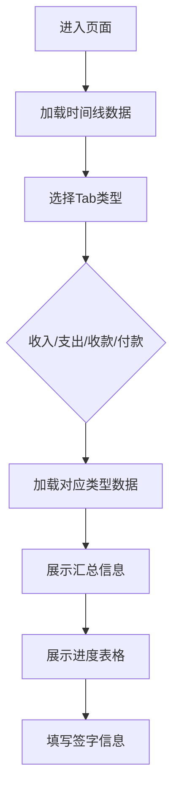

# 进度管理 PRD

## 需求背景
### 痛点
- **问题现象**：财务人员需要查看合同的收入、支出、收款、付款进度，目前缺乏统一的可视化工具
- **发生频率**：高
- **当前 workaround**：通过Excel表格手动汇总各类型财务数据

### 业务目标
- **量化指标**：实现财务进度统一展示，财务对账效率提升60%
- **目标期限**：随LTO研发版本上线

### 涉及系统/模块
- **模块名称**：LTO研发版本-进度管理
- **变更类型**：新增
- **对接接口**：无后端接口，纯前端展示页面（mock数据）

## 用户故事
### 故事1
- **角色**：财务人员
- **功能**：按类型查看合同财务进度
- **收益**：在一个页面内完成收入/支出/收款/付款四种类型的数据查看
- **验收条件**：Tab页签切换流畅，数据展示准确

### 故事2
- **角色**：项目经理
- **功能**：查看项目整体财务进度
- **收益**：了解项目资金到位情况，便于项目管控
- **验收条件**：可查看各科目的前期、本期、累计确认金额

## 需求清单
| 序号 | 需求描述 | 优先级 | 状态 | 负责人 | 截止日期 |
|------|----------|--------|------|--------|----------|
| 1 | 财务进度时间线组件 | P0 | TODO | | |
| 2 | 收入进度Tab | P0 | TODO | | |
| 3 | 支出进度Tab | P0 | TODO | | |
| 4 | 收款进度Tab | P0 | TODO | | |
| 5 | 付款进度Tab | P0 | TODO | | |
| 6 | 进度表格展示 | P0 | TODO | | |
| 7 | 签字盖章区域 | P1 | TODO | | |

- **优先级**：P0（核心流程阻塞）/ P1（重要功能）/ P2（体验优化）
- **状态**：TODO / IN PROGRESS / DONE / BLOCKED

## 业务流程图

## 页面结构
### 路由信息
- **路由路径**：`/lto/progress-management`
- **页面标题**：进度管理
- **访问权限**：登录

### 布局结构
- **布局类型**：单栏
- **区域-主内容**：时间线区+Tab切换区+进度表格区+签字区

## 功能描述
### 功能点1：财务进度时间线

#### 页面级
- **字段：功能入口** - 类型：文本；描述：展示当前会计期和项目财务进度概览
- **字段：前置条件** - 类型：文本；描述：页面加载完成
- **字段：后置影响** - 类型：字段列表；描述：作为页面顶部信息展示

### 功能点2：Tab切换

#### 页面级
- **字段：功能入口** - 类型：文本；描述：通过Tab切换查看不同类型财务进度
- **字段：前置条件** - 类型：文本；描述：时间线数据加载完成
- **字段：后置影响** - 类型：字段列表；描述：切换后刷新进度表格数据

#### Tab配置
  | 字段名 | 类型 | 必填 | 默认值 | 来源 | 校验规则 | 展示形式 | 交互约束 |
  |--------|------|------|--------|------|----------|----------|----------|
  | 收入进度 | Tab | 是 | 选中 | 系统 | 无 | Tab页签 | 可点击 |
  | 支出进度 | Tab | 是 | - | 系统 | 无 | Tab页签 | 可点击 |
  | 收款进度 | Tab | 是 | - | 系统 | 无 | Tab页签 | 可点击 |
  | 付款进度 | Tab | 是 | - | 系统 | 无 | Tab页签 | 可点击 |

### 功能点3：汇总信息展示

#### 页面级
- **字段：功能入口** - 类型：文本；描述：展示合同基本信息汇总
- **字段：前置条件** - 类型：文本；描述：有数据加载
- **字段：后置影响** - 类型：字段列表；描述：提供上下文信息

#### 汇总字段
  | 字段名 | 类型 | 必填 | 默认值 | 来源 | 校验规则 | 展示形式 | 交互约束 |
  |--------|------|------|--------|------|----------|----------|----------|
  | 所属会计期 | 文本 | 是 | - | 接口/Mock | 无 | 表格文本 | 只读 |
  | ICT项目编号 | 文本 | 是 | - | 接口/Mock | 无 | monospace文本 | 只读 |
  | ICT项目名称 | 文本 | 是 | - | 接口/Mock | 无 | 表格文本 | 只读 |
  | 合同编号 | 文本 | 是 | - | 接口/Mock | 无 | monospace文本 | 只读 |
  | 合同名称 | 文本 | 是 | - | 接口/Mock | 无 | 表格文本 | 只读 |
  | 合同甲方 | 文本 | 是 | - | 接口/Mock | 无 | 表格文本 | 只读 |
  | 合同乙方 | 文本 | 是 | - | 接口/Mock | 无 | 表格文本 | 只读 |
  | 合同总金额（含税） | 金额 | 是 | - | 接口/Mock | 无 | 金额文本 | 只读 |

### 功能点4：进度表格

#### 页面级
- **字段：功能入口** - 类型：文本；描述：展示各科目财务进度数据
- **字段：前置条件** - 类型：文本；描述：有进度数据
- **字段：后置影响** - 类型：字段列表；描述：可查看各科目详情

#### 表格列字段
  | 字段名 | 类型 | 必填 | 默认值 | 来源 | 校验规则 | 展示形式 | 交互约束 |
  |--------|------|------|--------|------|----------|----------|----------|
  | 序号 | 数字 | 是 | - | 系统 | 无 | 居中数字 | 只读 |
  | 类型 | 文本 | 是 | - | 接口 | 无 | 表格文本 | 只读 |
  | 合同编码 | 文本 | 是 | - | 接口 | 无 | monospace文本 | 只读 |
  | 科目 | 文本 | 是 | - | 接口 | 无 | 表格文本 | 只读 |
  | A.金额（含税） | 金额 | 是 | - | 接口 | 无 | 金额文本 | 只读 |
  | B.增值税税率 | 百分比 | 是 | - | 接口 | 无 | 百分比文本 | 只读 |
  | C.金额（不含税） | 金额 | 是 | - | 接口 | 无 | 金额文本 | 只读 |
  | D.前期已确认进度 | 百分比 | 是 | - | 接口 | 无 | 百分比文本 | 只读 |
  | E.前期已确认金额（含税） | 金额 | 是 | - | 接口 | 无 | 金额文本 | 只读 |
  | F.前期已确认金额（不含税） | 金额 | 是 | - | 接口 | 无 | 金额文本 | 只读 |
  | G.本期确认进度 | 百分比 | 是 | - | 接口 | 无 | 高亮百分比 | 可编辑 |
  | H.本期确认金额（含税） | 金额 | 是 | - | 接口 | 无 | 高亮金额 | 可编辑 |
  | I.本期确认金额（不含税） | 金额 | 是 | - | 接口 | 无 | 高亮金额 | 可编辑 |
  | J.累计确认进度 | 百分比 | 是 | - | 接口 | 无 | 百分比文本 | 只读 |
  | K.累计确认金额（含税） | 金额 | 是 | - | 接口 | 无 | 金额文本 | 只读 |
  | L.累计确认金额（不含税） | 金额 | 是 | - | 接口 | 无 | 金额文本 | 只读 |
  | 小计行 | 金额汇总 | 是 | - | 系统 | 无 | 金额汇总 | 只读 |

## 数据流图
### 数据刷新点
- **刷新时机**：Tab切换
- **影响字段**：汇总信息区、进度表格区

## 验收标准
### 正常流程
- [ ] **操作**：进入页面 → **预期**：展示财务时间线和收入进度Tab
- [ ] **操作**：点击不同Tab → **预期**：切换到对应类型的进度数据
- [ ] **操作**：查看表格 → **预期**：展示16列进度数据，包含小计行

### 异常流程
- [ ] **操作**：数据加载失败 → **预期**：显示错误提示，支持重试

## 更新记录
### v1 - 2026-05-08
- 初始版本（字段级别细化）